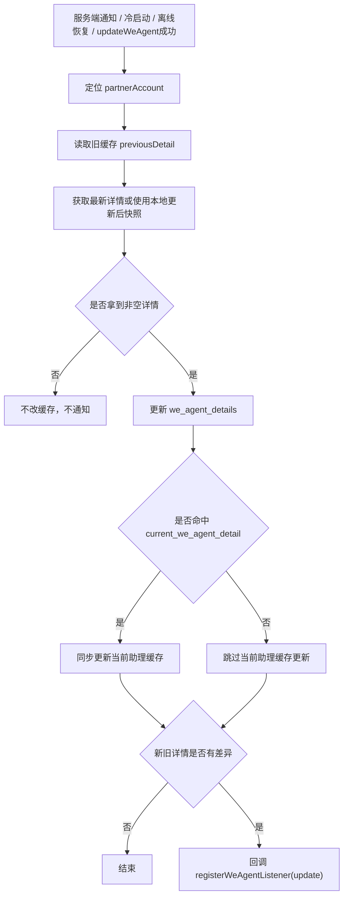
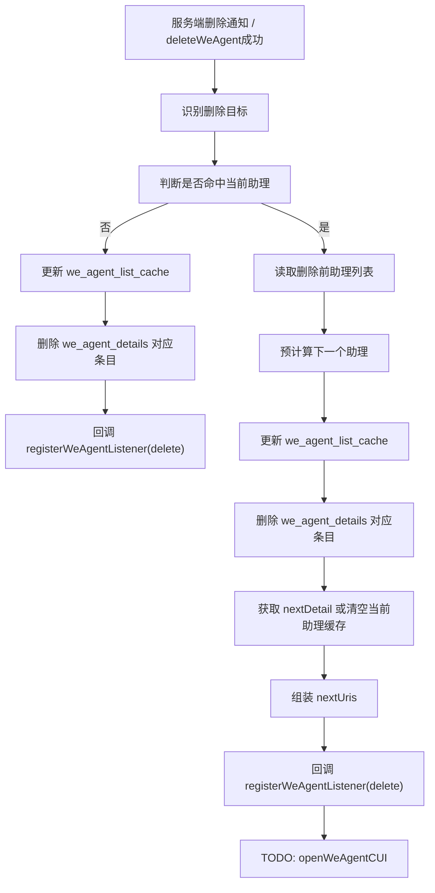

# 助理详情更新与删除同步方案

## 1. 背景

基于 [SkillClientSdkInterfaceV2.md](/F:/AIProject/skillSDK/SkillClientSdkInterfaceV2.md)，当前助理相关能力已经具备以下基础：

- `getWeAgentDetails`：获取指定助理详情，并写入 `current_we_agent_detail`
- `getAssistantDetails`：优先返回 `we_agent_details` 缓存，并异步刷新缓存
- `updateWeAgent`：更新助理信息，并同步更新本地缓存
- `deleteWeAgent`：删除助理，并在删除当前助理时处理切换逻辑

由于存在多端同时操作同一个助理的场景，SDK 还需要补齐“服务端主动通知 + 本地缓存刷新 + 对外监听回调”的统一同步机制，保证宿主能及时感知助理详情更新和助理删除。

> 说明：以下方案默认“服务端主动通知”通过 SDK 已接入的长连接/推送通道下发。若后续服务端采用其他通知通道，仅替换通知接入层，缓存处理与对外回调规则保持不变。

---

## 2. 目标

1. 当服务端主动下发“助理详情更新”或“助理删除”通知时，SDK 能自动更新本地缓存，并通过监听接口对外通知。
2. 当客户端冷启动，或从断网离线恢复到在线时，SDK 能对 `we_agent_details` 中的所有助理做异步补偿刷新，并在检测到差异时通过监听接口对外通知。
3. 当本端主动调用 `updateWeAgent` 成功后，SDK 除了更新缓存，还要立即通过监听接口通知助理更新事件。
4. 当本端主动调用 `deleteWeAgent` 成功后，SDK 除了更新缓存和当前助理切换状态，还要立即通过监听接口通知助理删除事件。
5. `ai-chat-viewer` 的 `weAgentCUI` 页面在收到助理更新或删除通知后，能够及时刷新助理信息，或引导用户切换到其他助理。

---

## 3. 缓存基线

缓存仍沿用 `SkillClientSdkInterfaceV2.md` 现有约定，并按 `userId` 隔离；当前 `userId` 仍使用 mock 值 `mock_user_id`：

- `current_we_agent_detail`
  当前助理详情对象。
- `we_agent_details`
  助理详情缓存对象，key 为 `partnerAccount`，value 为对应助理详情对象。
- `we_agent_list_cache`
  助理列表缓存。

本方案不新增新的持久化缓存 key，重点是补齐这些既有缓存的同步策略。

---

## 4. 对外监听机制

建议 SDK 新增统一监听接口：

```typescript
registerWeAgentListener(params: RegisterWeAgentListenerParams): Promise<RegisterWeAgentListenerResult>
```

### 4.1 入参

| 参数名 | 类型 | 必填 | 说明 |
|---|---|---|---|
| `type` | `string` | 是 | 生命周期事件类型，合法值：`update`（助理更新）、`delete`（助理删除） |
| `func` | `function` | 是 | 对应事件回调函数 |

### 4.2 回调载荷

- 当 `type = update` 时：
  `func` 的回调内容为助理更新后的详情数据，即 `WeAgentDetails` 对象。
- 当 `type = delete` 时：
  `func` 的回调内容为一个对象，仅包含 `partnerAccount` 字段。

### 4.3 注册规则

1. SDK 内部按 `type` 维度维护监听函数集合。
2. `update` 类型监听只接收助理更新通知。
3. `delete` 类型监听只接收助理删除通知。
4. 若场景触发了助理更新或助理删除，SDK 需通过 `registerWeAgentListener` 注册的监听函数将事件回调出去。

### 4.4 类型定义建议

```typescript
type RegisterWeAgentListenerParams = {
  type: 'update' | 'delete'
  func: (payload: WeAgentDetails | { partnerAccount: string }) => void
}

type RegisterWeAgentListenerResult = {
  status: 'success'
}
```

### 4.5 ai-chat-viewer 页面消费规则

`ai-chat-viewer` 中的 `weAgentCUI` 页面应作为当前助理生命周期事件的主要消费方：

1. 页面初始化后，分别调用两次 `registerWeAgentListener`：
   - 一次注册 `type = update`
   - 一次注册 `type = delete`
2. `update` 监听仅处理“当前聊天助理”的更新事件：
   - 若回调中的 `partnerAccount` 与当前页面助理一致，则更新页面中的助理名称、简介、头像等信息
   - 若不一致，则忽略
3. `delete` 监听仅处理“当前聊天助理”的删除事件：
   - 若回调中的 `partnerAccount` 与当前页面助理一致，则弹窗提示用户“助理已删除”
   - 弹窗底部左边按钮为“取消”
   - 弹窗底部右边按钮为“切换助理”
   - 点击“切换助理”后跳转到切换助理页面
   - 若删除的不是当前页面助理，则忽略

### 4.6 weAgentCUI 页面更新范围

当 `weAgentCUI` 页面收到当前助理的 `update` 通知时，建议至少同步以下展示字段：

- 助理名称
- 助理简介
- 助理头像
- 页面内依赖助理详情展示的其他轻量信息

页面不需要再次主动调用 `getWeAgentDetails`，可直接使用 `registerWeAgentListener(update)` 回调返回的最新 `WeAgentDetails` 更新 UI。

---

## 5. 助理详情更新方案

## 5.1 服务端主动下发详情更新通知

### 触发条件

服务端主动通知某个助理详情已更新。

### SDK 处理规则

1. SDK 从通知载荷中解析助理唯一标识，优先使用 `partnerAccount`，若服务端同时提供 `robotId` 也一并保留。
2. SDK 读取本地 `we_agent_details`，尝试拿到旧详情 `previousDetail`。
3. SDK 调用查详情服务端接口 `GET /v1/robot-partners/{partnerAccount}` 获取最新详情。
4. 若服务端返回非空详情：
   - 更新 `we_agent_details[partnerAccount]`
   - 若当前 `current_we_agent_detail` 命中同一助理，则同步覆盖为最新详情
5. SDK 对比 `previousDetail` 与最新详情：
   - 若旧值不存在，建议视为“新增缓存同步”，不对外通知
   - 若旧值存在且字段有差异，则触发 `type = update` 的监听函数，并将最新 `WeAgentDetails` 作为回调内容
   - 若旧值存在但字段无差异，则不通知
6. 若服务端返回空详情：
   - 不更新缓存
   - 不删除旧缓存
   - 不触发删除监听

### 说明

- “字段有差异”建议按 `WeAgentDetails` 全量业务字段比较，至少包含 `name`、`icon`、`desc`、`weCodeUrl`、`partnerAccount`、`id`、`ownerWelinkId`、`creatorWorkId`、`bizRobotTag`、`ownerW3Account`、`creatorW3Account` 等文档字段。
- 该场景下不直接复用通知载荷作为最终详情，而是以服务端详情接口返回结果为准，避免推送字段不全。

## 5.2 冷启动与离线恢复在线的缓存补偿刷新

### 触发条件

- SDK 冷启动初始化完成后
- 网络状态从离线切换为在线后

### SDK 处理规则

1. SDK 读取按 `userId` 隔离的 `we_agent_details` 缓存对象。
2. 若缓存为空，则直接结束，不发起补偿刷新。
3. SDK 取出所有 `partnerAccount`，异步调用 `GET /v1/robot-partners/{partnerAccount}` 获取最新详情。
4. 对每个助理分别处理：
   - 若服务端返回非空详情，则与旧缓存详情比较；
   - 若存在差异，则更新 `we_agent_details[partnerAccount]`，并触发 `type = update` 的监听函数，将最新 `WeAgentDetails` 作为回调内容；
   - 若该助理同时命中 `current_we_agent_detail`，则同步覆盖当前助理缓存；
   - 若服务端返回空详情，则不设置新缓存，也不删除旧缓存，不触发删除监听；
   - 若请求失败，则仅记录日志，不影响其他助理继续刷新。
5. 所有刷新任务彼此独立；单个助理刷新失败，不影响其他助理刷新结果。

### 说明

- 该场景只处理“详情同步”，不处理“删除判定”。
- 删除应以服务端主动删除通知或本端 `deleteWeAgent` 成功为准，避免把“临时空返回 / 数据延迟”误判成助理被删除。

## 5.3 本端调用 updateWeAgent 成功后的同步

### 触发条件

本端调用 `updateWeAgent` 成功，且服务端返回 `code = 200`。

### SDK 处理规则

1. 先按 `SkillClientSdkInterfaceV2.md` 既有约定更新本地缓存：
   - 若 `current_we_agent_detail` 命中当前助理，则同步更新名称、头像、简介
   - 若 `we_agent_details` 中存在对应助理缓存，则同步更新名称、头像、简介
2. 组装“最新助理详情快照”：
   - 优先使用更新后的本地缓存对象；
   - 若本地没有命中缓存，则本次不新增缓存，但仍可基于入参组装一个最小详情对象用于通知。
3. 触发 `type = update` 的监听函数，并将最新 `WeAgentDetails` 作为回调内容。

### 说明

- 该通知不依赖 `notifyAssistantDetailUpdated`。
- `notifyAssistantDetailUpdated` 仍只负责 `openAssistantEditPage` 的本地编辑页回调，不替代宿主级监听通知。

## 5.4 weAgentCUI 页面收到更新通知后的处理

### 触发条件

`weAgentCUI` 页面已注册 `type = update` 监听，且 SDK 回调了助理更新事件。

### 页面处理规则

1. 页面读取当前聊天助理的 `partnerAccount`。
2. 将回调载荷中的 `partnerAccount` 与当前页面助理做比对：
   - 若不一致，则直接忽略
   - 若一致，则继续处理
3. 使用回调中的最新 `WeAgentDetails` 更新页面内存态：
   - 助理名称
   - 助理简介
   - 助理头像
4. 页面中若存在依赖助理详情展示的头部、资料区或说明区，也同步刷新对应文案与图片。

### 说明

- 页面不需要再次请求 `getWeAgentDetails`，避免重复网络请求。
- SDK 已在回调前完成缓存更新，页面只消费最终结果即可。

---

## 6. 助理删除方案

## 6.1 服务端主动下发助理删除通知

### 触发条件

服务端主动通知某个助理已被删除。

### SDK 处理原则

该场景应尽量复用 `deleteWeAgent` 成功后的“本地删除后处理逻辑”，区别仅在于：

- 不再调用删除服务端接口
- 直接进入“删除后的缓存处理 + 当前助理切换 + 对外监听通知”阶段

### SDK 处理规则

1. SDK 根据通知载荷拿到删除目标标识：
   - `partnerAccount` 与 `robotId` 至少一个存在
2. SDK 读取 `current_we_agent_detail`，判断是否命中当前助理：
   - 若未命中，则视为“删除非当前助理”
   - 若命中，则视为“删除当前助理”
3. 若为“删除非当前助理”：
   - 若存在 `we_agent_list_cache`，从列表缓存中删除对应助理并回写
   - 若存在 `we_agent_details` 中对应助理详情缓存，则移除对应条目并回写
   - 不修改 `current_we_agent_detail`
   - 触发 `type = delete` 的监听函数，并将 `{ partnerAccount }` 作为回调内容
4. 若为“删除当前助理”：
   - 先读取 `we_agent_list_cache`；若无缓存，则调用 `getWeAgentList` 对应服务端接口获取列表
   - 基于“删除前列表”预计算下一个助理
   - 从删除前列表中移除当前助理，并回写新的 `we_agent_list_cache`
   - 同时从 `we_agent_details` 中移除被删除助理条目并回写
   - 若存在下一个助理：
     - 优先从 `we_agent_details` 读取其详情
     - 若缓存不存在，则调用 `GET /v1/robot-partners/{partnerAccount}` 获取详情
     - 若获取成功，则设置到 `current_we_agent_detail`
     - 若仍获取不到详情，则删除 `current_we_agent_detail`
   - 若不存在下一个助理，则直接删除 `current_we_agent_detail`
   - SDK 在内存中直接按 `getWeAgentUri` 同一套规则组装 `nextUris`
   - 触发 `type = delete` 的监听函数，并将 `{ partnerAccount }` 作为回调内容
5. `todo`
   后续可继续使用 `nextUris.weAgentUri`、`nextUris.assistantDetailUri`、`nextUris.switchAssistantUri` 调用 `openWeAgentCUI`。

## 6.2 本端调用 deleteWeAgent 成功后的同步

### 触发条件

本端调用 `deleteWeAgent` 成功，且服务端返回 `code = 200`。

### SDK 处理规则

1. 先复用 `SkillClientSdkInterfaceV2.md` 中既有的删除后缓存处理逻辑：
   - 删除非当前助理：仅更新列表缓存
   - 删除当前助理：执行下一个助理定位、当前助理缓存切换、`nextUris` 组装
2. 在既有逻辑基础上，补充两点：
   - 若 `we_agent_details` 中存在被删除助理条目，同步删除对应详情缓存
   - 删除逻辑结束后，触发 `type = delete` 的监听函数，并将 `{ partnerAccount }` 作为回调内容

### 说明

- 删除通知应放在本地缓存更新完成后触发，保证宿主收到回调时，SDK 本地状态已经一致。
- 若删除的是当前助理，即使 `nextDetail` 为空，也需要基于 fallback 规则提供 `nextUris`，方便宿主后续直接拉起“激活助理”或其他兜底页。

## 6.3 weAgentCUI 页面收到删除通知后的处理

### 触发条件

`weAgentCUI` 页面已注册 `type = delete` 监听，且 SDK 回调了助理删除事件。

### 页面处理规则

1. 页面读取当前聊天助理的 `partnerAccount`。
2. 将回调载荷中的 `partnerAccount` 与当前页面助理做比对：
   - 若不一致，则直接忽略
   - 若一致，则继续处理
3. 弹出“助理已删除”提示弹窗。
4. 弹窗底部按钮固定为：
   - 左边按钮：“取消”
   - 右边按钮：“切换助理”
5. 点击“取消”：
   - 仅关闭弹窗
6. 点击“切换助理”：
   - 关闭弹窗
   - 跳转到切换助理页面

### 说明

- 该弹窗只针对“当前聊天助理被删除”场景弹出。
- 删除非当前助理时，`weAgentCUI` 页面无需做任何 UI 变化。
- “切换助理”跳转只负责把用户带到切换助理页面，后续由切换助理页面继续承接选择和打开新助理的流程。

---

## 7. 推荐的内部实现拆分

为避免三端实现继续膨胀，建议把“更新”和“删除”统一拆成内部公共流程。

## 7.1 详情更新公共流程

建议抽成统一内部方法：

```text
refreshWeAgentDetailAndNotify(partnerAccount)
```

职责：

1. 查服务端详情
2. 比较新旧详情
3. 更新 `we_agent_details`
4. 若命中当前助理则同步更新 `current_we_agent_detail`
5. 按需触发 `type = update` 的监听函数

该方法可复用于：

- 服务端主动详情更新通知
- 冷启动补偿刷新
- 离线恢复在线补偿刷新

## 7.2 删除后处理公共流程

建议抽成统一内部方法：

```text
handleWeAgentDeletedAfterSuccess(partnerAccount, robotId)
```

职责：

1. 判断是否删除当前助理
2. 更新 `we_agent_list_cache`
3. 删除 `we_agent_details` 中被删除助理条目
4. 按需切换 `current_we_agent_detail`
5. 组装 `nextUris`
6. 触发 `type = delete` 的监听函数

该方法可复用于：

- 服务端主动删除通知
- 本端 `deleteWeAgent` 成功后

---

## 8. 时序建议

## 8.1 详情更新时序



## 8.2 删除时序



---

## 9. 与现有接口文档的关系

本方案不改变以下既有接口语义：

- `getWeAgentDetails`
- `getAssistantDetails`
- `updateWeAgent`
- `deleteWeAgent`
- `notifyAssistantDetailUpdated`

本方案是在其基础上补齐“跨端同步”和“宿主感知”的处理流程，并新增 `registerWeAgentListener` 作为统一的对外通知接口。

---

## 10. 落地建议

1. 先在文档层确认 `registerWeAgentListener` 的入参、监听回调载荷、注册规则。
2. 三端内部各自抽出统一的“详情刷新并通知”和“删除后处理并通知”公共方法，避免重复分支。
3. 先接入服务端主动通知，再补冷启动/离线恢复在线的补偿刷新。
4. `ai-chat-viewer` 优先在 `weAgentCUI` 页面接入 `registerWeAgentListener`，先打通“当前聊天助理更新/删除”的页面联动。
5. 最后将 `registerWeAgentListener` 正式补充到 SDK 接口文档中。
