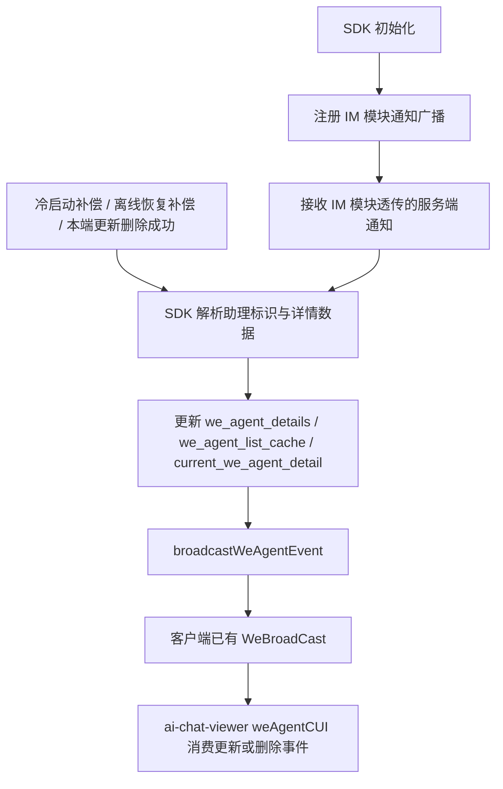
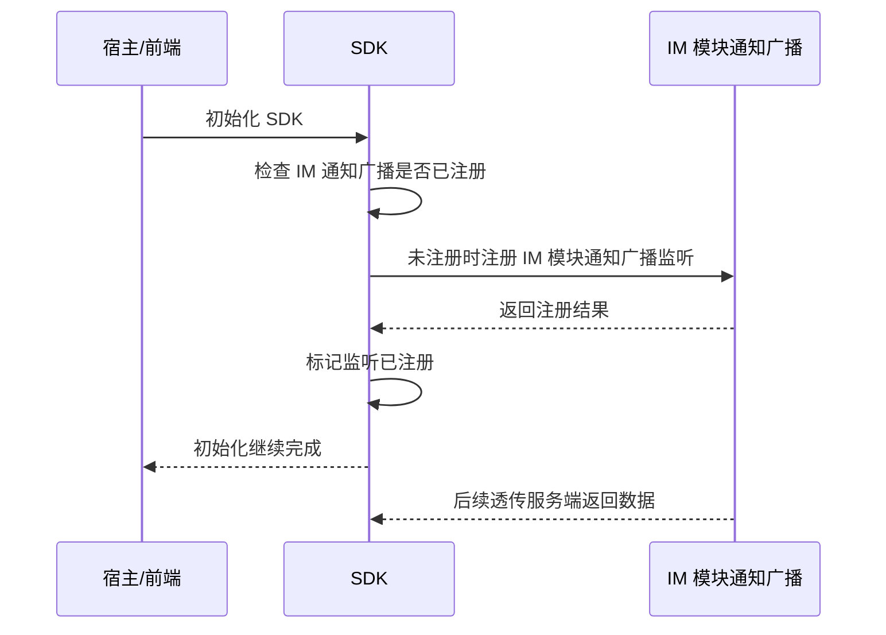
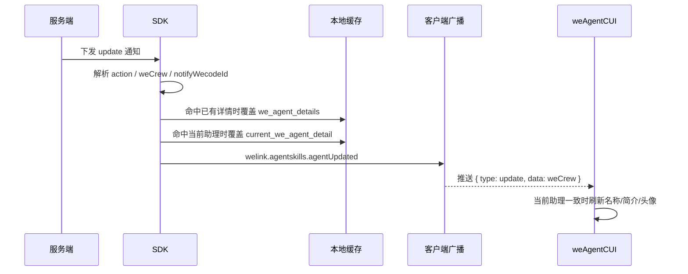
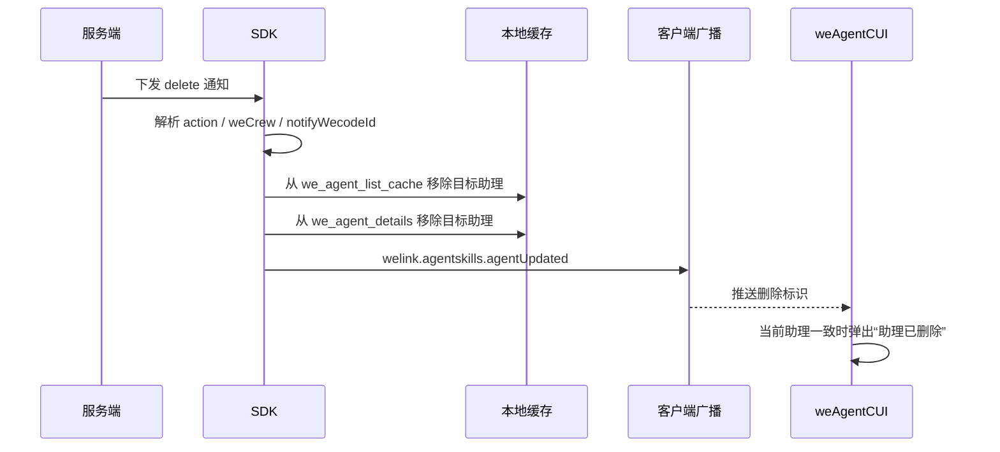
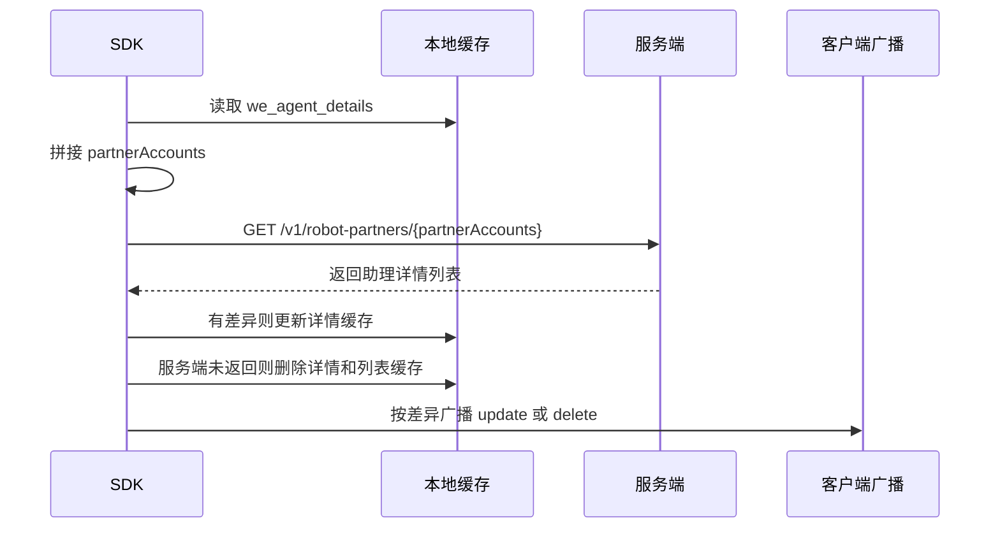
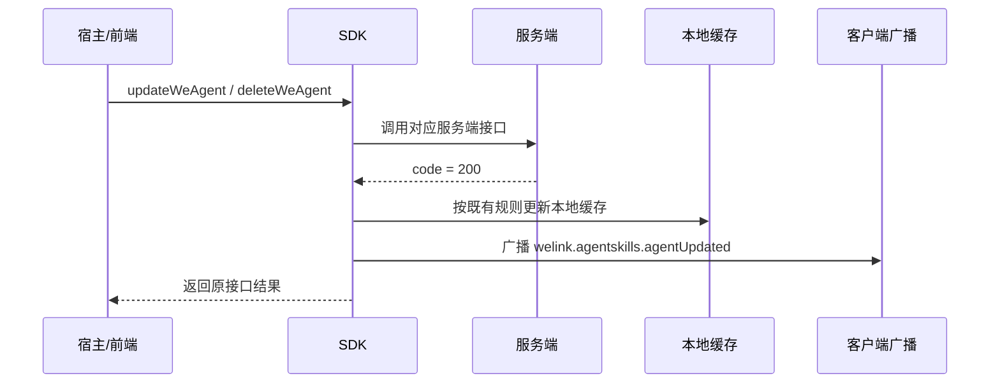
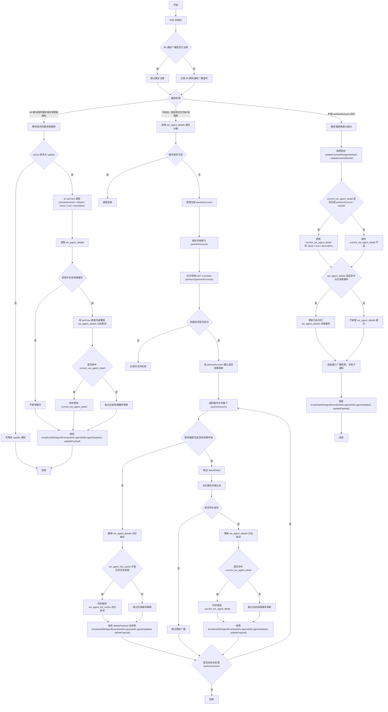
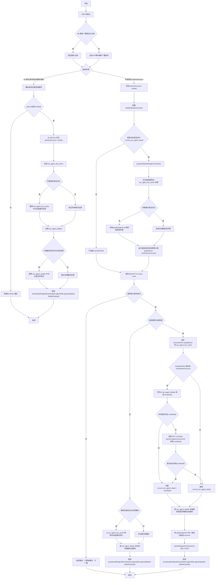
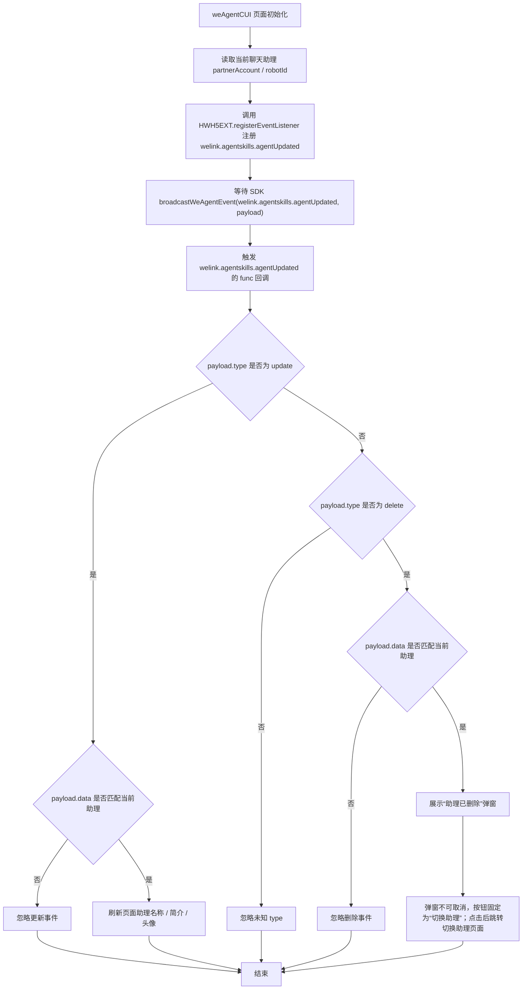

# `助理详情更新与删除同步方案`

- 方案日期：`2026-05-08`
- 目标工程：`skillSDK`、`ai-chat-viewer`
- 参考文档：`SkillClientSdkInterfaceV2.md`、`ai-chat-viewer/docs/plans/技术方案模板.md`
- 方案类型：`跨端 SDK 同步机制设计`

## 1. 背景

### 1.1 场景说明

基于 [SkillClientSdkInterfaceV2.md](/F:/AIProject/skillSDK/SkillClientSdkInterfaceV2.md)，当前助理相关能力已经具备以下基础：

1. `getWeAgentDetails`：获取指定助理详情，并写入 `current_we_agent_detail`。
2. `getAssistantDetails`：优先返回 `we_agent_details` 缓存，并异步刷新缓存。
3. `updateWeAgent`：更新助理信息，并同步更新本地缓存。
4. `deleteWeAgent`：删除助理，并在删除当前助理时处理切换逻辑。

由于存在多端同时操作同一个助理的场景，SDK 还需要补齐“服务端主动通知 + 本地缓存刷新 + 对外广播通知”的统一同步机制，保证宿主能及时感知助理详情更新和助理删除。

以下方案默认“服务端主动通知”先由 IM 模块通知广播透传给 SDK，IM 模块广播载荷保持服务端返回数据原样透传，不在 IM 模块做字段改写或业务解析。若后续服务端采用其他通知通道，仅替换通知接入层，缓存处理与对外回调规则保持不变。

### 1.2 需求目标

1. SDK 初始化时注册 IM 模块的通知广播，用于接收 IM 模块透传的服务端助理详情更新和删除通知。
2. 服务端主动下发助理详情更新或删除通知时，SDK 自动更新本地缓存，并通过客户端已有广播机制对外通知。
3. 客户端冷启动，或从断网离线恢复到在线时，SDK 对 `we_agent_details` 中的所有助理做异步补偿刷新，并在检测到差异或发现助理已删除时对外通知。
4. 本端主动调用 `updateWeAgent` 成功后，在现有缓存更新逻辑完成后补充广播助理更新事件。
5. 本端主动调用 `deleteWeAgent` 成功后，在三端现有列表缓存与当前助理切换逻辑完成后补充广播助理删除事件。
6. 专属助手的详情页不显示编辑按钮。
7. `ai-chat-viewer` 的 `weAgentCUI` 页面在收到助理更新或删除通知后，能够及时刷新助理信息，或引导用户切换到其他助理。

### 1.3 非目标

1. 不新增统一监听接口，继续复用客户端已有广播机制。
2. 不新增新的持久化缓存 key，继续沿用 `current_we_agent_detail`、`we_agent_details`、`we_agent_list_cache`。
3. 服务端主动更新通知场景下，不额外调用 `getWeAgentDetails` 或查详情接口补拉详情。
4. 服务端主动删除通知场景下，不复用 `deleteWeAgent` 的当前助理切换逻辑，不组装 `nextUris`。

## 2. 方案图

### 2.1 整体方案图



### 2.2 方案核心

SDK 初始化时先注册 IM 模块的通知广播，IM 模块将服务端返回数据原样透传给 SDK；SDK 收到透传载荷后，再统一将助理详情更新和删除事件收口为“缓存处理后广播”的内部流程，服务端主动通知、本端操作成功、冷启动与离线恢复补偿刷新都复用同一套事件语义。

## 3. 时序图

### 3.1 SDK 初始化注册 IM 模块通知广播



### 3.2 服务端主动下发详情更新



服务端下发更新详情的数据结构调整为：

```json
{
  "action": "update",
  "weCrew": {
    "robotId": "123",
    "partnerAccount": "123",
    "name": "分身小白",
    "icon": "/mcloud/xxx",
    "description": "数字分身小白能做..."
  },
  "notifyWecodeId": ["123456"]
}
```

### 3.3 服务端主动下发删除



服务端下发删除的数据结构调整为：

```json
{
  "action": "delete",
  "weCrew": {
    "robotId": "123",
    "partnerAccount": "123"
  },
  "notifyWecodeId": ["123456"]
}
```

### 3.4 冷启动与离线恢复在线补偿刷新



### 3.5 本端主动更新或删除成功



### 3.6 详情更新详细流程图



### 3.7 删除详细流程图



## 4. 技术细节

### 4.1 调整点

1. SDK 初始化时注册 IM 模块通知广播，统一接收 IM 模块透传的服务端助理更新和删除通知。
2. 新增 SDK 内部广播封装：`broadcastWeAgentEvent(eventName: string, data: any): void`。
3. 服务端主动通知载荷统一改为 `action + weCrew + notifyWecodeId` 结构。
4. 助理更新与删除统一广播 `welink.agentskills.agentUpdated`，通过 payload 中的 `type` 区分 `update` 与 `delete`。
5. 统一广播 payload 中的 `data` 与对应服务端下发的 `weCrew` 一致。
6. 冷启动和离线恢复在线时，对已有 `we_agent_details` 做批量补偿刷新。
7. `weAgentCUI` 页面订阅更新和删除广播，仅处理当前聊天助理相关事件。

### 4.2 核心实现方式

缓存仍沿用 `SkillClientSdkInterfaceV2.md` 现有约定，并按 `userId` 隔离；当前 `userId` 仍使用 mock 值 `mock_user_id`。

| 缓存 key | 说明 |
|---|---|
| `current_we_agent_detail` | 当前助理详情对象 |
| `we_agent_details` | 助理详情缓存对象，key 为 `partnerAccount`，value 为对应助理详情对象 |
| `we_agent_list_cache` | 助理列表缓存 |

SDK 内部统一封装广播调用：

```typescript
broadcastWeAgentEvent(eventName: string, data: any): void
```

方法职责：

1. 在方法内部统一接入客户端已有广播机制。
2. 方法内部直接调用 `WeBroadCast(eventName, data)` 完成实际广播。
3. `WeBroadCast(eventName, data)` 需按事件映射触发通过 `HWH5EXT.registerEventListener` 注册的页面监听回调，并将 `data` 作为回调参数透传给页面。
4. 所有助理更新和删除场景都统一复用该方法，不在业务分支中直接散落调用 `WeBroadCast(...)`。

广播约定：

| 场景 | SDK 内部 eventName | HWH5EXT.registerEventListener type | payload |
|---|---|---|
| 助理详情更新 | `welink.agentskills.agentUpdated` | `welink.agentskills.agentUpdated` | `{ type: 'update', data: weCrew }`，其中 `data` 与服务端下发更新通知中的 `weCrew` 一致，即至少包含 `robotId`、`partnerAccount`、`name`、`icon`、`description` |
| 助理删除 | `welink.agentskills.agentUpdated` | `welink.agentskills.agentUpdated` | `{ type: 'delete', data: weCrew }`，其中 `data` 与服务端下发删除通知中的 `weCrew` 一致，即至少包含 `robotId`、`partnerAccount` |

广播规则：

1. 若场景触发了助理更新，SDK 调用 `broadcastWeAgentEvent('welink.agentskills.agentUpdated', updatePayload)` 对外广播。
2. 若场景触发了助理删除，SDK 调用 `broadcastWeAgentEvent('welink.agentskills.agentUpdated', deletePayload)` 对外广播。
3. `updatePayload` 结构固定为：
   ```json
   {
     "type": "update",
     "data": {
       "robotId": "123",
       "partnerAccount": "123",
       "name": "分身小白",
       "icon": "/mcloud/xxx",
       "description": "数字分身小白能做..."
     }
   }
   ```
4. `deletePayload` 结构固定为：
   ```json
   {
     "type": "delete",
     "data": {
       "robotId": "123",
       "partnerAccount": "123"
     }
   }
   ```
5. 广播触发时机固定放在本地缓存处理之后，且缓存处理结果不影响广播。

SDK 初始化监听注册：

1. SDK 初始化流程中调用内部方法注册 IM 模块通知广播，例如 `registerWeAgentImNotifyBroadcastListener()`。
2. 注册方法只负责接入 IM 模块通知广播，不直接处理 UI 广播，也不要求 IM 模块改写服务端数据结构。
3. IM 模块通知广播回调数据必须透传服务端返回的原始载荷，SDK 在自身回调中解析 `action + weCrew + notifyWecodeId`。
4. 注册前先检查内存态标记，若已注册则直接返回，避免重复初始化或重连流程导致同一通知被消费多次。
5. 监听回调收到 IM 模块透传的服务端载荷后，先做基础合法性校验，再根据 `action` 分发：
   - `action = 'update'`：进入服务端主动详情更新处理；
   - `action = 'delete'`：进入服务端主动删除处理；
   - 其他 `action`：记录日志后忽略。
6. 注册失败不阻塞 SDK 初始化主流程，但需要记录日志或埋码，便于定位 IM 通知广播不可用问题。
7. 若 SDK 支持销毁或切换账号，销毁时应注销监听或清理注册标记；切换账号后重新按当前 `userId` 注册或过滤通知。

服务端主动详情更新处理：

1. SDK 从通知载荷中读取 `action`，仅当 `action = 'update'` 时进入详情更新流程。
2. SDK 从 `weCrew` 中解析助理唯一标识，优先使用 `partnerAccount`，若服务端同时提供 `robotId` 也一并保留。
3. SDK 读取本地 `we_agent_details`，检查是否已存在该助理缓存详情。
4. 若存在，则使用 `weCrew` 中的更新字段覆盖 `we_agent_details[partnerAccount]`。
5. 若 `current_we_agent_detail` 命中同一助理，则同步覆盖为最新内容。
6. 若本地 `we_agent_details` 中不存在该助理缓存详情，则不新增缓存，不调用查详情服务端接口补拉。
7. SDK 最后调用 `broadcastWeAgentEvent('welink.agentskills.agentUpdated', updatePayload)`，其中 `updatePayload.data` 为通知中的 `weCrew`。

服务端主动删除处理：

1. SDK 从通知载荷中读取 `action`，仅当 `action = 'delete'` 时进入删除流程。
2. SDK 从 `weCrew` 中解析删除目标标识，`partnerAccount` 与 `robotId` 至少一个存在。
3. SDK 读取本地 `we_agent_list_cache`，若存在则从列表缓存中删除对应助理并回写。
4. SDK 读取本地 `we_agent_details`，若存在对应助理详情缓存，则移除对应条目并回写。
5. 该场景不读取也不修改 `current_we_agent_detail`，是否为当前助理由广播消费方自行判断。
6. SDK 最后调用 `broadcastWeAgentEvent('welink.agentskills.agentUpdated', deletePayload)`，其中 `deletePayload.data` 为通知中的 `weCrew`。

冷启动与离线恢复在线补偿刷新：

1. SDK 读取按 `userId` 隔离的 `we_agent_details` 缓存对象。
2. 若缓存为空，则直接结束，不发起补偿刷新。
3. SDK 从缓存对象中取出所有 `partnerAccount`，并按逗号拼接成字符串 `partnerAccounts`。
4. SDK 异步调用批量查详情服务端接口：`GET /v1/robot-partners/{partnerAccounts}`。
5. SDK 解析服务端返回的助理详情列表，并建立以 `partnerAccount` 为 key 的映射。
6. 若服务端返回了对应助理详情，则与旧缓存详情比较；存在差异时更新 `we_agent_details[partnerAccount]` 并广播更新。
7. 若该助理同时命中 `current_we_agent_detail`，则同步覆盖当前助理缓存。
8. 若服务端未返回对应 `partnerAccount` 的助理详情，则视为该助理已删除，同步删除详情缓存和列表缓存中的对应项，并广播删除。
9. 若批量请求失败，则仅记录日志，不更新缓存，也不触发广播。

本端主动调用 `updateWeAgent` 成功后的处理：

三端现有实现基线：

| 平台 | 更新缓存方法 | 关键行为 |
|---|---|---|
| Android | `WeAgentStorage.updateCachedWeAgentDetails(...)` | 更新命中的 `current_we_agent_detail` 与 `we_agent_details`，不新增详情缓存 |
| iOS | `WLAgentSkillsWeAgentStore updateCachedWeAgentDetailsWithPartnerAccount:...` | 更新命中的当前详情与详情缓存，不新增详情缓存 |
| HarmonyOS | `WeAgentStore.updateCachedDetails(...)` | 更新命中的当前详情与详情缓存，不新增详情缓存 |

1. 三端现有实现先校验 `partnerAccount` 与 `robotId` 至少一个存在，并要求 `name`、`icon`、`description` 为有效字符串。
2. 服务端更新接口成功后，三端均调用现有缓存更新方法：
   - Android：`updateCachedWeAgentDetails(partnerAccount, robotId, name, icon, description)`；
   - iOS：`updateCachedWeAgentDetailsWithPartnerAccount:robotId:name:icon:description:`；
   - HarmonyOS：`updateCachedDetails(partnerAccount, robotId, name, icon, description)`。
3. 若 `current_we_agent_detail` 匹配 `partnerAccount` 或 `robotId`，则仅更新当前详情中的 `name`、`icon`、`description`。
4. 若 `we_agent_details` 中命中对应缓存详情，则仅更新该缓存详情中的 `name`、`icon`、`description`。
5. 若 `we_agent_details` 中未命中对应缓存详情，则保持现有实现，不新增详情缓存。
6. 现有三端接口返回 `success` 结果，不改变原接口返回语义。
7. 本方案若补充更新广播，广播点放在现有缓存更新完成之后；广播事件为 `welink.agentskills.agentUpdated`，payload 结构为 `{ type: 'update', data: weCrew }`，其中 `data` 需组装为与服务端更新通知 `weCrew` 一致的结构，即包含 `robotId`、`partnerAccount`、`name`、`icon`、`description`，仅用于通知，不写入 `we_agent_details`。

本端主动调用 `deleteWeAgent` 成功后的处理：

接口文档与三端现有实现基线：

| 平台 | 删除后处理方法 | 关键行为 |
|---|---|---|
| Android | `handleDeleteWeAgentResult(...)` / `handleDeleteWeAgentSuccess(...)` | 非当前助理只更新已存在列表缓存；当前助理预计算下一个助理、切换当前详情、组装 `nextUris`； |
| iOS | `handleDeleteWeAgentResultWithContext:...` / `handleDeleteWeAgentSuccessWithPlan:...` | 非当前助理只更新已存在列表缓存；当前助理预计算下一个助理、切换当前详情、组装 `nextUris`； |
| HarmonyOS | `handleDeleteWeAgentResult(...)` / `handleDeleteCurrentWeAgentSuccess(...)` | 非当前助理只更新已存在列表缓存；当前助理预计算下一个助理、切换当前详情、组装 `nextUris`； |

1. SDK 校验 `partnerAccount` 与 `robotId` 至少传一个：
   - 仅传 `partnerAccount` 时，透传 `partnerAccount`；
   - 仅传 `robotId` 时，透传 `robotId`；
   - 两者同时传入时，两个参数都透传给服务端。
2. SDK 在调用删除接口前读取 `current_we_agent_detail`，判断删除目标是否命中当前助理：
   - 当前详情存在，且 `partnerAccount` 或 `id/robotId` 与删除目标匹配时，视为删除当前助理；
   - 否则视为删除非当前助理。
3. SDK 调用服务端删除接口 `DELETE /v4-1/we-crew`。
4. 服务端删除成功后，原接口返回 `deleteResult: "success"`；服务端失败时保持现有异常处理，透传或包装服务端错误，不触发本端删除成功广播。
5. 若删除目标不是当前助理：
   - 仅尝试更新本地 `we_agent_list_cache`；
   - 若本地存在助理列表缓存，则从缓存列表中移除当前被删除助理，并将删除后的列表回写；
   - 若本地不存在助理列表缓存，则不主动调用 `getWeAgentList`，也不做缓存处理；
   - 不触发当前助理切换逻辑，不修改 `current_we_agent_detail`，不组装 `nextUris`；
   - 若本地 `we_agent_details` 中存在当前被删除助理对应详情缓存，则删除该条详情缓存并回写。
6. 若删除目标是当前助理：
   - 删除接口请求前先准备切换上下文；三端代码中 `prepareDeleteWeAgentContext` 会在 `requestDeleteWeAgent` 前执行，用于基于删除前列表快照预计算 `transitionPlan`；
   - 优先读取本地 `we_agent_list_cache` 作为删除前列表快照；
   - 若本地没有列表缓存，则调用 `getWeAgentList` 对应接口获取最新列表，并更新列表缓存；
   - 基于删除前列表快照定位被删助理，并预先计算下一个助理：若被删助理不是列表最后一个，取其后一个；若被删助理是列表最后一个，取列表第 `0` 个；若没有剩余助理，则标记无下一个助理；
   - 服务端删除成功后，基于删除前列表快照移除被删助理，并回写 `we_agent_list_cache`；
   - 若没有下一个助理，则清空 `current_we_agent_detail`；
   - 若存在下一个助理，则优先从 `we_agent_details[nextPartnerAccount]` 读取详情，未命中时调用 `GET /v1/robot-partners/{partnerAccount}` 获取详情并写入 `we_agent_details`；
   - 成功获取下一个助理详情时，将其写入 `current_we_agent_detail`；未获取到时清空 `current_we_agent_detail`；
   - 在内存中按 `getWeAgentUri` 同一套规则组装 `nextUris`，不再额外调用 `getWeAgentUri` 读取缓存；
   - 若下一个助理详情为空，则按 `getWeAgentUri` fallback 规则组装 `nextUris`；
   - `openWeAgentCUI(nextUris)` 仍为接口文档和三端代码中的 TODO，当前不实际拉起页面；
   - 若本地 `we_agent_details` 中存在当前被删除助理对应详情缓存，则删除该条详情缓存并回写。
7. 本方案若补充删除广播，广播点放在上述现有删除成功处理完成之后；广播事件为 `welink.agentskills.agentUpdated`，payload 结构为 `{ type: 'delete', data: weCrew }`，其中 `data` 需组装为与服务端删除通知 `weCrew` 一致的结构，即包含删除目标 `robotId`、`partnerAccount`。

`weAgentCUI` 页面消费规则：

1. 页面初始化后，通过 `HWH5EXT.registerEventListener` JSAPI 注册统一的助理变更监听。
2. `HWH5EXT.registerEventListener` 入参包含：
   - `type`：事件名；
   - `func`：监听事件响应回调。
3. 页面注册助理变更监听：
   ```typescript
   HWH5EXT.registerEventListener({
     type: 'welink.agentskills.agentUpdated',
     func: (payload: {
       type: 'update' | 'delete';
       data: {
         robotId?: string;
         partnerAccount?: string;
         name?: string;
         icon?: string;
         description?: string;
       };
     }) => {
       // 根据 payload.type 区分更新或删除。
     }
   });
   ```
4. SDK 侧调用 `broadcastWeAgentEvent('welink.agentskills.agentUpdated', payload)` 后，由客户端广播机制触发 `HWH5EXT.registerEventListener` 对应 `type` 的 `func` 回调，并将对应广播 payload 原样透传给页面。
5. 当 `payload.type = 'update'` 时，`func` 仅处理当前聊天助理的更新事件。
6. 若 `payload.data.partnerAccount` 与当前页面助理一致，则更新页面中的助理名称、简介、头像等信息。
7. 若更新事件不是当前页面助理，则忽略。
8. 当 `payload.type = 'delete'` 时，`func` 仅处理当前聊天助理的删除事件。
9. 若 `payload.data.partnerAccount` 与当前页面助理一致，则弹窗提示用户“助理已删除”。
10. 弹窗底部按钮固定为“切换助理”，弹窗不可取消。
11. 点击“切换助理”后跳转到切换助理页面。
12. 删除非当前助理时，页面不做 UI 变化。

`weAgentCUI` 页面消费流程图：



### 4.3 兼容与边界

1. 服务端通知载荷中的 `notifyWecodeId` 用于标识需要通知的 wecode 范围，SDK 缓存处理仍以 `weCrew.partnerAccount` 和 `weCrew.robotId` 为目标标识。
2. 更新通知中若 `we_agent_details` 不存在目标助理缓存，SDK 不新增缓存，但仍按通知数据触发更新广播。
3. 删除通知中若本地缓存不存在目标助理，SDK 仍触发删除广播。
4. 服务端主动删除通知不修改 `current_we_agent_detail`，避免 SDK 在非用户主动删除场景中擅自切换当前助理。
5. 冷启动和离线恢复在线的批量补偿刷新失败时仅记录日志，不影响 SDK 初始化和页面使用。
6. 服务端未在批量详情接口中返回某个本地已缓存助理时，视为该助理已删除。
7. `partnerAccount` 缺失但存在 `robotId` 时，可用 `robotId` 辅助从列表缓存或详情缓存中反查目标；若仍无法确定 `partnerAccount`，删除广播至少携带 `robotId`。
8. IM 模块通知广播注册失败不阻塞 SDK 初始化，后续仍可依赖冷启动和离线恢复在线补偿刷新收敛缓存。
9. SDK 重复初始化、IM 模块重连、前后台切换恢复时，监听注册必须幂等，避免同一服务端通知触发多次缓存处理和客户端广播。
10. IM 模块通知广播只负责透传服务端返回数据；若透传载荷缺少 `action` 或 `weCrew`，SDK 记录日志并忽略该通知。
11. 历史版本兼容：对于 6 月前的历史版本，助理详情页需屏蔽编辑按钮，避免旧版本进入不支持新同步通知链路的编辑流程。
12. 专属助手详情页不显示编辑按钮，避免专属助手进入编辑流程。

### 4.4 相关接口联动

1. `getWeAgentDetails`：语义不变，继续用于指定助理详情查询与缓存写入。
2. `getAssistantDetails`：语义不变，继续优先返回缓存并异步刷新。
3. `updateWeAgent`：保留三端现有“只更新命中的当前详情与详情缓存，不新增详情缓存”的逻辑，成功后补充 `welink.agentskills.agentUpdated` 广播，payload.type 为 `update`。
4. `deleteWeAgent`：保留三端现有“非当前助理只更新已存在列表缓存、当前助理执行下一个助理切换”的逻辑，并补充“若 `we_agent_details` 存在被删助手详情缓存则删除对应条目”，成功后补充 `welink.agentskills.agentUpdated` 广播，payload.type 为 `delete`。
5. `notifyAssistantDetailUpdated`：仍只负责 `openAssistantEditPage` 的本地编辑页回调，不替代宿主级广播通知。
6. `GET /v1/robot-partners/{partnerAccounts}`：用于冷启动和离线恢复在线后的批量补偿刷新。
7. SDK 初始化入口：新增 IM 模块通知广播注册调用，监听回调按服务端透传载荷中的 `action` 分发到更新或删除处理流程。
8. `HWH5EXT.registerEventListener`：`weAgentCUI` 页面通过该 JSAPI 注册 `welink.agentskills.agentUpdated`，SDK 通过 `broadcastWeAgentEvent` 触发对应回调并透传对应广播 payload。
9. 助理详情页：专属助手详情页固定不展示编辑按钮；6 月前历史版本详情页也需屏蔽编辑按钮。

### 4.5 文档需要同步修改的内容

1. `SkillClientSdkInterfaceV2.md`：补充 SDK 初始化注册 IM 模块通知广播、IM 广播透传服务端返回数据、服务端下发 `action + weCrew + notifyWecodeId` 载荷结构和广播事件约定。
2. Android / iOS / HarmonyOS SDK 接口说明：补充更新、删除、补偿刷新触发广播的时机。
3. `ai-chat-viewer` 相关需求或设计文档：补充 `weAgentCUI` 页面通过 `HWH5EXT.registerEventListener` 消费 `welink.agentskills.agentUpdated` 的处理规则。
4. 助理详情页相关文档：补充专属助手详情页不显示编辑按钮，以及 6 月前历史版本屏蔽编辑按钮的规则。

## 5. 性能

1. 服务端主动更新通知不额外发起详情查询请求，直接以 `weCrew` 作为缓存更新和广播数据源。
2. 服务端主动删除通知只处理本地缓存，不额外发起删除接口或详情接口请求。
3. 冷启动和离线恢复在线会新增一次批量详情补偿请求，仅在 `we_agent_details` 非空时触发。
4. 补偿刷新按批量接口一次性查询，避免对每个助理逐个发起请求。
5. 页面收到更新广播后直接使用广播数据刷新 UI，不需要再次调用 `getWeAgentDetails`，避免重复网络请求。
6. SDK 初始化新增一次 IM 模块通知广播注册，不引入额外详情查询请求；重复初始化时通过幂等判断避免重复注册。

## 6. 功耗

1. 不新增轮询机制。
2. 不新增独立长连接，复用 SDK 已接入的长连接或推送通道。
3. 不新增后台常驻任务。
4. 冷启动与离线恢复在线补偿刷新为事件触发，不做高频刷新。
5. 页面侧只在收到广播后做轻量状态更新，不引入额外动画或频繁渲染。
6. 初始化监听注册只复用已有 IM 模块通知广播通道，不额外维持新的后台连接。

## 7. 埋码

1. `we_agent_server_notify_received`
   - 说明：记录服务端主动通知接收情况，建议包含 `action`、`partnerAccount`、`robotId`、`notifyWecodeId`、IM 模块通知广播标识。
2. `we_agent_im_notify_listener_register`
   - 说明：记录 SDK 初始化时 IM 模块通知广播注册情况，建议包含注册结果、失败原因、是否重复注册、当前 `userId`。
3. `we_agent_cache_sync_result`
   - 说明：记录缓存同步结果，建议包含触发来源、更新数量、删除数量、失败原因。
4. `we_agent_broadcast_sent`
   - 说明：记录 SDK 对外广播发送情况，建议包含 `eventName`、`partnerAccount`、`robotId`、触发来源。
5. `we_agent_cui_delete_dialog_shown`
   - 说明：记录 `weAgentCUI` 因当前助理被删除而展示不可取消弹窗的情况。

## 8. 影响范围

### 8.1 直接影响

1. Android SDK、iOS SDK、HarmonyOS SDK 的助理详情更新、删除和缓存补偿刷新逻辑。
2. SDK 内部客户端广播封装与调用点。
3. `ai-chat-viewer` 的 `weAgentCUI` 页面通过 `HWH5EXT.registerEventListener` 注册事件监听后的 UI 刷新、删除弹窗逻辑。
4. 服务端下发助理更新和删除通知的数据结构。
5. SDK 初始化流程中的 IM 模块通知广播注册逻辑。
6. 助理详情页历史版本兼容展示逻辑：6 月前历史版本需屏蔽编辑按钮。
7. 助理详情页专属助手展示逻辑：专属助手详情页需隐藏编辑按钮。

### 8.2 间接影响

1. 助理列表页或切换助理页可能读取到被同步更新后的列表缓存。
2. 多端同时编辑或删除同一助理时，宿主页面对当前助理状态的感知更及时。
3. 冷启动或离线恢复在线后，本地缓存与服务端状态更快收敛。

### 8.3 不影响

1. 不改变 `getWeAgentDetails`、`getAssistantDetails`、`updateWeAgent`、`deleteWeAgent` 的既有对外入参和返回语义。
2. 不改变 `notifyAssistantDetailUpdated` 的既有职责。
3. 不新增持久化缓存 key。
4. 不改变本端主动删除当前助理时既有的下一个助理定位和 `nextUris` 组装逻辑。

## 9. 测试范围

### 9.1 功能测试

1. 服务端下发 `action = update`，本地存在目标助理详情缓存时，校验 `we_agent_details`、`current_we_agent_detail` 和 `welink.agentskills.agentUpdated` 更新广播。
2. 服务端下发 `action = update`，本地不存在目标助理详情缓存时，校验不新增缓存但仍触发更新广播。
3. 服务端下发 `action = delete`，本地存在目标助理时，校验列表缓存和详情缓存被删除，并触发删除广播。
4. 服务端下发 `action = delete`，本地不存在目标助理时，校验不报错且仍触发删除广播。
5. SDK 初始化时校验 IM 模块通知广播已注册，IM 模块透传服务端模拟通知后能进入对应更新或删除流程。
6. SDK 重复初始化或 IM 模块重连时，校验监听注册幂等，同一服务端通知只触发一次缓存处理和一次客户端广播。
7. 冷启动时 `we_agent_details` 非空，批量接口返回详情有差异，校验缓存更新和更新广播。
8. 冷启动时批量接口未返回某个本地助理，校验该助理详情缓存和列表缓存删除，并触发删除广播。
9. 离线恢复在线后重复执行补偿刷新，校验无差异时不触发无意义广播。
10. 本端 `updateWeAgent` 成功后，校验仅更新命中的当前详情或详情缓存、不新增详情缓存，并触发 `welink.agentskills.agentUpdated` 广播，payload.type 为 `update`。
11. 本端 `deleteWeAgent` 删除非当前助理成功后，校验仅在删除前已有列表缓存时更新列表缓存；若 `we_agent_details` 有对应助手详情缓存，则删除对应详情缓存；并触发 `welink.agentskills.agentUpdated` 广播，payload.type 为 `delete`。
12. 本端 `deleteWeAgent` 删除当前助理成功后，校验列表缓存移除目标助理、当前详情切换到下一个助理或清空、`nextUris` 按现有规则组装；若 `we_agent_details` 有被删助手详情缓存，则删除对应详情缓存；并触发 `welink.agentskills.agentUpdated` 广播，payload.type 为 `delete`。
13. `weAgentCUI` 初始化时通过 `HWH5EXT.registerEventListener({ type: 'welink.agentskills.agentUpdated', func })` 注册统一监听，并校验更新广播可触发该 `func`。
14. `weAgentCUI` 初始化时通过 `HWH5EXT.registerEventListener({ type: 'welink.agentskills.agentUpdated', func })` 注册统一监听，并校验删除广播可触发该 `func`。
15. 校验 `welink.agentskills.agentUpdated` 的更新回调 payload 为 `{ type: 'update', data: weCrew }`，删除回调 payload 为 `{ type: 'delete', data: weCrew }`。
16. `weAgentCUI` 收到当前助理更新事件后，校验名称、简介、头像刷新。
17. `weAgentCUI` 收到非当前助理更新或删除事件后，校验页面不变化。
18. `weAgentCUI` 收到当前助理删除事件后，校验展示不可取消弹窗，且“切换助理”可跳转到切换助理页面。

### 9.2 兼容测试

1. Android、iOS、HarmonyOS 三端通知解析、缓存更新和广播事件名保持一致。
2. 通知载荷只包含 `partnerAccount`、只包含 `robotId`、二者都包含时的处理行为。
3. `notifyWecodeId` 为空数组、缺失、包含多个 wecode id 时，SDK 不因该字段异常影响缓存处理主流程。
4. 批量详情接口失败、超时、返回空列表、返回部分详情时的降级行为。
5. 旧版本宿主未订阅广播时，SDK 缓存处理不受影响。
6. IM 模块通知广播注册失败、重复注册、销毁后重新初始化、切换账号后重新注册或过滤通知的行为。
7. 6 月前历史版本进入助理详情页时，校验编辑按钮被屏蔽；6 月及之后版本按既有规则展示编辑入口。
8. 专属助手进入详情页时，校验不显示编辑按钮。

### 9.3 文档一致性检查

1. 服务端通知示例统一为 `action + weCrew + notifyWecodeId`。
2. 更新与删除广播事件名统一为 `welink.agentskills.agentUpdated`。
3. 更新广播 payload 统一为 `{ type: 'update', data: weCrew }`。
4. 删除广播 payload 统一为 `{ type: 'delete', data: weCrew }`。
5. 三端 SDK 文档中的缓存 key、触发时机、边界处理规则保持一致。
6. 三端 SDK 文档中的 IM 模块通知广播注册时机、幂等策略、透传载荷解析和失败降级规则保持一致。
7. `weAgentCUI` 页面文档中的 `HWH5EXT.registerEventListener` 入参 `type`、`func` 与 SDK 广播保持一致：`type` 统一为 `welink.agentskills.agentUpdated`。
8. 助理详情页文档需补充 6 月前历史版本屏蔽编辑按钮的兼容策略。
9. 助理详情页文档需补充专属助手详情页不显示编辑按钮的展示规则。

## 10. 最终建议

推荐优先落地“SDK 初始化注册 IM 模块通知广播 + IM 广播透传服务端返回数据 + SDK 解析服务端主动通知 + SDK 缓存处理 + 统一广播封装”主链路，再补齐冷启动与离线恢复在线的批量补偿刷新。这样能先解决多端同时更新或删除助理时的实时同步问题，同时不改变现有公开接口语义，风险集中在 SDK 初始化监听注册、透传载荷解析、内部同步流程和 `weAgentCUI` 页面事件消费上，便于三端按同一协议逐步实现和验证。
