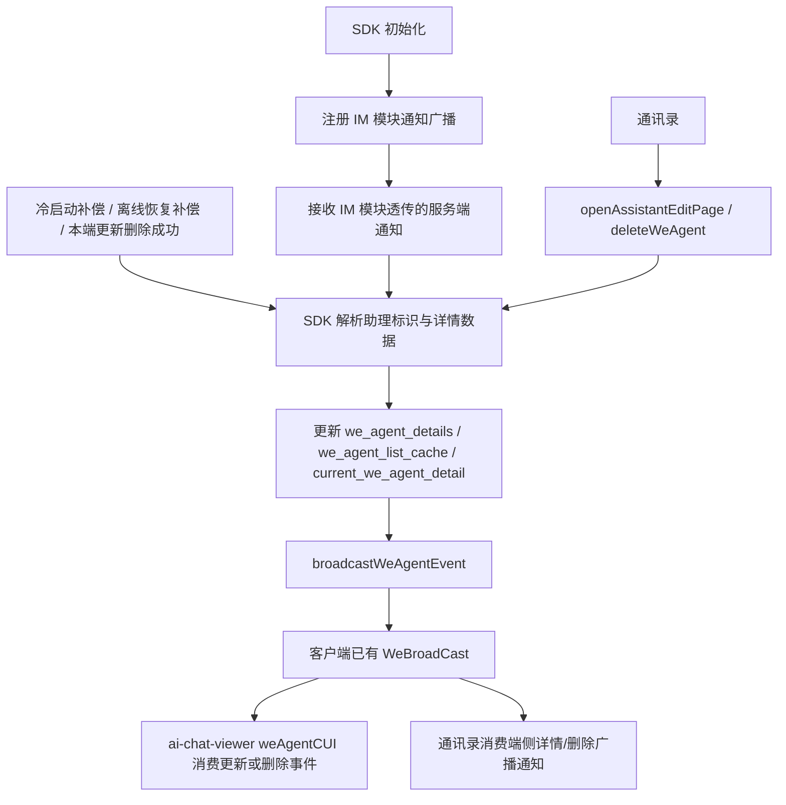
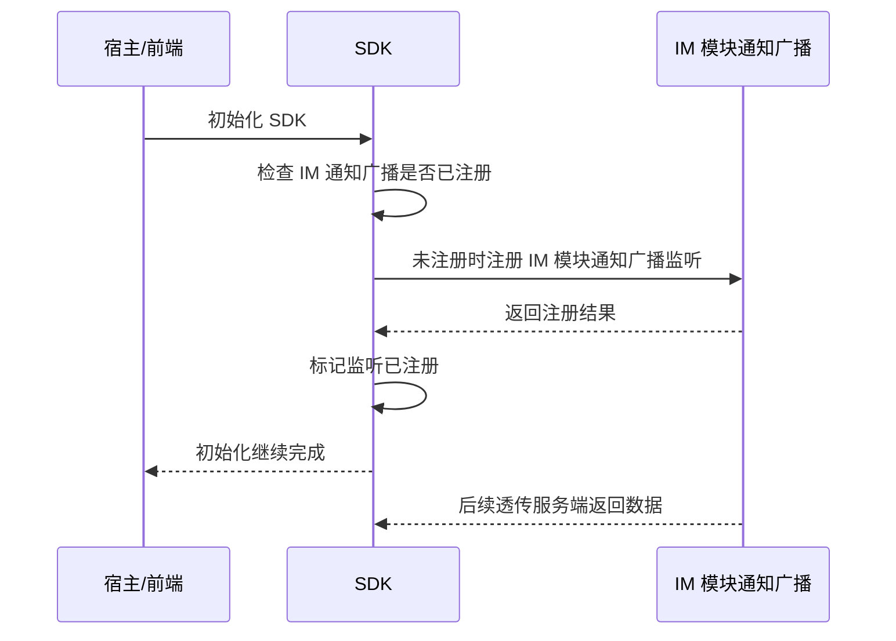
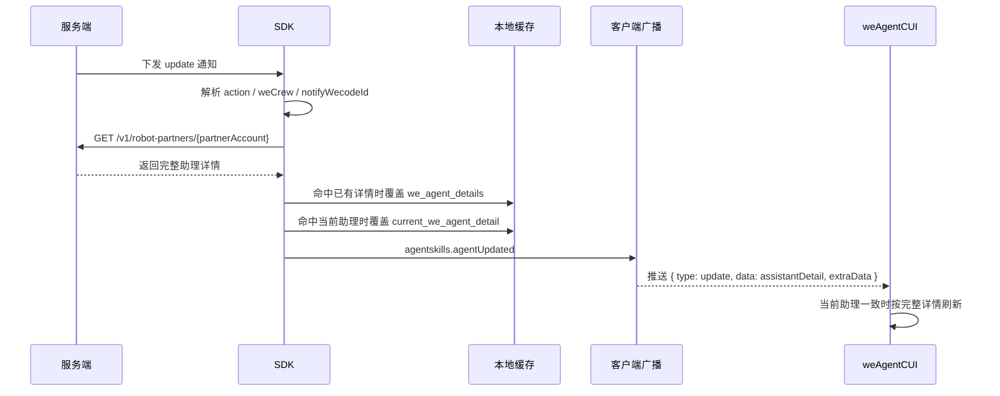
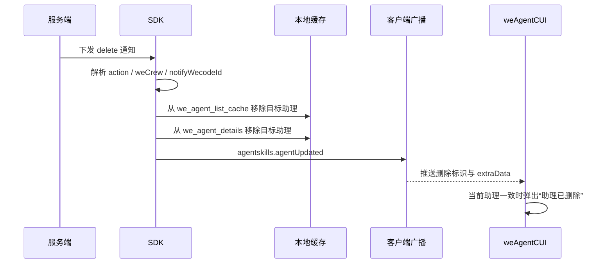
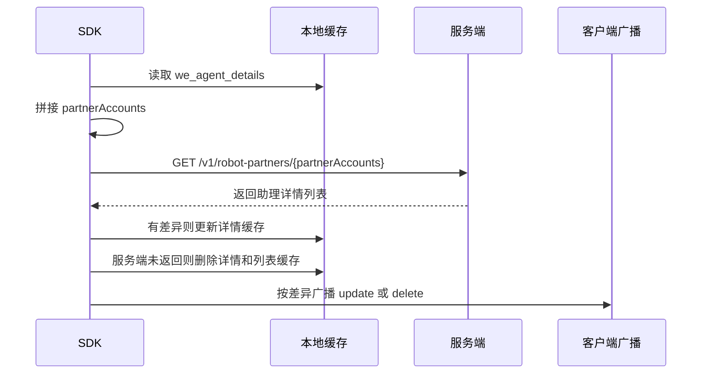
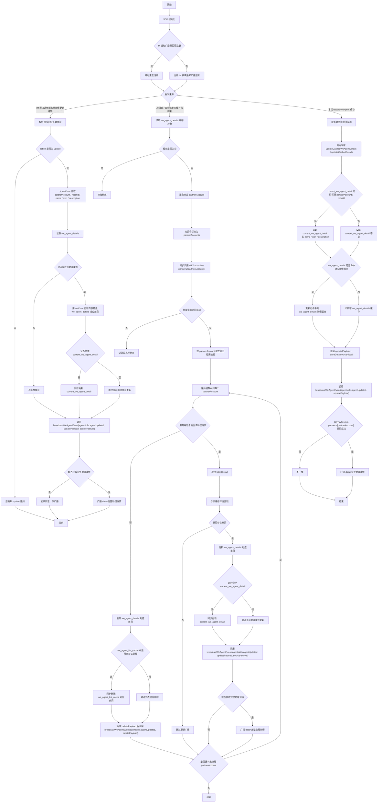
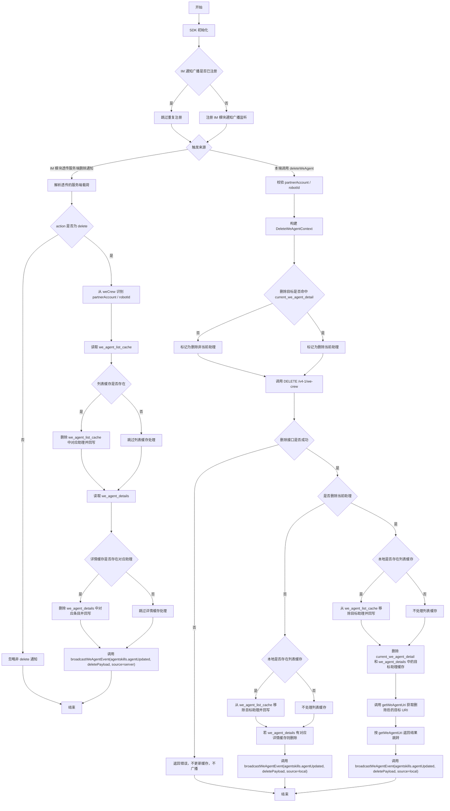
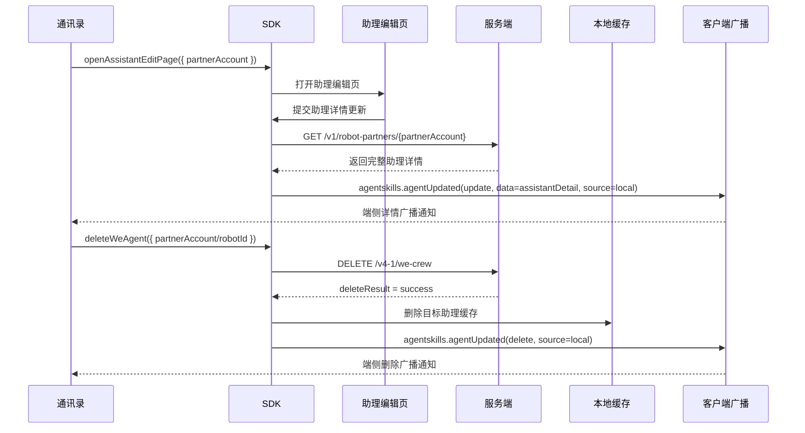
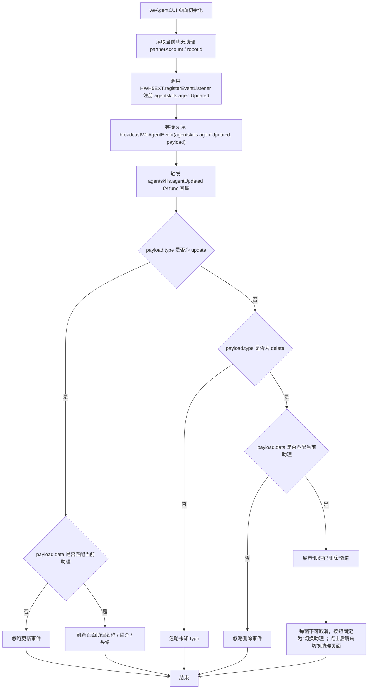

# `助理详情更新与删除同步方案`

- 方案日期：`2026-05-08`
- 目标工程：`skillSDK`、`ai-chat-viewer`
- 参考文档：`SkillClientSdkInterfaceV2.md`、`ai-chat-viewer/docs/plans/技术方案模板.md`
- 方案类型：`跨端 SDK 同步机制设计`

## 1. 背景

### 1.1 场景说明

基于 [SkillClientSdkInterfaceV2.md](/F:/AIProject/skillSDK/SkillClientSdkInterfaceV2.md)，当前助理相关能力已经具备以下基础：

1. `getWeAgentDetails`：获取指定助理详情，并写入 `current_we_agent_detail`。
2. `getAssistantDetails`：优先返回 `we_agent_details` 缓存，并异步刷新缓存。
3. `updateWeAgent`：更新助理信息，并同步更新本地缓存。
4. `deleteWeAgent`：删除助理，并在删除当前助理时处理切换逻辑。

由于存在多端同时操作同一个助理的场景，SDK 还需要补齐“服务端主动通知 + 本地缓存刷新 + 对外广播通知”的统一同步机制，保证宿主能及时感知助理详情更新和助理删除。

以下方案默认“服务端主动通知”先由 IM 模块通知广播透传给 SDK，IM 模块广播载荷保持服务端返回数据原样透传，不在 IM 模块做字段改写或业务解析。若后续服务端采用其他通知通道，仅替换通知接入层，缓存处理与对外回调规则保持不变。

### 1.2 需求目标

1. SDK 初始化时注册 IM 模块的通知广播，用于接收 IM 模块透传的服务端助理详情更新和删除通知。
2. 服务端主动下发助理详情更新或删除通知时，SDK 自动更新本地缓存，并通过客户端已有广播机制对外通知。
3. 客户端冷启动，或从断网离线恢复到在线时，SDK 对 `we_agent_details` 中的所有助理做异步补偿刷新，并在检测到差异或发现助理已删除时对外通知。
4. 本端主动调用 `updateWeAgent` 成功后，在现有缓存更新逻辑完成后补充广播助理更新事件。
5. 本端主动调用 `deleteWeAgent` 成功后，在列表缓存与当前助理跳转逻辑完成后补充广播助理删除事件；若删除目标是当前助理，则直接调用 `SkillClientSdkInterfaceV2.md` 中的 `getWeAgentUri` 方法，由该方法内部判断是否存在主助理，有主助理时返回主助理 URI，否则返回激活页面 URI。
6. 专属助手的详情页不显示编辑按钮。
7. `ai-chat-viewer` 的 `weAgentCUI` 页面在收到助理更新或删除通知后，能够及时刷新助理信息，或引导用户切换到其他助理。
8. 面向通讯录提供助理更新与删除联动能力：通讯录可通过 SDK 端侧详情广播通知和删除广播通知感知状态变化，并通过既有 JSAPI 调用 `openAssistantEditPage` 与 `deleteWeAgent` 完成编辑入口打开和删除操作。
9. 通讯录调用 `openAssistantEditPage` 时按 `SkillClientSdkInterfaceV2.md` 仅使用必填 `partnerAccount` 定位助理；更新后的助理详情数据不再通过 `openAssistantEditPage` 回调返回，通讯录统一通过注册 `agentskills.agentUpdated` 端侧详情广播通知获取。

### 1.3 非目标

1. 不新增统一监听接口，继续复用客户端已有广播机制。
2. 不新增新的持久化缓存 key，继续沿用 `current_we_agent_detail`、`we_agent_details`、`we_agent_list_cache`。
3. 服务端主动删除通知场景下，不复用 `deleteWeAgent` 的当前助理跳转逻辑，不组装跳转 URI。

## 2. 方案图

### 2.1 整体方案图



### 2.2 方案核心

SDK 初始化时先注册 IM 模块的通知广播，IM 模块将服务端返回数据原样透传给 SDK；SDK 收到透传载荷后，再统一将助理详情更新和删除事件收口为“缓存处理后广播”的内部流程，服务端主动通知、本端操作成功、冷启动与离线恢复补偿刷新都复用同一套事件语义。

## 3. 时序图

### 3.1 SDK 初始化注册 IM 模块通知广播



### 3.2 服务端主动下发详情更新



服务端下发更新详情的数据结构调整为：

```json
{
  "action": "update",
  "weCrew": {
    "robotId": "123",
    "partnerAccount": "123",
    "name": "分身小白",
    "icon": "/mcloud/xxx",
    "description": "数字分身小白能做..."
  },
  "notifyWecodeId": ["123456"]
}
```

### 3.3 服务端主动下发删除



服务端下发删除的数据结构调整为：

```json
{
  "action": "delete",
  "weCrew": {
    "robotId": "123",
    "partnerAccount": "123"
  },
  "notifyWecodeId": ["123456"]
}
```

### 3.4 冷启动与离线恢复在线补偿刷新



### 3.5 本端主动更新或删除成功


### 3.6 详情更新详细流程图



### 3.7 删除详细流程图



## 4. 技术细节

### 4.1 调整点

1. SDK 初始化时注册 IM 模块通知广播，统一接收 IM 模块透传的服务端助理更新和删除通知。
2. 新增 SDK 内部广播封装：`broadcastWeAgentEvent(eventName: string, data: any): void`。
3. 服务端主动通知载荷统一改为 `action + weCrew + notifyWecodeId` 结构。
4. 助理更新与删除统一广播 `agentskills.agentUpdated`，通过 payload 中的 `type` 区分 `update` 与 `delete`。
5. 助理详情更新广播前必须通过 `GET /v1/robot-partners/{partnerAccount}` 获取完整助理详情，广播 payload 中的 `data` 为该完整助理详情对象；若本次详情请求失败或无法确定 `partnerAccount`，则不触发更新广播。
6. 助理更新与删除广播 payload 均新增 `extraData` 对象，`extraData.source` 用于区分本地广播来源：`server` 表示由服务端通知或服务端补偿刷新触发，`local` 表示由本端主动 API 成功触发。
7. 冷启动和离线恢复在线时，对已有 `we_agent_details` 做批量补偿刷新。
8. `weAgentCUI` 页面订阅更新和删除广播，仅处理当前聊天助理相关事件。
9. 新增 SDK 内部助理缓存处理队列，所有会修改 `we_agent_details`、`we_agent_list_cache`、`current_we_agent_detail` 的事件都进入队列串行处理，避免本端主动操作与服务端同步广播回流并发写缓存。
10. 新增通讯录接入说明：通讯录复用 `openAssistantEditPage` 打开编辑页，复用 `deleteWeAgent` 删除助理，并订阅端侧详情广播通知和删除广播通知保持通讯录列表与详情同步。

### 4.2 核心实现方式

缓存仍沿用 `SkillClientSdkInterfaceV2.md` 现有约定，并按 `userId` 隔离；当前 `userId` 仍使用 mock 值 `mock_user_id`。

| 缓存 key | 说明 |
|---|---|
| `current_we_agent_detail` | 当前助理详情对象 |
| `we_agent_details` | 助理详情缓存对象，key 为 `partnerAccount`，value 为对应助理详情对象 |
| `we_agent_list_cache` | 助理列表缓存 |

SDK 内部新增助理缓存处理队列：

1. 队列为 SDK 内部实现，不新增公开接口，也不新增持久化缓存 key。
2. 所有会修改助理缓存的事件都必须先进入队列，由队列按入队顺序串行处理；同一时刻只处理一个事件，当前事件完成缓存读写和广播后再处理下一个事件。
3. 队列事件来源包括：
   - 本端主动 `updateWeAgent` 成功；
   - 本端主动 `deleteWeAgent` 成功；
   - 服务端主动广播 `action = update`；
   - 服务端主动广播 `action = delete`；
   - 冷启动或离线恢复在线补偿刷新。
4. 队列事件建议结构：
   ```typescript
   type WeAgentCacheMutation = {
     action: 'update' | 'delete';
     source: 'localApi' | 'serverPush' | 'compensate';
     partnerAccount?: string;
     robotId?: string;
     data: Record<string, unknown>;
     enqueueTime: number;
   };
   ```
5. 本阶段不做服务端回流广播去重，不做广播前最终态 diff；本端主动操作成功后的队列事件处理完成后必须广播，服务端广播回流到达后也按服务端广播规则处理。
6. 服务端未返回 `version` 和 `eventTime`，队列不做版本或时间戳比较。
7. `update` 事件只更新本地已存在的助理缓存；若 `we_agent_details` 不存在对应助理缓存，则不新增缓存、不补拉详情，因此删除后迟到的 `update` 不会恢复已删除助理。
8. `delete` 事件按幂等方式处理；若列表缓存或详情缓存中已不存在目标助理，则跳过对应缓存处理，不报错。

SDK 内部统一封装广播调用：

```typescript
broadcastWeAgentEvent(eventName: string, data: any): void
```

方法职责：

1. 在方法内部统一接入客户端已有广播机制。
2. 方法内部直接调用 `WeBroadCast(eventName, data)` 完成实际广播。
3. `WeBroadCast(eventName, data)` 需按事件映射触发通过 `HWH5EXT.registerEventListener` 注册的页面监听回调，并将 `data` 作为回调参数透传给页面。
4. 所有助理更新和删除场景都统一复用该方法，不在业务分支中直接散落调用 `WeBroadCast(...)`。
5. 当 `data.type = 'update'` 时，方法内部先从 payload 或缓存中解析 `partnerAccount`，再请求 `GET /v1/robot-partners/{partnerAccount}` 获取完整助理详情，并使用接口返回的完整助理详情对象覆盖 `data.data` 后再广播。
6. 当更新广播无法确定 `partnerAccount`，或 `GET /v1/robot-partners/{partnerAccount}` 请求失败、超时、返回结构异常、未返回有效助理详情时，方法记录日志并终止本次广播，不调用 `WeBroadCast(...)`。
7. 当 `data.type = 'delete'` 时，不额外请求详情接口，直接广播删除 payload。

广播约定：

| 场景 | SDK 内部 eventName | HWH5EXT.registerEventListener type | payload |
|---|---|---|---|
| 助理详情更新 | `agentskills.agentUpdated` | `agentskills.agentUpdated` | `{ type: 'update', data: assistantDetail, extraData: { source } }`，其中 `data` 为 `GET /v1/robot-partners/{partnerAccount}` 返回的完整助理详情对象 |
| 助理删除 | `agentskills.agentUpdated` | `agentskills.agentUpdated` | `{ type: 'delete', data: weCrew, extraData: { source } }`，其中 `data` 至少包含 `robotId`、`partnerAccount` |

广播规则：

1. 若场景触发了助理更新，SDK 调用 `broadcastWeAgentEvent('agentskills.agentUpdated', updatePayload)`；`broadcastWeAgentEvent` 成功补拉完整助理详情后才对外广播。
2. 若场景触发了助理删除，SDK 调用 `broadcastWeAgentEvent('agentskills.agentUpdated', deletePayload)` 对外广播。
3. `updatePayload` 结构固定为：
   ```json
   {
     "type": "update",
     "data": {
       "name": "分身小白",
       "icon": "/mcloud/xxx",
       "desc": "数字分身小白能做...",
       "moduleId": "M1000",
       "partnerAccount": "123",
       "appKey": "",
       "appSecret": "",
       "createdBy": "",
       "creatorWorkId": "",
       "creatorW3Account": "",
       "creatorName": "",
       "creatorNameEn": "",
       "ownerWelinkId": "",
       "ownerW3Account": "",
       "ownerName": "",
       "ownerNameEn": "",
       "ownerDeptName": "",
       "ownerDeptNameEn": "",
       "id": "123",
       "bizRobotId": "biz_123",
       "bizRobotName": "业务助手",
       "bizRobotNameEn": "Business Agent",
       "bizRobotTag": "myAgent",
       "tagName": "助手",
       "tagNameEn": "Agent",
       "weCodeUrl": "h5://S008623/index.html?assistantAccount=123"
     },
     "extraData": {
       "source": "server"
     }
   }
   ```
4. `updatePayload.data` 必须为完整助理详情对象，字段以 `GET /v1/robot-partners/{partnerAccount}` 返回的 `WeAgentDetails` 为准；若后续服务端新增字段，SDK 需在最终广播 `data` 中原样透传。
5. `deletePayload` 结构固定为：
   ```json
   {
     "type": "delete",
     "data": {
       "robotId": "123",
       "partnerAccount": "123"
     },
     "extraData": {
       "source": "local"
     }
   }
   ```
6. `extraData.source = 'server'` 表示该广播由服务端主动通知或冷启动/离线恢复补偿刷新触发；`extraData.source = 'local'` 表示该广播由本端主动调用 `updateWeAgent` 或 `deleteWeAgent` 成功触发。
7. 广播触发时机固定放在本地缓存处理之后；删除广播不受缓存命中结果影响，更新广播受完整详情补拉结果影响，补拉失败则不广播。

通讯录更新与删除接入：

接口能力明细表：

| 能力 | 接入方式 | 调用/订阅方 | 入参或 payload | 返回或回调 | 触发时机 | 通讯录处理 | 备注 |
|---|---|---|---|---|---|---|---|
| 打开助理编辑页 | `openAssistantEditPage(params)` | 通讯录主动调用 | `partnerAccount` 必填 | 返回打开结果；不包含更新回调 | 用户在通讯录点击编辑入口 | 只负责进入编辑页，不从该接口读取更新后的名称、头像、简介 | 该接口不发起服务端请求，不承载数据回传 |
| 删除助理 | `deleteWeAgent(params)` | 通讯录主动调用 | `partnerAccount?`、`robotId?`，二者至少传一个 | 成功返回 `deleteResult: "success"`；失败沿用现有错误返回 | 用户在通讯录确认删除助理 | 成功后等待或消费删除广播移除条目；失败时保留条目并展示错误提示 | 通讯录不直接调用服务端删除接口，统一走 SDK 删除链路 |
| 详情更新通知 | `agentskills.agentUpdated', func })` | 通讯录订阅 | `{ type: 'update', data: assistantDetail, extraData: { source } }`，`data` 为完整助理详情对象 | 通过 `func` 接收广播 payload | 服务端主动更新、本端 `updateWeAgent` 成功、冷启动或离线恢复补偿发现详情变化，且完整详情补拉成功 | 按 `partnerAccount` 优先、`robotId` 兜底匹配条目，刷新名称、头像、简介等详情字段 | 通讯录获取更新后数据的唯一推荐通道 |
| 删除通知 | `agentskills.agentUpdated, func })` | 通讯录订阅 | `{ type: 'delete', data: weCrew, extraData: { source } }`，`data` 至少包含 `robotId`、`partnerAccount` | 通过 `func` 接收广播 payload | 服务端主动删除、本端 `deleteWeAgent` 成功、冷启动或离线恢复补偿发现助理已删除 | 按 `partnerAccount` 优先、`robotId` 兜底移除条目；当前正在展示详情时关闭详情或展示已删除状态 | 删除广播需幂等处理，重复收到不报错 |

1. 通讯录打开编辑页时调用 `openAssistantEditPage({ partnerAccount })`，入参与 `SkillClientSdkInterfaceV2.md` 保持一致：`partnerAccount` 必填，SDK 仅使用 `partnerAccount` 作为助理标识。
2. `openAssistantEditPage` 只负责打开助理编辑页面，不再接收或注册更新回调，也不承载通讯录的数据回传职责。
3. 通讯录需要通过既有客户端事件机制订阅 `agentskills.agentUpdated`，消费 SDK 端侧详情广播通知和删除广播通知。
4. 编辑页完成更新并触发 SDK 更新成功链路后，SDK 先通过 `GET /v1/robot-partners/{partnerAccount}` 获取完整助理详情；请求成功时通过 `agentskills.agentUpdated` 下发 `{ type: 'update', data: assistantDetail, extraData: { source: 'local' } }`，请求失败时不下发更新广播。
5. 通讯录收到 `{ type: 'update', data: assistantDetail, extraData }` 后，按 `partnerAccount` 优先、`robotId` 兜底匹配本地通讯录条目，刷新对应助理的名称、头像、简介等详情字段，并可通过 `extraData.source` 判断该广播来自服务端链路还是本端链路。
6. 通讯录收到 `{ type: 'delete', data: weCrew, extraData }` 后，按 `partnerAccount` 优先、`robotId` 兜底移除对应通讯录条目；若当前正在展示该助理详情，则关闭详情或展示已删除状态，并可通过 `extraData.source` 判断该广播来自服务端链路还是本端链路。
7. 通讯录删除助理时调用 `deleteWeAgent({ partnerAccount?, robotId? })`，不直接绕过 SDK 调用服务端删除接口；SDK 在删除成功后处理缓存、当前助理跳转和 `agentskills.agentUpdated` 删除广播。
8. `deleteWeAgent` 调用失败时沿用现有失败处理，不更新缓存，不触发删除广播；通讯录保持原有条目并展示自身错误提示。



SDK 初始化监听注册：

1. SDK 初始化流程中调用内部方法注册 IM 模块通知广播，例如 `registerWeAgentImNotifyBroadcastListener()`。
2. 注册方法只负责接入 IM 模块通知广播，不直接处理 UI 广播，也不要求 IM 模块改写服务端数据结构。
3. IM 模块通知广播回调数据必须透传服务端返回的原始载荷，SDK 在自身回调中解析 `action + weCrew + notifyWecodeId`。
4. 注册前先检查内存态标记，若已注册则直接返回，避免重复初始化或重连流程导致同一通知被消费多次。
5. 监听回调收到 IM 模块透传的服务端载荷后，先做基础合法性校验，再根据 `action` 分发：
   - `action = 'update'`：进入服务端主动详情更新处理；
   - `action = 'delete'`：进入服务端主动删除处理；
   - 其他 `action`：记录日志后忽略。
6. 注册失败不阻塞 SDK 初始化主流程，但需要记录日志或埋码，便于定位 IM 通知广播不可用问题。
7. 若 SDK 支持销毁或切换账号，销毁时应注销监听或清理注册标记；切换账号后重新按当前 `userId` 注册或过滤通知。

服务端主动详情更新处理：

1. SDK 从通知载荷中读取 `action`，仅当 `action = 'update'` 时进入详情更新流程。
2. SDK 从 `weCrew` 中解析助理唯一标识，优先使用 `partnerAccount`，若服务端同时提供 `robotId` 也一并保留。
3. SDK 组装 `source = 'serverPush'`、`action = 'update'` 的助理缓存处理事件，并放入助理缓存处理队列。
4. 队列处理该事件时读取本地 `we_agent_details`，检查是否已存在该助理缓存详情。
5. 若存在，则使用 `weCrew` 中的更新字段覆盖 `we_agent_details[partnerAccount]`。
6. 若 `current_we_agent_detail` 命中同一助理，则同步覆盖为最新内容。
7. 若本地 `we_agent_details` 中不存在该助理缓存详情，则不新增缓存。
8. 队列最后调用 `broadcastWeAgentEvent('agentskills.agentUpdated', updatePayload)`，其中 `updatePayload` 至少携带 `type = 'update'`、`data.partnerAccount` 和 `extraData.source = 'server'`。
9. `broadcastWeAgentEvent` 在真正对外广播前请求 `GET /v1/robot-partners/{partnerAccount}` 获取完整助理详情；请求成功且返回有效详情时，用完整助理详情对象作为 `payload.data` 对外广播。
10. 若无法从 `weCrew` 或缓存解析出 `partnerAccount`，或本次 `GET /v1/robot-partners/{partnerAccount}` 请求失败、超时、返回结构异常、未返回有效助理详情，则记录日志并结束本次更新事件处理，不触发 `agentskills.agentUpdated` 更新广播。

服务端主动删除处理：

1. SDK 从通知载荷中读取 `action`，仅当 `action = 'delete'` 时进入删除流程。
2. SDK 从 `weCrew` 中解析删除目标标识，`partnerAccount` 与 `robotId` 至少一个存在。
3. SDK 组装 `source = 'serverPush'`、`action = 'delete'` 的助理缓存处理事件，并放入助理缓存处理队列。
4. 队列处理该事件时读取本地 `we_agent_list_cache`，若存在则从列表缓存中删除对应助理并回写。
5. 队列读取本地 `we_agent_details`，若存在对应助理详情缓存，则移除对应条目并回写。
6. 该场景不读取也不修改 `current_we_agent_detail`，是否为当前助理由广播消费方自行判断。
7. 队列最后调用 `broadcastWeAgentEvent('agentskills.agentUpdated', deletePayload)`，其中 `deletePayload.data` 为通知中的 `weCrew`，`deletePayload.extraData.source = 'server'`。

冷启动与离线恢复在线补偿刷新：

1. SDK 读取按 `userId` 隔离的 `we_agent_details` 缓存对象。
2. 若缓存为空，则直接结束，不发起补偿刷新。
3. SDK 从缓存对象中取出所有 `partnerAccount`，并按逗号拼接成字符串 `partnerAccounts`。
4. SDK 异步调用批量查详情服务端接口：`GET /v1/robot-partners/{partnerAccounts}`。
5. SDK 解析服务端返回的助理详情列表，并建立以 `partnerAccount` 为 key 的映射。
6. 若服务端返回了对应助理详情，则组装 `source = 'compensate'`、`action = 'update'` 的助理缓存处理事件入队；队列与旧缓存详情比较，存在差异时更新 `we_agent_details[partnerAccount]`，并调用 `broadcastWeAgentEvent` 广播更新，`extraData.source = 'server'`。
7. 若该助理同时命中 `current_we_agent_detail`，则由队列同步覆盖当前助理缓存。
8. 补偿刷新已经通过批量接口拿到对应完整助理详情；`broadcastWeAgentEvent` 可复用该详情作为更新广播 `data`，也可按统一规则再次请求 `GET /v1/robot-partners/{partnerAccount}` 校验并获取最新详情。若最终无法获得有效完整详情，则不触发该助理的更新广播。
9. 若服务端未返回对应 `partnerAccount` 的助理详情，则视为该助理已删除，组装 `source = 'compensate'`、`action = 'delete'` 的助理缓存处理事件入队；队列同步删除详情缓存和列表缓存中的对应项，并广播删除，`extraData.source = 'server'`。
10. 若批量请求失败，则仅记录日志，不更新缓存，也不触发广播。

本端主动调用 `updateWeAgent` 成功后的处理：

三端现有实现基线：

| 平台 | 更新缓存方法 | 关键行为 |
|---|---|---|
| Android | `WeAgentStorage.updateCachedWeAgentDetails(...)` | 更新命中的 `current_we_agent_detail` 与 `we_agent_details`，不新增详情缓存 |
| iOS | `WLAgentSkillsWeAgentStore updateCachedWeAgentDetailsWithPartnerAccount:...` | 更新命中的当前详情与详情缓存，不新增详情缓存 |
| HarmonyOS | `WeAgentStore.updateCachedDetails(...)` | 更新命中的当前详情与详情缓存，不新增详情缓存 |

1. 三端现有实现先校验 `partnerAccount` 与 `robotId` 至少一个存在，并要求 `name`、`icon`、`description` 为有效字符串。
2. 服务端更新接口成功后，三端组装 `source = 'localApi'`、`action = 'update'` 的助理缓存处理事件，并放入助理缓存处理队列。
3. 队列处理该事件时复用三端现有缓存更新方法：
   - Android：`updateCachedWeAgentDetails(partnerAccount, robotId, name, icon, description)`；
   - iOS：`updateCachedWeAgentDetailsWithPartnerAccount:robotId:name:icon:description:`；
   - HarmonyOS：`updateCachedDetails(partnerAccount, robotId, name, icon, description)`。
4. 若 `current_we_agent_detail` 匹配 `partnerAccount` 或 `robotId`，则仅更新当前详情中的 `name`、`icon`、`description`。
5. 若 `we_agent_details` 中命中对应缓存详情，则仅更新该缓存详情中的 `name`、`icon`、`description`。
6. 若 `we_agent_details` 中未命中对应缓存详情，则保持现有实现，不新增详情缓存。
7. 现有三端接口返回 `success` 结果，不改变原接口返回语义。
8. 本端主动调用 `updateWeAgent` 成功后必须尝试广播助理更新事件，广播点放在队列完成现有缓存更新之后；广播事件为 `agentskills.agentUpdated`，payload 结构为 `{ type: 'update', data: { partnerAccount, robotId, name, icon, description }, extraData: { source: 'local' } }`，其中 `data` 仅作为 `broadcastWeAgentEvent` 补拉完整详情前的标识和兜底上下文，不直接作为最终广播数据。
9. `broadcastWeAgentEvent` 需使用 `partnerAccount` 请求 `GET /v1/robot-partners/{partnerAccount}` 获取完整助理详情，并以完整助理详情对象作为最终广播 `data`；若本端更新事件无法确定 `partnerAccount`，或本次详情请求失败，则不触发更新广播。

本端主动调用 `deleteWeAgent` 成功后的处理：

接口文档与本方案调整后的三端处理要求：

| 平台 | 删除后处理方法 | 关键行为 |
|---|---|---|
| Android | `handleDeleteWeAgentResult(...)` / `handleDeleteWeAgentSuccess(...)` | 非当前助理只更新已存在列表缓存；当前助理不计算下一个助理，也不在 `deleteWeAgent` 内部展开主助理判断，删除成功后直接调用 `getWeAgentUri` 获取跳转 URI； |
| iOS | `handleDeleteWeAgentResultWithContext:...` / `handleDeleteWeAgentSuccessWithPlan:...` | 非当前助理只更新已存在列表缓存；当前助理不计算下一个助理，也不在 `deleteWeAgent` 内部展开主助理判断，删除成功后直接调用 `getWeAgentUri` 获取跳转 URI； |
| HarmonyOS | `handleDeleteWeAgentResult(...)` / `handleDeleteCurrentWeAgentSuccess(...)` | 非当前助理只更新已存在列表缓存；当前助理不计算下一个助理，也不在 `deleteWeAgent` 内部展开主助理判断，删除成功后直接调用 `getWeAgentUri` 获取跳转 URI； |

1. SDK 校验 `partnerAccount` 与 `robotId` 至少传一个：
   - 仅传 `partnerAccount` 时，透传 `partnerAccount`；
   - 仅传 `robotId` 时，透传 `robotId`；
   - 两者同时传入时，两个参数都透传给服务端。
2. SDK 在调用删除接口前读取 `current_we_agent_detail`，判断删除目标是否命中当前助理：
   - 当前详情存在，且 `partnerAccount` 或 `id/robotId` 与删除目标匹配时，视为删除当前助理；
   - 否则视为删除非当前助理。
3. SDK 调用服务端删除接口 `DELETE /v4-1/we-crew`。
4. 服务端删除成功后，原接口返回 `deleteResult: "success"`，SDK 组装 `source = 'localApi'`、`action = 'delete'` 的助理缓存处理事件，并放入助理缓存处理队列；服务端失败时保持现有异常处理，透传或包装服务端错误，不触发本端删除成功广播。
5. 若删除目标不是当前助理：
   - 仅尝试更新本地 `we_agent_list_cache`；
   - 若本地存在助理列表缓存，则从缓存列表中移除当前被删除助理，并将删除后的列表回写；
   - 若本地不存在助理列表缓存，则不主动调用 `getWeAgentList`，也不做缓存处理；
   - 不触发当前助理跳转逻辑，不修改 `current_we_agent_detail`，不组装跳转 URI；
   - 若本地 `we_agent_details` 中存在当前被删除助理对应详情缓存，则删除该条详情缓存并回写。
6. 若删除目标是当前助理：
   - 删除接口请求前只判断删除目标是否命中 `current_we_agent_detail`，不计算当前助理的下一个助理；
   - 服务端删除成功后，仅尝试更新本地 `we_agent_list_cache`；
   - 若本地存在助理列表缓存，则从缓存列表中移除当前被删除助理，并将删除后的列表回写；
   - 若本地不存在助理列表缓存，则不主动调用 `getWeAgentList`，也不做列表缓存处理；
   - 删除 `current_we_agent_detail` 中的当前被删助理，避免 `getWeAgentUri` 继续读取到已删除助理；
   - 若本地 `we_agent_details` 中存在当前被删除助理对应详情缓存，则删除该条详情缓存并回写；
   - 不在 `deleteWeAgent` 内部判断删除后列表是否存在主助理，也不直接组装主助理或激活页 URI；
   - 直接调用 `SkillClientSdkInterfaceV2.md` 中的 `getWeAgentUri` 方法获取删除后的目标 URI；
   - `getWeAgentUri` 内部负责判断是否存在主助理：有主助理时返回主助理相关 URI；无主助理、主助理获取失败或 `weCodeUrl` 为空时，按接口文档约定返回激活页面 URI；
   - SDK 按 `getWeAgentUri` 返回结果执行跳转。
7. 本端主动调用 `deleteWeAgent` 成功后必须广播助理删除事件，广播点放在队列完成上述现有删除成功处理之后；广播事件为 `agentskills.agentUpdated`，payload 结构为 `{ type: 'delete', data: weCrew, extraData: { source: 'local' } }`，其中 `data` 需组装为与服务端删除通知 `weCrew` 一致的结构，即包含删除目标 `robotId`、`partnerAccount`。

`weAgentCUI` 页面消费规则：

1. 页面初始化后，通过 `HWH5EXT.registerEventListener` JSAPI 注册统一的助理变更监听。
2. `HWH5EXT.registerEventListener` 入参包含：
   - `type`：事件名；
   - `func`：监听事件响应回调。
3. 页面注册助理变更监听：
   ```typescript
   HWH5EXT.registerEventListener({
     type: 'agentskills.agentUpdated',
     func: (payload: {
       type: 'update' | 'delete';
       data: {
         robotId?: string;
         partnerAccount?: string;
         name?: string;
         icon?: string;
         description?: string;
          [key: string]: unknown;
       };
       extraData?: {
         source?: 'server' | 'local';
       };
     }) => {
       // 根据 payload.type 区分更新或删除。
     }
   });
   ```
4. SDK 侧调用 `broadcastWeAgentEvent('agentskills.agentUpdated', payload)` 后，由客户端广播机制触发 `HWH5EXT.registerEventListener` 对应 `type` 的 `func` 回调，并将对应广播 payload 原样透传给页面。
5. 当 `payload.type = 'update'` 时，`func` 仅处理当前聊天助理的更新事件；此时 `payload.data` 为完整助理详情对象。
6. 若 `payload.data.partnerAccount` 与当前页面助理一致，则使用完整助理详情更新页面中的名称、简介、头像、业务标签等信息。
7. 若更新事件不是当前页面助理，则忽略。
8. 当 `payload.type = 'delete'` 时，`func` 仅处理当前聊天助理的删除事件；此时 `payload.data` 为删除目标标识对象。
9. 若 `payload.data.partnerAccount` 与当前页面助理一致，则弹窗提示用户“助理已删除”。
10. 弹窗底部按钮固定为“切换助理”，弹窗不可取消。
11. 点击“切换助理”后跳转到切换助理页面。
12. 删除非当前助理时，页面不做 UI 变化。
13. 页面可通过 `payload.extraData.source` 区分广播来源，`server` 表示服务端通知或补偿刷新触发，`local` 表示本端主动 API 成功触发。

`weAgentCUI` 页面消费流程图：



### 4.3 兼容与边界

1. 服务端通知载荷中的 `notifyWecodeId` 用于标识需要通知的 wecode 范围，SDK 缓存处理仍以 `weCrew.partnerAccount` 和 `weCrew.robotId` 为目标标识。
2. 更新通知中若 `we_agent_details` 不存在目标助理缓存，SDK 不新增缓存；但只要能解析出 `partnerAccount` 并成功获取完整助理详情，仍可触发更新广播。
3. 更新广播前若无法确定 `partnerAccount`，或 `GET /v1/robot-partners/{partnerAccount}` 请求失败、超时、返回结构异常、未返回有效助理详情，则不触发更新广播。
4. 删除通知中若本地缓存不存在目标助理，SDK 仍触发删除广播。
5. 服务端主动删除通知不修改 `current_we_agent_detail`，避免 SDK 在非用户主动删除场景中擅自切换当前助理。
6. 冷启动和离线恢复在线的批量补偿刷新失败时仅记录日志，不影响 SDK 初始化和页面使用。
7. 服务端未在批量详情接口中返回某个本地已缓存助理时，视为该助理已删除。
8. `partnerAccount` 缺失但存在 `robotId` 时，可用 `robotId` 辅助从列表缓存或详情缓存中反查目标；若仍无法确定 `partnerAccount`，删除广播至少携带 `robotId`，更新广播不触发。
9. IM 模块通知广播注册失败不阻塞 SDK 初始化，后续仍可依赖冷启动和离线恢复在线补偿刷新收敛缓存。
10. SDK 重复初始化、IM 模块重连、前后台切换恢复时，监听注册必须幂等，避免同一服务端通知触发多次缓存处理和客户端广播。
11. IM 模块通知广播只负责透传服务端返回数据；若透传载荷缺少 `action` 或 `weCrew`，SDK 记录日志并忽略该通知。
12. 本阶段不做服务端回流广播去重，不做广播前最终态 diff；若本端主动操作成功后服务端又同步广播同一助理更新或删除，服务端广播仍会入队并按服务端广播规则处理。
13. 因为服务端未返回 `version` 和 `eventTime`，队列不做版本或时间戳比较，仅通过串行处理避免并发写缓存。
14. 删除后迟到的更新广播进入队列后，若本地 `we_agent_details` 已不存在对应助理缓存，则不新增缓存；若仍能成功补拉完整助理详情，则可触发更新广播，是否消费由页面按当前状态判断。
15. 历史版本兼容：对于 6 月前的历史版本，助理详情页需屏蔽编辑按钮，避免旧版本进入不支持新同步通知链路的编辑流程。
16. 专属助手详情页不显示编辑按钮，避免专属助手进入编辑流程。

### 4.4 相关接口联动

1. `getWeAgentDetails`：语义不变，继续用于指定助理详情查询与缓存写入。
2. `getAssistantDetails`：语义不变，继续优先返回缓存并异步刷新。
3. `updateWeAgent`：保留三端现有“只更新命中的当前详情与详情缓存，不新增详情缓存”的逻辑，成功后将 `localApi update` 事件放入助理缓存处理队列；队列处理完成后必须尝试触发 `agentskills.agentUpdated` 更新广播，payload.type 为 `update`，`extraData.source = 'local'`，最终广播 `data` 为补拉成功后的完整助理详情对象。
4. `deleteWeAgent`：非当前助理只更新已存在列表缓存；当前助理删除成功后，删除列表、`current_we_agent_detail` 与详情缓存中的目标助理，然后直接调用 `getWeAgentUri` 获取跳转 URI，由 `getWeAgentUri` 内部判断是否有主助理，有主助理则返回主助理 URI，否则返回激活页面 URI；成功后将 `localApi delete` 事件放入助理缓存处理队列，队列处理完成后必须触发 `agentskills.agentUpdated` 删除广播，payload.type 为 `delete`，`extraData.source = 'local'`。该接口同时作为提供给通讯录的助理删除入口，通讯录调用成功后通过返回结果和删除广播收敛本地列表。
5. `openAssistantEditPage`：提供给通讯录或详情入口打开助理编辑页，入参以 `SkillClientSdkInterfaceV2.md` 为准，仅使用必填 `partnerAccount` 定位助理；该接口不再包含更新回调，不发起服务端请求，也不负责向通讯录回传更新后数据。
6. `notifyAssistantDetailUpdated`：按最新接口文档已删除，不再作为通讯录获取更新后数据的通道；通讯录必须订阅 `agentskills.agentUpdated` 作为端侧详情广播通知，并从 `{ type: 'update', data: assistantDetail, extraData }` 中获取更新后的完整助理详情。
7. `GET /v1/robot-partners/{partnerAccounts}`：用于冷启动和离线恢复在线后的批量补偿刷新。
8. SDK 初始化入口：新增 IM 模块通知广播注册调用，监听回调按服务端透传载荷中的 `action` 组装 `serverPush update/delete` 事件并放入助理缓存处理队列。
9. `HWH5EXT.registerEventListener`：`weAgentCUI` 页面和通讯录通过该 JSAPI 注册 `agentskills.agentUpdated`，SDK 通过 `broadcastWeAgentEvent` 触发对应回调并透传对应广播 payload。
10. 通讯录：订阅端侧详情广播通知和删除广播通知；收到更新广播时刷新匹配助理条目，收到删除广播时移除匹配助理条目并处理当前详情展示状态。
11. 助理详情页：专属助手详情页固定不展示编辑按钮；6 月前历史版本详情页也需屏蔽编辑按钮。

### 4.5 文档需要同步修改的内容

1. `SkillClientSdkInterfaceV2.md`：补充 SDK 初始化注册 IM 模块通知广播、IM 广播透传服务端返回数据、服务端下发 `action + weCrew + notifyWecodeId` 载荷结构、更新广播补拉完整详情、`extraData.source` 和广播事件约定。
2. Android / iOS / HarmonyOS SDK 接口说明：补充更新、删除、补偿刷新触发广播的时机。
3. `ai-chat-viewer` 相关需求或设计文档：补充 `weAgentCUI` 页面通过 `HWH5EXT.registerEventListener` 消费 `agentskills.agentUpdated` 的处理规则。
4. 助理详情页相关文档：补充专属助手详情页不显示编辑按钮，以及 6 月前历史版本屏蔽编辑按钮的规则。
5. 通讯录接入文档：补充 `openAssistantEditPage`、`deleteWeAgent` 的调用规则，以及端侧详情广播通知、删除广播通知的订阅与消费规则。

## 5. 性能

1. 服务端主动更新通知在对外广播前会额外发起一次 `GET /v1/robot-partners/{partnerAccount}` 请求，用于获取完整助理详情作为最终广播数据。
2. 服务端主动删除通知只处理本地缓存，不额外发起删除接口或详情接口请求。
3. 冷启动和离线恢复在线会新增一次批量详情补偿请求，仅在 `we_agent_details` 非空时触发。
4. 补偿刷新按批量接口一次性查询，避免对每个助理逐个发起请求。
5. 页面收到更新广播后直接使用广播中的完整助理详情刷新 UI，不需要再次调用 `getWeAgentDetails`，避免页面侧重复网络请求。
6. SDK 初始化新增一次 IM 模块通知广播注册，不引入额外详情查询请求；重复初始化时通过幂等判断避免重复注册。

## 6. 功耗

1. 不新增轮询机制。
2. 不新增独立长连接，复用 SDK 已接入的长连接或推送通道。
3. 不新增后台常驻任务。
4. 冷启动与离线恢复在线补偿刷新为事件触发，不做高频刷新。
5. 页面侧只在收到广播后做轻量状态更新，不引入额外动画或频繁渲染。
6. 初始化监听注册只复用已有 IM 模块通知广播通道，不额外维持新的后台连接。

## 7. 埋码

1. `we_agent_server_notify_received`
   - 说明：记录服务端主动通知接收情况，建议包含 `action`、`partnerAccount`、`robotId`、`notifyWecodeId`、IM 模块通知广播标识。
2. `we_agent_im_notify_listener_register`
   - 说明：记录 SDK 初始化时 IM 模块通知广播注册情况，建议包含注册结果、失败原因、是否重复注册、当前 `userId`。
3. `we_agent_cache_sync_result`
   - 说明：记录缓存同步结果，建议包含触发来源、更新数量、删除数量、失败原因。
4. `we_agent_broadcast_sent`
   - 说明：记录 SDK 对外广播发送情况，建议包含 `eventName`、`partnerAccount`、`robotId`、`extraData.source`、触发来源。
5. `we_agent_broadcast_detail_fetch_failed`
   - 说明：记录更新广播前补拉完整助理详情失败情况，建议包含 `partnerAccount`、触发来源、失败原因、是否已终止广播。
6. `we_agent_cui_delete_dialog_shown`
   - 说明：记录 `weAgentCUI` 因当前助理被删除而展示不可取消弹窗的情况。

## 8. 影响范围

### 8.1 直接影响

1. Android SDK、iOS SDK、HarmonyOS SDK 的助理详情更新、删除和缓存补偿刷新逻辑。
2. SDK 内部客户端广播封装与调用点。
3. `ai-chat-viewer` 的 `weAgentCUI` 页面通过 `HWH5EXT.registerEventListener` 注册事件监听后的 UI 刷新、删除弹窗逻辑。
4. 服务端下发助理更新和删除通知的数据结构。
5. SDK 初始化流程中的 IM 模块通知广播注册逻辑。
6. 助理详情页历史版本兼容展示逻辑：6 月前历史版本需屏蔽编辑按钮。
7. 助理详情页专属助手展示逻辑：专属助手详情页需隐藏编辑按钮。
8. 通讯录的助理编辑入口、删除入口、列表刷新和详情关闭逻辑。

### 8.2 间接影响

1. 助理列表页或切换助理页可能读取到被同步更新后的列表缓存。
2. 多端同时编辑或删除同一助理时，宿主页面对当前助理状态的感知更及时。
3. 冷启动或离线恢复在线后，本地缓存与服务端状态更快收敛。
4. 通讯录在旧版本宿主未订阅广播时仍可完成接口调用，但列表与详情的实时同步能力依赖广播接入。

### 8.3 不影响

1. 不改变 `getWeAgentDetails`、`getAssistantDetails`、`updateWeAgent`、`deleteWeAgent` 的既有对外入参和返回语义。
2. 不恢复 `notifyAssistantDetailUpdated` 更新回调链路，通讯录继续通过 `agentskills.agentUpdated` 获取更新后数据。
3. 不新增持久化缓存 key。
4. 不改变服务端主动删除通知场景的处理边界：仍只处理本地缓存和广播，不复用本端 `deleteWeAgent` 的当前助理跳转逻辑。

## 9. 测试范围

### 9.1 功能测试

1. 服务端下发 `action = update`，本地存在目标助理详情缓存且 `GET /v1/robot-partners/{partnerAccount}` 成功时，校验 `we_agent_details`、`current_we_agent_detail` 和 `agentskills.agentUpdated` 更新广播，且广播 `data` 为完整助理详情对象、`extraData.source = 'server'`。
2. 服务端下发 `action = update`，本地不存在目标助理详情缓存但完整详情补拉成功时，校验不新增缓存但仍触发更新广播；若完整详情补拉失败，则校验不触发更新广播。
3. 服务端下发 `action = delete`，本地存在目标助理时，校验列表缓存和详情缓存被删除，并触发删除广播。
4. 服务端下发 `action = delete`，本地不存在目标助理时，校验不报错且仍触发删除广播。
5. SDK 初始化时校验 IM 模块通知广播已注册，IM 模块透传服务端模拟通知后能进入对应更新或删除流程。
6. SDK 重复初始化或 IM 模块重连时，校验监听注册幂等，同一服务端通知只入队一次、只触发一次缓存处理和一次客户端广播。
7. 冷启动时 `we_agent_details` 非空，批量接口返回详情有差异，校验缓存更新和更新广播。
8. 冷启动时批量接口未返回某个本地助理，校验该助理详情缓存和列表缓存删除，并触发删除广播。
9. 离线恢复在线后重复执行补偿刷新，校验无差异时不触发无意义广播。
10. 本端 `updateWeAgent` 成功后，校验仅更新命中的当前详情或详情缓存、不新增详情缓存；完整详情补拉成功时触发 `agentskills.agentUpdated` 更新广播，payload.type 为 `update`，`extraData.source = 'local'`，补拉失败时不触发更新广播。
11. 本端 `deleteWeAgent` 删除非当前助理成功后，校验仅在本地已有列表缓存时更新列表缓存；若 `we_agent_details` 有对应助手详情缓存，则删除对应详情缓存；并触发 `agentskills.agentUpdated` 删除广播，payload.type 为 `delete`，`extraData.source = 'local'`。
12. 本端 `deleteWeAgent` 删除当前助理成功后，校验列表缓存移除目标助理，`current_we_agent_detail` 清除被删当前助理，`we_agent_details` 中被删助手详情缓存被删除；随后 SDK 调用 `getWeAgentUri` 获取跳转 URI，由 `getWeAgentUri` 内部判断有主助理时返回主助理 URI、无主助理时返回激活页面 URI；最后触发 `agentskills.agentUpdated` 删除广播，payload.type 为 `delete`，`extraData.source = 'local'`。
13. 本端 `updateWeAgent` 成功后，服务端同步广播同一助理更新，校验两个事件按入队顺序串行处理，不发生并发写缓存。
14. 本端 `deleteWeAgent` 成功后，服务端同步广播同一助理删除，校验两个事件按入队顺序串行处理，第二次删除缓存已不存在时跳过对应缓存处理且不报错。
15. 本端 `deleteWeAgent` 成功后，若迟到的服务端 `update` 广播进入队列，且 `we_agent_details` 已不存在对应助理缓存，校验不新增缓存、不恢复已删除助理。
16. 同时触发本端主动操作、服务端广播和补偿刷新时，校验所有缓存变更事件进入同一队列并按顺序处理。
17. `weAgentCUI` 初始化时通过 `HWH5EXT.registerEventListener({ type: 'agentskills.agentUpdated', func })` 注册统一监听，并校验更新广播可触发该 `func`。
18. `weAgentCUI` 初始化时通过 `HWH5EXT.registerEventListener({ type: 'agentskills.agentUpdated', func })` 注册统一监听，并校验删除广播可触发该 `func`。
19. 校验 `agentskills.agentUpdated` 的更新回调 payload 为 `{ type: 'update', data: assistantDetail, extraData: { source } }`，删除回调 payload 为 `{ type: 'delete', data: weCrew, extraData: { source } }`。
20. `weAgentCUI` 收到当前助理更新事件后，校验名称、简介、头像刷新。
21. `weAgentCUI` 收到非当前助理更新或删除事件后，校验页面不变化。
22. `weAgentCUI` 收到当前助理删除事件后，校验展示不可取消弹窗，且“切换助理”可跳转到切换助理页面。
23. 通讯录调用 `openAssistantEditPage({ partnerAccount })` 时，校验 SDK 仅按必填 `partnerAccount` 打开助理编辑页，且接口不再要求或注册更新回调。
24. 通讯录订阅 `agentskills.agentUpdated` 后，收到 `{ type: 'update', data: assistantDetail, extraData }` 时校验可从端侧详情广播通知中获取完整助理详情，并按 `partnerAccount` 优先、`robotId` 兜底刷新对应通讯录条目。
25. 编辑页完成助理详情更新后，校验通讯录只通过端侧详情广播通知刷新数据，不依赖 `openAssistantEditPage` 回调。
26. 通讯录调用 `deleteWeAgent` 删除助理成功后，校验 SDK 触发 `{ type: 'delete', data: weCrew, extraData }` 删除广播，通讯录移除对应条目；若当前展示该助理详情，则关闭详情或展示已删除状态。
27. 通讯录调用 `deleteWeAgent` 失败时，校验不更新 SDK 缓存、不触发删除广播，通讯录保留原条目并展示失败提示。
28. 通讯录重复收到同一助理的端侧详情广播通知时，校验以同一助理标识做幂等刷新，不产生重复条目。

### 9.2 兼容测试

1. Android、iOS、HarmonyOS 三端通知解析、缓存更新和广播事件名保持一致。
2. 通知载荷只包含 `partnerAccount`、只包含 `robotId`、二者都包含时的处理行为。
3. `notifyWecodeId` 为空数组、缺失、包含多个 wecode id 时，SDK 不因该字段异常影响缓存处理主流程。
4. 批量详情接口失败、超时、返回空列表、返回部分详情时的降级行为。
5. 旧版本宿主未订阅广播时，SDK 缓存处理不受影响。
6. IM 模块通知广播注册失败、重复注册、销毁后重新初始化、切换账号后重新注册或过滤通知的行为。
7. 6 月前历史版本进入助理详情页时，校验编辑按钮被屏蔽；6 月及之后版本按既有规则展示编辑入口。
8. 专属助手进入详情页时，校验不显示编辑按钮。
9. 通讯录打开编辑页只传 `partnerAccount`；删除助理只传 `partnerAccount`、只传 `robotId`、二者都传时，校验 `deleteWeAgent` 和广播消费的助理匹配规则一致。

### 9.3 文档一致性检查

1. 服务端通知示例统一为 `action + weCrew + notifyWecodeId`。
2. 更新与删除广播事件名统一为 `agentskills.agentUpdated`。
3. 更新广播 payload 统一为 `{ type: 'update', data: assistantDetail, extraData: { source } }`，其中 `data` 为完整助理详情对象。
4. 删除广播 payload 统一为 `{ type: 'delete', data: weCrew, extraData: { source } }`。
5. 三端 SDK 文档中的缓存 key、触发时机、边界处理规则保持一致。
6. 三端 SDK 文档中的 IM 模块通知广播注册时机、幂等策略、透传载荷解析和失败降级规则保持一致。
7. `weAgentCUI` 页面文档中的 `HWH5EXT.registerEventListener` 入参 `type`、`func` 与 SDK 广播保持一致：`type` 统一为 `agentskills.agentUpdated`。
8. 助理详情页文档需补充 6 月前历史版本屏蔽编辑按钮的兼容策略。
9. 助理详情页文档需补充专属助手详情页不显示编辑按钮的展示规则。
10. 通讯录接入文档中的 `openAssistantEditPage`、`deleteWeAgent`、端侧详情广播通知和删除广播通知与 `SkillClientSdkInterfaceV2.md` 保持一致。

## 10. 最终建议

推荐优先落地“SDK 初始化注册 IM 模块通知广播 + IM 广播透传服务端返回数据 + SDK 解析服务端主动通知 + SDK 缓存处理 + 统一广播封装”主链路，再补齐冷启动与离线恢复在线的批量补偿刷新。这样能先解决多端同时更新或删除助理时的实时同步问题，同时不改变现有公开接口语义，风险集中在 SDK 初始化监听注册、透传载荷解析、内部同步流程和 `weAgentCUI` 页面事件消费上，便于三端按同一协议逐步实现和验证。
