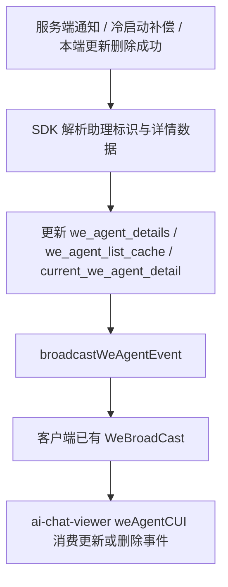
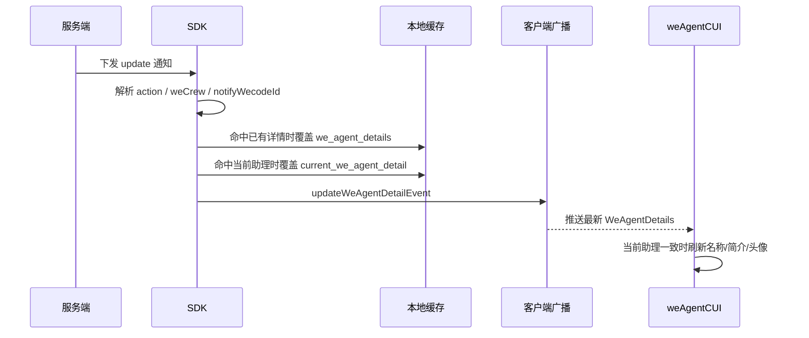
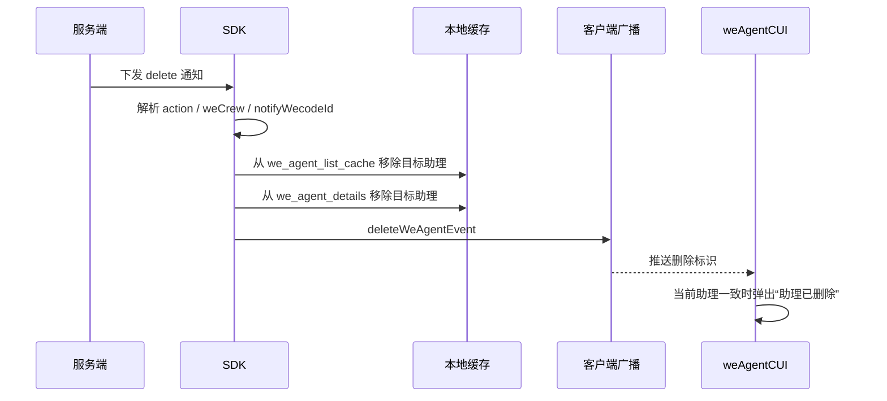
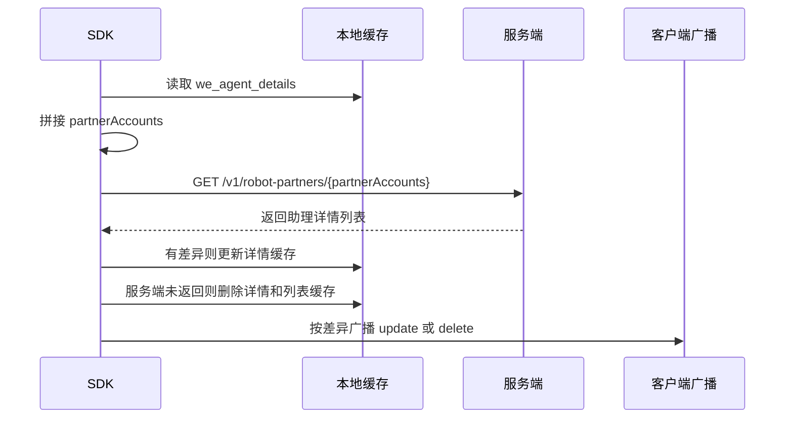
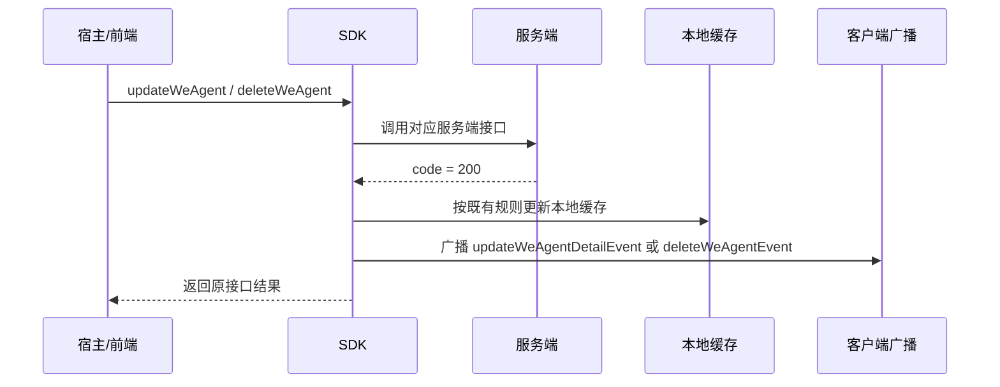
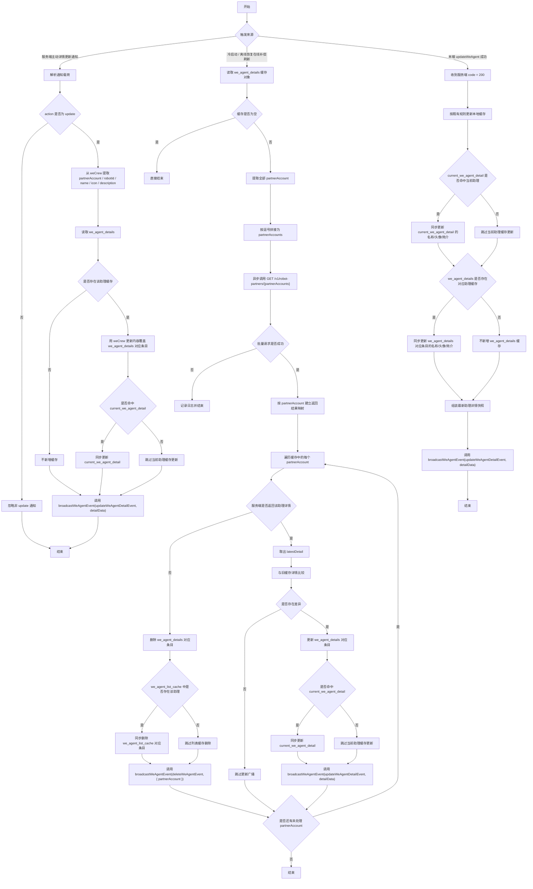
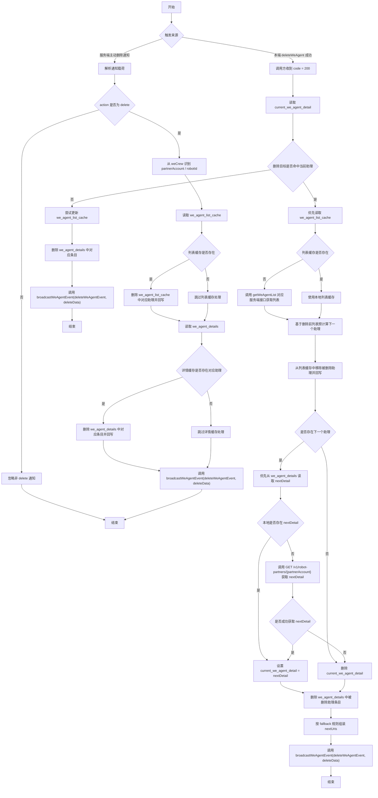

# `助理详情更新与删除同步方案`

- 方案日期：`2026-05-08`
- 目标工程：`skillSDK`、`ai-chat-viewer`
- 参考文档：`SkillClientSdkInterfaceV2.md`、`ai-chat-viewer/docs/plans/技术方案模板.md`
- 方案类型：`跨端 SDK 同步机制设计`

## 1. 背景

### 1.1 场景说明

基于 [SkillClientSdkInterfaceV2.md](/F:/AIProject/skillSDK/SkillClientSdkInterfaceV2.md)，当前助理相关能力已经具备以下基础：

1. `getWeAgentDetails`：获取指定助理详情，并写入 `current_we_agent_detail`。
2. `getAssistantDetails`：优先返回 `we_agent_details` 缓存，并异步刷新缓存。
3. `updateWeAgent`：更新助理信息，并同步更新本地缓存。
4. `deleteWeAgent`：删除助理，并在删除当前助理时处理切换逻辑。

由于存在多端同时操作同一个助理的场景，SDK 还需要补齐“服务端主动通知 + 本地缓存刷新 + 对外广播通知”的统一同步机制，保证宿主能及时感知助理详情更新和助理删除。

以下方案默认“服务端主动通知”通过 SDK 已接入的长连接或推送通道下发。若后续服务端采用其他通知通道，仅替换通知接入层，缓存处理与对外回调规则保持不变。

### 1.2 需求目标

1. 服务端主动下发助理详情更新或删除通知时，SDK 自动更新本地缓存，并通过客户端已有广播机制对外通知。
2. 客户端冷启动，或从断网离线恢复到在线时，SDK 对 `we_agent_details` 中的所有助理做异步补偿刷新，并在检测到差异或发现助理已删除时对外通知。
3. 本端主动调用 `updateWeAgent` 成功后，SDK 除了更新缓存，还要立即广播助理更新事件。
4. 本端主动调用 `deleteWeAgent` 成功后，SDK 除了更新缓存和当前助理切换状态，还要立即广播助理删除事件。
5. `ai-chat-viewer` 的 `weAgentCUI` 页面在收到助理更新或删除通知后，能够及时刷新助理信息，或引导用户切换到其他助理。

### 1.3 非目标

1. 不新增统一监听接口，继续复用客户端已有广播机制。
2. 不新增新的持久化缓存 key，继续沿用 `current_we_agent_detail`、`we_agent_details`、`we_agent_list_cache`。
3. 服务端主动更新通知场景下，不额外调用 `getWeAgentDetails` 或查详情接口补拉详情。
4. 服务端主动删除通知场景下，不复用 `deleteWeAgent` 的当前助理切换逻辑，不组装 `nextUris`。

## 2. 方案图

### 2.1 整体方案图



### 2.2 方案核心

SDK 统一将助理详情更新和删除事件收口为“缓存处理后广播”的内部流程，服务端主动通知、本端操作成功、冷启动与离线恢复补偿刷新都复用同一套事件语义。

## 3. 时序图

### 3.1 服务端主动下发详情更新



服务端下发更新详情的数据结构调整为：

```json
{
  "action": "update",
  "weCrew": {
    "robotId": "123",
    "partnerAccount": "123",
    "name": "分身小白",
    "icon": "/mcloud/xxx",
    "description": "数字分身小白能做..."
  },
  "notifyWecodeId": ["123456"]
}
```

### 3.2 服务端主动下发删除



服务端下发删除的数据结构调整为：

```json
{
  "action": "delete",
  "weCrew": {
    "robotId": "123",
    "partnerAccount": "123"
  },
  "notifyWecodeId": ["123456"]
}
```

### 3.3 冷启动与离线恢复在线补偿刷新



### 3.4 本端主动更新或删除成功



### 3.5 详情更新详细流程图



### 3.6 删除详细流程图



## 4. 技术细节

### 4.1 调整点

1. 新增 SDK 内部广播封装：`broadcastWeAgentEvent(eventName: string, data: any): void`。
2. 服务端主动通知载荷统一改为 `action + weCrew + notifyWecodeId` 结构。
3. 助理更新事件统一广播 `updateWeAgentDetailEvent`，数据为更新后的 `WeAgentDetails` 对象。
4. 助理删除事件统一广播 `deleteWeAgentEvent`，数据至少包含 `partnerAccount`，可同时保留 `robotId`。
5. 冷启动和离线恢复在线时，对已有 `we_agent_details` 做批量补偿刷新。
6. `weAgentCUI` 页面订阅更新和删除广播，仅处理当前聊天助理相关事件。

### 4.2 核心实现方式

缓存仍沿用 `SkillClientSdkInterfaceV2.md` 现有约定，并按 `userId` 隔离；当前 `userId` 仍使用 mock 值 `mock_user_id`。

| 缓存 key | 说明 |
|---|---|
| `current_we_agent_detail` | 当前助理详情对象 |
| `we_agent_details` | 助理详情缓存对象，key 为 `partnerAccount`，value 为对应助理详情对象 |
| `we_agent_list_cache` | 助理列表缓存 |

SDK 内部统一封装广播调用：

```typescript
broadcastWeAgentEvent(eventName: string, data: any): void
```

方法职责：

1. 在方法内部统一接入客户端已有广播机制。
2. 方法内部直接调用 `WeBroadCast(eventName, data)` 完成实际广播。
3. 所有助理更新和删除场景都统一复用该方法，不在业务分支中直接散落调用 `WeBroadCast(...)`。

广播约定：

| 场景 | eventName | data |
|---|---|---|
| 助理详情更新 | `updateWeAgentDetailEvent` | 更新后的助理详情数据，即 `WeAgentDetails` 对象 |
| 助理删除 | `deleteWeAgentEvent` | 删除助理数据，至少包含 `{ partnerAccount }` |

广播规则：

1. 若场景触发了助理更新，SDK 调用 `broadcastWeAgentEvent('updateWeAgentDetailEvent', detailData)` 对外广播。
2. 若场景触发了助理删除，SDK 调用 `broadcastWeAgentEvent('deleteWeAgentEvent', deleteData)` 对外广播。
3. 广播触发时机固定放在本地缓存处理之后，且缓存处理结果不影响广播。

服务端主动详情更新处理：

1. SDK 从通知载荷中读取 `action`，仅当 `action = 'update'` 时进入详情更新流程。
2. SDK 从 `weCrew` 中解析助理唯一标识，优先使用 `partnerAccount`，若服务端同时提供 `robotId` 也一并保留。
3. SDK 读取本地 `we_agent_details`，检查是否已存在该助理缓存详情。
4. 若存在，则使用 `weCrew` 中的更新字段覆盖 `we_agent_details[partnerAccount]`。
5. 若 `current_we_agent_detail` 命中同一助理，则同步覆盖为最新内容。
6. 若本地 `we_agent_details` 中不存在该助理缓存详情，则不新增缓存，不调用查详情服务端接口补拉。
7. SDK 最后调用 `broadcastWeAgentEvent('updateWeAgentDetailEvent', detailData)`，将通知中的助理更新内容直接对外广播。

服务端主动删除处理：

1. SDK 从通知载荷中读取 `action`，仅当 `action = 'delete'` 时进入删除流程。
2. SDK 从 `weCrew` 中解析删除目标标识，`partnerAccount` 与 `robotId` 至少一个存在。
3. SDK 读取本地 `we_agent_list_cache`，若存在则从列表缓存中删除对应助理并回写。
4. SDK 读取本地 `we_agent_details`，若存在对应助理详情缓存，则移除对应条目并回写。
5. 该场景不读取也不修改 `current_we_agent_detail`，是否为当前助理由广播消费方自行判断。
6. SDK 最后调用 `broadcastWeAgentEvent('deleteWeAgentEvent', deleteData)`。

冷启动与离线恢复在线补偿刷新：

1. SDK 读取按 `userId` 隔离的 `we_agent_details` 缓存对象。
2. 若缓存为空，则直接结束，不发起补偿刷新。
3. SDK 从缓存对象中取出所有 `partnerAccount`，并按逗号拼接成字符串 `partnerAccounts`。
4. SDK 异步调用批量查详情服务端接口：`GET /v1/robot-partners/{partnerAccounts}`。
5. SDK 解析服务端返回的助理详情列表，并建立以 `partnerAccount` 为 key 的映射。
6. 若服务端返回了对应助理详情，则与旧缓存详情比较；存在差异时更新 `we_agent_details[partnerAccount]` 并广播更新。
7. 若该助理同时命中 `current_we_agent_detail`，则同步覆盖当前助理缓存。
8. 若服务端未返回对应 `partnerAccount` 的助理详情，则视为该助理已删除，同步删除详情缓存和列表缓存中的对应项，并广播删除。
9. 若批量请求失败，则仅记录日志，不更新缓存，也不触发广播。

本端主动调用 `updateWeAgent` 成功后的处理：

1. 先按既有约定更新本地缓存。
2. 若 `current_we_agent_detail` 命中当前助理，则同步更新名称、头像、简介。
3. 若 `we_agent_details` 中存在对应助理缓存，则同步更新名称、头像、简介。
4. 组装最新助理详情快照，优先使用更新后的本地缓存对象。
5. 若本地没有命中缓存，则本次不新增缓存，但仍可基于入参组装最小详情对象用于通知。
6. 调用 `broadcastWeAgentEvent('updateWeAgentDetailEvent', detailData)`。

本端主动调用 `deleteWeAgent` 成功后的处理：

1. 先复用既有删除后缓存处理逻辑。
2. 删除非当前助理时，仅更新列表缓存。
3. 删除当前助理时，执行下一个助理定位、当前助理缓存切换、`nextUris` 组装。
4. 若 `we_agent_details` 中存在被删除助理条目，同步删除对应详情缓存。
5. 删除逻辑结束后，调用 `broadcastWeAgentEvent('deleteWeAgentEvent', deleteData)`。

`weAgentCUI` 页面消费规则：

1. 页面初始化后，接入客户端已有广播消费机制，分别订阅 `updateWeAgentDetailEvent` 与 `deleteWeAgentEvent`。
2. `updateWeAgentDetailEvent` 仅处理当前聊天助理的更新事件。
3. 若广播数据中的 `partnerAccount` 与当前页面助理一致，则更新页面中的助理名称、简介、头像等信息。
4. 若更新事件不是当前页面助理，则忽略。
5. `deleteWeAgentEvent` 仅处理当前聊天助理的删除事件。
6. 若广播数据中的 `partnerAccount` 与当前页面助理一致，则弹窗提示用户“助理已删除”。
7. 弹窗底部按钮固定为“切换助理”，弹窗不可取消。
8. 点击“切换助理”后跳转到切换助理页面。
9. 删除非当前助理时，页面不做 UI 变化。

### 4.3 兼容与边界

1. 服务端通知载荷中的 `notifyWecodeId` 用于标识需要通知的 wecode 范围，SDK 缓存处理仍以 `weCrew.partnerAccount` 和 `weCrew.robotId` 为目标标识。
2. 更新通知中若 `we_agent_details` 不存在目标助理缓存，SDK 不新增缓存，但仍按通知数据触发更新广播。
3. 删除通知中若本地缓存不存在目标助理，SDK 仍触发删除广播。
4. 服务端主动删除通知不修改 `current_we_agent_detail`，避免 SDK 在非用户主动删除场景中擅自切换当前助理。
5. 冷启动和离线恢复在线的批量补偿刷新失败时仅记录日志，不影响 SDK 初始化和页面使用。
6. 服务端未在批量详情接口中返回某个本地已缓存助理时，视为该助理已删除。
7. `partnerAccount` 缺失但存在 `robotId` 时，可用 `robotId` 辅助从列表缓存或详情缓存中反查目标；若仍无法确定 `partnerAccount`，删除广播至少携带 `robotId`。

### 4.4 相关接口联动

1. `getWeAgentDetails`：语义不变，继续用于指定助理详情查询与缓存写入。
2. `getAssistantDetails`：语义不变，继续优先返回缓存并异步刷新。
3. `updateWeAgent`：成功后补充广播 `updateWeAgentDetailEvent`。
4. `deleteWeAgent`：成功后补充详情缓存删除和广播 `deleteWeAgentEvent`。
5. `notifyAssistantDetailUpdated`：仍只负责 `openAssistantEditPage` 的本地编辑页回调，不替代宿主级广播通知。
6. `GET /v1/robot-partners/{partnerAccounts}`：用于冷启动和离线恢复在线后的批量补偿刷新。

### 4.5 文档需要同步修改的内容

1. `SkillClientSdkInterfaceV2.md`：补充服务端下发 `action + weCrew + notifyWecodeId` 载荷结构和广播事件约定。
2. Android / iOS / HarmonyOS SDK 接口说明：补充更新、删除、补偿刷新触发广播的时机。
3. `ai-chat-viewer` 相关需求或设计文档：补充 `weAgentCUI` 页面消费 `updateWeAgentDetailEvent`、`deleteWeAgentEvent` 的处理规则。

## 5. 性能

1. 服务端主动更新通知不额外发起详情查询请求，直接以 `weCrew` 作为缓存更新和广播数据源。
2. 服务端主动删除通知只处理本地缓存，不额外发起删除接口或详情接口请求。
3. 冷启动和离线恢复在线会新增一次批量详情补偿请求，仅在 `we_agent_details` 非空时触发。
4. 补偿刷新按批量接口一次性查询，避免对每个助理逐个发起请求。
5. 页面收到更新广播后直接使用广播数据刷新 UI，不需要再次调用 `getWeAgentDetails`，避免重复网络请求。

## 6. 功耗

1. 不新增轮询机制。
2. 不新增独立长连接，复用 SDK 已接入的长连接或推送通道。
3. 不新增后台常驻任务。
4. 冷启动与离线恢复在线补偿刷新为事件触发，不做高频刷新。
5. 页面侧只在收到广播后做轻量状态更新，不引入额外动画或频繁渲染。

## 7. 埋码

1. `we_agent_server_notify_received`
   - 说明：记录服务端主动通知接收情况，建议包含 `action`、`partnerAccount`、`robotId`、`notifyWecodeId`、通知通道。
2. `we_agent_cache_sync_result`
   - 说明：记录缓存同步结果，建议包含触发来源、更新数量、删除数量、失败原因。
3. `we_agent_broadcast_sent`
   - 说明：记录 SDK 对外广播发送情况，建议包含 `eventName`、`partnerAccount`、`robotId`、触发来源。
4. `we_agent_cui_delete_dialog_shown`
   - 说明：记录 `weAgentCUI` 因当前助理被删除而展示不可取消弹窗的情况。

## 8. 影响范围

### 8.1 直接影响

1. Android SDK、iOS SDK、HarmonyOS SDK 的助理详情更新、删除和缓存补偿刷新逻辑。
2. SDK 内部客户端广播封装与调用点。
3. `ai-chat-viewer` 的 `weAgentCUI` 页面广播订阅与 UI 刷新、删除弹窗逻辑。
4. 服务端下发助理更新和删除通知的数据结构。

### 8.2 间接影响

1. 助理列表页或切换助理页可能读取到被同步更新后的列表缓存。
2. 多端同时编辑或删除同一助理时，宿主页面对当前助理状态的感知更及时。
3. 冷启动或离线恢复在线后，本地缓存与服务端状态更快收敛。

### 8.3 不影响

1. 不改变 `getWeAgentDetails`、`getAssistantDetails`、`updateWeAgent`、`deleteWeAgent` 的既有对外入参和返回语义。
2. 不改变 `notifyAssistantDetailUpdated` 的既有职责。
3. 不新增持久化缓存 key。
4. 不改变本端主动删除当前助理时既有的下一个助理定位和 `nextUris` 组装逻辑。

## 9. 测试范围

### 9.1 功能测试

1. 服务端下发 `action = update`，本地存在目标助理详情缓存时，校验 `we_agent_details`、`current_we_agent_detail` 和 `updateWeAgentDetailEvent`。
2. 服务端下发 `action = update`，本地不存在目标助理详情缓存时，校验不新增缓存但仍触发更新广播。
3. 服务端下发 `action = delete`，本地存在目标助理时，校验列表缓存和详情缓存被删除，并触发删除广播。
4. 服务端下发 `action = delete`，本地不存在目标助理时，校验不报错且仍触发删除广播。
5. 冷启动时 `we_agent_details` 非空，批量接口返回详情有差异，校验缓存更新和更新广播。
6. 冷启动时批量接口未返回某个本地助理，校验该助理详情缓存和列表缓存删除，并触发删除广播。
7. 离线恢复在线后重复执行补偿刷新，校验无差异时不触发无意义广播。
8. 本端 `updateWeAgent` 成功后，校验缓存更新和 `updateWeAgentDetailEvent`。
9. 本端 `deleteWeAgent` 成功后，校验详情缓存删除和 `deleteWeAgentEvent`。
10. `weAgentCUI` 收到当前助理更新事件后，校验名称、简介、头像刷新。
11. `weAgentCUI` 收到非当前助理更新或删除事件后，校验页面不变化。
12. `weAgentCUI` 收到当前助理删除事件后，校验展示不可取消弹窗，且“切换助理”可跳转到切换助理页面。

### 9.2 兼容测试

1. Android、iOS、HarmonyOS 三端通知解析、缓存更新和广播事件名保持一致。
2. 通知载荷只包含 `partnerAccount`、只包含 `robotId`、二者都包含时的处理行为。
3. `notifyWecodeId` 为空数组、缺失、包含多个 wecode id 时，SDK 不因该字段异常影响缓存处理主流程。
4. 批量详情接口失败、超时、返回空列表、返回部分详情时的降级行为。
5. 旧版本宿主未订阅广播时，SDK 缓存处理不受影响。

### 9.3 文档一致性检查

1. 服务端通知示例统一为 `action + weCrew + notifyWecodeId`。
2. 更新广播事件名统一为 `updateWeAgentDetailEvent`。
3. 删除广播事件名统一为 `deleteWeAgentEvent`。
4. 删除广播数据说明统一为至少包含 `partnerAccount`，可同时包含 `robotId`。
5. 三端 SDK 文档中的缓存 key、触发时机、边界处理规则保持一致。

## 10. 最终建议

推荐优先落地“服务端主动通知解析 + SDK 缓存处理 + 统一广播封装”主链路，再补齐冷启动与离线恢复在线的批量补偿刷新。这样能先解决多端同时更新或删除助理时的实时同步问题，同时不改变现有公开接口语义，风险集中在 SDK 内部同步流程和 `weAgentCUI` 页面事件消费上，便于三端按同一协议逐步实现和验证。
