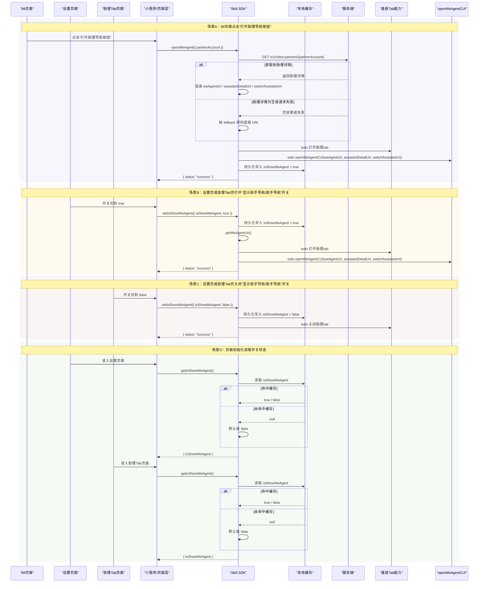

# 助理导航显示与打开能力技术方案

## 文档目标

本文档聚焦以下 3 个 SDK 本地扩展接口的设计与使用方式：

- `setIsShowWeAgent`
- `getIsShowWeAgent`
- `openWeAgent`

目标是统一“助理 tab 是否展示”和“从外部入口打开助理”的端侧行为，供 Android、iOS、Harmony 三端保持一致实现。

---

## 一、接口总览

| SDK 接口 | 服务端接口 | 说明 |
|---|---|---|
| `setIsShowWeAgent` | 无（SDK 本地扩展能力） | 设置是否展示助理 tab 的持久化缓存并同步基座展示态 |
| `getIsShowWeAgent` | 无（SDK 本地扩展能力） | 获取是否展示助理 tab 的持久化缓存值 |
| `openWeAgent` | `GET /v1/robot-partners/{partnerAccount}` | 根据助理账号打开助理 |

---

## 二、持久化缓存约定

缓存按 `userId` 隔离，当前 `userId` 使用 mock 值：`mock_user_id`。

建议使用以下缓存 key：

- `isShowWeAgent`：布尔值，表示是否展示助理 tab
- `current_we_agent_detail`：当前助理详情
- `we_agent_details`：助理详情缓存对象，key 为 `partnerAccount`
- `we_agent_list_cache`：助理列表缓存

说明：

- `isShowWeAgent` 只负责表达“助理 tab 是否显示”
- 当前打开哪个助理由 `current_we_agent_detail` 和 URI 组装逻辑共同决定

---

## 三、接口设计

## 1. 设置是否展示助理接口

### 调用方

Skill 小程序调用

### 接口说明

设置本地持久化缓存 `isShowWeAgent`，并同步触发基座助理 tab 的显示或隐藏。

该接口为 SDK 本地扩展接口，无对应服务端接口。

### 接口名

```typescript
setIsShowWeAgent(params: SetIsShowWeAgentParams): Promise<SetIsShowWeAgentResult>
```

### 入参

| 参数名 | 类型 | 必填 | 说明 |
|---|---|---|---|
| `isShowWeAgent` | `boolean` | 是 | 是否展示助理 tab |

### 入参示例

```json
{
  "isShowWeAgent": true
}
```

### 出参

| 参数名 | 类型 | 说明 |
|---|---|---|
| `status` | `string` | 固定返回 `success` |

### 出参示例

```json
{
  "status": "success"
}
```

### 实现方法

1. SDK 接收入参 `isShowWeAgent`，并校验其为 `boolean` 类型。
2. SDK 先按 `userId` 维度持久化写入 `isShowWeAgent`。
3. 当 `isShowWeAgent = true` 时：
   - SDK 调用 `getWeAgentUri()` 获取 `weAgentUri`、`assistantDetailUri`、`switchAssistantUri`；
   - `todo`：调用外部导入使用的基座方法打开助理 tab；
   - `todo`：调用外部导入使用的 `openWeAgentCUI` 方法，并传入 `weAgentUri`、`assistantDetailUri`、`switchAssistantUri`，打开当前助理。
4. 当 `isShowWeAgent = false` 时：
   - `todo`：调用外部导入使用的基座方法关闭助理 tab；
   - 该场景下不调用 `getWeAgentUri`；
   - 该场景下不调用 `openWeAgentCUI`。
5. SDK 返回 `SetIsShowWeAgentResult`，其中 `status` 固定为 `success`。

---

## 2. 获取是否展示助理接口

### 调用方

Skill 小程序调用

### 接口说明

获取本地持久化缓存 `isShowWeAgent` 的值。

该接口为 SDK 本地扩展接口，无对应服务端接口。

### 接口名

```typescript
getIsShowWeAgent(): Promise<GetIsShowWeAgentResult>
```

### 入参

无

### 出参

| 参数名 | 类型 | 说明 |
|---|---|---|
| `isShowWeAgent` | `boolean` | 是否展示助理 tab；若本地未命中缓存则默认返回 `false` |

### 出参示例

```json
{
  "isShowWeAgent": false
}
```

### 实现方法

1. SDK 按 `userId` 维度读取本地缓存 `isShowWeAgent`。
2. 若读取到有效布尔值，则直接返回该值。
3. 若本地未命中缓存，则默认返回 `false`。

---

## 3. 打开助理接口

### 调用方

Skill 小程序调用

### 接口说明

根据 `partnerAccount` 打开指定助理。

该接口内部会优先获取助理详情，并组装打开助理所需 URI；若未获取到助理详情，也会按兜底规则继续打开助理。

### 接口名

```typescript
openWeAgent(params: OpenWeAgentParams): Promise<OpenWeAgentResult>
```

### 入参

| 参数名 | 类型 | 必填 | 说明 |
|---|---|---|---|
| `partnerAccount` | `string` | 是 | 助理账号 ID |

### 入参示例

```json
{
  "partnerAccount": "x00_1"
}
```

### 出参

| 参数名 | 类型 | 说明 |
|---|---|---|
| `status` | `string` | 固定返回 `success` |

### 出参示例

```json
{
  "status": "success"
}
```

### 实现方法

1. SDK 接收入参 `partnerAccount`，并校验其为非空字符串。
2. SDK 优先调用服务端接口 `GET /v1/robot-partners/{partnerAccount}`，尝试获取指定助理详情。
3. 若成功获取到助理详情，则按 `getWeAgentUri` 相同规则组装：
   - `weAgentUri`
   - `assistantDetailUri`
   - `switchAssistantUri`
4. 若助理详情为空，或获取详情失败，则继续按兜底规则组装：
   - `weAgentUri = h5://S008623/index.html?wecodePlace=weAgent#activateAssistant`
   - `assistantDetailUri = h5://S008623/index.html?partnerAccount={partnerAccount}#assistantDetail`
   - `switchAssistantUri = h5://S008623/index.html?partnerAccount={partnerAccount}#switchAssistant`
5. `todo`：调用外部导入使用的基座方法打开助理 tab。
6. `todo`：调用外部导入使用的 `openWeAgentCUI` 方法，并传入 `weAgentUri`、`assistantDetailUri`、`switchAssistantUri`。
7. 当助理打开成功后，SDK 按 `userId` 将本地持久化缓存 `isShowWeAgent` 设置为 `true`。
8. SDK 返回 `OpenWeAgentResult`，其中 `status` 固定为 `success`。

---

## 四、接口关系说明

### 1. `setIsShowWeAgent(true)` 与 `openWeAgent` 的区别

- `setIsShowWeAgent(true)`：
  - 面向“显示助理 tab 并打开当前助理”
  - 不指定 `partnerAccount`
  - 依赖 `getWeAgentUri()` 返回当前助理 URI

- `openWeAgent(partnerAccount)`：
  - 面向“打开指定助理”
  - 指定目标 `partnerAccount`
  - 内部优先按目标助理组装 URI

### 2. 两者共同点

- 最终都需要打开助理 tab
- 最终都需要调用 `openWeAgentCUI`
- 最终都需要将 `isShowWeAgent` 维持为 `true`

---

## 五、核心时序图



---

## 六、使用场景说明

### 场景 1

IM 页面中点击“打开助理导航按钮”。

调用方式：

- 调用 `openWeAgent({ partnerAccount })`

预期行为：

- 打开助理 tab
- 打开对应助理页面
- 助理打开成功后写入 `isShowWeAgent = true`

适用原因：

- IM 页面通常知道要打开哪个助理，因此适合直接用 `partnerAccount` 打开指定助理

---

### 场景 2

点击助理 tab 页面导航栏中的“助手导航”开关按钮隐藏助手 tab。

调用方式：

- 调用 `setIsShowWeAgent({ isShowWeAgent: false })`

预期行为：

- 持久化写入 `isShowWeAgent = false`
- 调用基座关闭助理 tab

---

### 场景 3

进入助手设置页面，显示“显示助手导航”的开关按钮状态。

调用方式：

- 调用 `getIsShowWeAgent()`

预期行为：

- 将返回的 `isShowWeAgent` 作为设置页开关状态

---

### 场景 4

设置页面点击“显示助手导航”的开关按钮，显示或隐藏助手 tab。

调用方式：

- 打开时：`setIsShowWeAgent({ isShowWeAgent: true })`
- 关闭时：`setIsShowWeAgent({ isShowWeAgent: false })`

预期行为：

- 打开时显示助理 tab，并打开当前助理页面
- 关闭时隐藏助理 tab

---

### 场景 5

进入助理 tab 页面，显示“助手导航”开关按钮状态。

调用方式：

- 调用 `getIsShowWeAgent()`

预期行为：

- 将返回的 `isShowWeAgent` 作为助理 tab 页面导航栏开关状态

---

## 七、页面接入建议

### 1. IM 页面

- 使用 `openWeAgent`
- 场景特征：知道目标助理 `partnerAccount`

### 2. 助手设置页面

- 页面进入时调用 `getIsShowWeAgent`
- 用户切换开关时调用 `setIsShowWeAgent`

### 3. 助理 tab 页面

- 页面进入时调用 `getIsShowWeAgent`
- 点击导航栏开关时调用 `setIsShowWeAgent`

---

## 八、三端实现要求

- Android、iOS、Harmony 三端保持完全一致
- 三端都作为 SDK 本地扩展能力实现
- 不新增服务端接口依赖
- 基座打开/关闭助理 tab 方法先按外部导入方式 `todo`
- `openWeAgentCUI` 方法先按外部导入方式 `todo`

---

## 九、后续待补充项

- 基座打开助理 tab 的方法名与签名
- 基座关闭助理 tab 的方法名与签名
- `openWeAgentCUI` 的导入方式与方法签名
- `setIsShowWeAgent(true)` 打开当前助理时，对“当前助理为空”的最终产品策略是否继续沿用 `getWeAgentUri` fallback
