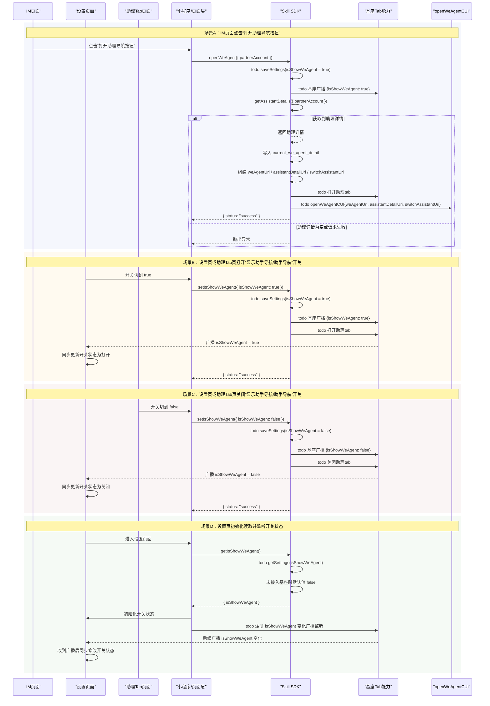

# 助理导航显示与打开能力技术方案

## 文档目标

本文档聚焦以下 3 个 SDK 本地扩展接口的设计与使用方式：

- `setIsShowWeAgent`
- `getIsShowWeAgent`
- `openWeAgent`

目标是统一“助理 tab 是否展示”和“从外部入口打开助理”的端侧行为，供 Android、iOS、Harmony 三端保持一致实现。

---

## 一、接口总览

| SDK 接口 | 服务端接口 | 说明 |
|---|---|---|
| `setIsShowWeAgent` | 无（SDK 本地扩展能力） | 设置是否展示助理 tab 的持久化缓存并同步基座展示态 |
| `getIsShowWeAgent` | 无（SDK 本地扩展能力） | 获取是否展示助理 tab 的持久化缓存值 |
| `openWeAgent` | `GET /v1/robot-partners/{partnerAccount}` | 根据助理账号打开助理 |

---

## 二、持久化缓存约定

缓存按 `userId` 隔离，当前 `userId` 使用 mock 值：`mock_user_id`。

建议使用以下缓存 key：

- `isShowWeAgent`：布尔值，表示是否展示助理 tab；该值后续通过基座 `saveSettings` / `getSettings` 维护，当前阶段仅在 SDK 接口实现中预留 `todo`
- `current_we_agent_detail`：当前助理详情
- `we_agent_details`：助理详情缓存对象，key 为 `partnerAccount`
- `we_agent_list_cache`：助理列表缓存

说明：

- `isShowWeAgent` 只负责表达“助理 tab 是否显示”
- 当前打开哪个助理由 `current_we_agent_detail` 和 URI 组装逻辑共同决定

## 三、接口设计

## 1. 设置是否展示助理接口

### 调用方

设置页面、助理 tab 页面调用

### 接口说明

设置基座配置中的 `isShowWeAgent`，并同步触发基座助理 tab 的显示或隐藏。

该接口为 SDK 本地扩展接口，无对应服务端接口。

### 接口名

```typescript
setIsShowWeAgent(params: SetIsShowWeAgentParams): Promise<SetIsShowWeAgentResult>
```

### 入参

| 参数名 | 类型 | 必填 | 说明 |
|---|---|---|---|
| `isShowWeAgent` | `boolean` | 是 | 是否展示助理 tab |

### 入参示例

```json
{
  "isShowWeAgent": true
}
```

### 出参

| 参数名 | 类型 | 说明 |
|---|---|---|
| `status` | `string` | 固定返回 `success` |

### 出参示例

```json
{
  "status": "success"
}
```

### 实现方法

1. SDK 接收入参 `isShowWeAgent`，并校验其为 `boolean` 类型。
2. `todo`：在 SDK 接口实现中调用基座提供的 `saveSettings` 方法，保存 `isShowWeAgent` 对应配置值。
3. `todo`：在 SDK 接口实现中调用基座广播接口，广播 `{ isShowWeAgent: true }`。
4. 当 `isShowWeAgent = true` 时：
    - `todo`：调用外部导入使用的基座方法打开助理 tab；
5. 当 `isShowWeAgent = false` 时：
    - `todo`：调用外部导入使用的基座方法关闭助理 tab；
6. SDK 返回 `SetIsShowWeAgentResult`，其中 `status` 固定为 `success`。

### 错误码（参考）

| 错误码 | 错误消息 | 说明 |
|---|---|---|
| `1000` | 无效的参数 | `isShowWeAgent` 缺失或类型错误 |
| `5000` | 内部错误 | `saveSettings` 调用失败、基座广播失败，或打开/关闭助理 tab 失败 |

---

## 2. 获取是否展示助理接口

### 调用方

设置页面调用

### 接口说明

获取基座配置中的 `isShowWeAgent` 值。

该接口为 SDK 本地扩展接口，无对应服务端接口。

### 接口名

```typescript
getIsShowWeAgent(): Promise<GetIsShowWeAgentResult>
```

### 入参

无

### 出参

| 参数名 | 类型 | 说明 |
|---|---|---|
| `isShowWeAgent` | `boolean` | 是否展示助理 tab；若基座未返回有效值则默认返回 `false` |

### 出参示例

```json
{
  "isShowWeAgent": false
}
```

### 实现方法

1. `todo`：在 SDK 接口实现中调用基座提供的 `getSettings` 方法获取 `isShowWeAgent` 对应配置值。
2. 若读取到有效布尔值，则直接返回该值。
3. 当前阶段若尚未接入基座 `getSettings`，则默认返回 `false`，并返回：

```json
{
  "isShowWeAgent": false
}
```

### 错误码（参考）

| 错误码 | 错误消息 | 说明 |
|---|---|---|
| `5000` | 内部错误 | `getSettings` 调用失败，或基座返回结果异常 |

---

## 3. 打开助理接口

### 调用方

IM 模块调用

### 接口说明

根据 `partnerAccount` 获取指定助理详情，并组装打开助理所需的 URI 信息。

该接口为 SDK 本地扩展接口，无对应服务端接口。

### 接口名

```typescript
openWeAgent(params: OpenWeAgentParams): Promise<OpenWeAgentResult>
```

### 入参

| 参数名 | 类型 | 必填 | 说明 |
|---|---|---|---|
| `partnerAccount` | `string` | 是 | 助理账号 ID |

### 入参示例

```json
{
  "partnerAccount": "x00_1"
}
```

### 出参

| 参数名 | 类型 | 说明 |
|---|---|---|
| `status` | `string` | 固定返回 `success` |

### 出参示例

```json
{
  "status": "success"
}
```

### 实现方法

1. SDK 接收入参 `partnerAccount`，并校验其为非空字符串。
2. `todo`：在 SDK 接口实现中调用基座提供的 `saveSettings` 方法，保存 `isShowWeAgent = true`。
3. `todo`：在 SDK 接口实现中调用基座广播接口，广播 `{ isShowWeAgent: true }`。
4. SDK 调用 `getAssistantDetails(params: QueryWeAgentParams)` 获取指定助理详情。
5. 若成功获取到助理详情，则 SDK 取首个助理详情对象作为当前目标助理详情，并校验其中 `weCodeUrl` 为非空字符串；若 `weCodeUrl` 为空，则 SDK 抛出 `7000` 异常。
6. 当目标助理详情有效且 `weCodeUrl` 非空时，SDK 将该助理详情设置到 `current_we_agent_detail` 缓存中。
7. 若服务端未返回有效助理详情，或接口调用失败，则 SDK 抛出异常。
8. SDK 在内存中直接组装 `weAgentUri`、`assistantDetailUri`、`switchAssistantUri`，URI 组装规则与 `getWeAgentUri` 保持一致：
   - 若 `weCodeUrl` 的 host 值与常量 `WE_AGENT_CUI_APPID: S008623` 不一致：以 `weCodeUrl` 为基础地址，追加 query 参数 `wecodePlace=weAgent` 与 `robotId={id}`；
   - 若 `weCodeUrl` 的 host 值与常量 `WE_AGENT_CUI_APPID: S008623` 一致：以 `weCodeUrl` 为基础地址，追加 query 参数 `wecodePlace=weAgent` 与 `assistantAccount={partnerAccount}`；
   - `assistantDetailUri` 组装为：`h5://S008623/index.html` + query 参数 `partnerAccount={partnerAccount}` + hash `assistantDetail`；
   - `switchAssistantUri` 组装为：`h5://S008623/index.html` + query 参数 `partnerAccount={partnerAccount}` + hash `switchAssistant`。
9. `todo`：调用基座方法打开助理 tab，并使用 `weAgentUri`、`assistantDetailUri`、`switchAssistantUri` 调用 `openWeAgentCUI` 方法打开助理 CUI。
10. SDK 返回 `OpenWeAgentResult`，其中 `status` 固定为 `success`。

### 错误码（参考）

| 错误码 | 错误消息 | 说明 |
|---|---|---|
| `1000` | 无效的参数 | `partnerAccount` 缺失或格式错误 |
| `5000` | 内部错误 | `saveSettings` 调用失败、基座广播失败、打开助理 tab 失败，或 `openWeAgentCUI` 调用失败 |
| `7000` | 服务端错误 | `getAssistantDetails` 调用失败、服务端未返回有效助理详情、助理详情中的 `weCodeUrl` 为空，或返回结构异常 |

---

## 四、接口关系说明

### 1. `setIsShowWeAgent(true)` 与 `openWeAgent` 的区别

- `setIsShowWeAgent(true)`：
  - 面向“显示助理 tab”
  - 不指定 `partnerAccount`

- `openWeAgent(partnerAccount)`：
  - 面向“打开指定助理”
  - 指定目标 `partnerAccount`
  - 内部优先按目标助理组装 URI

### 2. 两者共同点

- 最终都需要打开助理 tab
- `setIsShowWeAgent(true)` 仅负责展示助理 tab
- `openWeAgent` 负责打开指定助理，并将 `isShowWeAgent` 维持为 `true`

---

## 五、核心时序图



---

## 六、使用场景说明

### 场景 1

IM 页面中点击“打开助理导航按钮”。

调用方式：

- 调用 `openWeAgent({ partnerAccount })`

预期行为：

- 打开助理 tab
- 打开对应助理页面
- `todo`：先调用基座 `saveSettings` 保存 `isShowWeAgent = true`
- `todo`：调用基座广播 `{ isShowWeAgent: true }`
- 再调用 `getAssistantDetails` 获取目标助理详情
- 获取到助理详情后，设置 `current_we_agent_detail` 缓存并组装打开参数
- 若服务端未返回有效助理详情、助理详情中的 `weCodeUrl` 为空，或接口调用失败，则接口抛出异常

适用原因：

- IM 页面通常知道要打开哪个助理，因此适合直接用 `partnerAccount` 打开指定助理

---

### 场景 2

点击助理 tab 页面导航栏中的“助手导航”开关按钮隐藏助手 tab。

调用方式：

- 调用 `setIsShowWeAgent({ isShowWeAgent: false })`

预期行为：

- `todo`：调用基座 `saveSettings` 保存 `isShowWeAgent = false`
- `todo`：调用基座广播 `{ isShowWeAgent: false }`
- 调用基座关闭助理 tab

---

### 场景 3

进入助手设置页面，显示“显示助手导航”的开关按钮状态，并在 `isShowWeAgent` 变化时同步更新开关状态。

调用方式：

- 调用 `getIsShowWeAgent()`
- `todo`：注册监听 `isShowWeAgent` 变化的基座广播

预期行为：

- 将返回的 `isShowWeAgent` 作为设置页开关状态
- 当监听到 `isShowWeAgent` 变化时，同步修改“显示助手导航”开关按钮状态

---

### 场景 4

设置页面点击“显示助手导航”的开关按钮，显示或隐藏助手 tab。

调用方式：

- 打开时：`setIsShowWeAgent({ isShowWeAgent: true })`
- 关闭时：`setIsShowWeAgent({ isShowWeAgent: false })`

预期行为：

- 打开时通过 `saveSettings` 保存 `isShowWeAgent = true`
- `todo`：调用基座广播 `{ isShowWeAgent: true }`
- 打开时显示助理 tab
- 关闭时通过 `saveSettings` 保存 `isShowWeAgent = false`
- `todo`：调用基座广播 `{ isShowWeAgent: false }`
- 关闭时隐藏助理 tab

---

## 七、页面接入建议

### 1. IM 页面

- 使用 `openWeAgent`
- 场景特征：知道目标助理 `partnerAccount`

### 2. 助手设置页面

- 页面进入时调用 `getIsShowWeAgent`
- 页面进入时 `todo`：注册监听 `isShowWeAgent` 变化的基座广播
- 监听到 `isShowWeAgent` 变化时，同步刷新“显示助手导航”开关状态
- 用户切换开关时调用 `setIsShowWeAgent`

### 3. 助理 tab 页面

- 点击导航栏开关时调用 `setIsShowWeAgent`

---

## 八、三端实现要求

- Android、iOS、Harmony 三端保持完全一致
- 三端都作为 SDK 本地扩展能力实现
- 不新增服务端接口依赖
- 基座打开/关闭助理 tab 方法先按外部导入方式 `todo`
- `openWeAgentCUI` 方法先按外部导入方式 `todo`

---

## 九、后续待补充项

- 基座打开助理 tab 的方法名与签名
- 基座关闭助理 tab 的方法名与签名
- `openWeAgentCUI` 的导入方式与方法签名
