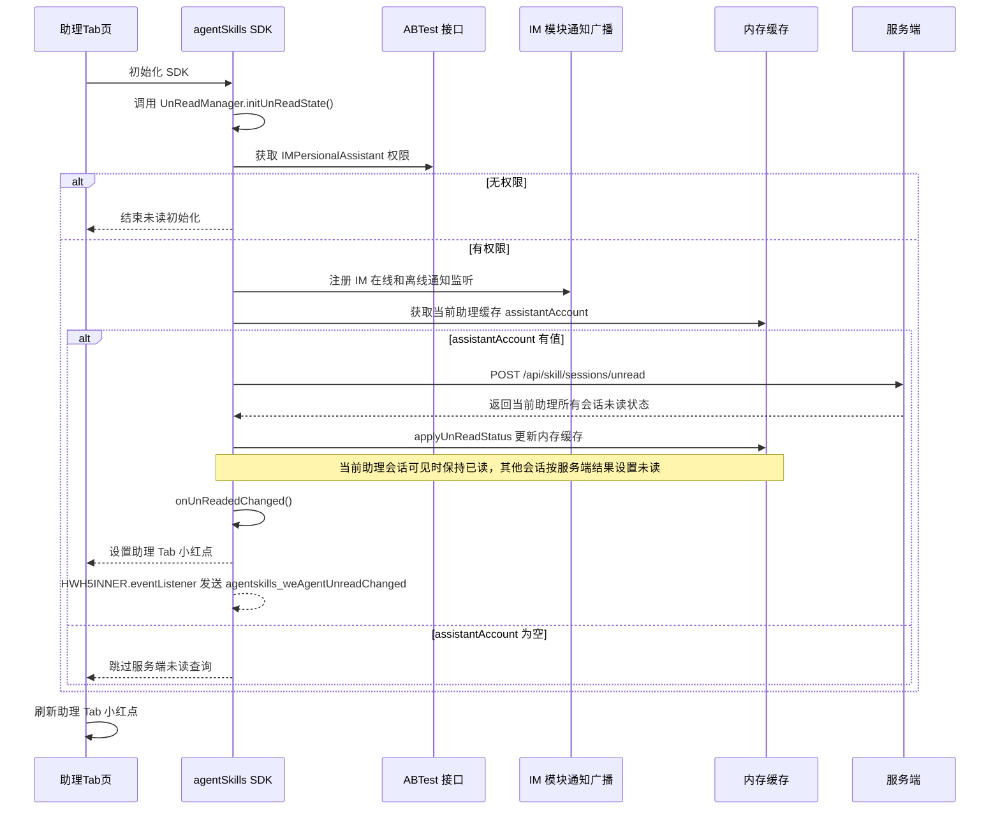
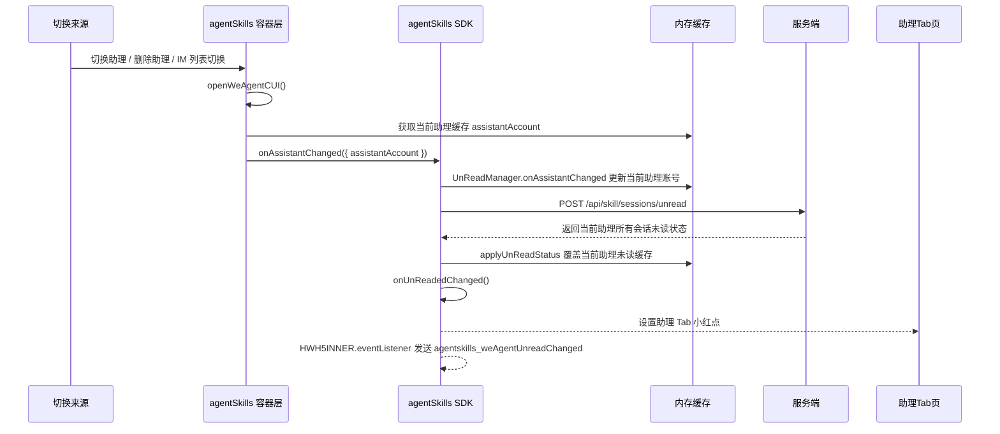
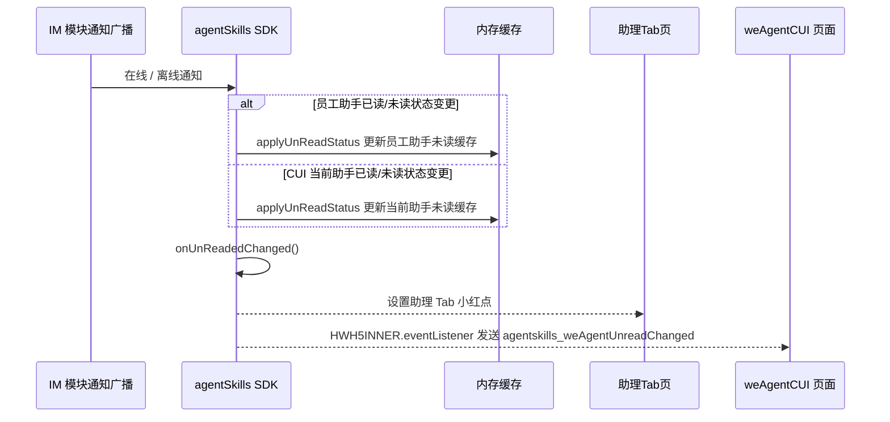
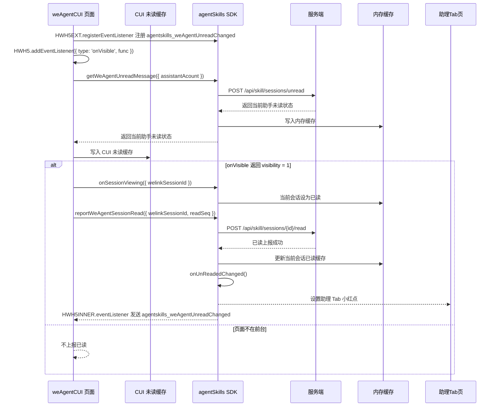
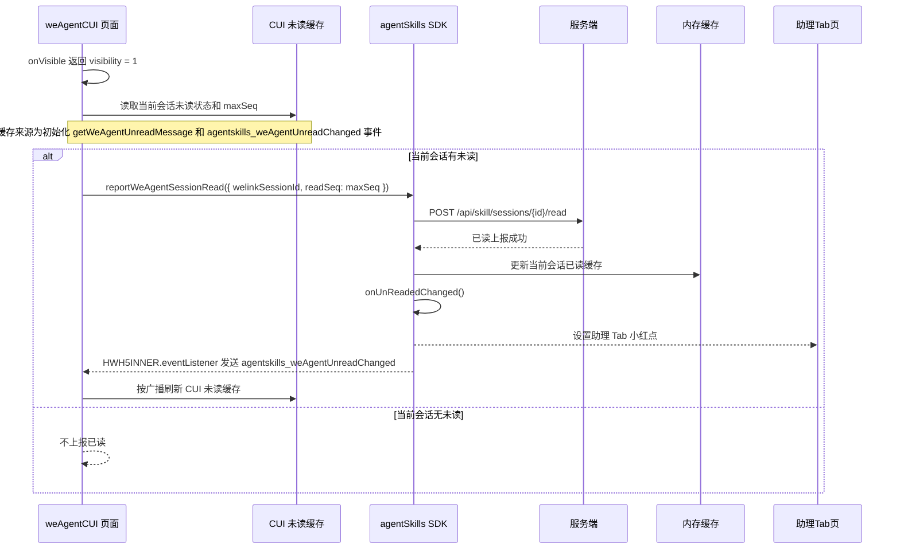

# `助理 Tab 未读消息小红点技术方案`

- 方案日期：`2026-06-11`
- 目标工程：`skillSDK`、`ai-chat-viewer`
- 参考文档：`SkillClientSdkInterfaceV2.md`、`小程序JSAPI接口文档.md`、`ai-chat-viewer/docs/plans/技术方案模板.md`
- 方案类型：`跨端 SDK 未读消息同步与前端展示方案`

## 1. 背景

### 1.1 场景说明

当前助理 Tab 已支持打开当前助理的 `weAgentCUI` 页面和切换助理，但缺少会话未读消息提醒能力。新需求要求在助理 Tab 按钮、`weAgentCUI` 历史会话入口、历史会话列表 item 上展示未读小红点，帮助用户感知当前助理是否存在未读会话消息。

本方案将未读状态收口到服务端管控，端侧只做内存缓存、刷新、广播和 UI 展示，不在客户端计算未读数，也不对非当前选择助理展示 Tab 小红点。SDK 初始化时通过 `UnReadManager.initUnReadState` 判断 `IMPersionalAssistant` 权限、注册 IM 在线和离线通知，并在存在当前助理账号时获取当前助理的会话未读状态写入内存缓存；后续切换助理由 agentSkills 容器层 `openWeAgentCUI` 读取当前助理缓存后调用 agentSkills SDK 接口 `onAssistantChanged`，再由 `UnReadManager` 更新内存缓存并调用 `onUnReadedChanged`；IM 在线/离线通知、CUI 已读上报也走同一套内存缓存刷新和广播逻辑。需要通知 `weAgentCUI` 时，SDK 通过 `HWH5INNER.eventListener` 发送 H5 内部广播。

需要特别处理三端页面生命周期差异：HarmonyOS 和 iOS 冷启动时会预加载 `weAgentCUI` 页面，并执行页面中的全部逻辑代码，但此时页面并未前台显示；Android 冷启动不会预加载 `weAgentCUI` 页面。因此 `weAgentCUI` 初始化阶段只能注册可见性监听和准备页面内状态，不得直接上报已读，也不得把预加载视为用户已打开页面。所有会影响小红点消失的动作必须等待 `onVisible` 返回 `visibility = 1` 后执行。

### 1.2 需求目标

1. 助理 Tab 按钮只展示小红点，不展示也不计算未读消息数。
2. 助理 Tab 小红点只针对当前选择的助理生效，其他助理存在未读消息时不影响当前 Tab 按钮。
3. 从 A 助理在切换助理页面切换到 B 助理后，调用 SDK 接口获取 B 助理是否存在未读会话消息，并刷新助理 Tab 小红点。
4. 用户从 IM Tab 切换到助理 Tab 并打开当前助理 `weAgentCUI` 页面后，页面在移动端前台可见时请求服务端已读上报接口；服务端通过 IM 广播已读后的消息状态，SDK 更新内存缓存并判断当前助理是否仍存在未读消息，有未读则助理 Tab 继续展示小红点，没有未读则隐藏小红点。
5. `weAgentCUI` 页面真实前台可见后调用 SDK 获取当前助理未读会话消息；若当前助理存在非当前会话的未读消息，历史会话列表按钮图标展示小红点；打开历史会话列表后，有未读消息的会话 item 展示小红点。
6. PC 端打开助理会话 CUI 页面并完成已读上报后，移动端对应会话 item 小红点需要消失；助理 Tab 是否隐藏小红点由当前助理是否仍存在其他未读会话决定。
7. 小红点是否展示由服务端后台管控：后台全员开关默认关闭；命中黑名单用户时不展示小红点。

### 1.3 非目标

1. 不展示未读消息数，不做未读数累加、合并或端侧计算。
2. 不改变助理 Tab 是否展示的 `isShowWeAgent` 逻辑。
3. 不改变现有消息收发、历史消息渲染和会话创建流程。
4. 不为非当前选择助理展示助理 Tab 小红点。

## 2. 方案图

### 2.1 整体方案图


### 2.2 方案核心

核心方案围绕 `UnReadManager` 收口五类流程：

1. SDK 冷启动时，`agentSkills` SDK 调用 `UnReadManager.initUnReadState`，先通过外部导入的 ABTest 接口判断 `IMPersionalAssistant` 权限；无权限则不继续初始化，有权限则注册 IM 在线和离线通知，读取当前助理缓存中的 `assistantAccount`，拉取当前助理所有会话未读状态，调用 `applyUnReadStatus` 更新内存缓存，再调用 `onUnReadedChanged` 广播当前助理未读信息并设置助理 Tab 小红点。
2. 切换助手时，切换助理页面、删除助理、IM 列表切换都会进入 agentSkills 容器层的 `openWeAgentCUI` 方法；该方法先读取当前助理缓存拿到 `assistantAccount`，再调用 agentSkills SDK 接口 `onAssistantChanged({ assistantAccount })`。SDK 内部由 `UnReadManager.onAssistantChanged` 更新当前助理账号，拉取当前助理所有会话未读状态，调用 `applyUnReadStatus` 覆盖当前助理未读缓存，最后调用 `onUnReadedChanged`。
3. IM 在线和离线通知到达时，员工助手已读/未读状态变更、CUI 当前助手已读/未读状态变更都会进入 `UnReadManager`，更新内存缓存并调用 `onUnReadedChanged`。
4. CUI 页面初始化时，`weAgentCUI` 调用 `HWH5EXT.registerEventListener` 注册 `agentskills_weAgentUnreadChanged`，调用 `HWH5.addEventListener({ type: 'onVisible', func })` 监听页面前后台；页面调用 `getWeAgentUnreadMessage` 获取当前会话未读消息并写入 CUI 未读缓存，若 `onVisible` 表示页面在前台，则调用 `reportWeAgentSessionRead` 上报当前会话已读，SDK 更新内存缓存并调用 `onUnReadedChanged`。
5. 用户从其他页面切回助理 Tab 时，`weAgentCUI` 通过 `onVisible` 感知重新前台展示，不再调用 `getWeAgentUnreadMessage`；页面直接从 CUI 未读缓存中读取当前会话未读状态和最大 `message_seq`，调用 `reportWeAgentSessionRead` 上报当前会话已读，SDK 更新内存缓存并调用 `onUnReadedChanged`。CUI 未读缓存来源于页面初始化会话时调用的 `getWeAgentUnreadMessage` 和 `agentskills_weAgentUnreadChanged` 事件监听。

## 3. 时序图

### 3.1 SDK 冷启动拉取当前助手未读状态



### 3.2 切换助手拉取当前助手未读状态



### 3.3 IM 在线和离线通知触发未读状态更新



### 3.4 CUI 页面初始化后上报已读



### 3.5 从其他页面切回助理 Tab 后上报已读



## 4. 技术细节

### 4.1 调整点

1. SDK 初始化时调用 `UnReadManager.initUnReadState`；该方法先调用外部导入的 ABTest 接口判断 `IMPersionalAssistant` 权限，无权限直接结束，有权限才继续注册 IM 在线和离线通知监听。
2. `initUnReadState` 从当前助理缓存读取 `assistantAccount`；若存在助理账号，则调用服务端 POST `/api/skill/sessions/unread` 拉取该助理所有会话未读状态。
3. SDK 新增 `UnReadManager`，统一收口未读查询、已读上报、会话查看态标记、助理切换、内存缓存和 H5 内部广播处理逻辑。
4. SDK 新增 `applyUnReadStatus`，用于初始化或更新助理会话未读内存缓存；如果当前助理的会话可见，则当前会话保持已读，其他会话按服务端或 IM 通知结果设置未读。
5. SDK 新增 `onUnReadedChanged`，用于广播当前助理未读信息，并设置助理 Tab 小红点。
6. 切换助理页面、删除助理、IM 列表切换统一通过 agentSkills 容器层 `openWeAgentCUI` 进入；容器层先读取当前助理缓存拿到 `assistantAccount`，再调用 agentSkills SDK 接口 `onAssistantChanged({ assistantAccount })`，由 SDK 内部 `UnReadManager.onAssistantChanged` 更新当前助理账号并拉取新助理未读状态。
7. SDK 新增获取助理未读消息接口，入参为 `assistantAcount` 和可选 `sessionIds`，通过服务端 POST `/api/skill/sessions/unread` 获取当前助理会话未读状态并写入内存缓存。
8. SDK 新增或封装已读上报能力，供 `weAgentCUI` 页面在移动端前台可见且已渲染消息后调用。
9. SDK 新增当前会话查看态接口，`weAgentCUI` 进入会话页面后通知 SDK 当前正常查看的会话，停留期间该会话设为已读并忽略服务端正常未读推送处理；离开会话页面后通知 SDK 清除查看标记并恢复正常推送处理。
10. SDK 新增面向 `weAgentCUI` 的未读状态 H5 内部广播，`weAgentCUI` 根据广播刷新历史入口和会话 item 小红点。
11. `weAgentCUI` 页面初始化阶段注册 `HWH5EXT.registerEventListener` 和 `HWH5.addEventListener({ type: 'onVisible', func })`；只有 `visibility = 1` 时才上报已读。
12. 服务端通过后台开关和黑名单控制是否返回或下发小红点可见状态，端侧不绕过服务端开关。

### 4.2 核心实现方式

#### 4.2.1 UnReadManager 职责

SDK 内部新增 `UnReadManager`，作为消息未读相关逻辑的统一管理模块，对外暴露未读查询、已读上报、会话查看态标记接口，对内负责服务端协议请求、IM 未读推送接入、内存缓存读写和面向 `weAgentCUI` 的 H5 内部广播。

建议接口集合：

```typescript
interface UnReadManager {
  initUnReadState(): Promise<void>

  onAssistantChanged(assistantAccount: string): Promise<void>

  applyUnReadStatus(params: ApplyUnReadStatusParams): void

  onUnReadedChanged(): void

  getWeAgentUnreadMessage(
    params: GetWeAgentUnreadMessageParams
  ): Promise<GetWeAgentUnreadMessageResult>

  reportWeAgentSessionRead(
    params: ReportWeAgentSessionReadParams
  ): Promise<ReportWeAgentSessionReadResult>

  onSessionViewing(params: OnSessionViewingParams): Promise<void>

  onSessionViewingEnd(params: OnSessionViewingEndParams): Promise<void>
}
```

职责边界：

1. `UnReadManager` 只管理未读状态，不承载历史消息拉取、消息渲染、会话排序等业务逻辑。
2. `initUnReadState` 负责 SDK 冷启动未读初始化：先判断外部 ABTest 的 `IMPersionalAssistant` 权限，再注册 IM 在线/离线通知并拉取当前助理未读状态。
3. `onAssistantChanged` 是 agentSkills SDK 对容器层暴露的切换助手通知接口，由容器层 `openWeAgentCUI` 读取当前助理缓存拿到 `assistantAccount` 后调用；SDK 内部 `UnReadManager.onAssistantChanged` 负责当前助理账号更新、服务端未读状态拉取和缓存覆盖。
4. `applyUnReadStatus` 负责将初始化、主动查询、IM 在线/离线通知、已读上报后的未读状态写入内存缓存；当前正在查看的会话保持已读，其他会话按输入数据设置未读。
5. `onUnReadedChanged` 负责读取当前助理未读缓存，设置助理 Tab 小红点，并通过 `HWH5INNER.eventListener` 发送 `agentskills_weAgentUnreadChanged`。
6. 服务端未读查询和已读上报均由 `UnReadManager` 发起或封装，避免各页面重复拼接协议。
7. `onSessionViewing` 标记的当前查看会话在 SDK 内部视为已读；该会话停留期间收到服务端正常未读推送时，SDK 忽略该会话未读态更新，避免正在阅读的会话小红点反复出现。
8. `onSessionViewingEnd` 清除当前查看会话标记后，该会话恢复服务端正常推送处理。

#### 4.2.2 未读内存缓存结构

新增按 `userId` 隔离的 SDK 进程级内存缓存，不新增持久化缓存 key：

| 缓存对象 | 说明 |
|---|---|
| `WeAgentUnreadMemoryCache` | 助理未读状态内存缓存，key 为 `partnerAccount` |

建议缓存结构：

```typescript
type WeAgentUnreadMemoryCache = {
  updatedAt: number
  assistants: Record<string, WeAgentUnreadState>
}

type WeAgentUnreadState = {
  partnerAccount: string
  assistantUnread: boolean
  sessions: Record<string, WeAgentSessionUnreadState>
  redDotVisible: boolean
}

type WeAgentSessionUnreadState = {
  welinkSessionId: string
  hasUnRead: boolean
  maxSeq: number
}
```

说明：

1. `assistantUnread` 只表示当前助理是否存在未读会话消息，不表示未读数。
2. `sessions[welinkSessionId].hasUnRead` 用于历史会话列表 item 小红点展示；该字段由 SDK 根据服务端 `unreadSessionList` 映射生成，不是服务端原始字段。
3. `sessions[welinkSessionId].maxSeq` 表示服务端返回的该会话最大消息序列号，来源为 `unreadSessionList[].maxSeq`。
4. `redDotVisible` 由服务端后台开关、黑名单和未读状态共同决定；当服务端返回 `false` 时，即使存在未读，端侧也不展示小红点。
5. SDK 初始化查询会写入当前助理的内存缓存；IM 在线/离线通知只更新载荷中指定助理的缓存。
6. 内存缓存只在当前 SDK 进程生命周期内有效，进程重启后通过 `initUnReadState` 的当前助理未读查询重新构建。
7. SDK 发送 `weAgentCUI` H5 内部广播时只发送当前助理的未读状态，避免非当前助理影响当前页面展示。

#### 4.2.3 SDK 未读接口

建议新增接口：

```typescript
getWeAgentUnreadMessage(params: GetWeAgentUnreadMessageParams): Promise<GetWeAgentUnreadMessageResult>
```

入参：

| 参数名 | 类型 | 必填 | 说明 |
|---|---|---|---|
| `assistantAcount` | `string` | 是 | 助理账号，透传到服务端请求体 |
| `sessionIds` | `string[]` | 否 | 会话 ID 列表；不传时由服务端返回该助理下相关会话未读状态 |

服务端协议：

| 项 | 内容 |
|---|---|
| Method | `POST` |
| Path | `/api/skill/sessions/unread` |
| Body | `{ "assistantAcount": string, "sessionIds"?: string[] }` |

服务端返回：

```json
{
  "code": 0,
  "data": {
    "unreadSessionCount": 2,
    "unreadSessionList": [
      {
        "sessionId": "123",
        "maxSeq": 10
      }
    ]
  }
}
```

出参：

| 参数名 | 类型 | 说明 |
|---|---|---|
| `partnerAccount` | `string` | 助理账号；由 `assistantAcount` 映射为 SDK 内部统一字段 |
| `assistantUnread` | `boolean` | 当前助理是否存在未读会话 |
| `redDotVisible` | `boolean` | 当前助理小红点是否允许展示 |
| `sessions` | `Array<{ welinkSessionId: string, hasUnRead: boolean, maxSeq: number }>` | SDK 根据服务端 `unreadSessionList` 映射出的会话未读状态 |
| `source` | `'server' \| 'cache'` | 本次返回来源 |

返回示例：

```json
{
  "partnerAccount": "123",
  "assistantUnread": true,
  "redDotVisible": true,
  "sessions": [
    {
      "welinkSessionId": "123",
      "hasUnRead": true,
      "maxSeq": 10
    }
  ],
  "source": "server"
}
```

说明：

1. `getWeAgentUnreadMessage` 出参删除 `robotId`。
2. SDK 收到服务端结果后，使用 `data.unreadSessionCount > 0` 生成 `assistantUnread`。
3. SDK 将 `data.unreadSessionList[].sessionId` 映射为 `sessions[].welinkSessionId`，将 `data.unreadSessionList[].maxSeq` 映射为 `sessions[].maxSeq`，并为列表内会话设置 `hasUnRead=true`。
4. 如果入参传了 `sessionIds`，不在 `unreadSessionList` 内的会话可在 SDK 返回中补齐为 `hasUnRead=false`；如果未传 `sessionIds`，SDK 只返回服务端 `unreadSessionList` 中的未读会话。
5. SDK 结合服务端开关和黑名单结果生成 `redDotVisible`。
6. 若服务端请求失败，SDK 可降级返回内存缓存；缓存缺失时默认 `assistantUnread=false`、`redDotVisible=false`、`sessions=[]`。

#### 4.2.4 已读上报接口

建议新增接口：

```typescript
reportWeAgentSessionRead(params: ReportWeAgentSessionReadParams): Promise<ReportWeAgentSessionReadResult>
```

入参：

| 参数名 | 类型 | 必填 | 说明 |
|---|---|---|---|
| `welinkSessionId` | `string` | 是 | 当前会话 ID，对应服务端 path 中的 `{id}` |
| `readSeq` | `number` | 是 | 前端已渲染的最大 `message_seq` |

服务端协议：

| 项 | 内容 |
|---|---|
| Method | `POST` |
| Path | `/api/skill/sessions/{id}/read` |
| Body | `{ "readSeq": number }` |

出参：

| 参数名 | 类型 | 说明 |
|---|---|---|
| `status` | `string` | 固定返回 `success` |

已读上报成功后，不直接以已读上报接口返回结果清理助理 Tab 小红点；SDK 以服务端 IM 广播回来的已读/未读状态作为最终缓存来源。若已读上报由页面直接请求服务端，则 SDK 只通过 IM 广播更新内存缓存后重新判断当前助理是否仍存在未读会话。

#### 4.2.5 会话查看态接口

新增进入会话查看接口：

```typescript
onSessionViewing(params: OnSessionViewingParams): Promise<void>
```

入参：

| 参数名 | 类型 | 必填 | 说明 |
|---|---|---|---|
| `welinkSessionId` | `string` | 是 | 当前正在查看的会话 ID |

新增离开会话查看接口：

```typescript
onSessionViewingEnd(params: OnSessionViewingEndParams): Promise<void>
```

入参：

| 参数名 | 类型 | 必填 | 说明 |
|---|---|---|---|
| `welinkSessionId` | `string` | 是 | 需要清除查看态的会话 ID |

处理规则：

1. `weAgentCUI` 进入会话页面后调用 `onSessionViewing({ welinkSessionId })`，SDK 将该会话记录为当前正常查看会话，并将内存缓存中的该会话未读态设置为已读。
2. 当前查看会话停留期间，SDK 收到服务端正常未读推送时，若推送会话等于 `welinkSessionId`，忽略该会话的未读态更新；其他会话仍按正常推送处理。
3. `weAgentCUI` 离开会话页面、切换会话或页面销毁时调用 `onSessionViewingEnd({ welinkSessionId })`，SDK 清除该会话查看标记。
4. 清除查看标记后，该会话恢复服务端正常推送处理；后续服务端推送的未读状态可以重新点亮会话 item 小红点。

#### 4.2.6 SDK 对 weAgentCUI 未读广播

SDK 通过 `HWH5INNER.eventListener` 向 `weAgentCUI` 发送 H5 内部广播：

```typescript
HWH5INNER.eventListener({
  type: 'agentskills_weAgentUnreadChanged',
  data: payload
})
```

`weAgentCUI` 通过 `HWH5EXT.registerEventListener` 注册监听：

```typescript
HWH5EXT.registerEventListener({
  type: 'agentskills_weAgentUnreadChanged',
  func: (payload) => {
    // 根据 payload 刷新历史入口和会话 item 小红点
  }
})
```

广播 payload：

```json
{
  "partnerAccount": "123",
  "assistantUnread": true,
  "redDotVisible": true,
  "sessions": [
    {
      "welinkSessionId": "session_1",
      "hasUnRead": true,
      "maxSeq": 10
    }
  ],
  "source": "serverPush"
}
```

广播规则：

1. `initUnReadState`、`onAssistantChanged`、IM 在线/离线通知、CUI 已读上报完成后，均通过 `applyUnReadStatus` 更新内存缓存，再调用 `onUnReadedChanged`。
2. `onUnReadedChanged` 读取当前助理内存缓存，设置助理 Tab 小红点，并在需要通知 `weAgentCUI` 时通过 `HWH5INNER.eventListener` 发送 `agentskills_weAgentUnreadChanged`。
3. SDK 冷启动时，如果 ABTest 判断无 `IMPersionalAssistant` 权限，则不调用 `onUnReadedChanged`，也不发送 `agentskills_weAgentUnreadChanged`。
4. 切换助理后由 agentSkills 容器层 `openWeAgentCUI` 读取当前助理缓存中的 `assistantAccount`，再触发 agentSkills SDK 接口 `onAssistantChanged({ assistantAccount })`；服务端返回后覆盖当前助理未读缓存，再通过 `onUnReadedChanged` 刷新 Tab 和 `weAgentCUI`。
5. 若服务端后台开关关闭或命中黑名单，`redDotVisible=false`，助理 Tab 和页面均不得展示小红点。
6. `weAgentCUI` 收到 `agentskills_weAgentUnreadChanged` 后只处理当前助理数据：根据 `assistantUnread` 与 `redDotVisible` 刷新历史会话入口小红点，根据 SDK 映射后的 `sessions[].hasUnRead` 更新 CUI 未读缓存并刷新已打开历史会话列表中的 item 小红点。

#### 4.2.7 助理 Tab 展示规则

1. 助理 Tab 只消费当前选择助理的 `redDotVisible`。
2. `redDotVisible=true` 时展示小红点；`false` 时隐藏小红点。
3. 不读取、不展示、不计算未读数。
4. 当前助理为空、激活页状态、服务端接口失败或缓存缺失时，默认不展示小红点。
5. 从 A 助理切到 B 助理后，必须以 B 助理为准重新调用 `getWeAgentUnreadMessage({ assistantAcount: B })`，不能沿用 A 助理状态。

#### 4.2.8 weAgentCUI 页面展示规则

1. 页面初始化后立即调用 `HWH5EXT.registerEventListener` 注册 `agentskills_weAgentUnreadChanged`，用于接收 SDK 通过 `HWH5INNER.eventListener` 发送的未读状态。
2. 页面初始化后立即调用 `HWH5.addEventListener({ type: 'onVisible', func })` 监听可见性。
3. 页面初始化阶段可以调用 `getWeAgentUnreadMessage({ assistantAcount })` 获取当前会话的所有未读消息，并将接口返回写入 CUI 未读缓存；SDK 同步维护 `UnReadManager` 内存缓存，但页面不得直接调用已读上报接口；HarmonyOS 和 iOS 冷启动预加载会执行页面代码，但不代表用户已前台打开 `weAgentCUI`。
4. 回调中 `visibility = 1` 表示页面在移动端前台显示，页面先调用 `onSessionViewing({ welinkSessionId })` 标记当前查看会话，并在已渲染消息后调用 `reportWeAgentSessionRead({ welinkSessionId, readSeq })`；上报成功后 SDK 更新内存缓存并调用 `onUnReadedChanged`，刷新助理 Tab 和 `weAgentCUI` 未读展示。
5. 回调中 `visibility = 0` 表示页面不可见，不触发已读上报，不清理当前会话未读状态，不隐藏小红点。
6. Android 冷启动不会预加载 `weAgentCUI`，但仍按同一规则处理：页面初始化注册广播和可见性监听，收到 `visibility = 1` 后再标记会话查看态、上报已读和刷新未读状态。
7. 页面需要维护本次前台可见周期的幂等标记，避免同一 `welinkSessionId` 在连续 `visibility = 1` 回调中重复上报已读；当会话或助理切换后重置该标记。
8. 如果存在非当前会话的未读消息，则历史会话列表按钮图标展示小红点。
9. 打开历史会话列表后，根据 SDK 映射后的 `sessions[].hasUnRead` 给对应会话 item 展示小红点。
10. 当前正在打开的会话已读后，不再在该会话 item 上展示小红点；其他会话未读状态保持不变。
11. 页面需要通过 `HWH5EXT.registerEventListener` 监听 `agentskills_weAgentUnreadChanged`；当广播的 `partnerAccount` 与当前页面助理一致时，按广播 payload 更新 CUI 未读缓存，并立即刷新历史会话入口和已渲染会话 item 的小红点。
12. 广播的 `partnerAccount` 与当前页面助理不一致时，页面只忽略 UI 刷新，不主动请求服务端，也不修改当前页面小红点。
13. 页面需要维护 CUI 未读缓存，缓存来源包括页面初始化会话时调用的 `getWeAgentUnreadMessage` 返回结果，以及 `agentskills_weAgentUnreadChanged` 事件监听收到的未读变更；用户从其他页面切回助理 Tab 时，不再调用 `getWeAgentUnreadMessage`，直接从该缓存读取当前会话的未读状态和 `maxSeq` 作为 `readSeq` 上报。
14. 页面离开会话、切换会话或销毁时必须调用 `onSessionViewingEnd({ welinkSessionId })`，通知 SDK 清除当前查看会话标记并恢复该会话正常推送处理。

### 4.3 兼容与边界

1. 服务端后台开关默认关闭时，SDK 查询结果和 IM 广播均应返回 `redDotVisible=false` 或不返回未读数据；端侧默认不展示小红点。
2. 命中黑名单用户时，即使存在未读会话，服务端也应控制 `redDotVisible=false`，端侧不展示小红点。
3. ABTest 判断无 `IMPersionalAssistant` 权限时，不注册 IM 在线/离线通知，不请求未读接口，默认不展示助理未读小红点。
4. 初始化当前助理未读状态请求失败时保留当前进程内已有内存缓存；若内存缓存也无数据，默认当前助理无小红点，并等待后续主动查询或 IM 广播增量更新。
5. IM 在线和离线通知只更新载荷中指定助理的内存缓存；若通知不属于当前助理，助理 Tab 小红点不变化。
6. PC 端和移动端同时打开同一助理会话时，以服务端已读状态为准；移动端收到服务端 IM 广播后刷新对应助理内存缓存和 UI。
7. 当前助理切换过程中，旧助理未读广播不得影响新助理 Tab 小红点；广播消费方需要校验 `partnerAccount` 与当前助理一致。
8. 历史会话分页加载时，未读状态来自 SDK 内存缓存或服务端未读接口，不从历史会话列表条目自行推断。
9. HarmonyOS 和 iOS 冷启动预加载 `weAgentCUI` 时，页面执行初始化逻辑但未前台展示；该阶段不得触发已读上报，也不得因为页面代码执行而隐藏助理 Tab、历史按钮或会话 item 小红点。
10. 若预加载阶段没有收到 `onVisible` 回调，页面默认按不可见处理；只有明确收到 `visibility = 1` 才进入前台已读流程。
11. 初始化当前助理未读查询返回、IM 广播增量更新、移动端已读回流、PC 端已读回流可能并发到达；SDK 直接按事件到达顺序更新内存缓存和广播。
12. 本方案不做服务端回流广播去重，不做最终态 diff；若同一助理连续收到多条状态变更，最终状态由最后一次内存缓存更新结果决定。
13. 单次内存缓存更新失败时，需要记录日志或埋码，后续主动查询或 IM 广播仍可继续校正未读状态。

### 4.4 相关接口联动

1. SDK 初始化入口：调用 `UnReadManager.initUnReadState`，先通过外部导入的 ABTest 接口判断 `IMPersionalAssistant` 权限；有权限后注册 IM 在线/离线通知监听，再按当前缓存中的 `assistantAccount` 拉取未读状态。
2. `UnReadManager`：新增 SDK 内部未读管理模块，统一管理 `initUnReadState`、`onAssistantChanged`、`applyUnReadStatus`、`onUnReadedChanged`、未读查询、已读上报、会话查看态、内存缓存和广播。
3. `getWeAgentUnreadMessage`：新增 SDK 接口，入参为 `assistantAcount` 和可选 `sessionIds`，请求服务端 POST `/api/skill/sessions/unread`，返回该助理会话未读状态；请求失败时可降级读取内存缓存。
4. `reportWeAgentSessionRead`：新增 SDK 或页面可调用能力，仅用于 `weAgentCUI` 收到 `visibility = 1` 且消息已渲染后上报当前会话已读；入参为 `welinkSessionId` 和 `readSeq`，请求服务端 POST `/api/skill/sessions/{id}/read`。
5. `onSessionViewing`：`weAgentCUI` 进入会话页面后调用，SDK 标记当前正常查看会话并将该会话设为已读，停留期间忽略该会话服务端正常未读推送处理。
6. `onSessionViewingEnd`：`weAgentCUI` 离开会话页面、切换会话或销毁时调用，SDK 清除当前查看会话标记并恢复该会话正常推送处理。
7. agentSkills 容器层 `openWeAgentCUI`：切换助理页面、删除助理、IM 列表切换进入该方法后，先获取当前助理缓存中的 `assistantAccount`，再调用 agentSkills SDK 接口 `onAssistantChanged({ assistantAccount })`；SDK 内部通过 `UnReadManager.onAssistantChanged` 更新当前助理账号，并拉取新助理所有会话未读状态。
8. `getHistorySessionsList`：历史会话列表仍负责返回会话列表；小红点状态通过未读接口补充，不要求该接口直接承载未读数。
9. `HWH5.addEventListener`：`weAgentCUI` 页面监听 `onVisible`，根据 `visibility` 判断是否进入查看态和上报已读。
10. SDK 对 `weAgentCUI` H5 内部广播：SDK 调用 `HWH5INNER.eventListener` 发送 `agentskills_weAgentUnreadChanged`，`weAgentCUI` 通过 `HWH5EXT.registerEventListener` 注册监听，更新 CUI 未读缓存并刷新历史会话入口和会话 item 小红点。

### 4.5 文档需要同步修改的内容

1. `SkillClientSdkInterfaceV2.md`：补充 SDK 初始化 ABTest 权限判断、IM 在线/离线通知监听、`UnReadManager`、`initUnReadState`、`onAssistantChanged`、`applyUnReadStatus`、`onUnReadedChanged`、`getWeAgentUnreadMessage`、`reportWeAgentSessionRead`、`onSessionViewing`、`onSessionViewingEnd` 接口定义、服务端协议和 `agentskills_weAgentUnreadChanged` H5 内部广播协议。
2. `小程序JSAPI接口文档.md`：补充 `HWH5.addEventListener({ type: 'onVisible', func })` 在 `weAgentCUI` 已读上报场景的使用约束。
3. Android / iOS / HarmonyOS SDK 接口说明：补充 IM 未读广播监听、内存缓存、`HWH5INNER.eventListener` 发送 `weAgentCUI` 广播和失败降级规则。
4. `ai-chat-viewer` 相关文档：补充助理 Tab、历史会话按钮和历史会话 item 的小红点消费规则。

## 5. 性能

1. SDK 初始化在存在当前助理账号时新增一次当前助理未读状态查询；该请求只返回会话未读标识和最大消息序列号，不返回消息内容。
2. `getWeAgentUnreadMessage` 按 `assistantAcount` 和可选 `sessionIds` 请求服务端未读接口，服务端返回 `unreadSessionCount`、`unreadSessionList[].sessionId` 和 `unreadSessionList[].maxSeq`，不返回消息内容。
3. 切换助理、打开 `weAgentCUI`、打开历史会话列表等页面场景按需请求服务端刷新；请求失败时使用内存缓存降级，避免阻塞基础会话展示。
4. 历史会话列表 item 小红点使用内存缓存映射，不对每个会话单独请求。
5. 已读上报只在 `weAgentCUI` 移动端前台可见时触发，避免 HarmonyOS / iOS 冷启动预加载造成额外请求和误清小红点。

## 6. 功耗

1. 不新增轮询机制。
2. 不新增独立长连接，复用 IM 模块通知广播通道。
3. 不新增后台常驻任务。
4. 页面不可见或处于 HarmonyOS / iOS 冷启动预加载态时不触发已读上报。
5. 未读状态由初始化当前助理未读查询、主动查询和 IM 广播事件驱动更新，不新增轮询或高频刷新。

## 7. 埋码

1. `we_agent_unread_init_request`
   - 说明：记录 SDK 初始化拉取未读状态的结果，建议包含 `success`、`assistantCount`、`duration`、`errorCode`。
2. `we_agent_unread_push_received`
   - 说明：记录 IM 已读/未读广播接收情况，建议包含 `partnerAccount`、`sessionCount`、广播动作类型。
3. `we_agent_unread_memory_cache_update`
   - 说明：记录未读内存缓存更新结果，建议包含 `partnerAccount`、`assistantUnread`、`redDotVisible`、`source`。
4. `we_agent_unread_broadcast_sent`
   - 说明：记录 SDK 通过 `HWH5INNER.eventListener` 向 `weAgentCUI` 发送 `agentskills_weAgentUnreadChanged` 的情况，建议包含 `partnerAccount`、`assistantUnread`、`redDotVisible`、`source`。
5. `we_agent_session_read_report`
   - 说明：记录已读上报结果，建议包含 `partnerAccount`、`welinkSessionId`、`readSeq`、`visibility`、`success`、`errorCode`。
6. `we_agent_session_viewing_state`
   - 说明：记录会话查看态变化，建议包含 `welinkSessionId`、`action(start/end)`、`success`、`errorCode`。
7. `we_agent_red_dot_exposure`
   - 说明：记录助理 Tab、历史会话按钮、历史会话 item 小红点展示情况，建议包含 `position(tab/historyButton/historyItem)`、`partnerAccount`。

## 8. 影响范围

### 8.1 直接影响

1. Android SDK、iOS SDK、HarmonyOS SDK 初始化流程、未读接口、内存缓存和广播能力。
2. 服务端未读状态查询、已读上报、IM 未读变更下发能力。
3. 助理 Tab 小红点展示逻辑。
4. `ai-chat-viewer` 的 `weAgentCUI` 页面可见性监听、已读上报、历史会话按钮和 item 小红点展示。

### 8.2 间接影响

1. 切换助理页面在切换成功后需要进入 agentSkills 容器层 `openWeAgentCUI`，由容器层读取当前助理缓存并调用 SDK `onAssistantChanged` 触发当前助理未读状态刷新。
2. PC 端会话已读状态会通过服务端影响移动端小红点。
3. 弱网或离线恢复后，未读内存缓存可能短暂使用旧值，后续 IM 广播、主动查询或下一次 SDK 初始化当前助理未读查询到达后再校正。

### 8.3 不影响

1. 不影响助理 Tab 是否展示的开关能力。
2. 不影响现有消息收发、历史消息分页、会话恢复和流式消息渲染。
3. 不改变历史会话列表排序规则。
4. 不改变 `updateWeAgent`、`deleteWeAgent`、助理详情同步等既有接口语义。

## 9. 测试范围

### 9.1 功能测试

1. SDK 初始化调用 `UnReadManager.initUnReadState` 时，ABTest 返回无 `IMPersionalAssistant` 权限，校验不注册 IM 在线/离线通知、不请求未读接口、不展示助理未读小红点。
2. SDK 初始化调用 `UnReadManager.initUnReadState` 时，ABTest 返回有权限但当前缓存无 `assistantAccount`，校验只注册 IM 在线/离线通知，不请求服务端未读接口。
3. SDK 初始化调用 `UnReadManager.initUnReadState` 时，ABTest 返回有权限且当前缓存有 `assistantAccount`，校验拉取当前助理所有会话未读状态，调用 `applyUnReadStatus` 写入内存缓存，再调用 `onUnReadedChanged` 设置助理 Tab 小红点。
4. SDK 初始化成功拉取当前助理未读状态并写入 `UnReadManager` 内存缓存，当前助理无未读时助理 Tab 不展示小红点。
5. 当前助理无未读、非当前助理有未读时，助理 Tab 不展示小红点。
6. 从 A 助理切换到 B 助理后，校验 agentSkills 容器层 `openWeAgentCUI` 先读取当前助理缓存拿到 B 助理 `assistantAccount`，再调用 agentSkills SDK 接口 `onAssistantChanged({ assistantAccount })`；SDK 请求 B 助理所有会话未读状态，调用 `applyUnReadStatus` 覆盖缓存并调用 `onUnReadedChanged`。
7. 删除助理或 IM 列表切换触发 agentSkills 容器层 `openWeAgentCUI` 时，校验走同一套“读取当前助理缓存 `assistantAccount` -> 调用 SDK `onAssistantChanged` -> 刷新未读状态”流程。
8. IM 在线/离线通知下发员工助手未读变更为 `true` 时，SDK 更新当前助理内存缓存并调用 `onUnReadedChanged`，助理 Tab 展示小红点，`weAgentCUI` 历史入口和对应会话 item 按 payload 展示小红点。
9. IM 在线/离线通知下发员工助手已读变更后未读状态为 `false` 时，SDK 更新当前助理内存缓存并调用 `onUnReadedChanged`，助理 Tab 小红点消失，`weAgentCUI` 历史入口和对应会话 item 按 payload 隐藏小红点。
10. IM 在线/离线通知下发 CUI 当前助手已读/未读状态变更时，SDK 更新当前助理内存缓存并调用 `onUnReadedChanged`。
11. IM 在线/离线通知下发非当前助理已读/未读变更时，SDK 只更新对应助理内存缓存，不改变当前助理 Tab 小红点。
12. HarmonyOS / iOS 冷启动预加载 `weAgentCUI` 并执行页面初始化代码时，校验只注册 `agentskills_weAgentUnreadChanged` 和 `onVisible`，可拉取未读缓存，但不触发已读上报，不隐藏助理 Tab 小红点。
13. Android 冷启动不预加载 `weAgentCUI`，校验页面打开初始化时可拉取未读状态并写入 CUI 未读缓存，但仍等待 `visibility=1` 后才触发已读上报。
14. CUI 页面初始化后调用 `getWeAgentUnreadMessage({ assistantAcount })` 获取当前会话所有未读消息并写入 CUI 未读缓存，存在非当前会话未读时历史会话按钮展示小红点。
15. 用户从其他页面切回助理 Tab，`onVisible` 返回 `visibility=1` 时，校验 CUI 不再调用 `getWeAgentUnreadMessage`，而是从 CUI 未读缓存读取当前会话未读状态和 `maxSeq`，并调用 `reportWeAgentSessionRead({ welinkSessionId, readSeq: maxSeq })` 上报已读，SDK 更新内存缓存并调用 `onUnReadedChanged`。
16. `weAgentCUI` 页面 `visibility=0` 时不触发已读上报。
17. 打开历史会话列表后，SDK 调用 `getWeAgentUnreadMessage({ assistantAcount, sessionIds })`，校验服务端 `unreadSessionList` 内的会话被映射为 `hasUnRead=true`，不在列表内的会话被补齐为 `hasUnRead=false`，有未读消息的会话 item 展示小红点，无未读的 item 不展示。
18. 当前打开会话已读后，服务端 IM 广播更新内存缓存并透传给 `weAgentCUI` 页面，该会话 item 小红点消失，其他未读会话 item 保持显示。
19. 同一助理同一会话连续收到多次 `visibility=1` 回调时，校验只执行一次有效已读上报；切换会话或切换助理后允许重新上报。
20. 当前查看会话停留期间收到服务端正常未读推送时，校验 SDK 因已调用 `onSessionViewing({ welinkSessionId })` 而忽略该会话未读态更新，该会话 item 小红点不重新出现。
21. 页面离开会话、切换会话或销毁时调用 `onSessionViewingEnd({ welinkSessionId })`，校验 SDK 清除查看态后该会话恢复正常推送处理。
22. PC 端打开并上报已读后，服务端通过 IM 广播下发对应助理已读/未读变更，移动端 SDK 更新对应助理内存缓存；对应会话 item 小红点消失，当前助理 Tab 和历史按钮是否隐藏由该助理是否仍存在其他未读会话决定。
23. 服务端后台开关关闭时，即使存在未读数据，端侧也不展示任何助理未读小红点。
24. 命中黑名单用户时，端侧不展示助理 Tab、历史按钮和历史 item 小红点。
25. 初始化请求失败但当前进程已有内存缓存时，优先展示内存缓存状态，并在后续主动查询或 IM 广播到达后校正。
26. 初始化请求失败且内存缓存无数据时，默认不展示小红点，并等待后续主动查询或 IM 广播增量更新。
27. 初始化当前助理未读查询返回和 IM 广播增量更新同时到达时，校验 SDK 按事件到达顺序更新内存缓存和广播。
28. 移动端已读上报回流广播和 PC 端已读回流广播连续到达时，校验 SDK 直接更新对应助理内存缓存，并按最后一次更新后的状态刷新助理 Tab、历史入口和会话 item 小红点。
29. 处理非当前助理未读变更时，校验只更新对应助理内存缓存，不广播当前助理 Tab 小红点变化。

### 9.2 兼容测试

1. Android、iOS、HarmonyOS 三端未读接口出参、广播事件名和 payload 字段保持一致。
2. 旧版本未实现未读接口时，助理 Tab 默认不展示小红点，不影响打开助理。
3. 弱网、断网恢复、IM 广播延迟场景下，最终以服务端最新广播、主动查询或下一次初始化当前助理未读查询结果为准。
4. PC 与移动端同时打开同一助理会话时，小红点状态最终一致。

### 9.3 文档一致性检查

1. `SkillClientSdkInterfaceV2.md` 中初始化当前助理未读查询、IM 已读/未读广播、接口、内存缓存规则、广播 payload 与本方案保持一致。
2. `小程序JSAPI接口文档.md` 中 `onVisible` 的 `visibility` 含义与本方案保持一致。
3. `ai-chat-viewer` 文档中助理 Tab、历史按钮、历史 item 的展示规则与本方案保持一致。

## 10. 最终建议

建议采用“服务端管控 + SDK 当前助理内存缓存 + IM 在线/离线通知增量更新 + 页面按当前助理消费”的方案。服务端负责开关、黑名单、跨端已读一致性和最终未读状态；SDK 冷启动通过 `initUnReadState` 完成 ABTest 权限判断、IM 在线/离线通知注册和当前助理未读状态拉取，后续切换助理由 agentSkills 容器层 `openWeAgentCUI` 读取当前助理缓存后调用 SDK `onAssistantChanged`，IM 通知和 CUI 已读上报也会更新内存缓存，并由 `onUnReadedChanged` 刷新助理 Tab 和 `weAgentCUI`。后续优先补齐服务端协议和 `SkillClientSdkInterfaceV2.md` 接口定义，再推进 Android、iOS、HarmonyOS 与 `ai-chat-viewer` 联调。
