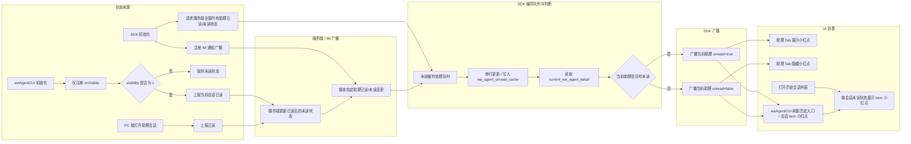
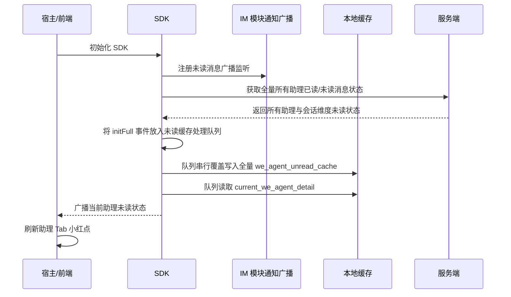
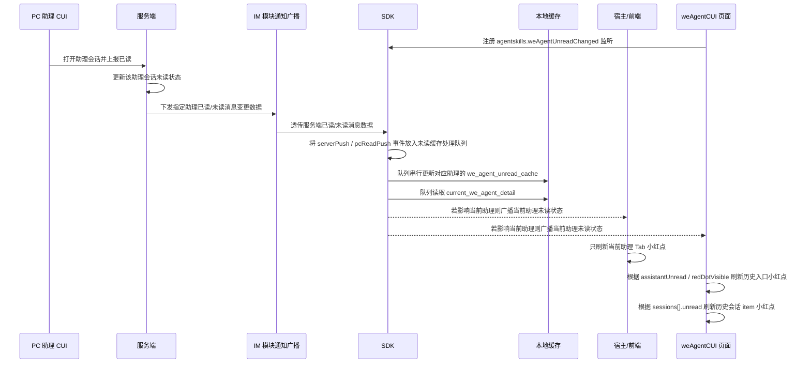
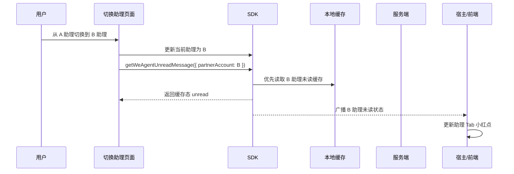
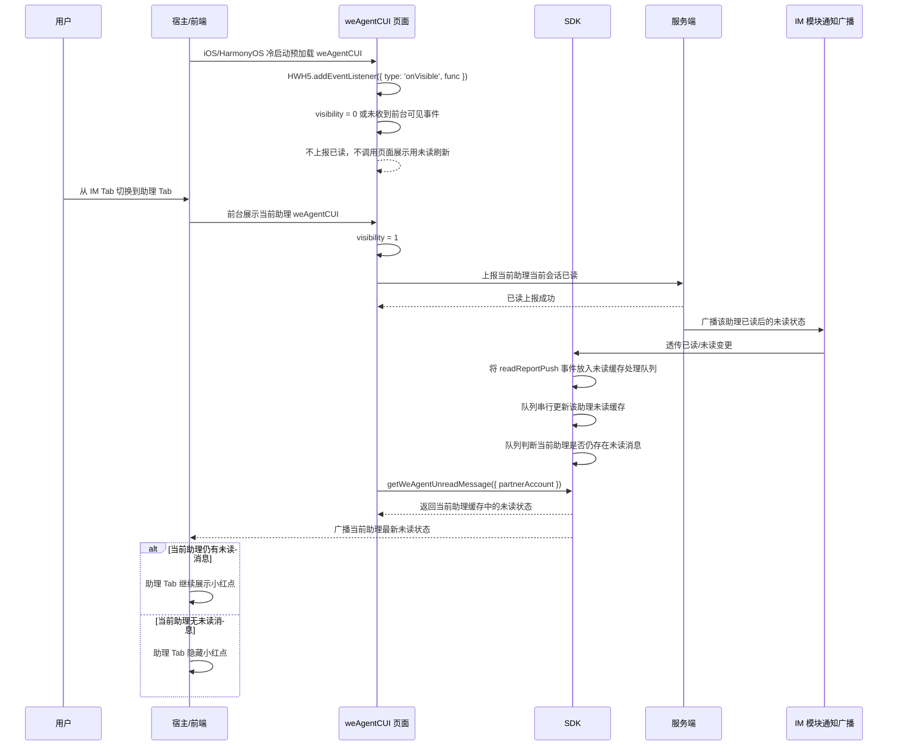
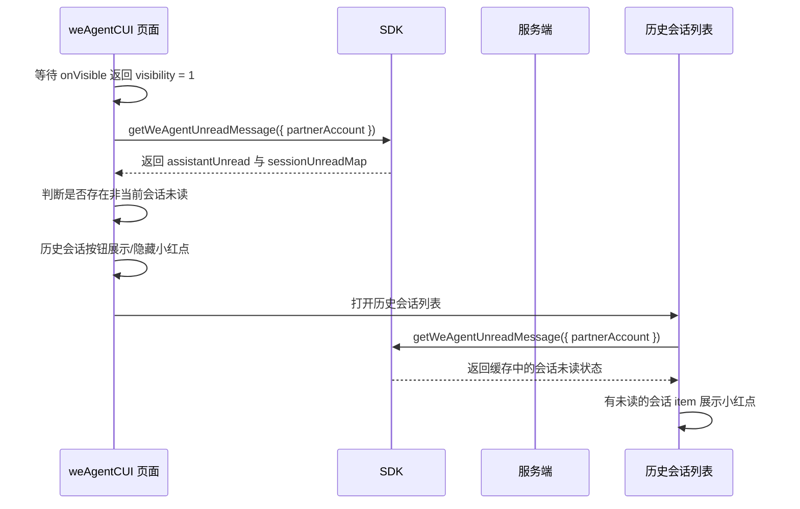

# `助理 Tab 未读消息小红点技术方案`

- 方案日期：`2026-06-11`
- 目标工程：`skillSDK`、`ai-chat-viewer`
- 参考文档：`SkillClientSdkInterfaceV2.md`、`小程序JSAPI接口文档.md`、`ai-chat-viewer/docs/plans/技术方案模板.md`
- 方案类型：`跨端 SDK 未读消息同步与前端展示方案`

## 1. 背景

### 1.1 场景说明

当前助理 Tab 已支持打开当前助理的 `weAgentCUI` 页面和切换助理，但缺少会话未读消息提醒能力。新需求要求在助理 Tab 按钮、`weAgentCUI` 历史会话入口、历史会话列表 item 上展示未读小红点，帮助用户感知当前助理是否存在未读会话消息。

本方案将未读状态收口到服务端管控，端侧只做缓存、刷新、广播和 UI 展示，不在客户端计算未读数，也不对非当前选择助理展示 Tab 小红点。SDK 初始化时会主动调用服务端接口获取全量所有助理的已读/未读消息状态并缓存；SDK 初始化同时注册 IM 通知广播，接收服务端后续广播的对应助理已读和未读消息数据，并将所有未读缓存变更放入 SDK 内部未读缓存处理队列串行处理，避免初始化全量数据、IM 广播增量数据、已读回流数据并发写缓存造成时序问题。

需要特别处理三端页面生命周期差异：HarmonyOS 和 iOS 冷启动时会预加载 `weAgentCUI` 页面，并执行页面中的全部逻辑代码，但此时页面并未前台显示；Android 冷启动不会预加载 `weAgentCUI` 页面。因此 `weAgentCUI` 初始化阶段只能注册可见性监听和准备本地状态，不得直接上报已读，也不得把预加载视为用户已打开页面。所有会影响小红点消失的动作必须等待 `onVisible` 返回 `visibility = 1` 后执行。

### 1.2 需求目标

1. 助理 Tab 按钮只展示小红点，不展示也不计算未读消息数。
2. 助理 Tab 小红点只针对当前选择的助理生效，其他助理存在未读消息时不影响当前 Tab 按钮。
3. 从 A 助理在切换助理页面切换到 B 助理后，调用 SDK 接口获取 B 助理是否存在未读会话消息，并刷新助理 Tab 小红点。
4. 用户从 IM Tab 切换到助理 Tab 并打开当前助理 `weAgentCUI` 页面后，页面在移动端前台可见时请求服务端已读上报接口；服务端通过 IM 广播已读后的消息状态，SDK 更新缓存并判断当前助理是否仍存在未读消息，有未读则助理 Tab 继续展示小红点，没有未读则隐藏小红点。
5. `weAgentCUI` 页面真实前台可见后调用 SDK 获取当前助理未读会话消息；若当前助理存在非当前会话的未读消息，历史会话列表按钮图标展示小红点；打开历史会话列表后，有未读消息的会话 item 展示小红点。
6. PC 端打开助理会话 CUI 页面并完成已读上报后，移动端对应会话 item 小红点需要消失；助理 Tab 是否隐藏小红点由当前助理是否仍存在其他未读会话决定。
7. 小红点是否展示由服务端后台管控：后台全员开关默认关闭；命中黑名单用户时不展示小红点。

### 1.3 非目标

1. 不展示未读消息数，不做未读数累加、合并或端侧计算。
2. 不改变助理 Tab 是否展示的 `isShowWeAgent` 逻辑。
3. 不改变现有消息收发、历史消息渲染和会话创建流程。
4. 不为非当前选择助理展示助理 Tab 小红点。

## 2. 方案图

### 2.1 整体方案图



### 2.2 方案核心

核心方案是：SDK 初始化全量拉取所有助理已读/未读状态，IM 广播持续增量更新指定助理的已读/未读状态；所有会修改 `we_agent_unread_cache` 的事件先进入 SDK 内部未读缓存处理队列，队列按入队顺序串行写缓存并广播当前助理状态；助理 Tab 只消费当前助理的布尔未读态；`weAgentCUI` 初始化时只注册可见性监听，在移动端真实前台可见时才上报已读并读取 SDK 缓存刷新小红点。

## 3. 时序图

### 3.1 SDK 初始化获取全量未读状态



### 3.2 IM 广播触发指定助理已读/未读状态更新



### 3.3 切换助理后刷新 Tab 小红点



### 3.4 weAgentCUI 预加载与前台可见后上报已读



### 3.5 历史会话列表小红点展示



## 4. 技术细节

### 4.1 调整点

1. SDK 初始化时主动请求服务端获取全量所有助理的已读/未读消息状态，并通过未读缓存处理队列写入本地缓存。
2. SDK 初始化时注册 IM 模块通知广播，接收服务端后续广播的指定助理已读和未读消息数据，并通过未读缓存处理队列更新对应助理的未读缓存。
3. SDK 新增获取助理未读消息接口，入参为 `partnerAccount`，用于获取当前助理的未读消息缓存；当前方案中实时性由初始化全量查询和 IM 广播增量更新保障，不要求每个页面场景再次请求服务端刷新。
4. SDK 新增或封装已读上报能力，供 `weAgentCUI` 页面在移动端前台可见时调用。
5. SDK 新增当前助理未读状态广播，宿主根据广播刷新助理 Tab 小红点。
6. `weAgentCUI` 页面初始化阶段只监听 `HWH5.addEventListener({ type: 'onVisible', func })`，不执行已读上报，也不触发用于页面展示的未读刷新。
7. `weAgentCUI` 收到 `visibility = 1` 后才上报已读，并调用 SDK 未读接口刷新历史按钮小红点和会话 item 小红点。
8. 服务端通过后台开关和黑名单控制是否返回或下发小红点可见状态，端侧不绕过服务端开关。
9. 新增 SDK 内部未读缓存处理队列，所有会修改 `we_agent_unread_cache` 的事件都进入队列串行处理，避免初始化全量查询、IM 广播增量更新、PC/移动端已读回流同时到达时并发写缓存。

### 4.2 核心实现方式

#### 4.2.1 未读缓存结构

新增按 `userId` 隔离的 SDK 本地缓存 key：

| 缓存 key | 说明 |
|---|---|
| `we_agent_unread_cache` | 助理未读状态缓存，key 为 `partnerAccount` |

建议缓存结构：

```typescript
type WeAgentUnreadCache = {
  updatedAt: number
  assistants: Record<string, WeAgentUnreadState>
}

type WeAgentUnreadState = {
  partnerAccount: string
  robotId?: string
  assistantUnread: boolean
  sessions: Record<string, WeAgentSessionUnreadState>
  redDotVisible: boolean
}

type WeAgentSessionUnreadState = {
  welinkSessionId: string
  unread: boolean
  updatedAt?: string
}
```

说明：

1. `assistantUnread` 只表示当前助理是否存在未读会话消息，不表示未读数。
2. `sessions[welinkSessionId].unread` 用于历史会话列表 item 小红点展示。
3. `redDotVisible` 由服务端后台开关、黑名单和未读状态共同决定；当服务端返回 `false` 时，即使存在未读，端侧也不展示小红点。
4. SDK 初始化全量查询和 IM 广播增量更新均不直接并发写缓存，必须先进入未读缓存处理队列。
5. SDK 初始化全量查询会通过队列覆盖写入所有助理的 `we_agent_unread_cache`；IM 广播通过队列只更新广播载荷中指定助理的缓存。
6. SDK 对外广播时只广播当前助理的未读状态，避免非当前助理影响助理 Tab。

#### 4.2.2 未读缓存处理队列

SDK 内部新增未读缓存处理队列：

1. 队列为 SDK 内部实现，不新增公开接口，也不新增持久化缓存 key。
2. 所有会修改 `we_agent_unread_cache` 的事件都必须先进入队列，由队列按入队顺序串行处理；同一时刻只处理一个事件，当前事件完成缓存读写和广播后再处理下一个事件。
3. 队列事件来源包括：
   - `initFull`：SDK 初始化请求服务端返回的全量所有助理已读/未读状态；
   - `serverPush`：IM 模块透传的服务端指定助理已读/未读变更；
   - `readReportPush`：移动端 `weAgentCUI` 前台已读上报后，服务端通过 IM 广播回来的已读后状态；
   - `pcReadPush`：PC 端打开助理会话并上报已读后，服务端通过 IM 广播回来的已读后状态。
4. 队列事件建议结构：

```typescript
type WeAgentUnreadCacheEvent = {
  source: 'initFull' | 'serverPush' | 'readReportPush' | 'pcReadPush'
  partnerAccount?: string
  robotId?: string
  payload: WeAgentUnreadState | WeAgentUnreadCache
}
```

5. `initFull` 事件覆盖写入全量 `we_agent_unread_cache`；增量事件只更新 `payload.partnerAccount` 对应助理缓存，不影响其他助理。
6. 队列处理完缓存后读取 `current_we_agent_detail`，若本次事件影响当前助理，则广播当前助理最新未读状态；若不影响当前助理，则只更新缓存，不刷新助理 Tab。
7. `getWeAgentUnreadMessage({ partnerAccount })` 只读取队列已落盘的缓存，不主动插队、不等待正在处理的事件完成；如果业务需要最新状态，以后续队列广播为准。
8. 本方案不做回流广播去重，不做版本或时间戳比较；服务端未返回稳定 `version` / `eventTime` 时，以队列入队顺序保证单端缓存写入串行化。

#### 4.2.3 SDK 未读接口

建议新增接口：

```typescript
getWeAgentUnreadMessage(params: GetWeAgentUnreadMessageParams): Promise<GetWeAgentUnreadMessageResult>
```

入参：

| 参数名 | 类型 | 必填 | 说明 |
|---|---|---|---|
| `partnerAccount` | `string` | 是 | 当前助理账号，用于从 `we_agent_unread_cache` 获取该助理未读消息缓存 |

出参：

| 参数名 | 类型 | 说明 |
|---|---|---|
| `partnerAccount` | `string` | 助理账号 |
| `robotId` | `string` | 助理 robotId |
| `assistantUnread` | `boolean` | 当前助理是否存在未读会话 |
| `redDotVisible` | `boolean` | 当前助理小红点是否允许展示 |
| `sessions` | `Array<WeAgentSessionUnreadState>` | 当前助理下会话未读状态 |
| `source` | `'cache'` | 本次返回来源，固定为缓存 |

返回示例：

```json
{
  "partnerAccount": "123",
  "robotId": "123",
  "assistantUnread": true,
  "redDotVisible": true,
  "sessions": [
    {
      "welinkSessionId": "session_1",
      "unread": true,
      "updatedAt": "2026-06-11T10:00:00+08:00"
    }
  ],
  "source": "cache"
}
```

#### 4.2.4 已读上报接口

建议新增接口：

```typescript
reportWeAgentSessionRead(params: ReportWeAgentSessionReadParams): Promise<ReportWeAgentSessionReadResult>
```

入参：

| 参数名 | 类型 | 必填 | 说明 |
|---|---|---|---|
| `partnerAccount` | `string` | 是 | 当前助理账号 |
| `robotId` | `string` | 否 | 当前助理 robotId |
| `welinkSessionId` | `string` | 否 | 当前会话 ID；不传时表示当前助理当前会话已读 |

出参：

| 参数名 | 类型 | 说明 |
|---|---|---|
| `status` | `string` | 固定返回 `success` |

已读上报成功后，不直接以已读上报接口返回结果清理助理 Tab 小红点；SDK 以服务端 IM 广播回来的已读/未读状态作为最终缓存来源。若已读上报由页面直接请求服务端，则 SDK 只通过 IM 广播生成未读缓存处理事件，入队更新缓存后重新判断当前助理是否仍存在未读会话。

#### 4.2.5 SDK 未读广播

建议新增 SDK 对外广播事件：

```typescript
type: 'agentskills.weAgentUnreadChanged'
```

广播 payload：

```json
{
  "partnerAccount": "123",
  "robotId": "123",
  "assistantUnread": true,
  "redDotVisible": true,
  "sessions": [
    {
      "welinkSessionId": "session_1",
      "unread": true
    }
  ],
  "source": "serverPush"
}
```

广播规则：

1. SDK 初始化全量未读状态查询完成后，先将 `initFull` 事件放入未读缓存处理队列；队列写入缓存后广播一次当前助理未读状态。
2. IM 模块透传服务端指定助理已读/未读变更后，先将增量事件放入未读缓存处理队列；队列更新该助理缓存后，若变更影响当前助理，则同时广播给宿主和已注册监听的 `weAgentCUI` 页面。
3. 切换助理后调用 `getWeAgentUnreadMessage({ partnerAccount: B })`，返回缓存态后广播一次 B 助理未读状态；不要求切换场景额外请求服务端刷新。
4. 已读上报后等待服务端 IM 广播；SDK 收到已读消息后将事件放入未读缓存处理队列，队列更新缓存后重新判断当前助理是否仍存在未读会话，并广播当前助理最新未读状态：仍有未读则广播 `assistantUnread=true`，无未读则广播 `assistantUnread=false`。
5. 若服务端后台开关关闭或命中黑名单，`redDotVisible=false`，宿主和页面均不得展示小红点。
6. `weAgentCUI` 收到广播后只处理当前助理数据：根据 `assistantUnread` 与 `redDotVisible` 刷新历史会话入口小红点，根据 `sessions[].unread` 刷新已打开历史会话列表中的 item 小红点。

#### 4.2.6 助理 Tab 展示规则

1. 助理 Tab 只消费当前选择助理的 `redDotVisible`。
2. `redDotVisible=true` 时展示小红点；`false` 时隐藏小红点。
3. 不读取、不展示、不计算未读数。
4. 当前助理为空、激活页状态、服务端接口失败或缓存缺失时，默认不展示小红点。
5. 从 A 助理切到 B 助理后，必须以 B 助理为准重新调用 `getWeAgentUnreadMessage({ partnerAccount: B })`，不能沿用 A 助理状态。

#### 4.2.7 weAgentCUI 页面展示规则

1. 页面初始化后立即调用 `HWH5.addEventListener({ type: 'onVisible', func })` 监听可见性。
2. 页面初始化阶段不得直接调用已读上报接口；HarmonyOS 和 iOS 冷启动预加载会执行页面代码，但不代表用户已前台打开 `weAgentCUI`。
3. 页面初始化阶段不得主动触发用于页面展示的 `getWeAgentUnreadMessage({ partnerAccount })` 缓存读取；助理 Tab 小红点由 SDK 初始化全量未读查询和 IM 广播负责。
4. 回调中 `visibility = 1` 表示页面在移动端前台显示，页面先调用已读上报接口；服务端通过 IM 广播该助理已读后的消息状态，SDK 收到广播后更新缓存，并根据当前助理是否仍存在未读消息广播最新状态：有未读则助理 Tab 继续展示小红点，没有未读则隐藏小红点。
5. 回调中 `visibility = 0` 表示页面不可见，不触发已读上报，不清理当前会话未读状态，不隐藏小红点。
6. Android 冷启动不会预加载 `weAgentCUI`，但仍按同一规则处理：页面初始化只注册监听，收到 `visibility = 1` 后再上报已读和读取未读缓存。
7. 页面需要维护本次前台可见周期的幂等标记，避免同一 `welinkSessionId` 在连续 `visibility = 1` 回调中重复上报已读；当会话或助理切换后重置该标记。
8. 如果存在非当前会话的未读消息，则历史会话列表按钮图标展示小红点。
9. 打开历史会话列表后，根据 `sessions[].unread` 给对应会话 item 展示小红点。
10. 当前正在打开的会话已读后，不再在该会话 item 上展示小红点；其他会话未读状态保持不变。
11. 页面需要监听 SDK 对外广播 `agentskills.weAgentUnreadChanged`；当广播的 `partnerAccount` 与当前页面助理一致时，按广播 payload 立即刷新历史会话入口和已渲染会话 item 的小红点。
12. 广播的 `partnerAccount` 与当前页面助理不一致时，页面只忽略 UI 刷新，不主动请求服务端，也不修改当前页面小红点。

### 4.3 兼容与边界

1. 服务端后台开关默认关闭时，SDK 查询结果和 IM 广播均应返回 `redDotVisible=false` 或不返回未读数据；端侧默认不展示小红点。
2. 命中黑名单用户时，即使存在未读会话，服务端也应控制 `redDotVisible=false`，端侧不展示小红点。
3. 初始化全量未读状态请求失败时保留本地缓存；若本地也无缓存，默认当前助理无小红点，并等待后续 IM 广播增量更新。
4. IM 广播只更新载荷中指定助理的未读缓存；若广播不属于当前助理，助理 Tab 小红点不变化。
5. PC 端和移动端同时打开同一助理会话时，以服务端已读状态为准；移动端收到服务端 IM 广播后刷新对应助理缓存和 UI。
6. 当前助理切换过程中，旧助理未读广播不得影响新助理 Tab 小红点；广播消费方需要校验 `partnerAccount` 与当前助理一致。
7. 历史会话分页加载时，未读状态来自 SDK 未读缓存或服务端未读接口，不从历史会话列表条目自行推断。
8. HarmonyOS 和 iOS 冷启动预加载 `weAgentCUI` 时，页面执行初始化逻辑但未前台展示；该阶段不得触发已读上报，也不得因为页面代码执行而隐藏助理 Tab、历史按钮或会话 item 小红点。
9. 若预加载阶段没有收到 `onVisible` 回调，页面默认按不可见处理；只有明确收到 `visibility = 1` 才进入前台已读流程。
10. 初始化全量查询返回、IM 广播增量更新、移动端已读回流、PC 端已读回流可能并发到达；SDK 必须统一入未读缓存处理队列，按入队顺序串行写缓存和广播。
11. 队列不做服务端回流广播去重，不做最终态 diff；若同一助理连续收到多条状态变更，按队列顺序依次落缓存和广播，最终状态由最后处理完成的事件决定。
12. 队列中的单个事件处理失败时，需要记录日志或埋码，并继续处理后续事件，避免阻塞未读状态后续收敛。

### 4.4 相关接口联动

1. SDK 初始化入口：主动调用服务端全量未读接口获取所有助理已读/未读消息状态，同时注册 IM 未读广播监听；全量返回数据需以 `initFull` 事件放入未读缓存处理队列后再写缓存。
2. `getWeAgentUnreadMessage`：新增 SDK 接口，入参为 `partnerAccount`，从缓存返回该助理未读状态与会话未读列表；普通页面场景不触发服务端刷新。
3. `reportWeAgentSessionRead`：新增 SDK 或页面可调用能力，仅用于 `weAgentCUI` 收到 `visibility = 1` 后上报当前会话已读；已读上报成功后等待服务端 IM 广播入队更新缓存。
4. `getWeAgentUri` / `openWeAgent`：打开或切换当前助理后，读取当前助理未读缓存并刷新助理 Tab 小红点。
5. `getHistorySessionsList`：历史会话列表仍负责返回会话列表；小红点状态通过未读接口补充，不要求该接口直接承载未读数。
6. `HWH5.addEventListener`：`weAgentCUI` 页面监听 `onVisible`，根据 `visibility` 判断是否上报已读。
7. SDK 对外广播：`agentskills.weAgentUnreadChanged` 通知宿主刷新助理 Tab 小红点，并通知 `weAgentCUI` 页面刷新历史会话入口和会话 item 小红点。

### 4.5 文档需要同步修改的内容

1. `SkillClientSdkInterfaceV2.md`：补充 SDK 初始化全量未读查询、IM 已读/未读广播缓存更新、未读缓存处理队列、`getWeAgentUnreadMessage`、`reportWeAgentSessionRead` 接口定义和按 `partnerAccount` 读取缓存规则。
2. `小程序JSAPI接口文档.md`：补充 `HWH5.addEventListener({ type: 'onVisible', func })` 在 `weAgentCUI` 已读上报场景的使用约束。
3. Android / iOS / HarmonyOS SDK 接口说明：补充 IM 未读广播监听、未读缓存、广播事件和失败降级规则。
4. `ai-chat-viewer` 相关文档：补充助理 Tab、历史会话按钮和历史会话 item 的小红点消费规则。

## 5. 性能

1. SDK 初始化新增一次全量助理未读状态查询；该请求只返回布尔状态和会话未读标识，不返回消息内容和未读数。
2. `getWeAgentUnreadMessage` 只读取指定 `partnerAccount` 的本地缓存，避免切 Tab 和打开页面时阻塞首屏。
3. 切换助理、打开 `weAgentCUI`、打开历史会话列表等页面场景默认不额外请求服务端刷新，减少重复网络请求。
4. 历史会话列表 item 小红点使用未读缓存映射，不对每个会话单独请求。
5. 已读上报只在 `weAgentCUI` 移动端前台可见时触发，避免 HarmonyOS / iOS 冷启动预加载造成额外请求和误清小红点。

## 6. 功耗

1. 不新增轮询机制。
2. 不新增独立长连接，复用 IM 模块通知广播通道。
3. 不新增后台常驻任务。
4. 页面不可见或处于 HarmonyOS / iOS 冷启动预加载态时不触发已读上报。
5. 未读状态由初始化全量查询和 IM 广播事件驱动更新，不新增轮询或高频刷新。
6. 未读缓存处理队列只串行化本地缓存写入和广播，不新增后台常驻任务。

## 7. 埋码

1. `we_agent_unread_init_request`
   - 说明：记录 SDK 初始化拉取未读状态的结果，建议包含 `success`、`assistantCount`、`duration`、`errorCode`。
2. `we_agent_unread_push_received`
   - 说明：记录 IM 已读/未读广播接收情况，建议包含 `partnerAccount`、`robotId`、`sessionCount`、广播动作类型。
3. `we_agent_unread_cache_update`
   - 说明：记录未读缓存更新结果，建议包含 `partnerAccount`、`assistantUnread`、`redDotVisible`、`source`。
4. `we_agent_unread_broadcast_sent`
   - 说明：记录 SDK 对外广播发送情况，建议包含 `partnerAccount`、`assistantUnread`、`redDotVisible`、`source`。
5. `we_agent_session_read_report`
   - 说明：记录已读上报结果，建议包含 `partnerAccount`、`welinkSessionId`、`visibility`、`success`、`errorCode`。
6. `we_agent_red_dot_exposure`
   - 说明：记录助理 Tab、历史会话按钮、历史会话 item 小红点展示情况，建议包含 `position(tab/historyButton/historyItem)`、`partnerAccount`。

## 8. 影响范围

### 8.1 直接影响

1. Android SDK、iOS SDK、HarmonyOS SDK 初始化流程、未读接口、缓存和广播能力。
2. 服务端未读状态查询、已读上报、IM 未读变更下发能力。
3. 宿主助理 Tab 小红点展示逻辑。
4. `ai-chat-viewer` 的 `weAgentCUI` 页面可见性监听、已读上报、历史会话按钮和 item 小红点展示。

### 8.2 间接影响

1. 切换助理页面在切换成功后需要触发当前助理未读状态刷新。
2. PC 端会话已读状态会通过服务端影响移动端小红点。
3. 弱网或离线恢复后，未读缓存可能短暂使用旧值，后续 IM 广播或下一次 SDK 初始化全量查询到达后再校正。

### 8.3 不影响

1. 不影响助理 Tab 是否展示的开关能力。
2. 不影响现有消息收发、历史消息分页、会话恢复和流式消息渲染。
3. 不改变历史会话列表排序规则。
4. 不改变 `updateWeAgent`、`deleteWeAgent`、助理详情同步等既有接口语义。

## 9. 测试范围

### 9.1 功能测试

1. SDK 初始化成功拉取全量所有助理已读/未读状态并写入 `we_agent_unread_cache`，当前助理存在未读时助理 Tab 展示小红点。
2. SDK 初始化成功拉取全量所有助理已读/未读状态并写入 `we_agent_unread_cache`，当前助理无未读时助理 Tab 不展示小红点。
3. 当前助理无未读、非当前助理有未读时，助理 Tab 不展示小红点。
4. 从 A 助理切换到 B 助理后，校验 SDK 读取 B 助理未读缓存，Tab 小红点按 B 助理刷新。
5. IM 广播下发当前助理未读变更为 `true` 时，SDK 更新当前助理缓存并广播，助理 Tab 展示小红点，`weAgentCUI` 历史入口和对应会话 item 按 payload 展示小红点。
6. IM 广播下发当前助理已读变更后未读状态为 `false` 时，SDK 更新当前助理缓存并广播，助理 Tab 小红点消失，`weAgentCUI` 历史入口和对应会话 item 按 payload 隐藏小红点。
7. IM 广播下发非当前助理已读/未读变更时，SDK 只更新对应助理缓存，不改变当前助理 Tab 小红点。
8. HarmonyOS / iOS 冷启动预加载 `weAgentCUI` 并执行页面初始化代码时，校验不触发已读上报，不调用页面展示用未读刷新，不隐藏助理 Tab 小红点。
9. Android 冷启动不预加载 `weAgentCUI`，校验页面打开后仍等待 `visibility=1` 再触发已读上报和读取未读缓存。
10. 用户从 IM Tab 切换到助理 Tab 并打开 `weAgentCUI`，页面 `visibility=1` 时上报已读；服务端 IM 广播已读后的消息状态后，SDK 更新缓存并判断当前助理是否仍有未读消息，有未读则助理 Tab 继续展示小红点，没有未读则隐藏小红点。
11. `weAgentCUI` 页面 `visibility=0` 时不触发已读上报。
12. `weAgentCUI` 前台可见后调用 `getWeAgentUnreadMessage` 读取缓存，存在非当前会话未读时历史会话按钮展示小红点。
13. 打开历史会话列表后，SDK 从缓存返回会话未读状态，有未读消息的会话 item 展示小红点，无未读的 item 不展示。
14. 当前打开会话已读后，服务端 IM 广播更新缓存并透传给 `weAgentCUI` 页面，该会话 item 小红点消失，其他未读会话 item 保持显示。
15. 同一助理同一会话连续收到多次 `visibility=1` 回调时，校验只执行一次有效已读上报；切换会话或切换助理后允许重新上报。
16. PC 端打开并上报已读后，服务端通过 IM 广播下发对应助理已读/未读变更，移动端 SDK 更新对应助理缓存；对应会话 item 小红点消失，当前助理 Tab 和历史按钮是否隐藏由该助理是否仍存在其他未读会话决定。
17. 服务端后台开关关闭时，即使存在未读数据，端侧也不展示任何助理未读小红点。
18. 命中黑名单用户时，端侧不展示助理 Tab、历史按钮和历史 item 小红点。
19. 初始化请求失败但本地有缓存时，优先展示缓存状态，并在后续 IM 广播到达后校正。
20. 初始化请求失败且本地无缓存时，默认不展示小红点，并等待后续 IM 广播增量更新。
21. 初始化全量查询返回和 IM 广播增量更新同时到达时，校验两个事件均进入未读缓存处理队列，并按入队顺序串行写入 `we_agent_unread_cache`。
22. 移动端已读上报回流广播和 PC 端已读回流广播连续到达时，校验队列依次更新对应助理缓存，并按最后处理完成的状态刷新助理 Tab、历史入口和会话 item 小红点。
23. 队列处理非当前助理未读变更时，校验只更新对应助理缓存，不广播当前助理 Tab 小红点变化。

### 9.2 兼容测试

1. Android、iOS、HarmonyOS 三端未读接口出参、广播事件名和 payload 字段保持一致。
2. 旧版本未实现未读接口时，助理 Tab 默认不展示小红点，不影响打开助理。
3. 弱网、断网恢复、IM 广播延迟场景下，最终以服务端最新广播或下一次初始化全量查询结果为准。
4. PC 与移动端同时打开同一助理会话时，小红点状态最终一致。

### 9.3 文档一致性检查

1. `SkillClientSdkInterfaceV2.md` 中初始化全量未读查询、IM 已读/未读广播、接口、缓存规则、广播 payload 与本方案保持一致。
2. `小程序JSAPI接口文档.md` 中 `onVisible` 的 `visibility` 含义与本方案保持一致。
3. `ai-chat-viewer` 文档中助理 Tab、历史按钮、历史 item 的展示规则与本方案保持一致。

## 10. 最终建议

建议采用“服务端管控 + SDK 初始化全量缓存 + IM 广播增量更新 + 未读缓存处理队列 + 页面按当前助理消费”的方案。服务端负责开关、黑名单、跨端已读一致性和最终未读状态；SDK 初始化主动拉取所有助理已读/未读状态，后续通过 IM 广播接收指定助理变更，所有缓存变更统一进入队列串行写入并广播当前助理状态；宿主和 `weAgentCUI` 只消费布尔小红点状态，不计算未读数。后续优先补齐服务端协议和 `SkillClientSdkInterfaceV2.md` 接口定义，再推进 Android、iOS、HarmonyOS 与 `ai-chat-viewer` 联调。
