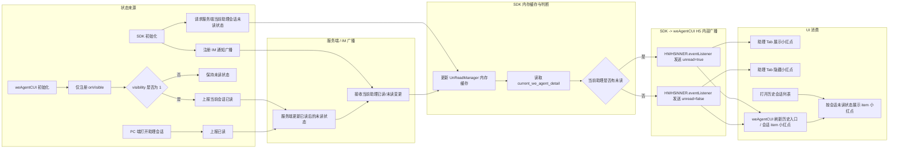
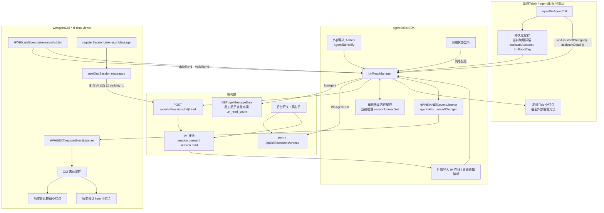
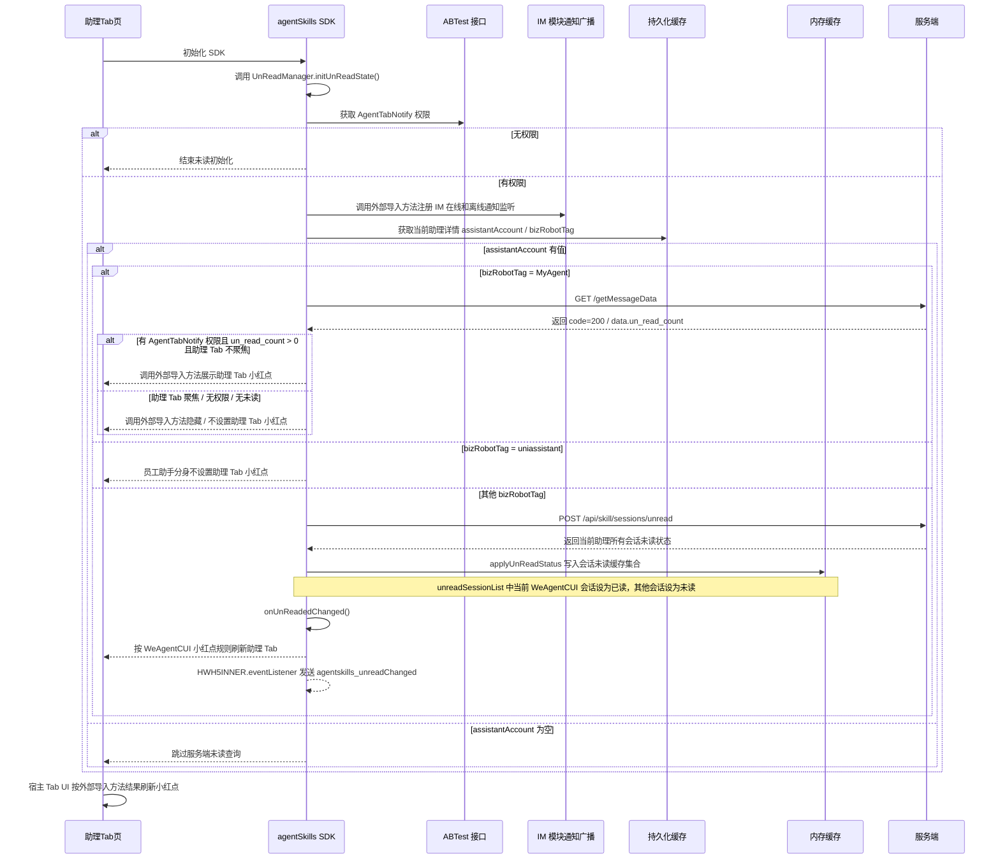
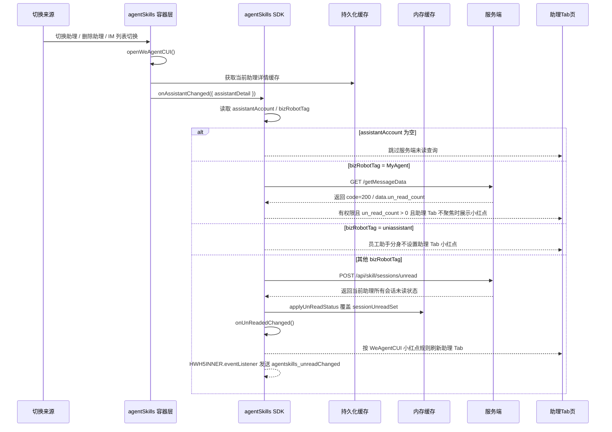
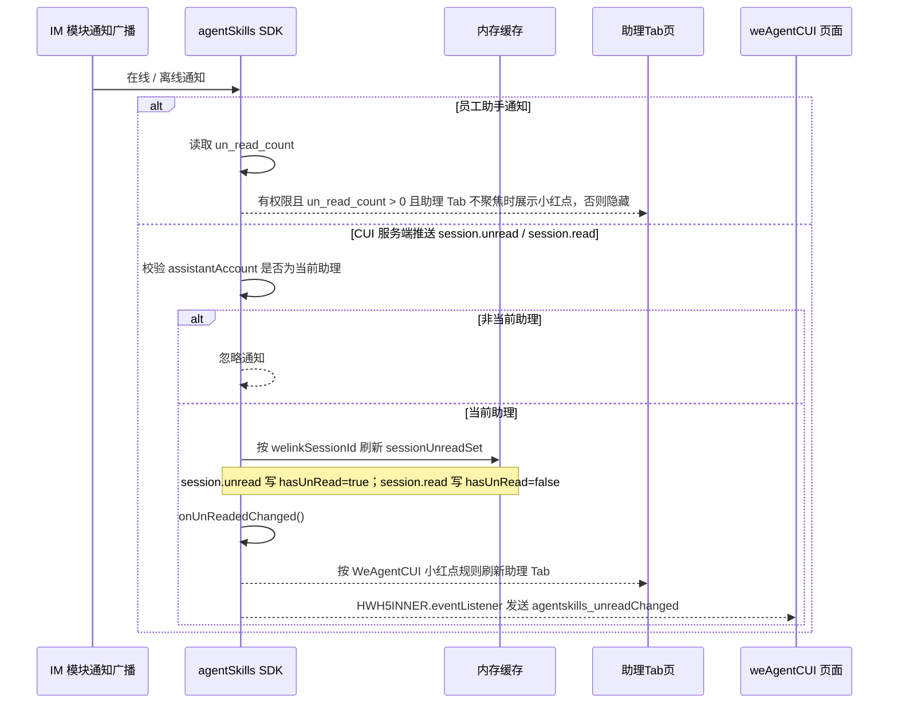
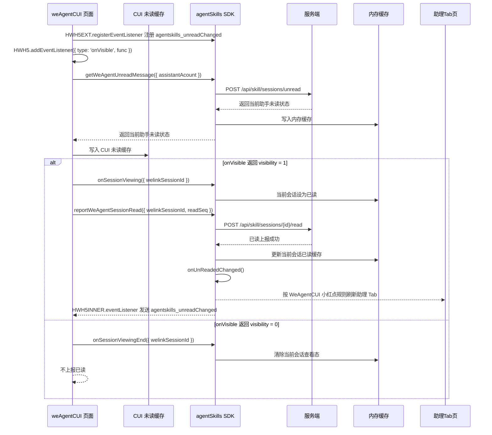
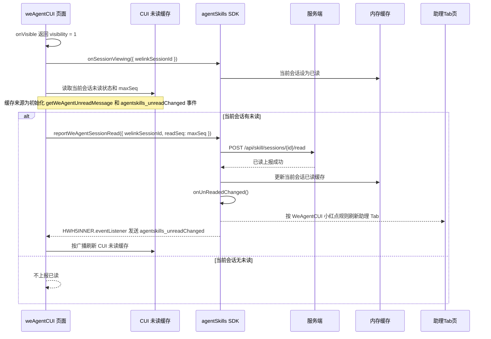
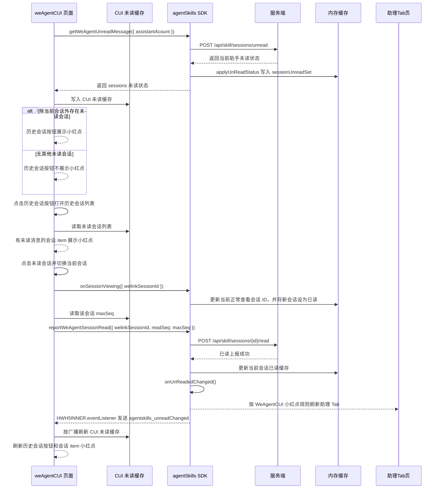
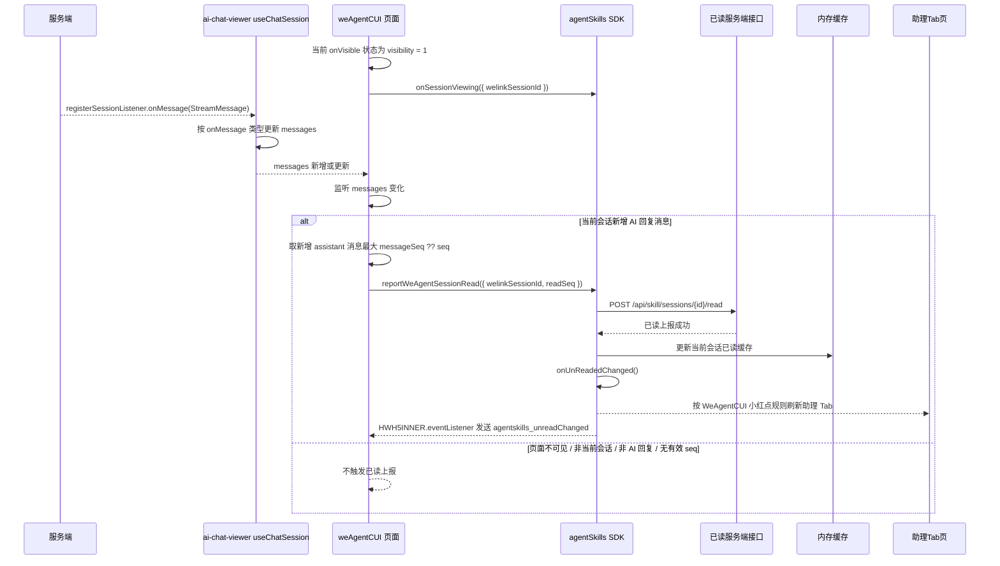
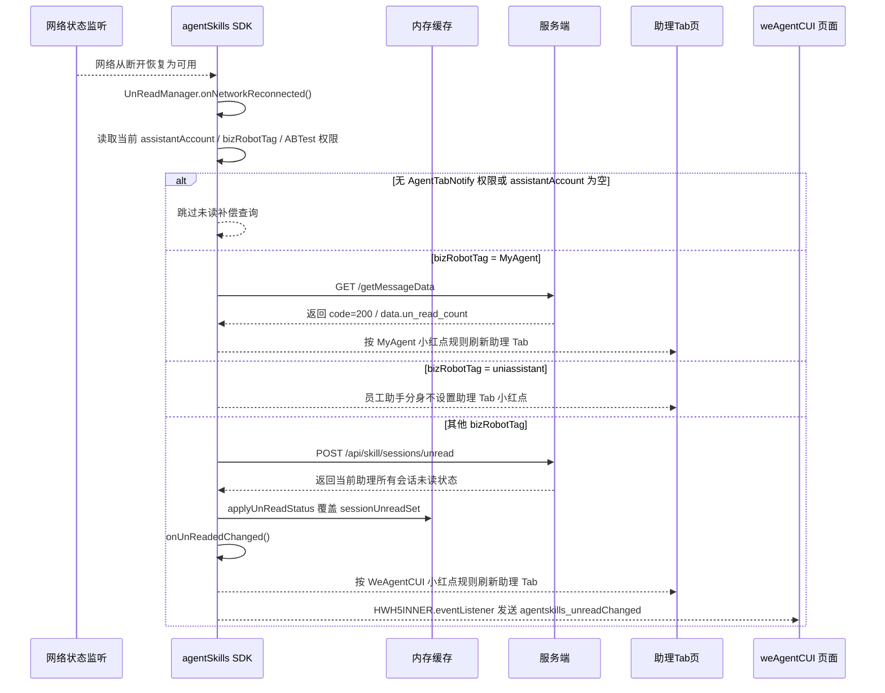

# `助理 Tab 未读消息小红点技术方案`

- 方案日期：`2026-06-11`
- 目标工程：`skillSDK`、`ai-chat-viewer`
- 参考文档：`SkillClientSdkInterfaceV2.md`、`小程序JSAPI接口文档.md`、`ai-chat-viewer/docs/plans/技术方案模板.md`
- 方案类型：`跨端 SDK 未读消息同步与前端展示方案`

## 1. 背景

### 1.1 场景说明

当前助理 Tab 已支持打开当前助理的 `weAgentCUI` 页面和切换助理，但缺少会话未读消息提醒能力。新需求要求在助理 Tab 按钮、`weAgentCUI` 历史会话入口、历史会话列表 item 上展示未读小红点，帮助用户感知当前助理是否存在未读会话消息。

本方案将未读状态收口到服务端管控，端侧只做内存缓存、刷新、广播和 UI 展示，不在客户端计算未读数，也不对非当前选择助理展示 Tab 小红点。SDK 初始化时通过 `UnReadManager.initUnReadState` 调用外部导入的 ABTest 方法判断 `AgentTabNotify` 权限，并将结果缓存为进程内状态；后续未读通知、网络恢复、小红点计算和页面广播均直接读取该缓存，不重复调用基座 ABTest 方法。对外结果中的 `redDotVisible` 仅表示该 ABTest 是否允许展示小红点；宿主助理 Tab 的实际展示由 SDK 结合未读、助理类型和 Tab 聚焦状态独立计算。命中权限后，SDK 通过外部导入方法注册 IM 在线和离线通知，再从持久化缓存读取当前助理详情，按 `assistantAccount` 与 `bizRobotTag` 决定冷启动未读拉取路径：`MyAgent` 走员工助手服务端 GET `/getMessageData` 全量未读接口，`uniassistant` 员工助手分身不展示助理 Tab 小红点，其他类型按 WeAgentCUI 页面流程请求 `/api/skill/sessions/unread`；后续切换助理由 agentSkills 容器层 `openWeAgentCUI` 从持久化缓存读取当前助理详情缓存，并调用 agentSkills SDK 接口 `onAssistantChanged({ assistantDetail })`，SDK 根据助理详情缓存中的 `assistantAccount` 和 `bizRobotTag` 执行冷启动场景中对应的未读拉取流程；IM 在线/离线通知、CUI 已读上报也走同一套内存缓存刷新和广播逻辑。设置助理 Tab 小红点时，SDK 只负责产出展示决策，实际展示 / 隐藏通过外部导入方法完成。需要通知 `weAgentCUI` 时，SDK 通过 `HWH5INNER.eventListener` 发送 H5 内部广播。

需要特别处理三端页面生命周期差异：HarmonyOS 和 iOS 冷启动时会预加载 `weAgentCUI` 页面，并执行页面中的全部逻辑代码，但此时页面并未前台显示；Android 冷启动不会预加载 `weAgentCUI` 页面。因此 `weAgentCUI` 初始化阶段只能注册可见性监听和准备页面内状态，不得直接上报已读，也不得把预加载视为用户已打开页面。所有会影响小红点消失的动作必须等待 `onVisible` 返回 `visibility = 1` 后执行。

### 1.2 需求目标

1. 助理 Tab 按钮只展示小红点，不展示也不计算未读消息数。
2. 助理 Tab 小红点只针对当前选择的助理生效，其他助理存在未读消息时不影响当前 Tab 按钮。
3. 从 A 助理在切换助理页面切换到 B 助理后，调用 SDK 接口获取 B 助理是否存在未读会话消息，并刷新助理 Tab 小红点。
4. 用户从 IM Tab 切换到助理 Tab 并打开当前助理 `weAgentCUI` 页面后，页面在移动端前台可见时请求服务端已读上报接口；服务端通过 IM 广播已读后的消息状态，SDK 更新内存缓存并判断当前助理是否仍存在未读消息，有未读则助理 Tab 继续展示小红点，没有未读则隐藏小红点。
5. `weAgentCUI` 页面真实前台可见后调用 SDK 获取当前助理未读会话消息；若当前助理存在非当前会话的未读消息，历史会话列表按钮图标展示小红点；打开历史会话列表后，有未读消息的会话 item 展示小红点。
6. PC 端打开助理会话 CUI 页面并完成已读上报后，移动端对应会话 item 小红点需要消失；助理 Tab 是否隐藏小红点由当前助理是否仍存在其他未读会话决定。
7. 小红点是否展示由服务端后台管控：后台全员开关默认关闭；命中黑名单用户时不展示小红点。

### 1.3 非目标

1. 不展示未读消息数，不做未读数累加、合并或端侧计算。
2. 不改变助理 Tab 是否展示的 `isShowWeAgent` 逻辑。
3. 不改变现有消息收发、历史消息渲染和会话创建流程。
4. 不为非当前选择助理展示助理 Tab 小红点。

## 2. 方案图

### 2.1 整体方案图



### 2.2 架构图



### 2.3 方案核心

核心方案围绕 `UnReadManager` 收口八类流程：

1. SDK 冷启动时，`agentSkills` SDK 调用 `UnReadManager.initUnReadState`，先通过外部导入的 ABTest 接口获取一次 `AgentTabNotify` 权限并缓存结果；无权限则不继续初始化，有权限则通过外部导入方法注册 IM 在线和离线通知，并从持久化缓存读取当前助理详情中的 `assistantAccount` 和 `bizRobotTag`。初始化后的所有未读流程直接读取该缓存，不重复调用基座 ABTest 方法。若 `bizRobotTag=MyAgent`，请求员工助手服务端 GET `/getMessageData` 获取全量未读消息，并将服务端 `data.un_read_count > 0` 作为未读判断；若 `bizRobotTag=uniassistant`，表示员工助手分身，不设置助理 Tab 小红点；其他情况按 WeAgentCUI 页面流程请求 POST `/api/skill/sessions/unread`，调用 `applyUnReadStatus` 更新内存缓存。最后统一按 `bizRobotTag`、`AgentTabNotify` 权限、未读状态和助理 Tab 是否聚焦计算助理 Tab 小红点展示结果，并通过外部导入方法设置助理 Tab 小红点。
2. 切换助手时，切换助理页面、删除助理、IM 列表切换都会进入 agentSkills 容器层的 `openWeAgentCUI` 方法；该方法从持久化缓存中获取当前助理详情缓存，并调用 agentSkills SDK 接口 `onAssistantChanged({ assistantDetail })` 传入助理详情缓存。SDK 内部先清空旧助理未读缓存，再根据新助理详情缓存中的 `assistantAccount` 和 `bizRobotTag` 执行冷启动场景中对应的流程：`MyAgent` 走员工助手全量未读，`uniassistant` 不设置助理 Tab 小红点，其他类型走 `/api/skill/sessions/unread` 并通过 `applyUnReadStatus` 整体覆盖单例未读缓存，最后调用 `onUnReadedChanged`。
3. 外部导入的 IM 在线和离线通知回调到达时，员工助手通知按消息中的 `un_read_count > 0` 判断是否有未读；CUI 服务端推送只处理当前助理账号的 `session.unread` / `session.read` 通知，并按 `welinkSessionId` 刷新对应会话未读缓存，随后按统一助理 Tab 小红点规则产出展示决策，并通过外部导入方法设置助理 Tab 小红点。
4. CUI 页面初始化时，`weAgentCUI` 调用 `HWH5EXT.registerEventListener` 注册 `agentskills_unreadChanged`，调用 `HWH5.addEventListener({ type: 'onVisible', func })` 监听页面前后台；页面调用 `getWeAgentUnreadMessage` 获取当前会话未读消息并写入 CUI 未读缓存。若 `onVisible` 返回 `visibility=1`，页面先调用 `onSessionViewing({ welinkSessionId })`，再调用 `reportWeAgentSessionRead` 上报当前会话已读；若 `onVisible` 返回 `visibility=0`，页面调用 `onSessionViewingEnd({ welinkSessionId })` 清除查看态。
5. 用户从其他页面切回助理 Tab 时，`weAgentCUI` 通过 `onVisible` 感知重新前台展示，不再调用 `getWeAgentUnreadMessage`；页面先调用 `onSessionViewing({ welinkSessionId })`，再直接从 CUI 未读缓存中读取当前会话未读状态和最大 `message_seq`，调用 `reportWeAgentSessionRead` 上报当前会话已读，SDK 更新内存缓存并调用 `onUnReadedChanged`。CUI 未读缓存来源于页面初始化会话时调用的 `getWeAgentUnreadMessage` 和 `agentskills_unreadChanged` 事件监听。
6. `weAgentCUI` 页面内切换历史会话时，页面初始化调用 `getWeAgentUnreadMessage` 后，若除当前会话外还有其他会话未读，则历史会话按钮展示小红点；打开历史会话列表后，按 CUI 未读缓存中的未读会话列表给对应会话 item 展示小红点。用户点击未读会话后，`weAgentCUI` 切换当前会话，调用 `onSessionViewing({ welinkSessionId })` 通知 agentSkills SDK 更新当前正常查看会话 ID，再调用 `reportWeAgentSessionRead({ welinkSessionId, readSeq })` 上报该会话已读；SDK 更新当前会话已读缓存并按 WeAgentCUI 小红点规则刷新助理 Tab。
7. `weAgentCUI` 前台显示期间收到服务端 `onMessage` 新消息时，`ai-chat-viewer` 的 `useChatSession` 通过 `registerSessionListener` 监听服务端消息并更新页面 `messages`；页面监听 `messages` 变化，若当前 `visibility=1` 且当前会话新增了 AI 回复消息（`role=assistant`），则取新增 AI 回复消息中的最大 `messageSeq ?? seq` 作为 `readSeq`，调用 `reportWeAgentSessionRead({ welinkSessionId, readSeq })` 上报当前会话已读，并按 WeAgentCUI 小红点规则刷新助理 Tab。
8. 网络从断开恢复为可用时，agentSkills SDK 的 `UnReadManager` 监听网络恢复事件并触发未读状态补偿查询：若当前助理 `bizRobotTag=MyAgent`，请求员工助手服务端 GET `/getMessageData` 并按 `data.un_read_count` 刷新助理 Tab；若为 `uniassistant`，仍不展示助理 Tab 小红点；其他 `bizRobotTag` 则请求 CUI 服务端 POST `/api/skill/sessions/unread`，调用 `applyUnReadStatus` 覆盖单例未读缓存，随后调用 `onUnReadedChanged` 刷新助理 Tab 小红点并通过 `HWH5INNER.eventListener` 广播给 `weAgentCUI`。

## 3. 时序图

### 3.1 SDK 冷启动拉取当前助手未读状态



### 3.2 切换助手拉取当前助手未读状态



### 3.3 IM 在线和离线通知触发未读状态更新



### 3.4 CUI 页面初始化后上报已读



### 3.5 从其他页面切回助理 Tab 后上报已读



### 3.6 weAgentCUI 页面切换历史会话后上报已读



### 3.7 weAgentCUI 前台收到新 AI 回复后上报已读



### 3.8 网络恢复后补偿拉取未读状态



三端仅在网络状态由不可用变为可用时触发该流程。Android 使用
`ConnectivityManager.NetworkCallback`，HarmonyOS 使用系统 `netAvailable` / `netLost`
事件，iOS 的网络状态监听由基座外部导入，二次开发时在恢复在线回调中调用
`onNetworkReconnected`。补偿请求开始前不清空当前未读内存缓存；请求失败、响应已过期或
当前助理已切换时保留原缓存且不广播。`networkRefreshInFlight` 合并恢复期间的重复事件，
请求成功后才以 `source=networkReconnect` 刷新助理 Tab 并通知 weAgentCUI。

## 4. 技术细节

### 4.1 调整点

1. SDK 初始化时调用 `UnReadManager.initUnReadState`；该方法先调用外部导入的 ABTest 接口获取一次 `AgentTabNotify` 权限并写入 `agentTabNotifyEnabled` 内存缓存。无权限直接结束，有权限才继续通过外部导入方法注册 IM 在线和离线通知监听；初始化后的其他流程直接读取该缓存，不重复调用 ABTest 接口。
2. `initUnReadState` 从持久化缓存读取当前助理详情中的 `assistantAccount` 和 `bizRobotTag`；若 `assistantAccount` 不存在，则跳过服务端未读查询。
3. 冷启动时若 `bizRobotTag=MyAgent`，SDK 请求员工助手服务端 GET `/getMessageData` 获取全量未读消息，根据返回的 `code=200` 且 `data.un_read_count > 0` 判断是否有未读；最终只有命中 `AgentTabNotify` 权限、有未读且助理 Tab 不聚焦时才展示小红点，助理 Tab 聚焦时不展示。若 `bizRobotTag=uniassistant` 员工助手分身，则不设置助理 Tab 小红点；其他情况视为 WeAgentCUI 页面，继续调用服务端 POST `/api/skill/sessions/unread` 拉取该助理所有会话未读状态。
4. SDK 新增 `UnReadManager`，统一收口未读查询、已读上报、会话查看态标记、助理切换、内存缓存和 H5 内部广播处理逻辑。
5. SDK 新增 `applyUnReadStatus`，用于根据服务端 POST `/api/skill/sessions/unread` 返回的 `unreadSessionList` 初始化或更新助理会话未读内存缓存集合；如果列表中的会话 ID 与当前 WeAgentCUI 会话一致，则该会话设置为已读，其他会话设置为未读，并保存服务端返回的 `maxSeq`。
6. SDK 新增 `onUnReadedChanged`，用于读取当前助理会话未读缓存集合，并按 `bizRobotTag`、`AgentTabNotify` 权限、助理 Tab 聚焦状态和未读状态统一计算助理 Tab 小红点展示结果；实际设置 / 隐藏助理 Tab 小红点通过外部导入方法完成，并广播当前助理未读信息。
7. 切换助理页面、删除助理、IM 列表切换统一通过 agentSkills 容器层 `openWeAgentCUI` 进入；容器层从持久化缓存中获取当前助理详情缓存，再调用 agentSkills SDK 接口 `onAssistantChanged({ assistantDetail })` 传入助理详情缓存，由 SDK 内部 `UnReadManager.onAssistantChanged` 先清空单例未读缓存，再根据助理详情缓存中的 `assistantAccount` 和 `bizRobotTag` 执行冷启动场景中对应的流程。
8. SDK 新增获取助理未读消息接口，入参为 `assistantAcount` 和可选 `sessionIds`，通过服务端 POST `/api/skill/sessions/unread` 获取当前助理会话未读状态并写入内存缓存。
9. SDK 新增或封装已读上报能力，供 `weAgentCUI` 页面在移动端前台可见且已渲染消息后调用。
10. SDK 新增当前会话查看态接口，`weAgentCUI` 进入会话页面后通知 SDK 当前正常查看的会话，停留期间该会话设为已读并忽略服务端正常未读推送处理；离开会话页面后通知 SDK 清除查看标记并恢复正常推送处理。
11. SDK 新增面向 `weAgentCUI` 的未读状态 H5 内部广播，`weAgentCUI` 根据广播刷新历史入口和会话 item 小红点。
12. `weAgentCUI` 页面初始化阶段注册 `HWH5EXT.registerEventListener` 和 `HWH5.addEventListener({ type: 'onVisible', func })`；只有 `visibility = 1` 时才上报已读。
13. 服务端通过后台开关和黑名单控制是否返回或下发小红点可见状态，端侧不绕过服务端开关。
14. IM 在线和离线通知中，员工助手通知按 `un_read_count > 0` 作为未读输入；CUI 服务端推送只处理当前助理账号的 `session.unread` / `session.read` payload，并按 `welinkSessionId` 刷新对应 `sessionUnreadSet` 缓存。IM 在线和离线通知监听由外部导入方法提供，本方案不实现监听通道本体。
15. SDK 新增网络状态恢复监听；当网络从断开恢复为可用时，由 `UnReadManager.onNetworkReconnected` 按当前助理 `bizRobotTag` 触发未读补偿查询，后续复用 `applyUnReadStatus` 和 `onUnReadedChanged` 刷新助理 Tab 与 `weAgentCUI`。Android 使用 `ConnectivityManager.NetworkCallback`，HarmonyOS 使用系统 `netAvailable` / `netLost`，iOS 网络监听由基座外部导入并保留 TODO。补偿请求前不清空未读内存缓存，失败或响应已过期时保留缓存且不广播；通过 `networkRefreshInFlight` 合并同一恢复期间的重复触发。

### 4.1.1 外部导入方法与 TODO

以下能力不在本方案内实现，由宿主工程或现有基础 SDK 以外部导入方法形式提供；`UnReadManager` 只负责调用、消费结果和维护未读缓存：

| 能力 | 用途 | 本方案职责 | TODO |
|---|---|---|---|
| 获取 ABTest 权限接口 | 判断 `AgentTabNotify` 是否命中 | 调用外部导入方法，按返回结果决定是否继续未读初始化 | TODO：二次开发时对接实际 ABTest 方法名、入参、异常和超时降级 |
| 监听 IM 在线 / 离线通知接口 | 接收员工助手未读和 CUI `session.unread` / `session.read` 推送 | 注册外部导入监听回调，并在回调中更新 `UnReadManager` 内存缓存 | TODO：二次开发时对接实际 IM 通知注册 / 反注册方法、payload 字段和生命周期释放 |
| 设置助理 Tab 小红点接口 | 展示或隐藏宿主助理 Tab 小红点 | `onUnReadedChanged` 只产出 `showRedDot` 决策，再调用外部导入方法设置 UI | TODO：二次开发时对接实际 Tab 小红点设置方法、Tab 聚焦状态读取方法和失败降级 |

约束：

1. 本方案不新增 ABTest 服务、不实现 IM 通知通道、不直接操作宿主 Tab UI。
2. 三类外部导入方法需要在 Android、iOS、HarmonyOS 保持语义一致；若某端暂未接入，默认按“无权限 / 无通知 / 不展示小红点”降级。
3. 外部方法调用失败时需要记录本地日志，且不得阻断会话打开、消息收发和历史会话列表展示。

### 4.2 核心实现方式

#### 4.2.1 UnReadManager 职责

SDK 内部新增 `UnReadManager`，作为消息未读相关逻辑的统一管理模块，对外暴露未读查询、已读上报、会话查看态标记接口，对内负责服务端协议请求、IM 未读推送接入、内存缓存读写和面向 `weAgentCUI` 的 H5 内部广播。

建议接口集合：

```typescript
interface UnReadManager {
  initUnReadState(): Promise<void>

  onAssistantChanged(assistantDetail: WeAgentAssistantDetail): Promise<void>

  applyUnReadStatus(params: ApplyUnReadStatusParams): void

  onUnReadedChanged(): void

  getWeAgentUnreadMessage(
    params: GetWeAgentUnreadMessageParams
  ): Promise<GetWeAgentUnreadMessageResult>

  reportWeAgentSessionRead(
    params: ReportWeAgentSessionReadParams
  ): Promise<ReportWeAgentSessionReadResult>

  onSessionViewing(params: OnSessionViewingParams): Promise<void>

  onSessionViewingEnd(params: OnSessionViewingEndParams): Promise<void>

  onNetworkReconnected(): Promise<void>
}
```

职责边界：

1. `UnReadManager` 只管理未读状态，不承载历史消息拉取、消息渲染、会话排序等业务逻辑。
2. `initUnReadState` 负责 SDK 冷启动未读初始化：先调用外部导入 ABTest 方法获取一次 `AgentTabNotify` 权限并写入 `agentTabNotifyEnabled` 内存缓存，再通过外部导入方法注册 IM 在线/离线通知，从持久化缓存读取当前助理详情中的 `assistantAccount` 和 `bizRobotTag`，并按 `bizRobotTag` 分流冷启动未读拉取逻辑。
3. `onAssistantChanged` 是 agentSkills SDK 对容器层暴露的切换助手通知接口，由容器层 `openWeAgentCUI` 从持久化缓存读取当前助理详情缓存后调用；SDK 内部 `UnReadManager.onAssistantChanged` 读取 `assistantDetail.assistantAccount` 和 `assistantDetail.bizRobotTag`，先清空旧助理未读列表，再复用冷启动场景中对应的未读拉取流程，负责当前助理账号更新、服务端未读状态拉取和单例缓存覆盖。
4. `applyUnReadStatus` 负责将初始化、主动查询、IM 在线/离线通知、已读上报后的未读状态写入单例内存缓存；处理 `/api/skill/sessions/unread` 返回时，按 `unreadSessionList[].sessionId` 重建会话未读缓存集合，当前 WeAgentCUI 会话设置为 `hasUnRead=false`，其他会话设置为 `hasUnRead=true`，并保存 `maxSeq`。
5. `onUnReadedChanged` 负责读取当前助理详情、`agentTabNotifyEnabled` 内存缓存、助理 Tab 聚焦状态和未读缓存，按统一助理 Tab 展示规则产出实际展示决策；广播结果中的 `redDotVisible` 仅透传 `agentTabNotifyEnabled`。实际助理 Tab 小红点 UI 通过外部导入方法设置，并通过 `HWH5INNER.eventListener` 发送 `agentskills_unreadChanged`。
6. 服务端未读查询和已读上报均由 `UnReadManager` 发起或封装，避免各页面重复拼接协议。
7. `onSessionViewing` 标记的当前查看会话在 SDK 内部视为已读；该会话停留期间收到服务端正常未读推送时，SDK 忽略该会话未读态更新，避免正在阅读的会话小红点反复出现。
8. `onSessionViewingEnd` 清除当前查看会话标记后，该会话恢复服务端正常推送处理。
9. `onNetworkReconnected` 负责网络恢复后的未读状态补偿查询；该方法读取当前助理详情和 ABTest 权限，按冷启动相同的 `bizRobotTag` 分支查询未读状态，并复用缓存覆盖、Tab 刷新和 CUI 广播流程。

#### 4.2.2 冷启动当前助理类型判断

`initUnReadState` 只在 ABTest 判断有 `AgentTabNotify` 权限后继续执行冷启动未读初始化。SDK 从持久化缓存读取当前助理详情，至少使用 `assistantAccount` 和 `bizRobotTag` 两个字段：

1. `assistantAccount` 为空时，不请求服务端未读接口，不设置助理 Tab 小红点。
2. `bizRobotTag=MyAgent` 时，请求员工助手服务端 `GET /getMessageData` 获取全量未读消息；服务端返回 `code=200` 且 `data.un_read_count > 0` 后，若助理 Tab 不聚焦则设置助理 Tab 小红点，否则不设置助理 Tab 小红点。
3. `bizRobotTag=uniassistant` 时，表示员工助手分身，不请求 WeAgentCUI 未读接口，不设置助理 Tab 小红点。
4. 其他 `bizRobotTag` 按 WeAgentCUI 页面处理，请求 POST `/api/skill/sessions/unread`，按 `unreadSessionList` 更新 `UnReadManager` 会话未读缓存集合，并通过 `onUnReadedChanged` 根据助理 Tab 聚焦状态和集合中的 `hasUnRead` 刷新助理 Tab 和 `weAgentCUI`。

#### 4.2.3 未读内存缓存结构

未读内存缓存是 SDK 进程内单例缓存，不按 `userId` 隔离，也不按助理账号保存多份未读列表；缓存只表示当前助理的未读状态，不新增持久化缓存 key：

| 缓存对象 | 说明 |
|---|---|
| `WeAgentUnreadMemoryCache` | 当前助理未读状态单例内存缓存 |
| `sessionUnreadSet` | 会话未读缓存 Set 集合，key 为会话 ID，value 为 `{ hasUnRead, maxSeq }` |

建议缓存结构：

```typescript
type WeAgentUnreadMemoryCache = {
  assistantAccount: string
  bizRobotTag?: string
  updatedAt: number
  assistantUnread: boolean
  sessionUnreadSet: Map<string, WeAgentSessionUnreadState>
  redDotVisible: boolean
}

type WeAgentSessionUnreadState = {
  hasUnRead: boolean
  maxSeq: number
}
```

说明：

1. `WeAgentUnreadMemoryCache` 是当前助理的单例未读缓存；同一 SDK 进程内只保留一份当前助理未读列表。
2. 切换助理时，`onAssistantChanged({ assistantDetail })` 先清空旧助理的 `sessionUnreadSet`，再按新助理详情中的 `assistantAccount`、`bizRobotTag` 拉取未读状态，并用服务端返回结果覆盖整个未读消息列表。
3. `sessionUnreadSet` 是当前助理的会话未读缓存 Set 集合，按会话 ID 去重；key 为 `welinkSessionId`，value 为 `{ hasUnRead: boolean, maxSeq: number }`。
4. `applyUnReadStatus` 根据服务端 `/api/skill/sessions/unread` 返回的 `unreadSessionList` 整体重建或覆盖 `sessionUnreadSet`：若 `unreadSessionList[].sessionId` 与当前 WeAgentCUI 会话一致，则该会话写为 `{ hasUnRead: false, maxSeq }`；其他会话写为 `{ hasUnRead: true, maxSeq }`。
5. `assistantUnread` 不单独计算未读数，只作为从 `sessionUnreadSet` 派生出的布尔值：集合中存在任一 `hasUnRead=true` 时为 `true`，否则为 `false`。
6. 助理 Tab 小红点根据当前单例缓存中的 `sessionUnreadSet` 判断；存在 `hasUnRead=true` 则展示，不存在则隐藏。
7. `sessionUnreadSet[welinkSessionId].hasUnRead` 用于历史会话列表 item 小红点展示；该字段由 SDK 根据服务端 `unreadSessionList` 和当前 WeAgentCUI 会话状态映射生成，不是服务端原始字段。
8. `sessionUnreadSet[welinkSessionId].maxSeq` 表示服务端返回的该会话最大未读消息 ID，来源为 `unreadSessionList[].maxSeq`。
9. `redDotVisible` 仅由已缓存的 `AgentTabNotify` ABTest 权限决定；当值为 `false` 时，页面和宿主均不展示小红点。宿主 Tab 的实际展示还需由 SDK 结合未读、助理类型和 Tab 聚焦状态判断。
10. SDK 初始化查询会写入当前助理的单例内存缓存；IM 在线/离线通知只处理当前 `assistantAccount` 的通知，非当前助理通知直接忽略，不写入缓存。
11. 内存缓存只在当前 SDK 进程生命周期内有效，进程重启后通过 `initUnReadState` 的当前助理未读查询重新构建。
12. SDK 发送 `weAgentCUI` H5 内部广播时只发送当前助理的未读状态，不维护也不广播其他助理未读状态。

#### 4.2.4 SDK 未读接口

建议新增接口：

```typescript
getWeAgentUnreadMessage(params: GetWeAgentUnreadMessageParams): Promise<GetWeAgentUnreadMessageResult>
```

入参：

| 参数名 | 类型 | 必填 | 说明 |
|---|---|---|---|
| `assistantAcount` | `string` | 是 | 助理账号，透传到服务端请求体 |
| `sessionIds` | `string[]` | 否 | 会话 ID 列表；不传时由服务端返回该助理下相关会话未读状态 |

服务端协议：

| 项 | 内容 |
|---|---|
| Method | `POST` |
| Path | `/api/skill/sessions/unread` |
| Body | `{ "assistantAcount": string, "sessionIds"?: string[] }` |

服务端返回：

```json
{
  "code": 0,
  "data": {
    "unreadSessionCount": 2,
    "unreadSessionList": [
      {
        "sessionId": "123",
        "maxSeq": 10
      }
    ]
  }
}
```

出参：

| 参数名 | 类型 | 说明 |
|---|---|---|
| `partnerAccount` | `string` | 助理账号；由 `assistantAcount` 映射为 SDK 内部统一字段 |
| `assistantUnread` | `boolean` | 当前助理是否存在未读会话 |
| `redDotVisible` | `boolean` | `AgentTabNotify` ABTest 是否允许展示小红点；`true` 允许，`false` 不允许 |
| `sessions` | `Array<{ welinkSessionId: string, hasUnRead: boolean, maxSeq: number }>` | SDK 根据服务端 `unreadSessionList` 映射出的会话未读状态 |
| `source` | `'server' \| 'cache'` | 本次返回来源 |

返回示例：

```json
{
  "partnerAccount": "123",
  "assistantUnread": true,
  "redDotVisible": true,
  "sessions": [
    {
      "welinkSessionId": "123",
      "hasUnRead": true,
      "maxSeq": 10
    }
  ],
  "source": "server"
}
```

说明：

1. `getWeAgentUnreadMessage` 出参删除 `robotId`。
2. SDK 收到服务端结果后，调用 `applyUnReadStatus` 将 `data.unreadSessionList` 写入 `sessionUnreadSet`，再根据集合中是否存在 `hasUnRead=true` 生成 `assistantUnread`。
3. SDK 将 `data.unreadSessionList[].sessionId` 映射为会话缓存 key 和 `sessions[].welinkSessionId`，将 `data.unreadSessionList[].maxSeq` 映射为 `maxSeq`；若会话 ID 与当前 WeAgentCUI 会话一致，则设置 `hasUnRead=false`，其他会话设置 `hasUnRead=true`。
4. 如果入参传了 `sessionIds`，不在 `unreadSessionList` 内的会话可在 SDK 返回中补齐为 `hasUnRead=false`；如果未传 `sessionIds`，SDK 只返回服务端 `unreadSessionList` 处理后的会话未读状态。
5. SDK 将缓存的 `AgentTabNotify` ABTest 权限映射为 `redDotVisible`；宿主助理 Tab 的实际展示由 SDK 独立计算。
6. 若服务端请求失败，SDK 可降级返回内存缓存；缓存缺失时默认 `assistantUnread=false`、`redDotVisible=false`、`sessions=[]`。

#### 4.2.5 员工助手全量未读接口

`bizRobotTag=MyAgent` 场景不调用 WeAgentCUI 会话未读接口，而是由 SDK 请求员工助手服务端获取当前用户全量未读消息：

| 项 | 内容 |
|---|---|
| Method | `GET` |
| Path | `/getMessageData` |
| Body | 无 |
| 使用场景 | SDK 冷启动、切换到 `MyAgent`、网络恢复补偿查询 |

服务端返回：

```json
{
  "code": 200,
  "data": {
    "un_read_count": 1
  }
}
```

字段说明：

| 字段 | 类型 | 说明 |
|---|---|---|
| `code` | `number` | `200` 表示请求成功；非 `200` 按请求失败处理 |
| `data.un_read_count` | `number` | 员工助手全量未读消息数，SDK 只消费是否大于 `0`，不展示具体数字 |

处理规则：

1. SDK 仅在当前助理 `bizRobotTag=MyAgent` 且命中 `AgentTabNotify` 权限时调用 `GET /getMessageData`。
2. `code=200` 且 `data.un_read_count > 0` 表示员工助手存在未读；`data.un_read_count <= 0`、字段缺失或非数字时按无未读处理。
3. 员工助手 Tab 小红点仍受助理 Tab 聚焦状态控制：Tab 不聚焦且存在未读时展示，Tab 聚焦时不展示。
4. SDK 不把 `un_read_count` 写入 `sessionUnreadSet`，只更新当前 `MyAgent` 的 `assistantUnread`；`redDotVisible` 始终仅表示 `AgentTabNotify` ABTest 权限。
5. 请求失败、超时、`code != 200` 或响应 JSON 解析失败时，优先保留当前进程内同一 `MyAgent` 的缓存状态；无可用缓存时按无未读处理，并等待后续 IM 通知或下一次补偿查询校正。

#### 4.2.6 已读上报接口

建议新增接口：

```typescript
reportWeAgentSessionRead(params: ReportWeAgentSessionReadParams): Promise<ReportWeAgentSessionReadResult>
```

入参：

| 参数名 | 类型 | 必填 | 说明 |
|---|---|---|---|
| `welinkSessionId` | `string` | 是 | 当前会话 ID，对应服务端 path 中的 `{id}` |
| `readSeq` | `number` | 是 | 前端已渲染的最大 `message_seq` |

服务端协议：

| 项 | 内容 |
|---|---|
| Method | `POST` |
| Path | `/api/skill/sessions/{id}/read` |
| Body | `{ "readSeq": number }` |

出参：

| 参数名 | 类型 | 说明 |
|---|---|---|
| `status` | `string` | 固定返回 `success` |

已读上报成功后，不直接以已读上报接口返回结果清理助理 Tab 小红点；SDK 以服务端 IM 广播回来的已读/未读状态作为最终缓存来源。若已读上报由页面直接请求服务端，则 SDK 只通过 IM 广播更新内存缓存后重新判断当前助理是否仍存在未读会话。

#### 4.2.7 会话查看态接口

新增进入会话查看接口：

```typescript
onSessionViewing(params: OnSessionViewingParams): Promise<void>
```

入参：

| 参数名 | 类型 | 必填 | 说明 |
|---|---|---|---|
| `welinkSessionId` | `string` | 是 | 当前正在查看的会话 ID |

新增离开会话查看接口：

```typescript
onSessionViewingEnd(params: OnSessionViewingEndParams): Promise<void>
```

入参：

| 参数名 | 类型 | 必填 | 说明 |
|---|---|---|---|
| `welinkSessionId` | `string` | 是 | 需要清除查看态的会话 ID |

处理规则：

1. `weAgentCUI` 在 `onVisible` 返回 `visibility=1` 或页面内切换会话后调用 `onSessionViewing({ welinkSessionId })`，SDK 将该会话记录为当前正常查看会话，并将内存缓存中的该会话未读态设置为已读。
2. 当前查看会话停留期间，SDK 收到服务端正常未读推送时，若推送会话等于 `welinkSessionId`，忽略该会话的未读态更新；其他会话仍按正常推送处理。
3. `weAgentCUI` 在 `onVisible` 返回 `visibility=0`、离开会话页面或页面销毁时调用 `onSessionViewingEnd({ welinkSessionId })`，SDK 清除该会话查看标记。
4. 清除查看标记后，该会话恢复服务端正常推送处理；后续服务端推送的未读状态可以重新点亮会话 item 小红点。

#### 4.2.8 新增接口测试说明

小红点相关新增接口只在新版本 SDK 中存在，接口测试需要同时覆盖“新版本正常调用”和“低版本版本判断后不调用”两类路径。

1. `getWeAgentUnreadMessage` 测试：
   - 入参校验：`assistantAcount` 必填，`sessionIds` 可选；`assistantAcount` 为空时直接返回无未读或错误，不请求服务端。
   - 服务端请求校验：新版本 SDK 调用 POST `/api/skill/sessions/unread`，请求体包含 `assistantAcount`，传入会话列表时包含 `sessionIds`。
   - 返回映射校验：服务端 `unreadSessionList[].sessionId` 映射为 `sessions[].welinkSessionId`，`maxSeq` 保持 number 类型；当前查看会话映射为 `hasUnRead=false`，其他返回会话映射为 `hasUnRead=true`。
   - 降级校验：服务端失败时，仅当单例缓存属于当前助理时返回缓存；缓存缺失或属于旧助理时返回无未读。
   - 版本判断校验：低版本 SDK 中页面判断当前 SDK 版本低于最低支持版本后，不调用该接口，不展示历史入口和历史 item 小红点，并输出 `sdk_version_unsupported`。
2. `reportWeAgentSessionRead` 测试：
   - 入参校验：`welinkSessionId` 和 `readSeq` 必填，`readSeq` 必须为 number；无有效 `readSeq` 时不上报。
   - 服务端请求校验：新版本 SDK 调用 POST `/api/skill/sessions/{id}/read`，path 使用 `welinkSessionId`，body 为 `{ "readSeq": number }`。
   - 触发来源校验：`visibility=1`、切换未读历史会话、前台新增 AI 回复三类来源都能传入正确 `readSeq`。
   - 幂等校验：同一 `welinkSessionId` 已上报最大 `readSeq` 后，后续小于或等于该值的上报不重复调用服务端。
   - 版本判断校验：低版本 SDK 中页面判断当前 SDK 版本低于最低支持版本后，不调用该接口，`visibility=1`、切换会话和新增 AI 回复场景均不发起已读上报，并输出 `sdk_version_unsupported`。
3. `onSessionViewing` 测试：
   - 入参校验：`welinkSessionId` 必填；为空时不更新查看态。
   - 触发时机校验：`onVisible` 返回 `visibility=1` 和页面内切换会话时调用；切换会话时新的 `onSessionViewing` 覆盖当前查看会话，不额外调用 `onSessionViewingEnd`。
   - 缓存校验：调用后 SDK 将当前查看会话设为已读，停留期间同会话 `session.unread` 推送被忽略，其他会话推送正常处理。
   - 版本判断校验：低版本 SDK 中页面判断当前 SDK 版本低于最低支持版本后，不调用该接口，不进入查看态流程，并输出 `sdk_version_unsupported`。
4. `onSessionViewingEnd` 测试：
   - 入参校验：`welinkSessionId` 必填；为空时不修改查看态。
   - 触发时机校验：`onVisible` 返回 `visibility=0`、离开会话页面或页面销毁时调用；切换会话时不调用。
   - 推送恢复校验：调用后 SDK 清除当前查看会话标记，该会话后续收到服务端 `session.unread` 推送时可以重新置为未读。
   - 版本判断校验：低版本 SDK 中页面判断当前 SDK 版本低于最低支持版本后，不调用该接口，并输出 `sdk_version_unsupported`。
5. 员工助手 `GET /getMessageData` 测试：
   - 请求路径校验：`bizRobotTag=MyAgent` 时，冷启动、切换助理和网络恢复补偿查询均请求 `GET /getMessageData`，不请求 POST `/api/skill/sessions/unread`。
   - 返回映射校验：服务端返回 `{"code":200,"data":{"un_read_count":1}}` 时，SDK 将 `data.un_read_count > 0` 映射为员工助手有未读，但不展示未读数。
   - 空值校验：`un_read_count=0`、字段缺失、非数字或 `code != 200` 时按无未读或请求失败降级处理，不展示助理 Tab 小红点。
   - 聚焦态校验：`un_read_count > 0` 且助理 Tab 聚焦时不展示小红点，非聚焦时展示小红点。

#### 4.2.9 IM 在线和离线通知处理

员工助手 IM 在线和离线通知由 agentSkills SDK 直接消费消息中的 `un_read_count` 字段：

1. `un_read_count > 0` 表示员工助手有未读；最终按 MyAgent 小红点规则判断：命中 `AgentTabNotify` 权限、助理 Tab 不聚焦时展示小红点，助理 Tab 聚焦时不展示。
2. `un_read_count <= 0` 表示员工助手无未读，助理 Tab 不展示小红点。

CUI 服务端推送的未读 payload：

```json
{
  "notify_module": "welink-athena",
  "notify_data": {
    "notify_type": "session.unread",
    "notyfy_content": {
      "welinkSessionId": "13",
      "maxSeq": 10,
      "assistantAccount": "123"
    }
  }
}
```

CUI 服务端推送的已读 payload：

```json
{
  "notify_module": "welink-athena",
  "notify_data": {
    "notify_type": "session.read",
    "notyfy_content": {
      "welinkSessionId": "13",
      "readSeq": 10,
      "maxSeq": 10,
      "assistantAccount": "123"
    }
  }
}
```

处理规则：

1. 仅当 `notify_module=welink-athena` 且 `notyfy_content.assistantAccount` 等于当前助理账号时处理；非当前助理账号的通知直接忽略。
2. `notify_type=session.unread` 时，按 `welinkSessionId` 刷新对应 `sessionUnreadSet`，写入 `{ hasUnRead: true, maxSeq }`。
3. `notify_type=session.read` 时，按 `welinkSessionId` 刷新对应 `sessionUnreadSet`，写入 `{ hasUnRead: false, maxSeq }`；`readSeq` 用于日志、幂等判断或调试，不参与小红点展示计算。
4. 更新缓存后调用 `onUnReadedChanged`，按 WeAgentCUI 小红点规则刷新助理 Tab 和 `weAgentCUI`。

#### 4.2.10 SDK 对 weAgentCUI 未读广播

SDK 通过 `HWH5INNER.eventListener` 向 `weAgentCUI` 发送 H5 内部广播：

```typescript
HWH5INNER.eventListener({
  type: 'agentskills_unreadChanged',
  data: payload
})
```

`weAgentCUI` 通过 `HWH5EXT.registerEventListener` 注册监听：

```typescript
HWH5EXT.registerEventListener({
  type: 'agentskills_unreadChanged',
  func: (payload) => {
    // 根据 payload 刷新历史入口和会话 item 小红点
  }
})
```

广播 payload：

```json
{
  "partnerAccount": "123",
  "assistantUnread": true,
  "redDotVisible": true,
  "sessions": [
    {
      "welinkSessionId": "session_1",
      "hasUnRead": true,
      "maxSeq": 10
    }
  ],
  "source": "serverPush"
}
```

广播规则：

1. `initUnReadState` 冷启动按 `bizRobotTag` 分支处理：`MyAgent` 直接根据员工助手 GET `/getMessageData` 返回的 `data.un_read_count` 更新员工助手未读态，`uniassistant` 不设置助理 Tab 小红点，其他 WeAgentCUI 场景通过 `applyUnReadStatus` 更新 `sessionUnreadSet` 后调用 `onUnReadedChanged`；`onAssistantChanged`、网络恢复补偿查询、IM 在线/离线通知、CUI 已读上报完成后，也统一调用 `onUnReadedChanged`。
2. `onUnReadedChanged` 读取当前助理详情、`AgentTabNotify` 权限状态、助理 Tab 聚焦状态、员工助手 `data.un_read_count` 派生出的未读布尔状态或 `sessionUnreadSet`，按“助理 Tab 展示规则”判断是否展示小红点，并在需要通知 `weAgentCUI` 时通过 `HWH5INNER.eventListener` 发送 `agentskills_unreadChanged`。
3. SDK 冷启动时，如果 ABTest 判断无 `AgentTabNotify` 权限，则不调用 `onUnReadedChanged`，也不发送 `agentskills_unreadChanged`。
4. 切换助理后由 agentSkills 容器层 `openWeAgentCUI` 从持久化缓存读取当前助理详情缓存，再触发 agentSkills SDK 接口 `onAssistantChanged({ assistantDetail })`；SDK 先清空旧助理未读列表，再根据助理详情缓存中的 `assistantAccount` 和 `bizRobotTag` 执行冷启动场景中对应流程，服务端返回后覆盖单例未读缓存，再通过 `onUnReadedChanged` 刷新 Tab 和 `weAgentCUI`。
5. 未命中 `AgentTabNotify` 权限时，`redDotVisible=false`，助理 Tab 和页面均不得展示小红点。
6. `weAgentCUI` 收到 `agentskills_unreadChanged` 后只处理当前助理数据：根据 `redDotVisible` 与 `sessionUnreadSet` 派生出的 `assistantUnread` 刷新历史会话入口小红点，根据 SDK 映射后的 `sessions[].hasUnRead` 更新 CUI 未读缓存并刷新已打开历史会话列表中的 item 小红点。

#### 4.2.11 助理 Tab 展示规则

1. 助理 Tab 只消费当前选择助理的 `bizRobotTag`、`AgentTabNotify` 权限状态、助理 Tab 聚焦状态、员工助手未读态或 WeAgentCUI 会话未读缓存集合。
2. `bizRobotTag=MyAgent` 时，只有命中 `AgentTabNotify` 权限、`un_read_count > 0` 且助理 Tab 不聚焦时展示小红点；助理 Tab 聚焦时不展示小红点。
3. `bizRobotTag=uniassistant` 时，无论是否有未读，助理 Tab 都不展示小红点。
4. 其他 `bizRobotTag` 时，必须先命中 `AgentTabNotify` 权限；若助理 Tab 不聚焦，只要当前助理会话存在任一 `hasUnRead=true` 的会话就展示小红点；若助理 Tab 聚焦，则排除当前正常使用会话后，其他会话存在 `hasUnRead=true` 时才展示小红点。
5. 不读取、不展示、不计算未读数。
6. 当前助理为空、ABTest 无权限、服务端接口失败且缓存缺失时，默认不展示小红点。
7. 从 A 助理切到 B 助理后，必须以 B 助理详情缓存和 B 助理未读缓存为准，不能沿用 A 助理状态。

#### 4.2.12 weAgentCUI 页面展示规则

1. 页面初始化后立即调用 `HWH5EXT.registerEventListener` 注册 `agentskills_unreadChanged`，用于接收 SDK 通过 `HWH5INNER.eventListener` 发送的未读状态。
2. 页面初始化后立即调用 `HWH5.addEventListener({ type: 'onVisible', func })` 监听可见性。
3. 页面初始化阶段可以调用 `getWeAgentUnreadMessage({ assistantAcount })` 获取当前会话的所有未读消息，并将接口返回写入 CUI 未读缓存；SDK 同步维护 `UnReadManager` 内存缓存，但页面不得直接调用已读上报接口；HarmonyOS 和 iOS 冷启动预加载会执行页面代码，但不代表用户已前台打开 `weAgentCUI`。
4. 回调中 `visibility = 1` 表示页面在移动端前台显示，页面先调用 `onSessionViewing({ welinkSessionId })` 标记当前查看会话，并在已渲染消息后调用 `reportWeAgentSessionRead({ welinkSessionId, readSeq })`；上报成功后 SDK 更新内存缓存并调用 `onUnReadedChanged`，刷新助理 Tab 和 `weAgentCUI` 未读展示。
5. 回调中 `visibility = 0` 表示页面不可见，页面调用 `onSessionViewingEnd({ welinkSessionId })` 清除当前查看会话标记，不触发已读上报，不主动隐藏小红点。
6. Android 冷启动不会预加载 `weAgentCUI`，但仍按同一规则处理：页面初始化注册广播和可见性监听，收到 `visibility = 1` 后再标记会话查看态、上报已读和刷新未读状态。
7. 页面需要维护本次前台可见周期的幂等标记，避免同一 `welinkSessionId` 在连续 `visibility = 1` 回调中重复上报已读；当会话或助理切换后重置该标记。
8. 如果存在非当前会话的未读消息，则历史会话列表按钮图标展示小红点。
9. 打开历史会话列表后，根据 SDK 映射后的 `sessions[].hasUnRead` 给对应会话 item 展示小红点。
10. 当前正在打开的会话已读后，不再在该会话 item 上展示小红点；其他会话未读状态保持不变。
11. 页面需要通过 `HWH5EXT.registerEventListener` 监听 `agentskills_unreadChanged`；当广播的 `partnerAccount` 与当前页面助理一致时，按广播 payload 更新 CUI 未读缓存，并立即刷新历史会话入口和已渲染会话 item 的小红点。
12. 广播的 `partnerAccount` 与当前页面助理不一致时，页面只忽略 UI 刷新，不主动请求服务端，也不修改当前页面小红点。
13. 页面需要维护 CUI 未读缓存，缓存来源包括页面初始化会话时调用的 `getWeAgentUnreadMessage` 返回结果，以及 `agentskills_unreadChanged` 事件监听收到的未读变更；用户从其他页面切回助理 Tab 时，不再调用 `getWeAgentUnreadMessage`，直接从该缓存读取当前会话的未读状态和 `maxSeq` 作为 `readSeq` 上报。
14. 页面内切换历史会话时，点击未读会话后先完成 `weAgentCUI` 当前会话切换，再调用 `onSessionViewing({ welinkSessionId })` 通知 SDK 更新当前正常查看会话 ID，并将新会话按查看态设为已读；切会话动作不额外调用 `onSessionViewingEnd`，由新的 `onSessionViewing` 覆盖当前查看会话。
15. 切换到未读历史会话后，页面从 CUI 未读缓存读取该会话 `maxSeq`，作为 `readSeq` 调用 `reportWeAgentSessionRead({ welinkSessionId, readSeq })`；上报成功后 SDK 更新该会话 `hasUnRead=false`，调用 `onUnReadedChanged`，按 WeAgentCUI 小红点规则刷新助理 Tab、历史会话按钮和历史会话 item 小红点。
16. `ai-chat-viewer` 当前通过 `useChatSession` 的 `registerSessionListener.onMessage` 接收服务端实时消息，并将消息归一后更新页面 `messages`；`weAgentCUI` 需要监听当前会话 `messages` 变化，识别新增的 AI 回复消息。
17. 当页面处于 `visibility=1`，且 `messages` 新增当前 `welinkSessionId` 下的 AI 回复消息（`role=assistant`）时，页面取新增 AI 回复消息中的最大 `messageSeq ?? seq` 作为 `readSeq`，调用 `reportWeAgentSessionRead({ welinkSessionId, readSeq })` 上报当前会话已读。
18. `messages` 变化由历史消息初始化、历史分页加载、用户消息新增、流式 assistant 消息更新、snapshot 重建等多种原因触发；只有“前台可见 + 当前会话 + 新增 AI 回复消息 + 存在有效 `messageSeq` 或 `seq`”同时满足时才触发已读上报。
19. 对同一 `welinkSessionId` 需要记录已上报的最大 `readSeq`，若后续监听到的新增 AI 回复消息 `readSeq` 小于或等于已上报值，则不重复调用 `reportWeAgentSessionRead`；流式同一条 assistant 消息多次更新时，只在有效 `readSeq` 首次超过已上报值时上报。
20. 页面 `onVisible` 返回 `visibility=0`、离开会话或销毁时必须调用 `onSessionViewingEnd({ welinkSessionId })`，通知 SDK 清除当前查看会话标记并恢复该会话正常推送处理。

### 4.3 兼容与边界

1. 未命中 `AgentTabNotify` 权限时，SDK 查询结果和 IM 广播均返回 `redDotVisible=false`，端侧默认不展示小红点。
2. `redDotVisible=true` 仅表示 ABTest 允许展示；宿主 Tab 是否实际展示仍由 SDK 根据未读、助理类型和 Tab 聚焦状态计算。
3. 外部导入 ABTest 方法判断无 `AgentTabNotify` 权限时，不调用外部导入 IM 在线/离线通知注册方法，不请求未读接口，默认不展示助理未读小红点。
4. 初始化当前助理未读状态请求失败时，若单例缓存中的 `assistantAccount` 与当前助理一致，可保留当前进程内已有内存缓存；若缓存为空或属于旧助理，默认当前助理无小红点，并等待后续主动查询或 IM 广播增量更新。
5. IM 在线和离线通知中，员工助手通知只消费 `un_read_count`；CUI 服务端推送只处理 `assistantAccount` 等于当前助理账号的 `session.unread` / `session.read` payload，若通知不属于当前助理，助理 Tab 小红点不变化。
6. PC 端和移动端同时打开同一助理会话时，以服务端已读状态为准；移动端收到当前助理的服务端 IM 广播后刷新单例内存缓存和 UI。
7. 当前助理切换过程中，旧助理未读广播不得影响新助理 Tab 小红点；SDK 和广播消费方都需要校验 `assistantAccount` / `partnerAccount` 与当前助理一致，不一致则直接忽略且不写入缓存。
8. 历史会话分页加载时，未读状态来自 SDK 内存缓存或服务端未读接口，不从历史会话列表条目自行推断。
9. HarmonyOS 和 iOS 冷启动预加载 `weAgentCUI` 时，页面执行初始化逻辑但未前台展示；该阶段不得触发已读上报，也不得因为页面代码执行而隐藏助理 Tab、历史按钮或会话 item 小红点。
10. 若预加载阶段没有收到 `onVisible` 回调，页面默认按不可见处理；只有明确收到 `visibility = 1` 才进入前台已读流程。
11. 初始化当前助理未读查询返回、IM 广播增量更新、移动端已读回流、PC 端已读回流可能并发到达；SDK 直接按事件到达顺序更新内存缓存和广播。
12. 本方案不做服务端回流广播去重，不做最终态 diff；若当前助理连续收到多条状态变更，最终状态由最后一次单例内存缓存更新结果决定。
13. 单次内存缓存更新失败时，需要记录日志或埋码，后续主动查询或 IM 广播仍可继续校正未读状态。
14. 小红点相关能力是新版本 SDK 新增能力，`weAgentCUI` 运行在不同版本 SDK 中时必须在调用前做 SDK 版本判断；若当前 SDK 版本低于支持小红点能力的最低版本，则不调用 `getWeAgentUnreadMessage`、`reportWeAgentSessionRead`、`onSessionViewing`、`onSessionViewingEnd`，也不依赖 `agentskills_unreadChanged` 广播，按低版本兼容处理：不展示助理 Tab、历史入口和历史 item 小红点，不影响打开助理和消息收发。
15. 新版本 SDK + 旧版本 `weAgentCUI` 时，SDK 可以按本方案维护助理 Tab 小红点；旧页面不消费未读广播，不展示历史入口和历史 item 小红点，不影响旧页面功能。
16. 网络恢复补偿查询需要做节流和并发保护：同一网络恢复事件只触发一次当前助理未读查询；若冷启动、切换助理或主动查询正在进行，可复用进行中的请求或等待完成后按最后一次结果刷新。

### 4.4 相关接口联动

1. SDK 初始化入口：调用 `UnReadManager.initUnReadState`，先通过外部导入的 ABTest 接口判断 `AgentTabNotify` 权限；有权限后调用外部导入方法注册 IM 在线/离线通知监听，再从持久化缓存读取当前助理详情中的 `assistantAccount` 和 `bizRobotTag`。`bizRobotTag=MyAgent` 时请求员工助手服务端 GET `/getMessageData` 并按 `data.un_read_count`、ABTest 权限和助理 Tab 聚焦状态判断小红点；`bizRobotTag=uniassistant` 时不设置助理 Tab 小红点；其他情况请求 POST `/api/skill/sessions/unread` 并按 WeAgentCUI 小红点规则判断展示。实际助理 Tab 小红点 UI 设置通过外部导入方法完成，本方案只定义决策和调用时机。
2. `UnReadManager`：新增 SDK 内部未读管理模块，统一管理 `initUnReadState`、`onAssistantChanged`、`applyUnReadStatus`、`onUnReadedChanged`、未读查询、已读上报、会话查看态、内存缓存和广播。
3. `getWeAgentUnreadMessage`：新增 SDK 接口，入参为 `assistantAcount` 和可选 `sessionIds`，请求服务端 POST `/api/skill/sessions/unread`，返回该助理会话未读状态；请求失败时可降级读取内存缓存。
4. `reportWeAgentSessionRead`：新增 SDK 或页面可调用能力，用于 `weAgentCUI` 收到 `visibility = 1` 且消息已渲染后上报当前会话已读；入参为 `welinkSessionId` 和 `readSeq`，请求服务端 POST `/api/skill/sessions/{id}/read`。触发来源包括页面前台可见后的当前会话已读上报、切换未读历史会话后的已读上报，以及前台可见期间监听到 `messages` 新增 AI 回复消息后的已读上报。
5. `onSessionViewing`：`weAgentCUI` 在 `onVisible` 返回 `visibility=1` 或页面内切换会话后调用，SDK 标记当前正常查看会话并将该会话设为已读，停留期间忽略该会话服务端正常未读推送处理。
6. `onSessionViewingEnd`：`weAgentCUI` 在 `onVisible` 返回 `visibility=0`、离开会话页面或销毁时调用，SDK 清除当前查看会话标记并恢复该会话正常推送处理。
7. agentSkills 容器层 `openWeAgentCUI`：切换助理页面、删除助理、IM 列表切换进入该方法后，从持久化缓存中获取当前助理详情缓存，再调用 agentSkills SDK 接口 `onAssistantChanged({ assistantDetail })` 传入助理详情缓存；SDK 内部通过 `UnReadManager.onAssistantChanged` 读取 `assistantAccount` 和 `bizRobotTag`，并执行冷启动场景中对应的未读拉取流程。
8. `getHistorySessionsList`：历史会话列表仍负责返回会话列表；小红点状态通过未读接口补充，不要求该接口直接承载未读数。
9. `HWH5.addEventListener`：`weAgentCUI` 页面监听 `onVisible`；`visibility=1` 时调用 `onSessionViewing` 并按需上报已读，`visibility=0` 时调用 `onSessionViewingEnd` 并停止已读上报。
10. `registerSessionListener.onMessage` / `messages`：`ai-chat-viewer` 通过 `useChatSession` 接收服务端实时消息并更新 `messages`；`weAgentCUI` 在 `visibility=1` 时监听新增 AI 回复消息，取最大 `messageSeq ?? seq` 作为 `readSeq` 调用 `reportWeAgentSessionRead`。
11. SDK 对 `weAgentCUI` H5 内部广播：SDK 调用 `HWH5INNER.eventListener` 发送 `agentskills_unreadChanged`，`weAgentCUI` 通过 `HWH5EXT.registerEventListener` 注册监听，更新 CUI 未读缓存并刷新历史会话入口和会话 item 小红点。
12. 低版本 SDK 版本判断：`weAgentCUI` 调用小红点相关接口前需要判断 SDK 版本是否满足最低支持版本；低版本时不调用小红点相关接口，输出本地日志并降级为“不展示小红点、不上报未读相关已读、不进入查看态”，但保留原有消息渲染和会话操作。
13. 网络状态监听：SDK 监听网络从不可用恢复为可用的事件，触发 `UnReadManager.onNetworkReconnected`；`MyAgent` 查询员工助手 GET `/getMessageData`，其他 WeAgentCUI 场景查询 POST `/api/skill/sessions/unread`，查询成功后按现有流程刷新缓存、助理 Tab 和 CUI 广播。

### 4.5 文档需要同步修改的内容

1. `SkillClientSdkInterfaceV2.md`：补充 SDK 初始化 ABTest 权限判断、持久化缓存读取当前助理详情、`bizRobotTag` 冷启动分流、员工助手服务端 GET `/getMessageData` 与 `data.un_read_count` 判断、助理 Tab 聚焦状态小红点规则、CUI `session.unread/session.read` IM payload、`onAssistantChanged({ assistantDetail })` 入参、外部导入 ABTest / IM 在线离线监听 / 设置助理 Tab 小红点方法的接入 TODO、`UnReadManager`、`initUnReadState`、`applyUnReadStatus`、`onUnReadedChanged`、`getWeAgentUnreadMessage`、`reportWeAgentSessionRead`、`onSessionViewing`、`onSessionViewingEnd` 接口定义、服务端协议和 `agentskills_unreadChanged` H5 内部广播协议。
2. `小程序JSAPI接口文档.md`：补充 `HWH5.addEventListener({ type: 'onVisible', func })` 在 `weAgentCUI` 已读上报场景的使用约束。
3. Android / iOS / HarmonyOS SDK 接口说明：补充外部导入 IM 未读广播监听方法接入、外部导入助理 Tab 小红点设置方法接入、内存缓存、`HWH5INNER.eventListener` 发送 `weAgentCUI` 广播和失败降级规则。
4. `ai-chat-viewer` 相关文档：补充助理 Tab、历史会话按钮和历史会话 item 的小红点消费规则。

## 5. 性能

1. SDK 初始化在存在当前助理账号时按 `bizRobotTag` 选择冷启动查询路径：`MyAgent` 请求员工助手 GET `/getMessageData` 并只消费 `data.un_read_count`，其他 WeAgentCUI 场景请求当前助理会话未读接口；小红点展示再结合 ABTest 权限和助理 Tab 聚焦状态判断，两类请求都不返回消息内容。
2. `getWeAgentUnreadMessage` 按 `assistantAcount` 和可选 `sessionIds` 请求服务端未读接口，服务端返回 `unreadSessionCount`、`unreadSessionList[].sessionId` 和 `unreadSessionList[].maxSeq`，不返回消息内容。
3. 切换助理时由 `openWeAgentCUI` 从持久化缓存读取当前助理详情缓存并传给 `onAssistantChanged`，SDK 先清空旧助理未读列表，再按助理详情缓存中的 `bizRobotTag` 选择查询路径；打开 `weAgentCUI`、打开历史会话列表等页面场景按需请求服务端刷新，请求失败时仅在单例缓存属于当前助理时使用内存缓存降级，避免阻塞基础会话展示。
4. 历史会话列表 item 小红点使用内存缓存映射，不对每个会话单独请求。
5. 已读上报只在 `weAgentCUI` 移动端前台可见时触发，避免 HarmonyOS / iOS 冷启动预加载造成额外请求和误清小红点。
6. 前台可见期间监听 `messages` 新增 AI 回复消息时，需要按 `welinkSessionId + readSeq` 做幂等控制；同一条流式 assistant 消息多次更新不重复上报，只有最大 `readSeq` 前进时才触发已读上报。
7. 网络恢复补偿查询只在网络状态从不可用变为可用时触发，不做周期性轮询；短时间内多次网络抖动需要做节流，避免重复请求员工助手未读接口或 `/api/skill/sessions/unread`。

## 6. 功耗

1. 不新增轮询机制。
2. 不新增独立长连接，复用 IM 模块通知广播通道。
3. 不新增后台常驻任务。
4. 页面不可见或处于 HarmonyOS / iOS 冷启动预加载态时不触发已读上报。
5. `messages` 监听只在页面前台可见且存在当前会话时触发已读判断；页面不可见时不因服务端 `onMessage` 或历史消息加载触发已读上报。
6. 未读状态由初始化当前助理未读查询、切换助理查询、网络恢复补偿查询、主动查询、IM 广播事件和前台新 AI 回复已读上报驱动更新，不新增轮询或高频刷新。
7. 网络恢复补偿查询需要做节流和请求合并，避免网络抖动造成连续未读查询。

## 7. 埋码

1. `we_agent_unread_init_request`
   - 说明：记录 SDK 初始化拉取未读状态的结果，建议包含 `success`、`assistantCount`、`duration`、`errorCode`。
2. `we_agent_unread_push_received`
   - 说明：记录 IM 已读/未读广播接收情况，建议包含 `partnerAccount`、`sessionCount`、广播动作类型。
3. `we_agent_unread_memory_cache_update`
   - 说明：记录未读内存缓存更新结果，建议包含 `partnerAccount`、`assistantUnread`、`redDotVisible`、`source`。
4. `we_agent_unread_broadcast_sent`
   - 说明：记录 SDK 通过 `HWH5INNER.eventListener` 向 `weAgentCUI` 发送 `agentskills_unreadChanged` 的情况，建议包含 `partnerAccount`、`assistantUnread`、`redDotVisible`、`source`。
5. `we_agent_session_read_report`
   - 说明：记录已读上报结果，建议包含 `partnerAccount`、`welinkSessionId`、`readSeq`、`visibility`、`success`、`errorCode`。
6. `we_agent_session_viewing_state`
   - 说明：记录会话查看态变化，建议包含 `welinkSessionId`、`action(start/end)`、`success`、`errorCode`。
7. `we_agent_red_dot_exposure`
   - 说明：记录助理 Tab、历史会话按钮、历史会话 item 小红点展示情况，建议包含 `position(tab/historyButton/historyItem)`、`partnerAccount`。

### 7.1 本地日志

为方便三端联调和测试验证，SDK 与 `weAgentCUI` 页面需要在关键分支输出本地日志。日志仅用于定位，不承载业务判断；字段中避免打印消息正文、用户隐私内容和完整服务端响应。

建议统一日志前缀：

- SDK：`[WeAgentUnread]`
- `weAgentCUI`：`[WeAgentUnreadCUI]`

建议日志点：

| 场景 | 日志关键字 | 建议字段 |
|---|---|---|
| ABTest 权限判断开始 | `[WeAgentUnread] abtest_start` | `feature=AgentTabNotify` |
| ABTest 权限判断结果 | `[WeAgentUnread] abtest_result` | `enabled`、`errorCode`、`costMs` |
| ABTest 无权限跳过初始化 | `[WeAgentUnread] init_skip_abtest_disabled` | `assistantAccount`、`bizRobotTag` |
| SDK 冷启动初始化 | `[WeAgentUnread] init_start` | `assistantAccount`、`bizRobotTag`、`sdkVersion` |
| 冷启动未读查询成功 | `[WeAgentUnread] init_unread_success` | `assistantAccount`、`bizRobotTag`、`sessionCount`、`hasUnread` |
| 冷启动未读查询失败 | `[WeAgentUnread] init_unread_fail` | `assistantAccount`、`bizRobotTag`、`errorCode`、`fallback=memory/none` |
| 切换助理清空单例缓存 | `[WeAgentUnread] assistant_changed_clear_cache` | `oldAssistantAccount`、`newAssistantAccount` |
| 切换助理未读覆盖完成 | `[WeAgentUnread] assistant_changed_apply_cache` | `assistantAccount`、`sessionCount`、`hasUnread` |
| 网络恢复补偿查询开始 | `[WeAgentUnread] network_reconnect_refresh_start` | `assistantAccount`、`bizRobotTag`、`networkType` |
| 网络恢复补偿查询成功 | `[WeAgentUnread] network_reconnect_refresh_success` | `assistantAccount`、`bizRobotTag`、`sessionCount`、`hasUnread` |
| 网络恢复补偿查询失败 | `[WeAgentUnread] network_reconnect_refresh_fail` | `assistantAccount`、`bizRobotTag`、`errorCode` |
| `applyUnReadStatus` 执行 | `[WeAgentUnread] apply_unread_status` | `assistantAccount`、`currentViewingSessionId`、`sessionCount`、`unreadCount` |
| 助理 Tab 小红点计算 | `[WeAgentUnread] tab_red_dot_decision` | `assistantAccount`、`bizRobotTag`、`abEnabled`、`tabFocused`、`hasUnread`、`showRedDot`、`reason` |
| IM 员工助手通知 | `[WeAgentUnread] im_myagent_unread` | `assistantAccount`、`unReadCount`、`showRedDot` |
| IM CUI 通知命中当前助理 | `[WeAgentUnread] im_cui_payload_apply` | `assistantAccount`、`notifyType`、`welinkSessionId`、`maxSeq` |
| IM CUI 通知非当前助理忽略 | `[WeAgentUnread] im_cui_payload_ignore` | `payloadAssistantAccount`、`currentAssistantAccount`、`notifyType` |
| H5 内部广播发送 | `[WeAgentUnread] broadcast_unread_changed` | `assistantAccount`、`sessionCount`、`hasUnread`、`redDotVisible`、`source` |
| 进入查看态 | `[WeAgentUnread] session_viewing_start` | `welinkSessionId`、`source=visible/switchSession` |
| 结束查看态 | `[WeAgentUnread] session_viewing_end` | `welinkSessionId`、`source=invisible/leave/destroy` |
| 已读上报开始 | `[WeAgentUnread] report_read_start` | `welinkSessionId`、`readSeq`、`source=visible/switchSession/newAssistantMessage` |
| 已读上报成功 | `[WeAgentUnread] report_read_success` | `welinkSessionId`、`readSeq`、`costMs` |
| 已读上报失败 | `[WeAgentUnread] report_read_fail` | `welinkSessionId`、`readSeq`、`errorCode` |
| 低版本 SDK 跳过小红点能力 | `[WeAgentUnreadCUI] sdk_version_unsupported` | `sdkVersion`、`minSupportedVersion`、`fallback=hideRedDot` |
| CUI 注册未读广播 | `[WeAgentUnreadCUI] register_unread_listener` | `success`、`errorCode` |
| CUI 收到未读广播 | `[WeAgentUnreadCUI] unread_changed_received` | `partnerAccount`、`sessionCount`、`hasUnread` |
| CUI 可见性变化 | `[WeAgentUnreadCUI] visible_changed` | `visibility`、`welinkSessionId` |
| CUI 历史入口刷新 | `[WeAgentUnreadCUI] history_button_red_dot` | `welinkSessionId`、`showRedDot`、`unreadSessionCount` |
| CUI 历史 item 刷新 | `[WeAgentUnreadCUI] history_item_red_dot` | `welinkSessionId`、`showRedDot` |
| CUI 监听新增 AI 回复 | `[WeAgentUnreadCUI] messages_ai_reply_detected` | `welinkSessionId`、`readSeq`、`messageId` |
| CUI 新增 AI 回复不上报 | `[WeAgentUnreadCUI] messages_ai_reply_skip_report` | `welinkSessionId`、`readSeq`、`reason` |

测试验证建议：

1. ABTest 相关用例通过 `abtest_start`、`abtest_result`、`init_skip_abtest_disabled` 判断权限分支是否正确。
2. 冷启动和切换助理用例通过 `init_unread_success`、`assistant_changed_clear_cache`、`assistant_changed_apply_cache` 判断是否清空旧缓存并覆盖单例缓存。
3. 网络恢复用例通过 `network_reconnect_refresh_start`、`network_reconnect_refresh_success` 或 `network_reconnect_refresh_fail` 判断是否触发补偿查询以及查询路径是否正确。
4. 助理 Tab 小红点用例通过 `tab_red_dot_decision` 的 `reason` 验证隐藏原因，如 `abDisabled`、`tabFocused`、`noUnread`、`uniassistant`、`backendDisabled`。
5. CUI 兼容用例通过 `sdk_version_unsupported` 验证低版本 SDK 不调用小红点相关接口且默认隐藏小红点。
6. 新 AI 回复已读上报用例通过 `messages_ai_reply_detected`、`report_read_start`、`report_read_success` 验证 `readSeq` 来源和幂等行为。

## 8. 影响范围

### 8.1 直接影响

1. Android SDK、iOS SDK、HarmonyOS SDK 初始化流程、网络恢复监听、未读接口、内存缓存和广播能力。
2. 服务端未读状态查询、已读上报、IM 未读变更下发能力。
3. 助理 Tab 小红点展示逻辑。
4. `ai-chat-viewer` 的 `weAgentCUI` 页面可见性监听、`messages` 新增 AI 回复监听、已读上报、历史会话按钮和 item 小红点展示。

### 8.2 间接影响

1. 切换助理页面在切换成功后需要进入 agentSkills 容器层 `openWeAgentCUI`，由容器层读取当前助理缓存并调用 SDK `onAssistantChanged` 触发当前助理未读状态刷新。
2. PC 端会话已读状态会通过服务端影响移动端小红点。
3. 弱网或离线恢复后，未读内存缓存可能短暂使用旧值；网络恢复补偿查询、后续 IM 广播、主动查询或下一次 SDK 初始化当前助理未读查询到达后再校正。

### 8.3 不影响

1. 不影响助理 Tab 是否展示的开关能力。
2. 不影响现有消息收发、历史消息分页、会话恢复和流式消息渲染。
3. 不改变历史会话列表排序规则。
4. 不改变 `updateWeAgent`、`deleteWeAgent`、助理详情同步等既有接口语义。

## 9. 测试范围

### 9.1 功能测试

1. SDK 初始化调用 `UnReadManager.initUnReadState` 时，外部导入 ABTest 方法返回无 `AgentTabNotify` 权限，校验不调用外部导入 IM 在线/离线通知注册方法、不请求未读接口、不调用外部导入助理 Tab 小红点设置方法展示小红点；初始化完成后触发 IM 未读通知、网络恢复和小红点刷新，校验均直接读取 `agentTabNotifyEnabled` 内存缓存，不重复调用外部导入 ABTest 方法。
2. SDK 初始化调用 `UnReadManager.initUnReadState` 时，外部导入 ABTest 方法返回有权限但持久化缓存无当前助理详情或无 `assistantAccount`，校验只调用外部导入 IM 在线/离线通知注册方法，不请求服务端未读接口。
3. SDK 初始化调用 `UnReadManager.initUnReadState` 时，从持久化缓存读取当前助理详情，校验正确获取 `assistantAccount` 和 `bizRobotTag`。
4. 当前助理 `bizRobotTag=MyAgent`、命中 `AgentTabNotify` 权限、员工助手服务端 GET `/getMessageData` 返回 `code=200` 且 `data.un_read_count > 0`，并且助理 Tab 不聚焦时，校验助理 Tab 展示小红点。
5. 当前助理 `bizRobotTag=MyAgent`、命中 `AgentTabNotify` 权限、员工助手服务端 GET `/getMessageData` 返回 `code=200` 且 `data.un_read_count > 0`，但助理 Tab 聚焦时，校验助理 Tab 不展示小红点。
6. 当前助理 `bizRobotTag=MyAgent` 且员工助手服务端 GET `/getMessageData` 返回 `code=200`、`data.un_read_count = 0` 时，校验助理 Tab 不展示小红点。
7. 当前助理 `bizRobotTag=uniassistant` 时，校验不请求 WeAgentCUI 未读接口，不展示助理 Tab 小红点。
8. 当前助理为其他 `bizRobotTag` 且助理 Tab 不聚焦时，校验 SDK 请求 POST `/api/skill/sessions/unread` 拉取当前助理所有会话未读状态，调用 `applyUnReadStatus` 将 `unreadSessionList` 写入 `sessionUnreadSet`；命中 `AgentTabNotify` 权限且集合中存在 `hasUnRead=true` 时展示助理 Tab 小红点。
9. 当前助理为其他 `bizRobotTag` 且助理 Tab 聚焦时，校验当前正常使用会话为 `hasUnRead=true` 但其他会话均无未读时不展示助理 Tab 小红点；其他会话存在 `hasUnRead=true` 时展示助理 Tab 小红点。
10. SDK 初始化成功拉取当前助理未读状态并写入 `UnReadManager` 内存缓存，当前助理无未读时助理 Tab 不展示小红点。
11. 当前助理无未读时，助理 Tab 不展示小红点；非当前助理未读通知到达时，SDK 直接忽略，不写入单例缓存。
12. 从 A 助理切换到 B 助理后，校验 agentSkills 容器层 `openWeAgentCUI` 从持久化缓存读取 B 助理详情缓存，并调用 agentSkills SDK 接口 `onAssistantChanged({ assistantDetail })`；SDK 先清空 A 助理未读列表，再根据 B 助理详情缓存中的 `assistantAccount` 和 `bizRobotTag` 执行冷启动场景中对应的流程，服务端返回后整体覆盖单例未读缓存。
13. 删除助理或 IM 列表切换触发 agentSkills 容器层 `openWeAgentCUI` 时，校验走同一套“从持久化缓存读取当前助理详情缓存 -> 调用 SDK `onAssistantChanged({ assistantDetail })` -> 清空旧未读列表 -> 按 `assistantAccount` 和 `bizRobotTag` 刷新单例未读缓存”流程。
14. IM 在线/离线通知下发员工助手消息时，SDK 根据消息中的 `un_read_count > 0` 判断员工助手未读态；命中 `AgentTabNotify` 权限、助理 Tab 不聚焦且 `un_read_count > 0` 时展示小红点，否则不展示。
15. IM 在线/离线通知下发 CUI `session.unread` 且 `assistantAccount` 为当前助理时，SDK 按 `welinkSessionId` 写入 `sessionUnreadSet[welinkSessionId]={ hasUnRead: true, maxSeq }`，再调用 `onUnReadedChanged`。
16. IM 在线/离线通知下发 CUI `session.read` 且 `assistantAccount` 为当前助理时，SDK 按 `welinkSessionId` 写入 `sessionUnreadSet[welinkSessionId]={ hasUnRead: false, maxSeq }`，再调用 `onUnReadedChanged`。
17. IM 在线/离线通知下发 CUI 通知但 `assistantAccount` 不是当前助理时，SDK 忽略通知，不刷新当前助理 Tab 小红点。
18. 网络从断开恢复为可用时，当前助理 `bizRobotTag=MyAgent`，校验 SDK 调用员工助手服务端 GET `/getMessageData`，根据 `data.un_read_count` 和助理 Tab 聚焦状态刷新助理 Tab 小红点，并输出 `network_reconnect_refresh_success`。
19. 网络从断开恢复为可用时，当前助理 `bizRobotTag=uniassistant`，校验 SDK 不请求 WeAgentCUI 未读接口，不展示助理 Tab 小红点。
20. 网络从断开恢复为可用时，当前助理为其他 `bizRobotTag`，校验 SDK 请求 POST `/api/skill/sessions/unread`，调用 `applyUnReadStatus` 覆盖单例未读缓存，再调用 `onUnReadedChanged` 刷新助理 Tab 并广播 `agentskills_unreadChanged` 给 `weAgentCUI`。
21. 网络恢复时 ABTest 无 `AgentTabNotify` 权限、当前助理为空或 `assistantAccount` 为空，校验不触发员工助手未读接口和 `/api/skill/sessions/unread` 请求。
22. 网络短时间多次断开重连时，校验 SDK 对网络恢复补偿查询做节流或请求合并，不连续重复刷新缓存和广播。
23. HarmonyOS / iOS 冷启动预加载 `weAgentCUI` 并执行页面初始化代码时，校验只注册 `agentskills_unreadChanged` 和 `onVisible`，可拉取未读缓存，但不触发已读上报，不隐藏助理 Tab 小红点。
24. Android 冷启动不预加载 `weAgentCUI`，校验页面打开初始化时可拉取未读状态并写入 CUI 未读缓存，但仍等待 `visibility=1` 后才触发已读上报。
25. CUI 页面初始化后调用 `getWeAgentUnreadMessage({ assistantAcount })` 获取当前会话所有未读消息并写入 CUI 未读缓存，存在非当前会话未读时历史会话按钮展示小红点。
26. 用户从其他页面切回助理 Tab，`onVisible` 返回 `visibility=1` 时，校验 CUI 不再调用 `getWeAgentUnreadMessage`，而是先调用 `onSessionViewing({ welinkSessionId })`，再从 CUI 未读缓存读取当前会话未读状态和 `maxSeq`，并调用 `reportWeAgentSessionRead({ welinkSessionId, readSeq: maxSeq })` 上报已读，SDK 更新内存缓存并调用 `onUnReadedChanged`。
27. `weAgentCUI` 页面 `visibility=0` 时，校验页面调用 `onSessionViewingEnd({ welinkSessionId })` 清除当前查看会话标记，且不触发已读上报。
28. 打开历史会话列表后，SDK 调用 `getWeAgentUnreadMessage({ assistantAcount, sessionIds })`，校验服务端 `unreadSessionList` 内与当前 WeAgentCUI 会话一致的会话被映射为 `hasUnRead=false`，其他会话被映射为 `hasUnRead=true`，不在列表内的会话被补齐为 `hasUnRead=false`；有未读的会话 item 展示小红点，无未读的 item 不展示。
29. 当前打开会话已读后，服务端 IM 广播更新内存缓存并透传给 `weAgentCUI` 页面，该会话 item 小红点消失，其他未读会话 item 保持显示。
30. `weAgentCUI` 页面初始化调用 `getWeAgentUnreadMessage` 后，若 CUI 未读缓存中除当前会话外存在其他 `hasUnRead=true` 的会话，校验历史会话按钮展示小红点；若仅当前会话未读或所有会话均无未读，校验历史会话按钮不展示小红点。
31. 点击历史会话按钮打开历史会话列表时，校验页面根据 CUI 未读缓存中的未读会话列表给对应历史会话 item 展示小红点，不依赖历史会话列表接口自行推断未读。
32. 点击带小红点的历史会话后，校验 `weAgentCUI` 完成当前会话切换并调用 `onSessionViewing({ welinkSessionId })`，SDK 覆盖当前正常查看会话 ID，并将新会话在内存缓存中设为已读；切会话过程不额外调用 `onSessionViewingEnd`。
33. 切换到未读历史会话后，校验页面从 CUI 未读缓存读取该会话 `maxSeq`，调用 `reportWeAgentSessionRead({ welinkSessionId, readSeq: maxSeq })` 上报已读；上报成功后 SDK 将该会话 `hasUnRead=false` 并调用 `onUnReadedChanged`。
34. 历史会话切换并上报已读后，校验助理 Tab 按 WeAgentCUI 小红点规则刷新：助理 Tab 聚焦时排除当前正常使用会话后仍有其他未读才展示小红点，非聚焦时任一会话未读即可展示小红点。
35. `weAgentCUI` 页面处于 `visibility=1` 且已调用 `onSessionViewing({ welinkSessionId })` 时，服务端通过 `registerSessionListener.onMessage` 下发当前会话新 AI 回复，校验 `ai-chat-viewer` 更新 `messages` 后页面识别新增 `role=assistant` 消息，并以新增消息最大 `messageSeq ?? seq` 调用 `reportWeAgentSessionRead({ welinkSessionId, readSeq })`。
36. `messages` 因同一条流式 assistant 消息多次更新时，校验页面按 `welinkSessionId + readSeq` 幂等处理；`readSeq` 未超过已上报最大值时不重复调用 `reportWeAgentSessionRead`。
37. 页面 `visibility=0`、服务端下发非当前会话消息、用户消息、无有效 `messageSeq/seq` 的消息或历史分页加载旧消息时，校验不触发“新增 AI 回复已读上报”。
38. 新增 AI 回复已读上报成功后，校验 SDK 更新当前会话已读缓存并调用 `onUnReadedChanged`，助理 Tab、历史会话按钮和历史会话 item 小红点按 WeAgentCUI 规则刷新。
39. `sessionUnreadSet` 中当前 WeAgentCUI 会话为 `hasUnRead=false`、其他会话存在 `hasUnRead=true` 且命中 `AgentTabNotify` 权限时，校验助理 Tab 仍展示小红点；当集合内所有会话均为 `hasUnRead=false` 时，校验助理 Tab 不展示小红点。
40. `sessionUnreadSet` 中存在 `hasUnRead=true` 但未命中 `AgentTabNotify` 权限时，校验助理 Tab 不展示小红点。
41. 同一助理同一会话连续收到多次 `visibility=1` 回调时，校验只执行一次有效已读上报；切换会话或切换助理后允许重新上报。
42. 当前查看会话停留期间收到服务端正常未读推送时，校验 SDK 因已调用 `onSessionViewing({ welinkSessionId })` 而忽略该会话未读态更新，该会话 item 小红点不重新出现。
43. 页面 `onVisible` 返回 `visibility=0`、离开会话或销毁时调用 `onSessionViewingEnd({ welinkSessionId })`，校验 SDK 清除查看态后该会话恢复正常推送处理。
44. PC 端打开并上报已读后，服务端通过 IM 广播下发当前助理已读/未读变更，移动端 SDK 更新单例内存缓存；对应会话 item 小红点消失，当前助理 Tab 和历史按钮是否隐藏由该助理是否仍存在其他未读会话决定。
45. 服务端后台开关关闭时，即使存在未读数据，端侧也不展示任何助理未读小红点。
46. 命中黑名单用户时，端侧不展示助理 Tab、历史按钮和历史 item 小红点。
47. 初始化请求失败但当前进程已有内存缓存且缓存 `assistantAccount` 与当前助理一致时，优先展示内存缓存状态，并在后续主动查询或 IM 广播到达后校正。
48. 初始化请求失败且内存缓存无数据，或单例缓存属于旧助理时，默认不展示小红点，并等待后续主动查询或 IM 广播增量更新。
49. 初始化当前助理未读查询返回、网络恢复补偿查询和 IM 广播增量更新同时到达时，校验 SDK 按事件到达顺序更新内存缓存和广播。
50. 移动端已读上报回流广播和 PC 端已读回流广播连续到达且均属于当前助理时，校验 SDK 直接更新单例内存缓存，并按最后一次更新后的状态刷新助理 Tab、历史入口和会话 item 小红点。
51. 处理非当前助理未读变更时，校验 SDK 直接忽略，不写入单例内存缓存，也不广播当前助理 Tab 小红点变化。

### 9.2 ABTest 测试

1. Mock 外部导入的 ABTest 接口返回 `false`，校验 SDK 输出 `[WeAgentUnread] abtest_result enabled=false` 和 `[WeAgentUnread] init_skip_abtest_disabled`，不调用外部导入 IM 在线/离线监听注册方法、不请求员工助手 GET `/getMessageData`、不请求 `/api/skill/sessions/unread`、不发送 `agentskills_unreadChanged`、不调用外部导入助理 Tab 小红点设置方法展示小红点，`weAgentCUI` 不展示小红点。
2. Mock ABTest 接口返回 `true`，当前助理 `bizRobotTag=MyAgent` 且员工助手 GET `/getMessageData` 返回 `code=200`、`data.un_read_count > 0`，助理 Tab 不聚焦时校验展示助理 Tab 小红点；助理 Tab 聚焦时校验不展示，并通过 `[WeAgentUnread] tab_red_dot_decision` 验证 `reason=tabFocused`。
3. Mock ABTest 接口返回 `true`，当前助理 `bizRobotTag=uniassistant`，校验不请求 WeAgentCUI 未读接口，不展示助理 Tab 小红点，并通过本地日志验证 `reason=uniassistant`。
4. Mock ABTest 接口返回 `true`，当前助理为其他 `bizRobotTag`，服务端 `/api/skill/sessions/unread` 返回存在未读会话，校验 SDK 写入单例缓存、广播 `agentskills_unreadChanged`，并按助理 Tab 聚焦状态判断小红点。
5. Mock ABTest 接口调用失败或超时，端侧按无权限处理：不继续初始化未读能力，不展示小红点，并输出 `[WeAgentUnread] abtest_result enabled=false errorCode=...`。
6. ABTest 权限从 `false` 切换为 `true` 后重新冷启动或重新初始化 SDK，校验未读能力恢复初始化；权限从 `true` 切换为 `false` 后重新冷启动，校验不沿用上一次进程内缓存展示小红点。
7. 三端分别验证 ABTest 分支一致性：Android、iOS、HarmonyOS 在相同 ABTest mock、相同 `bizRobotTag` 和相同服务端返回下，小红点展示结果、本地日志关键字和服务端请求次数一致。

### 9.3 兼容测试

1. Android、iOS、HarmonyOS 三端未读接口出参、广播事件名和 payload 字段保持一致。
2. 新版本 `weAgentCUI` 运行在低版本 SDK 中时，页面必须在调用小红点相关能力前判断 SDK 版本；若当前 SDK 版本低于小红点能力最低支持版本，则输出 `[WeAgentUnreadCUI] sdk_version_unsupported`，不调用 `getWeAgentUnreadMessage`、`reportWeAgentSessionRead`、`onSessionViewing`、`onSessionViewingEnd`，不依赖 `agentskills_unreadChanged` 广播，助理 Tab、历史会话按钮和历史会话 item 默认不展示小红点，不影响打开助理和正常收发消息。
3. 低版本 SDK 不支持 `HWH5INNER.eventListener` 向 `weAgentCUI` 广播 `agentskills_unreadChanged` 时，`weAgentCUI` 注册监听失败或长期收不到广播都不得主动展示小红点；历史会话列表仍按原有列表能力展示，不额外请求未读接口。
4. 低版本 SDK 不支持 `reportWeAgentSessionRead` 时，`weAgentCUI` 在 `visibility=1`、切换会话、新增 AI 回复消息等场景不执行已读上报；页面只跳过未读小红点能力，不影响消息渲染、流式回复、历史分页和权限卡片交互。
5. 低版本 SDK 不支持 `onSessionViewing` / `onSessionViewingEnd` 时，`weAgentCUI` 不进入查看态标记流程，服务端正常推送处理保持旧逻辑；页面不得因为缺少查看态接口而隐藏已有业务 UI 或阻断会话切换。
6. 新版本 SDK + 旧版本 `weAgentCUI` 时，SDK 可以初始化未读缓存并控制助理 Tab 小红点，但旧页面不会消费 `agentskills_unreadChanged` 刷新历史按钮和历史 item 小红点；不影响旧页面打开和消息收发。
7. 新版本 SDK + 新版本 `weAgentCUI` 时，校验助理 Tab、历史按钮、历史 item 小红点、查看态、已读上报和新 AI 回复已读上报均按本方案执行。
8. 弱网、断网恢复、IM 广播延迟场景下，最终以网络恢复补偿查询、服务端最新广播、主动查询或下一次初始化当前助理未读查询结果为准。
9. PC 与移动端同时打开同一助理会话时，小红点状态最终一致。

### 9.4 本地日志验证

1. SDK 冷启动无 ABTest 权限时，日志序列应包含 `abtest_start -> abtest_result(enabled=false) -> init_skip_abtest_disabled`，不得出现 `init_unread_success`、`broadcast_unread_changed`。
2. SDK 冷启动有 ABTest 权限且 WeAgentCUI 存在未读时，日志序列应包含 `abtest_result(enabled=true) -> init_start -> init_unread_success -> apply_unread_status -> tab_red_dot_decision -> broadcast_unread_changed`。
3. 切换助理时，日志序列应包含 `assistant_changed_clear_cache -> assistant_changed_apply_cache -> tab_red_dot_decision`，并校验旧助理账号不会出现在后续 `broadcast_unread_changed` 的 `assistantAccount` 中。
4. IM CUI 未读/已读推送时，当前助理通知应出现 `im_cui_payload_apply`，非当前助理通知应出现 `im_cui_payload_ignore`，且非当前助理通知后不出现 `broadcast_unread_changed`。
5. 网络恢复后应出现 `network_reconnect_refresh_start`，查询成功时出现 `network_reconnect_refresh_success`，查询失败时出现 `network_reconnect_refresh_fail`；WeAgentCUI 场景成功后还应出现 `broadcast_unread_changed source=networkReconnect`。
6. `weAgentCUI` 初始化并处于低版本 SDK 时，应出现 `sdk_version_unsupported`，且不出现 `history_button_red_dot showRedDot=true`。
7. `onVisible=1` 时应出现 `visible_changed visibility=1`、`session_viewing_start`，若当前会话有未读则出现 `report_read_start source=visible`。
8. `onVisible=0` 或离开会话时应出现 `visible_changed visibility=0`、`session_viewing_end`，不得出现新的 `report_read_start`。
9. 点击未读历史会话时应出现 `session_viewing_start source=switchSession`、`report_read_start source=switchSession`，且历史 item 小红点刷新日志中的当前会话 `showRedDot=false`。
10. 前台收到新 AI 回复时应出现 `messages_ai_reply_detected`、`report_read_start source=newAssistantMessage`；同一 `readSeq` 重复流式更新时应出现 `messages_ai_reply_skip_report reason=readSeqNotAdvanced`。
11. 服务端后台开关关闭或命中黑名单时，`tab_red_dot_decision` 的 `showRedDot=false`，`reason=backendDisabled/blacklist`，CUI 不展示历史入口和 item 小红点。

### 9.5 文档一致性检查

1. `SkillClientSdkInterfaceV2.md` 中初始化当前助理未读查询、IM 已读/未读广播、接口、内存缓存规则、广播 payload 与本方案保持一致。
2. `小程序JSAPI接口文档.md` 中 `onVisible` 的 `visibility` 含义与本方案保持一致。
3. `ai-chat-viewer` 文档中助理 Tab、历史按钮、历史 item 的展示规则与本方案保持一致。

## 10. 最终建议

建议采用“服务端管控 + SDK 当前助理内存缓存 + 外部导入 IM 在线/离线通知增量更新 + 页面按当前助理消费”的方案。服务端负责开关、黑名单、跨端已读一致性和最终未读状态；SDK 冷启动通过 `initUnReadState` 调用外部导入 ABTest 方法完成权限判断，并调用外部导入方法注册 IM 在线/离线通知，再从持久化缓存读取当前助理详情后按 `bizRobotTag` 分流：`MyAgent` 按员工助手 `un_read_count`、ABTest 权限和助理 Tab 聚焦状态产出助理 Tab 小红点展示决策，`uniassistant` 不展示助理 Tab 小红点，其他类型走 WeAgentCUI 未读接口和内存缓存，并在助理 Tab 聚焦时排除当前正常使用会话后判断是否仍有未读。实际助理 Tab 小红点展示 / 隐藏通过外部导入方法完成，该方法及 ABTest、IM 监听方法均设置 TODO，需要二次开发对接。后续切换助理由 agentSkills 容器层 `openWeAgentCUI` 从持久化缓存读取当前助理详情缓存后调用 SDK `onAssistantChanged({ assistantDetail })`，IM 通知中的员工助手 `un_read_count` 和 CUI `session.unread/session.read` payload 也会更新内存缓存，并由 `onUnReadedChanged` 按统一规则刷新助理 Tab 小红点和 `weAgentCUI`。后续优先补齐服务端协议、外部导入方法 TODO 和 `SkillClientSdkInterfaceV2.md` 接口定义，再推进 Android、iOS、HarmonyOS 与 `ai-chat-viewer` 联调。
