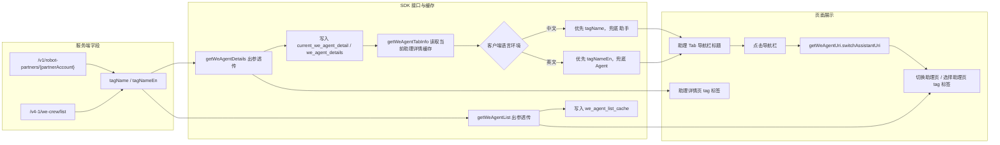
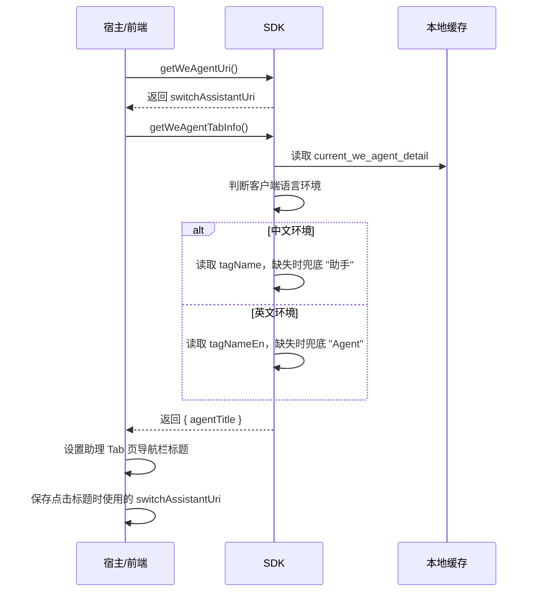
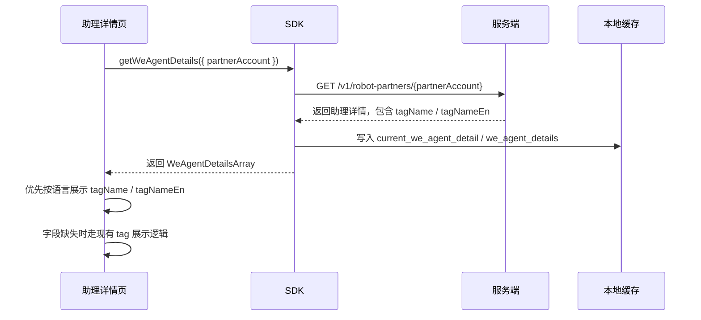
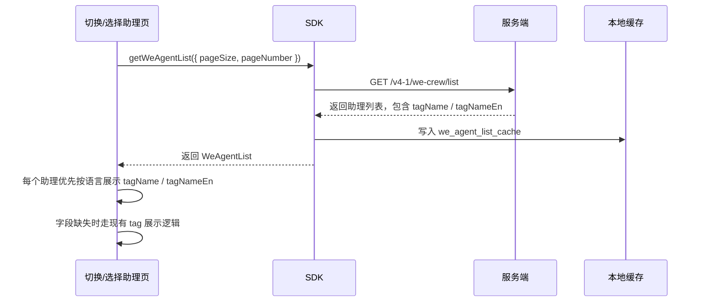
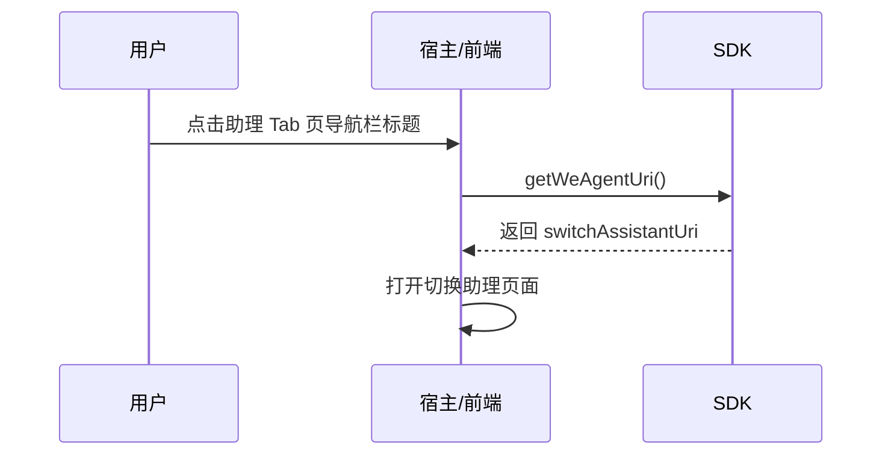
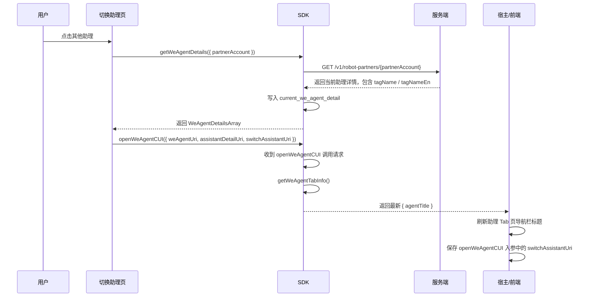
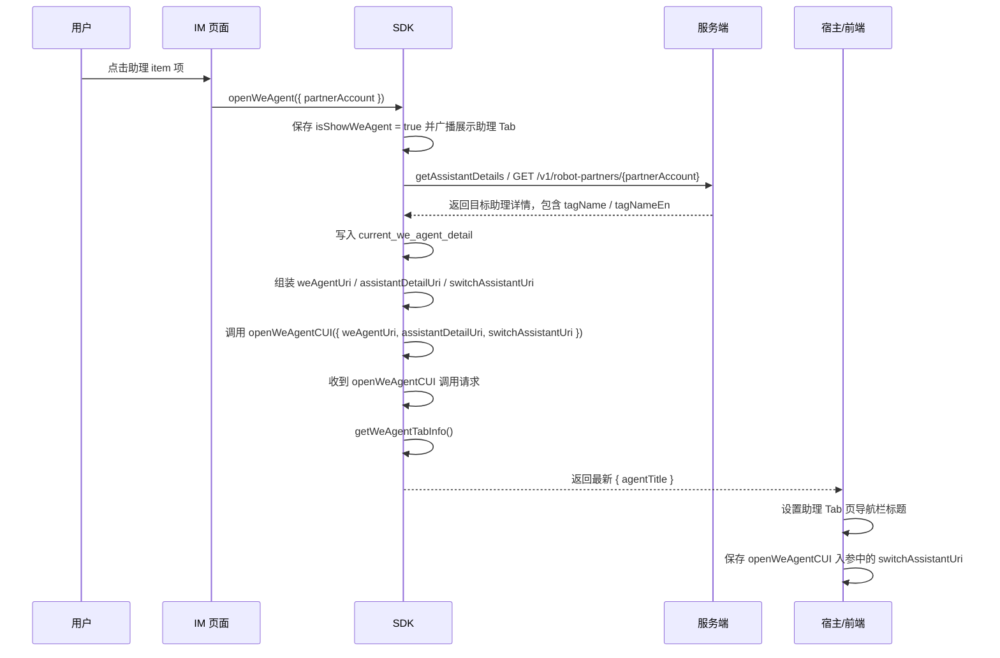

# `助理 Tab 业务助理标签名称展示技术方案`

- 方案日期：`2026-06-16`
- 目标工程：`skillSDK`、`ai-chat-viewer`
- 参考文档：`SkillClientSdkInterfaceV2.md`、`ai-chat-viewer/docs/plans/技术方案模板.md`
- 方案类型：`跨端 SDK 接口扩展与前端展示方案`

## 1. 背景

### 1.1 场景说明

当前助理详情页、切换助理页、选择助理页以及助理 Tab 导航栏已经具备助理信息展示能力，但业务助理的 Tab 标签名称仍依赖历史字段或固定文案，无法由服务端统一下发中文和英文名称。服务端计划在 `GET /v1/robot-partners/{partnerAccount}` 和 `GET /v4-1/we-crew/list` 两个接口中新增 `tagName`、`tagNameEn` 字段，分别表示助理 Tab 中文名称和英文名称。

端侧需要将这两个字段透传到 SDK 相关接口出参，并在助理详情页、切换助理页、选择助理页的 tag 标签中展示。同时助理 Tab 页导航栏需要通过新增 SDK 接口 `getWeAgentTabInfo` 获取当前语言环境下的导航标题。

### 1.2 需求目标

1. `GET /v1/robot-partners/{partnerAccount}` 和 `GET /v4-1/we-crew/list` 新增出参字段 `tagName`、`tagNameEn`，SDK 相关接口同步新增出参字段。
2. 助理详情页通过 `getWeAgentDetails` 获取 `tagName`、`tagNameEn`，用于展示助理 tag 标签名称。
3. 切换助理页、选择助理页通过 `getWeAgentList` 获取 `tagName`、`tagNameEn`，用于展示列表中对应助理的 tag 标签名称。
4. 客户端冷启动时，先调用 `getWeAgentUri` 获取 `switchAssistantUri`，再调用新增 SDK 接口 `getWeAgentTabInfo` 获取 `agentTitle`。
5. 助理 Tab 页导航栏使用 `agentTitle` 设置标题，并使用 `switchAssistantUri` 作为点击标题时打开切换助理页面的地址。
6. 切换助理页面点击其他助理时，先调用 `getWeAgentDetails` 获取并设置当前助理详情缓存，再根据 `小程序JSAPI接口文档.md` 调用 `openWeAgentCUI`；SDK 收到 `openWeAgentCUI` 调用请求后调用 `getWeAgentTabInfo` 获取最新 `agentTitle`，并刷新助理 Tab 页导航栏标题和点击标题时使用的切换助理页面地址。
7. IM 页面点击助理 item 项时，调用 `SkillClientSdkInterfaceV2.md` 中的 `openWeAgent` 打开助理 Tab 页；SDK 在 `openWeAgent` 内完成目标助理详情获取、当前详情缓存写入、URI 组装和 `openWeAgentCUI` 调用后，收到 `openWeAgentCUI` 调用请求时调用 `getWeAgentTabInfo` 获取最新 `agentTitle`，并刷新助理 Tab 页导航栏标题和点击标题时使用的切换助理页面地址。

### 1.3 非目标

1. 不改变 `getWeAgentDetails`、`getWeAgentList`、`getWeAgentUri`、`openWeAgentCUI` 的既有入参语义。
2. 不新增服务端接口，仅扩展已有接口字段。
3. 不改变现有助理 Tab 是否展示、助理打开、助理切换和 CUI 加载流程。
4. 不在端侧计算业务助理标签名称，端侧只做字段选择、透传和兜底。

## 2. 方案图

### 2.1 整体方案图



### 2.2 方案核心

核心方案是：服务端在详情和列表接口统一下发 `tagName`、`tagNameEn`；SDK 在详情、列表、缓存结构中完整透传；新增 `getWeAgentTabInfo` 从当前助理详情缓存读取标签名称，并按客户端语言环境返回 `agentTitle`，异常或字段缺失时使用固定兜底文案。

## 3. 时序图

### 3.1 冷启动获取助理 Tab 导航栏标题和切换助理页地址



### 3.2 详情页展示业务助理 tag 标签



### 3.3 切换助理页和选择助理页展示 tag 标签



### 3.4 点击助理 Tab 导航栏打开切换助理页



### 3.5 切换助理后刷新助理 Tab 导航栏标题



### 3.6 IM 页面点击助理 item 打开助理 Tab 并刷新标题



## 4. 技术细节

### 4.1 调整点

1. 服务端 `GET /v1/robot-partners/{partnerAccount}` 新增 `tagName`、`tagNameEn` 字段。
2. 服务端 `GET /v4-1/we-crew/list` 新增 `tagName`、`tagNameEn` 字段。
3. SDK `WeAgentDetails` 新增 `tagName`、`tagNameEn` 出参字段，并写入 `current_we_agent_detail`、`we_agent_details`。
4. SDK `WeAgent` / `WeAgentList.content[]` 新增 `tagName`、`tagNameEn` 出参字段，并写入 `we_agent_list_cache`。
5. SDK 新增 `getWeAgentTabInfo` 接口，返回 `{ agentTitle }`。
6. 助理详情页、切换助理页、选择助理页展示 tag 标签时优先使用 `tagName`、`tagNameEn`，缺失时走现有展示逻辑。
7. 助理 Tab 页冷启动时通过 `getWeAgentUri` 获取切换助理页面地址，通过 `getWeAgentTabInfo` 获取导航栏标题；SDK 收到 `openWeAgentCUI` 调用请求后需要调用 `getWeAgentTabInfo` 刷新标题，并保存本次入参中的 `switchAssistantUri`。
8. IM 页面点击助理 item 项调用 `openWeAgent` 后，SDK 需要在 `openWeAgent` 内完成目标助理详情获取和 `current_we_agent_detail` 写入，并在后续 `openWeAgentCUI` 调用请求到达时刷新助理 Tab 页导航栏标题和切换助理页面地址。

### 4.2 核心实现方式

#### 4.2.1 服务端字段扩展

`GET /v1/robot-partners/{partnerAccount}` 返回的助理详情对象新增：

| 字段名 | 类型 | 说明 |
|---|---|---|
| `tagName` | `string` | 助理 Tab 中文名称 |
| `tagNameEn` | `string` | 助理 Tab 英文名称 |

`GET /v4-1/we-crew/list` 返回的列表项新增：

| 字段名 | 类型 | 说明 |
|---|---|---|
| `tagName` | `string` | 助理 Tab 中文名称 |
| `tagNameEn` | `string` | 助理 Tab 英文名称 |

#### 4.2.2 SDK 出参与缓存扩展

`WeAgentDetails` 新增字段：

```typescript
type WeAgentDetails = {
  tagName?: string
  tagNameEn?: string
}
```

`WeAgent` 新增字段：

```typescript
type WeAgent = {
  tagName?: string
  tagNameEn?: string
}
```

缓存写入规则：

1. `getWeAgentDetails` 获取详情成功后，将 `tagName`、`tagNameEn` 原样写入 `current_we_agent_detail`。
2. 若 `we_agent_details[partnerAccount]` 需要写入或刷新，则同步写入 `tagName`、`tagNameEn`。
3. `getWeAgentList` 获取列表成功后，将每个列表项的 `tagName`、`tagNameEn` 原样写入 `we_agent_list_cache`。
4. 字段为空、缺失或服务端未返回时，SDK 不主动补值到详情或列表缓存，避免污染服务端真实数据。

#### 4.2.3 getWeAgentTabInfo 接口

新增接口：

```typescript
getWeAgentTabInfo(): Promise<GetWeAgentTabInfoResult>
```

入参：无。

出参：

| 参数名 | 类型 | 说明 |
|---|---|---|
| `agentTitle` | `string` | 当前助理 Tab 页导航栏标题 |

返回示例：

```json
{
  "agentTitle": "助手"
}
```

实现规则：

1. 接口读取按 `userId` 隔离的 `current_we_agent_detail` 缓存。
2. 判断当前客户端语言环境：
   - 中文环境：读取 `current_we_agent_detail.tagName`；
   - 英文环境：读取 `current_we_agent_detail.tagNameEn`。
3. 中文环境下，若 `tagName` 为空、缺失或读取异常，返回固定值 `"助手"`。
4. 英文环境下，若 `tagNameEn` 为空、缺失或读取异常，返回固定值 `"Agent"`。
5. 接口必须使用 `try/catch` 包裹缓存读取、语言判断和字段选择逻辑：

```typescript
async function getWeAgentTabInfo(): Promise<GetWeAgentTabInfoResult> {
  const isChinese = getClientLanguage() === 'zh'
  const fallbackTitle = isChinese ? '助手' : 'Agent'

  try {
    const detail = await readCurrentWeAgentDetail()
    const title = isChinese ? detail?.tagName : detail?.tagNameEn
    return {
      agentTitle: title || fallbackTitle,
    }
  } catch (error) {
    return {
      agentTitle: fallbackTitle,
    }
  }
}
```

6. `getWeAgentTabInfo` 只读取本地当前助理详情缓存，不发起服务端请求，不修改缓存。

#### 4.2.4 页面展示规则

1. 助理详情页展示 tag 标签：
   - 中文环境优先展示 `tagName`；
   - 英文环境优先展示 `tagNameEn`；
   - 对应字段缺失时走目前已有的 tag 展示逻辑。
2. 切换助理页、选择助理页展示 tag 标签：
   - 对每个列表项按当前语言优先展示 `tagName` 或 `tagNameEn`；
   - 对应字段缺失时走目前已有的 tag 展示逻辑。
3. 助理 Tab 页导航栏标题：
   - 冷启动时先调用 `getWeAgentUri` 获取 `switchAssistantUri`；
   - 冷启动时再调用 `getWeAgentTabInfo` 获取 `agentTitle`；
   - 切换助理页点击其他助理时，先调用 `getWeAgentDetails({ partnerAccount })` 获取当前助理详情，并由 SDK 写入 `current_we_agent_detail`；
   - 切换助理页根据 `小程序JSAPI接口文档.md` 调用 `openWeAgentCUI({ weAgentUri, assistantDetailUri, switchAssistantUri })`；
   - SDK 收到 `openWeAgentCUI` 调用请求后调用 `getWeAgentTabInfo`；
   - 返回 `agentTitle` 后设置导航栏标题；
   - 保存 `openWeAgentCUI` 入参中的 `switchAssistantUri`，作为点击助理 Tab 页导航栏标题时打开切换助理页面的地址。
4. 点击助理 Tab 页导航栏标题时，优先使用冷启动阶段保存的 `switchAssistantUri` 打开切换助理页面；若本地未保存或为空，再调用 `getWeAgentUri` 重新获取。
5. IM 页面点击助理 item 项打开助理 Tab：
   - IM 页面调用 `openWeAgent({ partnerAccount })`；
   - SDK 按 `SkillClientSdkInterfaceV2.md` 中 `openWeAgent` 逻辑获取目标助理详情并写入 `current_we_agent_detail`；
   - SDK 组装 `weAgentUri`、`assistantDetailUri`、`switchAssistantUri` 并调用 `openWeAgentCUI`；
   - SDK 收到 `openWeAgentCUI` 调用请求后调用 `getWeAgentTabInfo`；
   - 返回 `agentTitle` 后设置助理 Tab 页导航栏标题，并保存本次 `switchAssistantUri`。

### 4.3 兼容与边界

1. 助理详情页、切换助理页、选择助理页展示 tag 标签时，优先取 `tagName`、`tagNameEn`；取不到时走目前已有的 tag 展示逻辑。
2. 低版本 WeLink 升级到新版本 WeLink 时，旧版 `current_we_agent_detail` 缓存没有 `tagName`、`tagNameEn`，调用 `getWeAgentTabInfo` 将返回兜底标题：中文环境 `"助手"`，英文环境 `"Agent"`。
3. 服务端灰度期间只有部分助理返回 `tagName`、`tagNameEn` 时，已返回字段的助理展示新标签，未返回字段的助理走旧逻辑或兜底。
4. 语言环境读取失败时，SDK 默认按中文环境处理，返回 `"助手"`。
5. `tagName` 或 `tagNameEn` 为空字符串时，按缺失处理。
6. `getWeAgentTabInfo` 不请求服务端，因此不会因为旧缓存缺字段阻塞助理 Tab 首屏。
7. 切换助理时如果 `getWeAgentDetails` 未成功写入 `current_we_agent_detail`，则 SDK 在收到 `openWeAgentCUI` 后调用 `getWeAgentTabInfo` 仍可能读取旧缓存或返回兜底标题；页面应以 `getWeAgentDetails` 成功和 `openWeAgentCUI` 调用成功作为刷新标题的前置条件。

### 4.4 相关接口联动

1. `getWeAgentDetails`：新增 `WeAgentDetails.tagName`、`WeAgentDetails.tagNameEn`，用于详情页 tag 标签展示，并写入当前助理详情缓存。
2. `getAssistantDetails`：返回对象字段与 `WeAgentDetails` 保持一致，缓存刷新时同步保留 `tagName`、`tagNameEn`。
3. `getWeAgentList`：新增 `WeAgent.tagName`、`WeAgent.tagNameEn`，用于切换助理页、选择助理页 tag 标签展示。
4. `getWeAgentUri`：继续返回 `switchAssistantUri`，供点击助理 Tab 页导航栏标题时打开切换助理页面。
5. `openWeAgent`：IM 页面点击助理 item 项时调用；SDK 获取目标助理详情、写入 `current_we_agent_detail`、组装 URI，并调用 `openWeAgentCUI` 打开助理 Tab 页和 CUI。
6. `openWeAgentCUI`：切换助理页或 `openWeAgent` 内部按 `小程序JSAPI接口文档.md` 传入 `weAgentUri`、`assistantDetailUri`、`switchAssistantUri`；SDK 收到调用请求后触发 `getWeAgentTabInfo` 获取最新 `agentTitle`，并将 `switchAssistantUri` 作为助理 Tab 标题点击时的切换助理页面地址。
7. `getWeAgentTabInfo`：新增 SDK 本地接口，只读 `current_we_agent_detail` 并返回当前语言环境下的 `agentTitle`。

### 4.5 文档需要同步修改的内容

1. `SkillClientSdkInterfaceV2.md`：补充 `tagName`、`tagNameEn` 字段定义，新增 `getWeAgentTabInfo` 接口定义与兜底规则。
2. Android / iOS / HarmonyOS SDK 接口说明：同步 `WeAgentDetails`、`WeAgent`、`GetWeAgentTabInfoResult` 数据结构。
3. `ai-chat-viewer` 相关文档：补充助理详情页、切换助理页、选择助理页 tag 标签展示规则，以及助理 Tab 页导航栏标题刷新规则。

## 5. 性能

1. `tagName`、`tagNameEn` 为已有接口新增字段，不新增网络请求。
2. `getWeAgentTabInfo` 只读取本地 `current_we_agent_detail` 缓存，不请求服务端，对冷启动首屏影响可控。
3. SDK 收到 `openWeAgentCUI` 调用请求后新增一次本地接口调用，用于读取标题，不增加服务端压力。
4. 列表页展示 tag 标签只消费 `getWeAgentList` 已返回字段，不对每个助理额外请求详情。

## 6. 功耗

1. 不新增轮询。
2. 不新增长连接或后台任务。
3. 不新增高频刷新。
4. `getWeAgentTabInfo` 为本地缓存读取，功耗影响可忽略。

## 7. 埋码

1. `we_agent_tab_info_get`
   - 说明：记录 `getWeAgentTabInfo` 调用结果，建议包含 `success`、`language`、`fallbackUsed`、`hasTagName`、`hasTagNameEn`。
2. `we_agent_tag_label_exposure`
   - 说明：记录助理详情页、切换助理页、选择助理页 tag 标签曝光，建议包含 `page`、`partnerAccount`、`language`、`source(tagName/tagNameEn/legacy)`。
3. `we_agent_tab_title_update`
   - 说明：记录助理 Tab 页导航栏标题刷新，建议包含 `trigger(coldStart/switchAgent)`、`agentTitle`、`fallbackUsed`。

## 8. 影响范围

### 8.1 直接影响

1. Android SDK、iOS SDK、HarmonyOS SDK 的 `getWeAgentDetails`、`getAssistantDetails`、`getWeAgentList` 出参结构。
2. Android SDK、iOS SDK、HarmonyOS SDK 新增 `getWeAgentTabInfo` 本地接口。
3. 助理详情页、切换助理页、选择助理页 tag 标签展示。
4. 助理 Tab 页导航栏标题展示与刷新。

### 8.2 间接影响

1. `current_we_agent_detail`、`we_agent_details`、`we_agent_list_cache` 中的助理对象会新增可选字段。
2. 旧缓存升级场景下，助理 Tab 导航栏标题可能先展示兜底值，待后续详情缓存刷新后再展示服务端下发名称。
3. 多语言切换后，需要重新调用 `getWeAgentTabInfo` 或重新进入页面，才能按最新语言环境刷新标题。

### 8.3 不影响

1. 不影响助理 Tab 是否展示逻辑。
2. 不影响助理打开、切换、激活页兜底和 CUI URI 组装逻辑。
3. 不影响未读小红点展示逻辑。
4. 不影响助理详情更新和删除同步广播逻辑。

## 9. 测试范围

### 9.1 功能测试

1. `GET /v1/robot-partners/{partnerAccount}` 返回 `tagName`、`tagNameEn` 时，`getWeAgentDetails` 出参包含对应字段，并写入 `current_we_agent_detail`。
2. 助理详情页中文环境优先展示 `tagName`，英文环境优先展示 `tagNameEn`。
3. 助理详情页未返回 `tagName` 或 `tagNameEn` 时，校验走现有 tag 展示逻辑。
4. `GET /v4-1/we-crew/list` 返回 `tagName`、`tagNameEn` 时，`getWeAgentList` 出参 `content[]` 包含对应字段，并写入 `we_agent_list_cache`。
5. 切换助理页、选择助理页中文环境优先展示列表项 `tagName`，英文环境优先展示列表项 `tagNameEn`。
6. SDK 冷启动后先调用 `getWeAgentUri` 获取 `switchAssistantUri`，再调用 `getWeAgentTabInfo`，当前详情缓存包含 `tagName` 且语言为中文时，返回 `{ agentTitle: tagName }`，页面设置导航栏标题并保存 `switchAssistantUri`。
7. SDK 冷启动后先调用 `getWeAgentUri` 获取 `switchAssistantUri`，再调用 `getWeAgentTabInfo`，当前详情缓存包含 `tagNameEn` 且语言为英文时，返回 `{ agentTitle: tagNameEn }`，页面设置导航栏标题并保存 `switchAssistantUri`。
8. 当前详情缓存缺少 `tagName` 时，中文环境 `getWeAgentTabInfo` 返回 `{ agentTitle: "助手" }`。
9. 当前详情缓存缺少 `tagNameEn` 时，英文环境 `getWeAgentTabInfo` 返回 `{ agentTitle: "Agent" }`。
10. `getWeAgentTabInfo` 读取缓存或语言环境异常时，catch 中返回对应语言兜底标题。
11. 点击助理 Tab 页导航栏标题时，优先使用冷启动阶段保存的 `switchAssistantUri` 打开切换助理页面；未保存或为空时，调用 `getWeAgentUri` 并使用返回的 `switchAssistantUri` 打开切换助理页面。
12. 切换助理页面点击其他助理后，先调用 `getWeAgentDetails({ partnerAccount })` 获取当前助理详情并写入 `current_we_agent_detail`；再调用 `openWeAgentCUI({ weAgentUri, assistantDetailUri, switchAssistantUri })`；SDK 收到 `openWeAgentCUI` 调用请求后调用 `getWeAgentTabInfo`，刷新助理 Tab 页导航栏标题，并保存 `switchAssistantUri` 作为点击标题时的切换助理页面地址。
13. IM 页面点击助理 item 项后，调用 `openWeAgent({ partnerAccount })`；SDK 获取目标助理详情并写入 `current_we_agent_detail`，组装 URI 并调用 `openWeAgentCUI`；SDK 收到 `openWeAgentCUI` 调用请求后调用 `getWeAgentTabInfo`，设置助理 Tab 页导航栏标题，并保存 `switchAssistantUri` 作为点击标题时的切换助理页面地址。

### 9.2 兼容测试

1. 服务端未返回 `tagName`、`tagNameEn` 时，详情页、切换助理页、选择助理页继续走现有 tag 展示逻辑。
2. 低版本 WeLink 升级到新版本 WeLink，旧 `current_we_agent_detail` 缓存缺少 `tagName`、`tagNameEn` 时，中文环境助理 Tab 导航栏显示 `"助手"`，英文环境显示 `"Agent"`。
3. 服务端只返回 `tagName` 不返回 `tagNameEn` 时，中文环境展示 `tagName`，英文环境走旧逻辑或兜底。
4. 服务端只返回 `tagNameEn` 不返回 `tagName` 时，英文环境展示 `tagNameEn`，中文环境走旧逻辑或兜底。
5. Android、iOS、HarmonyOS 三端 `getWeAgentTabInfo` 出参字段名统一为 `agentTitle`。

### 9.3 文档一致性检查

1. `SkillClientSdkInterfaceV2.md` 中 `WeAgentDetails`、`WeAgent`、`getWeAgentTabInfo` 字段定义与本方案保持一致。
2. Android、iOS、HarmonyOS SDK 文档中的字段名、兜底值、语言判断规则与本方案保持一致。
3. `ai-chat-viewer` 文档中助理详情页、切换助理页、选择助理页、助理 Tab 导航栏展示规则与本方案保持一致。

## 10. 最终建议

建议采用“服务端字段扩展 + SDK 透传缓存 + `getWeAgentTabInfo` 本地兜底 + 页面按语言消费”的方案。该方案不新增服务端请求，不改变现有助理打开和切换链路，只在现有详情、列表和当前助理缓存上扩展字段，并用固定兜底值保证旧缓存和异常场景下的导航栏可用性。后续优先补齐 `SkillClientSdkInterfaceV2.md` 接口定义，再推进三端 SDK 与 `ai-chat-viewer` 页面联调。
