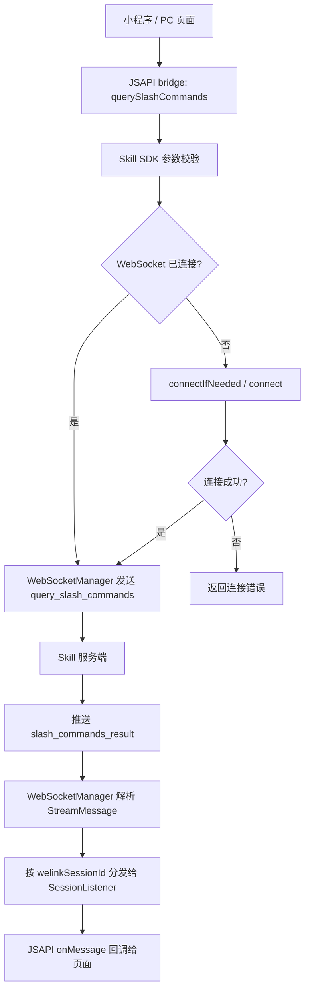
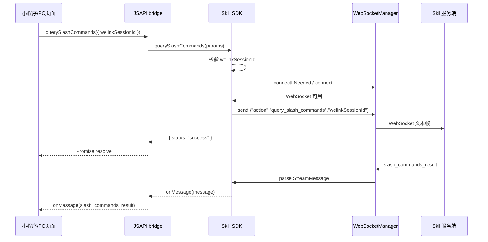
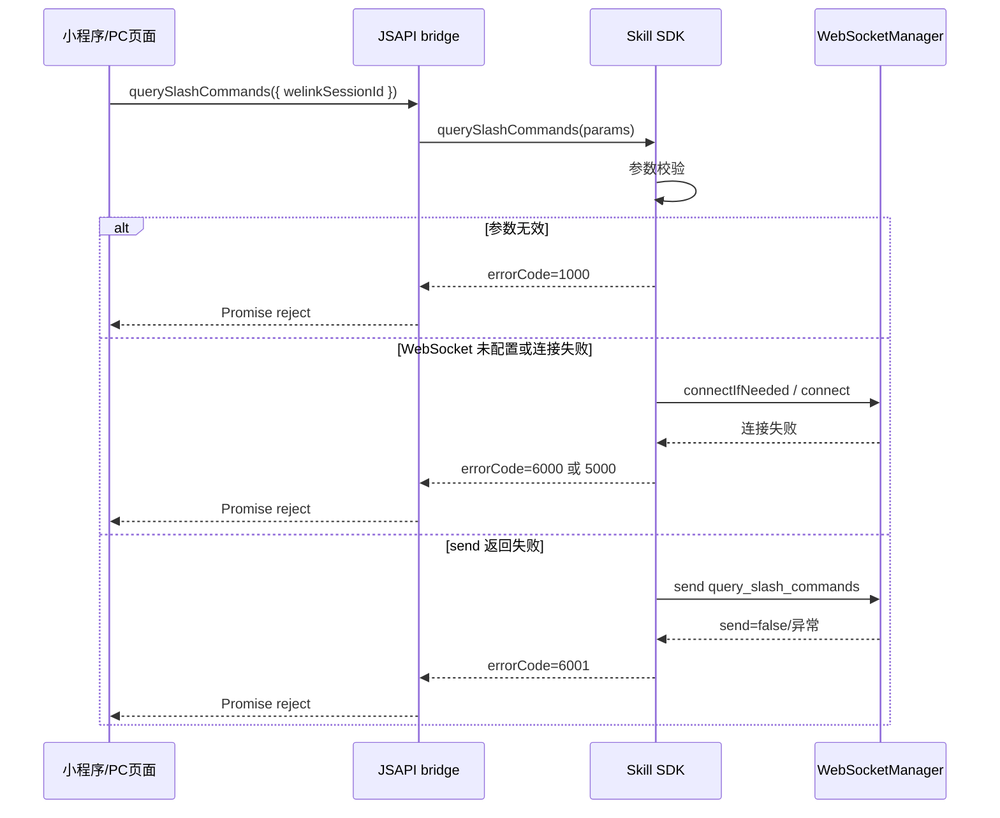

# `Skill SDK Slash Commands WebSocket JSAPI 方案`

- 方案日期：`2026-06-26`
- 目标工程：`skillSDK`
- 参考文档：`AGENTS.md`、`SkillClientSdkInterfaceV1.md`、`小程序JSAPI接口文档.md`、`ai-chat-viewer/docs/plans/2026-06-04-slash-command-suggestion-plan.md`
- 方案类型：`SDK/API 变更 / JSAPI bridge 能力 / WebSocket 指令与事件扩展`

## 1. 背景

### 1.1 场景说明

当前 `ai-chat-viewer` 已有 slash command 联想相关前端设计与实现痕迹，但已有方案基于 `HWH5.fetch` 请求 HTTP 接口获取命令列表。新的需求是：Skill SDK 向 JSAPI bridge 提供一个查询 slash commands 的方法，该方法不是普通 REST 接口，而是通过既有 WebSocket 长连接发送命令：

```json
{
  "action": "query_slash_commands",
  "welinkSessionId": "{string}"
}
```

服务端收到命令后，通过 WebSocket 新增 `slash_commands_result` 事件，将当前会话可用的 slash 命令列表推送给端侧。现有三端 SDK 中，Android 与 iOS 已有 `WebSocketManager`，并且已经存在通过 WebSocket 主动发送 `resume` 指令的先例；HarmonyOS 也有 `WebSocketManager.ets` 与统一 `StreamMessage` 类型。因此，该能力可以复用现有长连接、会话监听与 `StreamMessage` 分发通道，不需要新增 HTTP Client 或独立 WebSocket。

### 1.2 需求目标

1. SDK 新增面向 JSAPI bridge 的查询方法，调用后通过 WebSocket 发送 `query_slash_commands` 指令。
2. 请求参数只要求 `welinkSessionId`，由 SDK 负责连接可用性、参数校验与发送失败处理。
3. 服务端通过 `slash_commands_result` 事件推送 slash 命令列表，端侧通过现有 session listener 或 JSAPI 回调接收。
4. `slash_commands_result` 事件纳入 `StreamMessage` 协议扩展，至少包含 `slashCommands` 与 `welinkSessionId` 字段。
5. 保持 Android、iOS、HarmonyOS 公共 API 语义一致，同时符合各平台异步风格。
6. 文档先明确推荐方案、备选方案、边界与测试范围；本阶段不实施源码变更。

### 1.3 非目标

1. 不在本阶段修改 Android、iOS、HarmonyOS 源码。
2. 不新增 REST API，也不复用此前 `/api/v1/slash-commands/query` 的 `HWH5.fetch` 方案作为推荐路径。
3. 不在 SDK 内部做 slash command 列表缓存、过滤、排序、展示或 token 化输入。
4. 不改变 `sendMessage`、`registerSessionListener`、消息历史查询等既有接口语义。
5. 不定义服务端 slash command 的权限、灰度、配置后台与多语言策略。

## 2. 方案图

### 2.1 整体方案图



### 2.2 方案核心

推荐方案是在各端 `WebSocketManager` 中补充通用的 WebSocket JSON 指令发送能力，并在 SDK 对外层新增 `querySlashCommands` 方法；该方法只负责发送查询命令，查询结果仍通过现有 `registerSessionListener` 的 `onMessage(StreamMessage)` 接收，避免为一次请求型 WebSocket 指令新增第二套回调通道。

## 3. 时序图

### 3.1 `查询 slash commands 成功`



### 3.2 `连接或发送失败`



## 4. 技术细节

### 4.1 调整点

1. JSAPI 文档新增 `querySlashCommands`：
   - 移动端：`window.HWH5EXT.querySlashCommands(params)`
   - PC 端：`window.Pedestal.callMethod('method://agentSkills/handleSdk', { funName: 'querySlashCommands', params })`
   - 入参：`welinkSessionId: string`
   - 返回：建议为 `{ status: "success" }`，只表示查询指令已发送成功，不代表已拿到命令列表。
2. SDK 公共接口文档新增 `querySlashCommands(params)`，三端方法名保持一致。
3. `WebSocketManager` 增加发送指令方法：
   - 推荐内部通用方法：`sendCommand(action, payload)` 或平台等价实现。
   - 推荐业务方法：`sendQuerySlashCommands(welinkSessionId)`，向服务端发送固定 action。
4. `StreamMessage` 协议新增 `slash_commands_result` 事件类型。
5. `StreamMessage` 类型新增 slash command 相关字段：
   - `slashCommands: SlashCommand[] | null`
   - `SlashCommand.command: string`
   - `SlashCommand.description: string`
6. 事件分发沿用现有 `welinkSessionId` 路由；页面需先注册或保持 `registerSessionListener`，再调用 `querySlashCommands`。

### 4.2 核心实现方式

推荐采用“发送指令 Promise + 结果走 session listener”的双阶段语义。

第一阶段，页面调用 `querySlashCommands` 后，SDK 校验参数并确保 WebSocket 可用，然后发送：

```json
{
  "action": "query_slash_commands",
  "welinkSessionId": "{string}"
}
```

若发送成功，方法立即 resolve：

```json
{
  "status": "success"
}
```

第二阶段，服务端异步推送：

```json
{
  "type": "slash_commands_result",
  "seq": 135,
  "emittedAt": "2026-06-15T10:30:00Z",
  "messageId": "{string}",
  "messageSeq": 6,
  "role": "assistant",
  "sourceMessageId": "{string}",
  "partId": "{string}",
  "partSeq": 4,
  "status": "running",
  "sessionID": "{string}",
  "slashCommands": [
    {
      "command": "/new",
      "description": "新建会话"
    },
    {
      "command": "/delete",
      "description": "删除"
    }
  ],
  "welinkSessionId": "{string}"
}
```

SDK 解析为 `StreamMessage` 后，按 `welinkSessionId` 分发给当前会话监听器。页面通过 `message.type === "slash_commands_result"` 判断并读取 `message.slashCommands`。

#### 4.2.1 可行方案对比

| 方案 | 描述 | 优点 | 缺点 | 结论 |
|------|------|------|------|------|
| 方案 A：发送指令，结果走 `registerSessionListener` | `querySlashCommands` 只保证 WebSocket 指令发送成功，结果由 `slash_commands_result` 事件异步返回 | 复用现有事件流；三端改动小；符合 WebSocket 推送模型；不需要 SDK 维护 requestId 和超时匹配 | 调用方需要先注册 listener；Promise resolve 不代表已经拿到列表 | 推荐 |
| 方案 B：`querySlashCommands` Promise 等待结果 | SDK 发送指令后内部等待下一条匹配的 `slash_commands_result`，再 resolve 命令列表 | JSAPI 调用体验接近普通查询接口；页面接入简单 | 需要 requestId 或严格事件匹配；要处理超时、并发、取消、重复事件；会和现有 listener 分发形成双通道 | 暂不推荐 |
| 方案 C：继续使用 REST / `HWH5.fetch` | 页面或 bridge 调 HTTP 接口查询命令列表 | 实现简单；请求-响应语义清晰 | 不符合本次“通过 WebSocket 发送命令”的需求；与已有长连接能力割裂 | 不采用 |

### 4.3 兼容与边界

1. 兼容既有监听链路：`slash_commands_result` 是新增事件，不影响已有 `text.delta`、`tool.update`、`question` 等事件处理。
2. 事件不应进入消息历史聚合：该事件属于查询结果/辅助 UI 数据，不建议作为 `SessionMessage` 持久化展示。
3. `sessionID` 与 `welinkSessionId` 字段需统一口径：现有 Android 解析兼容 `sessionId`，但示例为 `sessionID`。推荐服务端固定返回 `welinkSessionId`；`sessionID` 仅作为服务端内部或兼容字段，不作为 SDK 分发主键。
4. 若页面未注册 `registerSessionListener` 就调用查询方法，SDK 可以成功发送指令，但页面可能收不到结果。文档应明确建议先注册监听器。
5. 若 WebSocket 未连接，SDK 应尝试连接后发送；若连接失败，则 `querySlashCommands` reject。
6. 若 WebSocket 当前正在重连，推荐将发送动作等待连接回调后执行，或返回连接不可用错误，具体按现有平台 WebSocket 连接模型选择。
7. `slashCommands` 为空数组表示当前会话无可用命令；字段缺失或非数组按协议异常处理，页面侧建议降级为不展示面板。
8. 重复调用不由 SDK 去重；是否限流、缓存或复用 in-flight 由页面或业务层处理。

### 4.4 相关接口联动

1. `registerSessionListener`：新增事件通过该接口回调，文档需补充 `slash_commands_result`。
2. `unregisterSessionListener`：移除监听后不再收到查询结果。
3. `executeSkill` / `sendMessage`：不需要修改，但页面通常在已有会话中调用查询方法。
4. `getSessionMessage` / `getSessionMessageHistory`：不应返回 `slash_commands_result`。
5. `stopSkill` / `closeSkill`：会话关闭后调用 `querySlashCommands` 应返回会话不可用或发送失败错误，具体错误码待服务端和 SDK 统一。

### 4.5 文档需要同步修改的内容

1. `SkillClientSdkInterfaceV1.md`：新增 SDK 接口、事件类型、`StreamMessage.slashCommands` 字段。
2. `小程序JSAPI接口文档.md`：接口列表新增 `querySlashCommands`，补充移动端和 PC 调用方式。
3. `SkillClientSdkInterfaceV4_V5_ChangeLog.md`：如本能力进入 V5 或后续版本，需记录新增接口与事件。
4. `Skill_SDK_接口文档.md`：若仍作为 HarmonyOS 或总览文档使用，需同步接口和数据结构。
5. `ai-chat-viewer/docs/plans/2026-06-04-slash-command-suggestion-plan.md`：若前端改用 SDK bridge WebSocket 方案，需要更新此前 `HWH5.fetch` 的非目标和数据获取方案。

## 5. 性能

新增一次 WebSocket 指令发送和一次服务端推送，不新增 HTTP 请求，不新增额外长连接。命令列表大小通常较小，对传输与解析影响有限。高频输入 `/` 时不建议 SDK 层自动查询，应由页面侧做触发控制、缓存或节流，避免反复向服务端发送 `query_slash_commands`。

## 6. 功耗

复用现有 WebSocket 长连接，不新增轮询和后台任务。若页面在输入过程中频繁触发查询，会增加无线网络唤醒与服务端推送次数，因此建议页面在会话维度缓存查询结果，或只在首次进入 slash 触发态时查询。

## 7. 埋码

1. `query_slash_commands_send`
   - 说明：SDK 成功发送 `query_slash_commands` 指令时上报，可包含 `welinkSessionId` 脱敏标识、平台、耗时。
2. `query_slash_commands_error`
   - 说明：参数错误、WebSocket 未配置、连接失败、发送失败时上报错误码与平台。
3. `slash_commands_result_receive`
   - 说明：收到 `slash_commands_result` 事件时上报命令数量与事件状态。

> 埋码是否放在 SDK 层或页面层待确认。若现有 SDK 不承担业务埋码，推荐只在页面层埋点，SDK 保持纯能力封装。

## 8. 影响范围

### 8.1 直接影响

1. Android：`WebSocketManager.java`、`StreamMessage.java`、`SkillSDK.java` 和公开 callback/model 文档。
2. iOS：`WLAgentSkillsWebSocketManager`、`WLAgentSkillsStreamMessage`、`WLAgentSkillsSDK` 公开方法与头文件。
3. HarmonyOS：`WebSocketManager.ets`、`types/index.ets`、`SkillSDK.ets` 公开方法。
4. JSAPI bridge：移动端 `HWH5EXT` 与 PC `Pedestal.callMethod` 的方法映射。
5. 前端页面：slash command 面板需要监听 `slash_commands_result` 并读取 `slashCommands`。

### 8.2 间接影响

1. 服务端 WebSocket 协议需要支持 `query_slash_commands` action。
2. 服务端事件字段命名需要和 SDK 解析主键对齐，尤其是 `welinkSessionId`。
3. 原前端 `HWH5.fetch` slash list 方案需要收敛或降级为兼容方案。

### 8.3 不影响

1. 不影响普通 REST 接口路径、Retrofit/HTTPClient 接口定义。
2. 不影响消息发送、停止生成、权限回复、发送到 IM 等既有业务接口。
3. 不影响 WebSocket URL、鉴权 header、重连策略等连接配置。
4. 不影响消息历史查询返回结构。

## 9. 测试范围

### 9.1 功能测试

1. 已连接 WebSocket 时调用 `querySlashCommands`，确认发送 payload 为 `{"action":"query_slash_commands","welinkSessionId":"..."}`。
2. 未连接 WebSocket 时调用，确认 SDK 先连接再发送，成功后 resolve。
3. 服务端推送 `slash_commands_result`，确认 session listener 收到完整 `StreamMessage`。
4. `slashCommands` 为空数组时，页面不展示命令面板但不报错。
5. 缺少 `welinkSessionId` 时返回参数错误。
6. WebSocket 未配置、连接失败、send 失败时返回明确错误。

### 9.2 兼容测试

1. Android、iOS、HarmonyOS 方法名、入参、返回语义一致。
2. 移动端 `HWH5EXT` 与 PC `Pedestal.callMethod` 调用方式一致。
3. 旧版本 SDK 收到未知 `slash_commands_result` 时不会崩溃；若模型未显式字段，至少可通过 raw 或扩展字段安全忽略。
4. 现有事件 `text.delta`、`question`、`permission.ask` 等仍正常分发。
5. `unregisterSessionListener` 后不再收到查询结果。

### 9.3 文档一致性检查

1. SDK 接口文档、JSAPI 文档、三端公开类型文档中的方法名统一为 `querySlashCommands`。
2. WebSocket action 统一为 `query_slash_commands`。
3. 事件类型统一为 `slash_commands_result`。
4. 会话字段统一使用 `welinkSessionId`。
5. 命令列表字段统一使用 `slashCommands`，元素字段为 `command` 和 `description`。

## 10. 最终建议

最终结论：推荐采用“`querySlashCommands` 只负责发送 WebSocket 查询指令，`slash_commands_result` 仍通过 `registerSessionListener` 返回”的方案。该方案复用现有 WebSocketManager、连接管理、会话分发和 JSAPI 回调模型，三端改动较小，也避免为 WebSocket 异步推送额外设计一套 request-response 超时匹配机制。

后续动作建议：

1. 先确认服务端事件字段是否可以固定返回 `welinkSessionId`，并避免只返回 `sessionID`。
2. 将本方案同步到 `SkillClientSdkInterfaceV1.md` 与 `小程序JSAPI接口文档.md`，作为正式接口契约。
3. 三端分别补充 `sendQuerySlashCommands` 与 `StreamMessage.slashCommands` 类型。
4. 页面层调整 slash list 获取路径，从此前 `HWH5.fetch` 方案迁移到 `querySlashCommands` + `registerSessionListener`。
