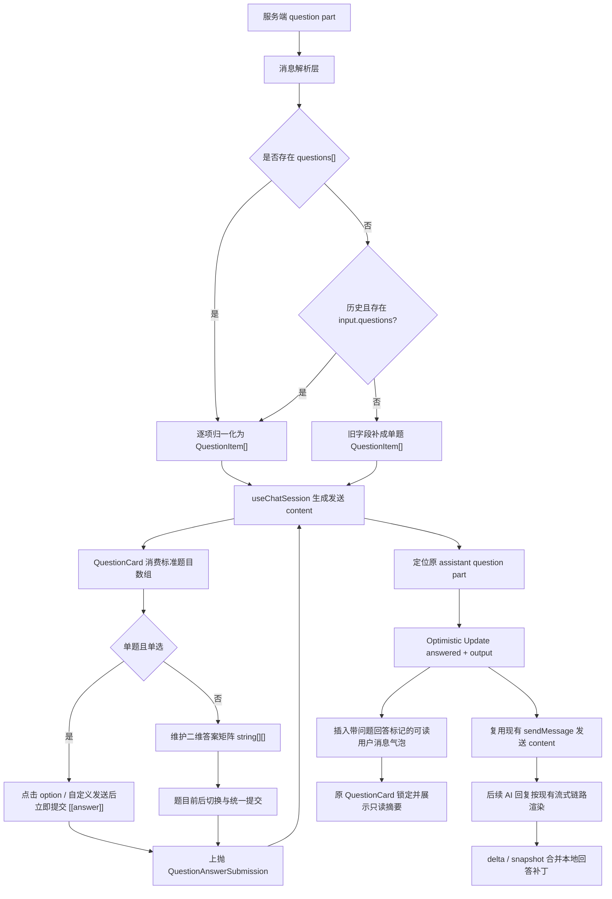
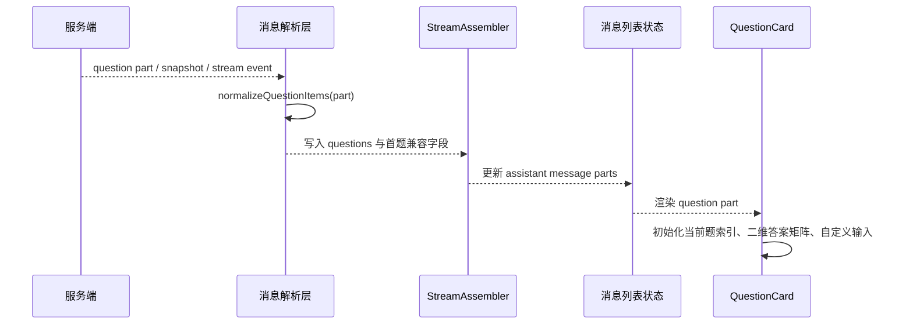
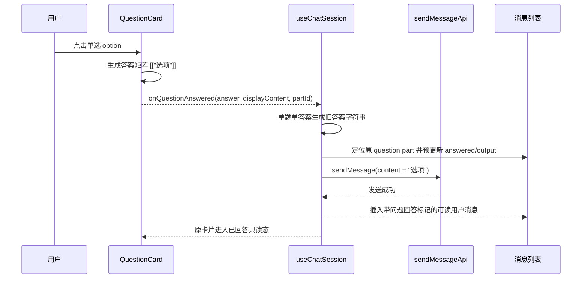
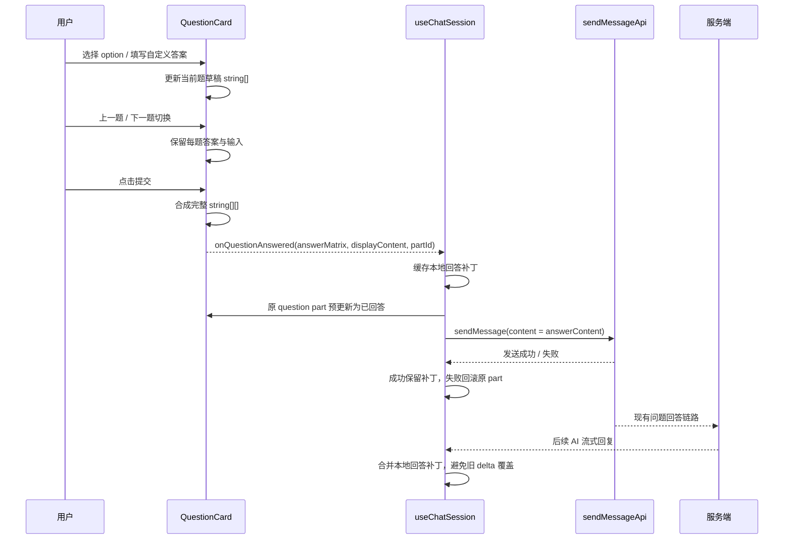

# `QuestionCard 多题与多选回答技术方案`

- 方案日期：`2026-06-12`
- 目标工程：`ai-chat-viewer`
- 方案类型：`功能增强 / 协议兼容 / UI 交互改造`
- 关联模块：`QuestionCard`、消息解析、流式组装、用户消息发送链路、Mock 调试场景

## 1. 背景

### 1.1 场景说明

当前 `QuestionCard` 主要按单题、单选的问答卡片处理：服务端下发一个 `question`、一组 `options`，用户点击答案后直接提交。新的服务端协议中，`part` 数据可能包含 `questions` 字段，该字段为问题数组，每个问题包含 `header`、`question`、`options`、`multiSelect`。其中 `multiSelect: true` 表示当前问题支持多选，`false` 表示单选。

同时，每个问题仍需要保留自定义答案输入能力。内部仍把所有题目的回答按题目顺序表示成二维数组；提交到服务端时，为兼容旧链路，单题单答案发送答案字符串，其他场景通过 `JSON.stringify` 转成二维数组 JSON 字符串作为现有 `sendMessage` 的 `content`。

问题回答提交后还存在两类状态一致性风险：第一，`QuestionCard` 组件本地设置 `answered` 后，如果父级消息列表被后续 delta / streaming / snapshot 以旧 part 覆盖，卡片会短暂回到未回答态，出现闪烁或重置；第二，多题场景中父级 part 引用变化可能触发组件重新初始化，导致 `currentQuestionIndex` 被重置为 0。方案需要把回答完成态提升到消息 part 层做本地预更新，并让组件只在真正切换卡片或题目结构变化时重置草稿状态。

### 1.2 需求目标

1. 支持服务端在同一个 question part 中下发多道问题。
2. 支持单题多选，多选题使用复选框视觉，单选题保持现有单选圆点视觉。
3. 支持每道题填写自定义答案，并与该题已选 option 合并到同一个内层数组。
4. 当只有一道题且该题为单选时，保持点击 option 立即提交的旧交互。
5. 当存在多道题或当前题为多选时，用户选择后点击统一提交按钮发送答案。
6. 多题场景支持上一题、下一题切换，切换后保留已选答案和自定义输入。
7. 兼容没有返回 `questions` 字段的旧数据，继续按旧单题单选逻辑处理。
8. 提交答案时兼容旧单答案链路：单题且只有一个答案时发送答案字符串；其他场景转换为 `string[][]` 的 JSON 字符串，例如 `[["A","B"],[]]`。
9. 用户消息气泡展示可读摘要，不直接展示原始 JSON 字符串。
10. 回答完成后的原问题卡片展示只读答案摘要，并保持后续 AI 回复作为独立助手消息继续渲染。
11. 提交回答时对原 assistant question part 做本地 Optimistic Update，立即写入 `answered` 与 `output`，避免后续刷新造成闪烁或回退。
12. 多题交互中只有卡片身份或题目结构实质变化时才重置当前题索引，普通 answered / output / status 更新不得把用户切回第一题。
13. 用户消息解析必须有 schema 标记或上下文依据，避免把普通文本中的二维数组 JSON 误展示为问题回答摘要。

### 1.3 非目标

1. 本版本不新增请求字段，不改变 `sendMessage` 接口地址、请求体结构、`toolCallId`、`questionId`、`subagentSessionId` 的传递方式。
2. 本版本不新增测试文件，也不修改现有测试用例覆盖该功能。
3. 本版本不支持除 `multiSelect` 之外的多选字段拼写，例如 `multisSelect`。
4. 本版本不改变普通文本聊天消息的发送和展示逻辑。
5. 本版本不改变 permission、tool、error 等其他消息 part 的渲染规则。

## 2. 方案图

### 2.1 整体方案图



### 2.2 方案核心

将服务端 question 数据统一收口到归一化工具，UI 层只消费标准 `QuestionItem[]`，回答状态统一维护为 `string[][]`。发送链路保持现有接口不变，问题回答场景在发送前根据答案矩阵选择最终 `content`：单题单答案复用旧链路发送答案字符串，其他场景发送二维答案矩阵 JSON 字符串，并额外保留界面可读文案用于本地消息展示。

回答提交成功态需要由 `useChatSession` 写回原 assistant question part：`part.output` 保存最终发送给服务端的 `content`，`part.answered` 立即置为 `true`；本地用户消息使用 `displayContent` 和问题回答标记展示可读摘要。后续实时 delta、streaming snapshot 或 completed/error 事件到达时，需要合并这份本地回答补丁，不能用旧 part 覆盖已回答态。

## 3. 时序图

### 3.1 question part 解析与渲染



### 3.2 单题单选立即提交



### 3.3 多题或多选统一提交



## 4. 技术细节

### 4.1 调整点

1. 类型层新增 `QuestionItem` 和 `QuestionAnswerMatrix = string[][]`，并将 `QuestionAnswerSubmission.answer` 从单字符串升级为二维答案矩阵。
2. 消息工具层新增 question 归一化、答案矩阵序列化、安全解析、展示摘要格式化能力。
3. 历史解析与实时流式解析统一使用同一套题目归一化规则，但仅历史消息在顶层 `questions` 缺失时允许从 `input.questions` 兜底；实时、snapshot、发送返回消息不从 `input` 恢复 question。
4. `QuestionCard` 状态从单答案模型升级为 `currentQuestionIndex`、`selectedAnswers`、`customInputs`、`answered`、`submitting`。
5. `QuestionAnswerSubmission` 除答案矩阵外携带 `partId`、`messageId`、`toolCallId`、`questionId`、`subagentSessionId`，便于上层定位原 assistant question part。
6. `useChatSession` 在问题回答场景内把答案矩阵转成发送字符串，单题单答案复用旧答案字符串，其他场景使用 JSON 字符串，再复用现有发送接口；同时本地预更新原 question part 的 `answered` 与 `output`。
7. `useChatSession` 维护已回答 question 的本地补丁缓存，后续 delta / streaming / snapshot 刷新时继续合并，避免旧 part 覆盖已回答态。
8. `QuestionCard` 只在卡片身份或题目结构变化时重置 `currentQuestionIndex`，普通 props 引用变化不得重置当前题。
9. `MessageBubble` 只在用户消息带问题回答标记，或能通过上下文确认是 question 回答时，才把 `string[][]` JSON 字符串展示为可读摘要。
10. 本地 Mock 增加多题与多选调试场景，便于手动验证完整链路。

### 4.2 核心实现方式

#### 4.2.1 question 归一化

解析层统一产出 `QuestionItem[]`：

1. 若 `part.questions` 是有效数组，则逐项读取 `header`、`question`、`options`、`multiSelect`。
2. 若没有 `questions`，则用旧协议中的 `header`、`question`、`options` 补成单题。
3. `multiSelect` 只读取正式字段 `multiSelect`，默认值为 `false`。
4. `options` 同时兼容字符串数组和对象数组，最终统一为 `{ label, description? }[]`。
5. question 渲染默认不从 `input` 字段读取题目、选项、多选状态或问题数组；`input` 只允许作为原始 part 字段透传给其他场景。
6. 历史消息存在兼容例外：仅 `sessionMessageToMessage()` 处理的历史 question part，在顶层 `questions` 缺失时，允许读取 `input.questions` 作为题目数组兜底；不读取 `input.header`、`input.question`、`input.options` 或 `input.multiSelect`。
7. 为兼容现有渲染入口，归一化后同步保留首题的旧字段值：`header`、`question`、`options`、`multiSelect`。

#### 4.2.2 答案矩阵

答案统一按题目顺序存储为二维数组：

```ts
type QuestionAnswerMatrix = string[][];
```

示例：

```json
[["功能设计"],["解析","发送链路","其他说明"],[]]
```

含义：

1. 第一道题选择了 `功能设计`。
2. 第二道题选择了两个 option，并填写了一个自定义答案 `其他说明`。
3. 第三道题未回答，保留空数组占位。

历史已回答展示只读取最外层 `part.output`，不读取 `questions[i].output`。当 `part.output` 是 `string[][]` JSON 字符串时，按题目顺序映射到每个问题；当 `part.output` 是普通字符串时，仅作为第一个问题的答案展示。若历史消息顶层缺少 `questions[]`，可先从 `input.questions` 兜底得到题目数组，再按最外层 `part.output` 解析答案。

#### 4.2.3 单题单选

当 `questions.length === 1` 且 `questions[0].multiSelect === false`：

1. option 使用现有单选圆点视觉。
2. 点击 option 后立即提交 `[["选项 label"]]`。
3. 填写自定义答案后点击发送，提交 `[["自定义答案"]]`。
4. 提交成功后卡片锁定并展示只读答案。

#### 4.2.4 多题或多选

当存在多个问题，或任意当前问题为多选题：

1. option 点击只更新当前题草稿，不立即发送。
2. 多选题使用复选框视觉，允许选择多个 option。
3. 多选题的 option 和自定义答案合并到同一个内层数组。
4. 单选题仍使用单选圆点视觉，选择新 option 时替换旧 option。
5. 底部展示上一题、下一题和统一提交按钮。
6. 提交时允许部分题目为空，空题用 `[]` 保留位置。

#### 4.2.5 回答完成后的卡片展示

问题回答成功后，原 `QuestionCard` 不再展示可编辑输入和提交按钮，整体进入只读态：

1. 展示所有题目的题干。
2. 每题展示该题已提交答案。
3. 未回答题目展示“未回答”。
4. 后续 AI 回复仍作为独立 assistant 消息进入消息流，不合并回原问题卡片。

#### 4.2.6 回答提交的 Optimistic Update

`QuestionCard` 点击提交后只负责上抛答案，不直接调用宿主发送接口。`useChatSession.handleQuestionAnswered()` 接收提交数据后需要立即执行以下动作：

1. 生成发送用 `answerContent`：当 `answerMatrix` 形态为 `[["answer"]]` 时返回 `"answer"`，否则返回 `JSON.stringify(answerMatrix)`。
2. 通过 `messageId + partId` 优先定位原 assistant question part；若缺少 `partId`，再用 `toolCallId`、`questionId`、`subagentSessionId` 组合匹配。
3. 将目标 part 本地预更新为：

```ts
{
  ...part,
  answered: true,
  output: answerContent,
  isStreaming: false
}
```

4. 将同一份补丁写入 `answeredQuestionPatchesRef`，补丁 key 优先使用 `partId`，缺失时使用 `toolCallId/questionId/subagentSessionId` 组合。
5. 调用现有 `sendMessageApi`，请求体中 `content` 仍是字符串，值为 `answerContent`。
6. 发送成功后插入用户消息，用户消息展示 `displayContent`，并打上问题回答标记。
7. 发送失败时回滚预更新的原 part，并移除对应补丁，避免界面误显示已回答。

注意：原 question part 的 `output` 必须保存最终发送给服务端的 `answerContent`，不能保存可读摘要。单题单答案时 `answerContent` 是旧链路答案字符串；多题或多选时 `answerContent` 是二维数组 JSON 字符串，`QuestionCard` 后续可按矩阵恢复答案。

#### 4.2.7 后续 delta / snapshot 的回答补丁合并

后续服务端可能继续下发 question delta、streaming snapshot 或 completed/error 事件。为了避免旧 part 覆盖本地已回答态，所有进入消息列表前的 question parts 都需要合并本地补丁：

1. `question` 实时事件经 `StreamAssembler` 产出的 parts，写入消息列表前合并本地补丁。
2. `streaming` 事件中的 `msg.parts` 经 `initializeFromSnapshot()` / `mapRawParts()` 产出后合并本地补丁。
3. `snapshot` 和历史消息恢复时，如果能通过 part identity 命中本地补丁，也应保留 `answered/output`。
4. completed/error 事件若携带服务端 `output`，以服务端 `output` 为准更新补丁；若没有 `output`，继续保留本地 `serializedAnswer`。

不建议直接复用会把整条 message 标记为非流式的通用 part 更新工具来做该补丁，因为同一条 assistant message 里可能还有其他仍在流式中的 part。应使用 question 专用 patch helper，只更新目标 part 字段。

#### 4.2.8 当前题索引重置控制

`QuestionCard` 不能因为 `initialDraftState` 或 `part` 引用变化就无条件执行 `setCurrentQuestionIndex(0)`。组件应通过 ref 缓存上一次渲染的卡片身份和题目结构签名：

1. 卡片身份优先使用 `part.partId`，兜底使用 `messageId + toolCallId + questionId`。
2. 题目结构签名可由 `questions.length`、每题 `question/header`、每题 option label、`multiSelect` 组合生成。
3. 只有卡片身份变化、题目数量变化或题目结构实质变化时，才重置当前题索引和本地草稿。
4. 如果只是 `answered`、`output`、`status` 或父级数组引用变化，不重置 `currentQuestionIndex`。
5. 进入已回答态时允许同步答案矩阵和锁定态，但不需要把索引强制归零，因为只读摘要展示所有题目。

#### 4.2.9 用户消息展示与误解析防护

问题回答用户消息有两个内容形态：

1. 发送给服务端的 `content`：单题单答案为答案字符串，其他场景为二维数组 JSON 字符串。
2. 展示给用户的 `displayContent`：可读答案摘要。

本地插入用户消息时应优先使用 `displayContent` 展示，并在 UI 消息实体上增加问题回答标记，例如 `meta.questionAnswer = true` 或 `meta.kind = 'question_answer'`。`MessageBubble` 只有在存在该标记时，才把原始 `string[][]` JSON 解析为问题回答摘要。

历史消息如果服务端暂时无法持久化该标记，可使用上下文兜底：只有当相邻或关联 assistant question part 的 `output` 与该用户消息 `content` 一致，或能通过 `toolCallId/questionId` 确认关联关系时，才按问题回答展示。否则即使用户普通消息内容是合法的 `[["A"]]`，也必须按普通文本展示。

`formatQuestionAnswerDisplay` 增加单题紧凑展示能力。用户消息气泡和 `displayContent` 可启用紧凑模式：单题答案直接展示 `A` 或 `A、B`，不显示冗余的 `第1题:`；`QuestionCard` 已回答摘要继续保留题干和答案，避免在卡片内部丢失问题上下文。

### 4.3 兼容与边界

1. 没有 `questions` 字段时，按旧单题单选逻辑补齐题目数组。
2. 历史消息存在顶层 `questions[]` 时，答案仍只读取最外层 `part.output`；题目项内即使存在 `output` 也忽略。
3. 历史消息不存在顶层 `questions[]` 但存在 `input.questions` 时，仅历史解析路径使用该题目数组兜底；实时、snapshot、发送返回路径不启用该兜底。
4. `part.output` 若是二维数组 JSON 字符串，则解析为已回答矩阵并按题目顺序展示；若不是 JSON，则按旧单答案字符串兼容为第一题答案，多题场景只展示第一题和该答案。
5. 用户普通聊天内容即使是合法 `string[][]` JSON 字符串，只要没有问题回答标记或上下文关联，也按普通文本展示和复制。
6. 多题提交不强制所有题目必答，未回答题目保留为空数组。
7. 自定义答案去除首尾空白后再进入答案矩阵，空字符串不提交。
8. 服务端返回的 `questions` 中若某一项缺少有效 `question`，该项不应作为可渲染题目进入 UI。
9. 若服务端同时返回旧字段和 `questions` 字段，以 `questions` 作为新协议主数据，旧字段仅作为首题兼容展示字段。
10. 若服务端没有提供 option，仍允许用户通过自定义输入提交答案。
11. 本地 Optimistic Update 失败回滚时，需要恢复提交前的原 part 状态，避免用户误以为答案已提交成功。
12. 本地补丁只作用于 question part，不影响同一条 assistant message 中其他 text、tool、permission、error part。
13. 单题紧凑展示只用于用户消息摘要，不改变 `QuestionCard` 已回答卡片的题干展示。

### 4.4 相关接口联动

1. `sendMessageApi` 请求体保持现状，`content` 仍为字符串。
2. 问题回答场景中，`content` 的字符串内容由答案矩阵决定：`[["answer"]]` 发送 `"answer"`，其他矩阵发送 `JSON.stringify(answerMatrix)`。
3. `partId` 仅用于前端本地定位原 question part，不新增到发送接口请求体；`toolCallId`、`questionId`、`subagentSessionId` 沿用当前问题回答链路透传。
4. 本地插入用户消息时优先使用 `displayContent`，避免界面直接展示 JSON，并给 UI 消息打上问题回答标记。
5. 原 assistant question part 的 `output` 写入最终发送给服务端的 `content`，保证旧单答案和新矩阵答案都能恢复只读卡片。
6. `contentLength` 仍按最终发送到服务端的字符串长度统计。
7. 后续 AI 回复继续通过现有 HWH5EXT / OpenCode 流式消息链路进入，不新增单独回调。

### 4.5 文档需要同步修改的内容

1. `docs/requirements.md`：补充 `questions[]`、`multiSelect`、二维答案矩阵、只读摘要展示规则。
2. `docs/design-decisions.md`：补充归一化边界、`QuestionCard` 只上抛答案、不直接调用发送接口的决策。
3. `docs/weAgentCUI-ai-reply-rendering.md`：补充 question part 在历史、实时、完成态和 Optimistic Update 下的渲染一致性。
4. `docs/weAgentCUI-opencode-cases.md`：补充本地 Mock 触发多题和多选的手动验证用例。
5. 若存在对外协议文档，需要同步说明 `content` 在问题回答场景中仍为字符串：单题单答案是答案字符串，其他场景是二维数组 JSON 字符串；`displayContent` 和问题回答标记属于前端展示层能力。

## 5. 性能

1. 解析层只新增轻量数组归一化和 JSON 安全解析，复杂度与题目数、选项数线性相关。
2. UI 状态由单值升级为二维数组，数据量通常很小，不会显著增加内存占用。
3. 发送链路不新增网络请求，不改变流式连接数量。
4. 用户消息展示前优先检查问题回答标记或上下文关联，只有确认是问题回答时才解析 JSON，减少普通消息的无意义解析和误识别。
5. 多题切换只更新本地 React 状态，不触发额外接口调用。
6. Optimistic Update 只 patch 目标 question part，不重建整条消息列表；补丁缓存按已提交 question 数量增长，规模较小。
7. 对长历史列表的影响较低；如果未来问题数量异常增大，可在消息解析层增加题目数和选项数上限保护。

## 6. 功耗

1. 不新增轮询、定时器、后台任务或额外长连接。
2. 多题切换和多选操作均为用户触发的本地状态更新。
3. 不新增持续动画或高频刷新。
4. 对移动端功耗影响可认为低风险。

## 7. 影响范围

### 7.1 直接影响

1. `QuestionCard` 的状态模型、选项选择、提交按钮、只读展示。
2. question part 的历史解析、实时解析、snapshot 初始化。
3. 问题回答发送链路中的 `content` 内容格式。
4. 用户消息气泡中问题回答内容的展示、复制、发送到 IM。
5. 原 assistant question part 的本地预更新、失败回滚和后续 delta / snapshot 合并策略。
6. 本地 Mock question 场景。

### 7.2 间接影响

1. 后续 AI 回复的消息排序需要继续保持为独立 assistant 消息。
2. 历史会话恢复时，已回答 question 的展示依赖 `part.output` 解析结果。
3. 埋点或日志中若统计 `contentLength`，问题回答场景按最终发送字符串长度统计；旧单答案为答案字符串长度，多题或多选为 JSON 字符串长度。
4. 服务端需同时兼容旧答案字符串和二维数组 JSON 字符串解析。
5. 如果服务端历史消息暂不持久化问题回答标记，前端历史展示需要依赖上下文关联兜底，存在无法识别的历史用户回答会按普通文本展示。

### 7.3 不影响

1. 普通文本聊天发送。
2. 普通 assistant markdown / text 渲染。
3. permission、tool、error 等其他 part 的交互。
4. 发送接口地址和请求体外层字段结构。
5. HWH5EXT / OpenCode bridge 的基础调用方式。
6. 会话列表、历史侧边栏、输入框快捷键等非问题卡片功能。

## 9. 测试范围

### 9.1 功能测试

1. 旧协议无 `questions[]` 的单题单选，点击 option 后立即提交。
2. 单选题保持现有圆点单选视觉。
3. 多选题使用复选框视觉，并可选择多个 option。
4. 单题多选需要点击提交；只有一个答案时兼容发送答案字符串，多个答案时发送二维数组 JSON 字符串，例如 `[["A","B"]]`。
5. 多题可上一题、下一题切换，切换后答案保留且可修改。
6. 多题中未回答题目提交为 `[]`。
7. 多选题 option 与自定义答案合并到同一个内层数组。
8. 提交成功后原 `QuestionCard` 展示只读答案摘要。
9. 用户消息气泡展示可读摘要，不展示原始 JSON。
10. 后续 AI 回复仍作为独立 assistant 消息出现。
11. 提交后原 question part 立即进入已回答态，不等待服务端 completed/error 事件。
12. 提交后后续 delta / streaming / snapshot 到达时，原卡片不闪烁回未回答态。
13. 多题切换到第二题或后续题目后，父级 part 的 answered/output/status 刷新不会把 `currentQuestionIndex` 重置为 0。
14. 单题用户消息摘要展示为答案本身，不展示冗余的 `第1题:`。

### 9.2 兼容测试

1. 历史消息存在顶层 `questions[]` 且 `part.output` 为二维数组 JSON 字符串时，按顺序展示每题答案。
2. 历史消息存在顶层 `questions[]` 且 `part.output` 为普通字符串时，只展示第一题和该答案。
3. 历史消息不存在顶层 `questions[]` 但存在 `input.questions` 且 `part.output` 为二维数组 JSON 字符串时，按顺序展示每题答案。
4. 历史消息不存在顶层 `questions[]` 但存在 `input.questions` 且 `part.output` 为普通字符串时，只展示第一题和该答案。
5. 实时 question 或 streaming snapshot 只有 `input.questions` 时，不从 `input` 恢复为 question 内容。
6. `options` 为字符串数组时，仍按 `label` 渲染。
7. `options` 为对象数组时，保留 `description` 展示。
8. 只有自定义输入、没有 option 的问题仍可提交。
9. 普通用户聊天消息即使内容是合法 `string[][]`，只要没有问题回答标记或上下文关联，仍按普通文本展示。
10. 问题回答发送失败时，原 question part 回滚到提交前状态，并允许用户继续修改和重试。
11. completed/error 事件携带服务端 output 时，以服务端 output 更新本地补丁；未携带 output 时保留本地已提交 JSON。

### 9.3 文档一致性检查

1. 检查需求文档中的协议字段与实现字段一致，特别是 `questions`、`multiSelect`、`options`。
2. 检查设计决策文档中 `QuestionCard` 职责边界与实现一致。
3. 检查 Mock 文档中的触发关键词、示例问题数量、多选字段与实际 Mock 一致。
4. 检查对外协议说明中是否明确问题回答 `content` 为字符串，且存在旧答案字符串与二维数组 JSON 字符串两种内容形态。
5. 检查文档中是否明确 `part.output` 保存最终发送字符串、`displayContent` 只用于前端展示。
6. 检查文档中是否明确普通用户消息不能仅凭 JSON 形状被识别为问题回答。

## 10. 最终建议

建议采用“解析归一化 + UI 维护二维答案矩阵 + 发送前序列化 + 原 question part 本地预更新”的方案。该方案对现有发送接口侵入最小，能同时覆盖旧单题单选、新多题、新多选、历史已回答展示和提交后闪烁/重置问题，且不会把多题逻辑散落在多个渲染入口中。

落地顺序建议为：

1. 先完成类型与归一化工具，保证历史、实时、snapshot 三条入口输出一致。
2. 再改造 `QuestionCard` 状态模型和交互，并加入卡片身份、题目结构签名，控制当前题索引重置时机。
3. 接入 `useChatSession` 的 Optimistic Update、失败回滚、本地补丁缓存和 delta / snapshot 补丁合并。
4. 完成用户消息展示标记和单题紧凑摘要，避免普通 JSON 文本被误解析。
5. 最后补充 Mock 验证和文档一致性检查。
6. 服务端同步确认问题回答场景 `content` 的解析方式，同时兼容旧单答案字符串和二维数组 JSON 字符串。

## 11. 安全

1. 自定义答案按普通文本处理，不引入 `dangerouslySetInnerHTML` 或 HTML 注入渲染。
2. JSON 解析必须做结构校验，仅接受 `string[][]`，不把任意 JSON 对象作为答案展示。
3. 用户消息展示必须依赖问题回答标记或上下文关联，避免普通用户文本因 JSON 形状相同而被误解析。
4. 发送给服务端的内容仍通过现有 `sendMessage` 链路，不新增额外通道。
5. 本地展示使用可读摘要，避免用户界面暴露原始协议 JSON。
6. 日志和埋点不应记录完整答案正文，若需要统计仅保留长度、题目数、是否多选等非敏感信息。
7. 复制和发送到 IM 使用当前界面可读文本，避免把内部 JSON 协议泄露给终端用户。
8. Optimistic Update 失败时必须回滚，避免在未成功提交的情况下长期展示已回答状态。

## 12. 单元测试

本版本明确不新增测试文件，也不修改现有测试用例覆盖该功能。质量保障以构建验证、手动功能验证和文档一致性检查为主。

若后续允许补充单元测试，建议覆盖以下最小集合：

1. `normalizeQuestionItems`：新 `questions[]`、旧单题字段、字符串 options、对象 options、`multiSelect` 默认值。
2. `parseQuestionAnswerMatrix`：合法二维数组 JSON、非法 JSON、非二维数组、旧单字符串兼容。
3. `formatQuestionAnswerDisplay`：多题、多选、空题“未回答”、无题目信息的用户消息展示、单题紧凑展示。
4. `QuestionCard`：单题单选立即提交、多选草稿提交、多题切换保留答案、父级 part 更新不重置当前题、提交后只读展示。
5. `useChatSession`：问题回答场景中单题单答案发送答案字符串，其他场景发送 JSON 字符串，同时本地用户消息展示 `displayContent`，并对原 question part 做 Optimistic Update 与失败回滚。
6. `MessageBubble`：只有问题回答标记或上下文关联命中时才解析 `string[][]` JSON，普通 JSON 文本保持原样展示。
