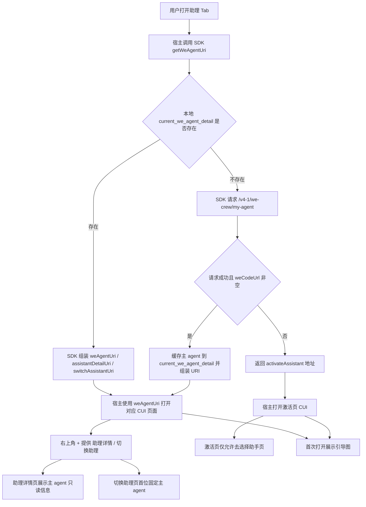
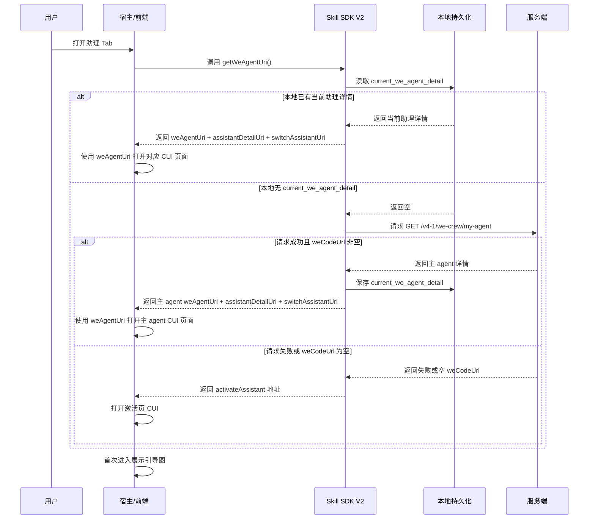
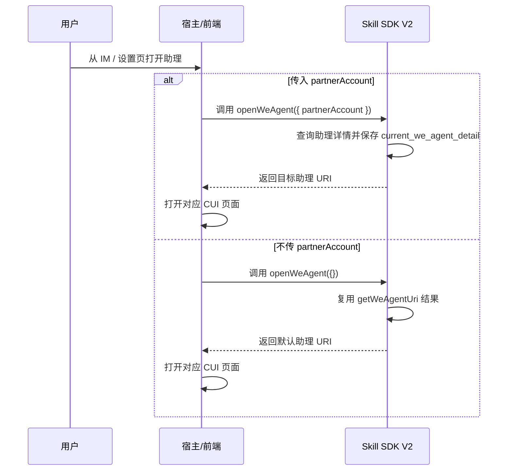

# 助理 Tab 默认展示主 Agent 方案

- 方案日期：`2026-05-20`
- 目标工程：`ai-chat-viewer`
- 参考文档：`SkillClientSdkInterfaceV2.md`、`android/skill-sdk/src/main/java/com/opencode/skill/SkillSDK.java`、`ios/WLAgentSkillsSDK/Classes/Managers/WLAgentSkillsSDK.m`、`harmony/src/main/ets/sdk/SkillSDK.ets`
- 方案类型：`助理 Tab 默认入口与主 Agent 展示策略调整方案`

## 1. 背景

### 1.1 场景说明

当前助理 Tab 的打开入口依赖 SDK V2 `getWeAgentUri` 返回的 URI，由宿主或前端根据返回结果打开对应的 CUI 页面。

现状存在以下问题：

1. 首次打开助理 Tab 时，默认入口与“主 agent”概念未完全对齐。
2. 当本地没有当前助理缓存时，容易直接进入激活页，无法围绕“主 agent”提供统一体验。
3. 助理详情页、切换助理页、激活页、IM `+` 号入口之间，对“主 agent”“历史助手分身”“创建入口”的规则不一致。
4. 新版场景要求弱化“创建助理”入口，但当前部分宿主行为和页面口径仍可能暴露该入口。

### 1.2 需求目标

1. 首次打开助理 Tab 时，默认展示助手主 agent。
2. 若用户没有主 agent，则展示激活页面，但激活页只允许跳转“选择助手”页面，不再跳转“创建助手”页面。
3. 助理 Tab 右上角显示 `+` 菜单，菜单项为“助理详情”“切换助理”。
4. 首次打开助理 Tab 时显示引导图。
5. 助理详情页返回并展示主 agent 信息，且主 agent 不显示创建人等信息，不允许编辑和删除。
6. 切换助理页固定将主 agent 展示在第一位，同时保留历史助手分身切换能力，并调整主 agent 的 tag 文案。
7. 新版 IM `+` 号场景和激活页不再暴露“创建助理”入口；历史版本仍可能存在入口，但由服务端控制失败返回。
8. 扫码注册入口保持不变。
9. 设置页开关和 IM 激活 Tab 行为保持支持：打开主 agent 时跳主 agent，打开助手分身时跳对应分身。

### 1.3 非目标

1. 不调整 `weAgentCUI` 内部消息渲染逻辑。
2. 不调整扫码注册的业务链路和页面结构。
3. 不新增“重新创建主 agent”的新业务流程。
4. 不改动历史助手分身的会话消息协议。

## 2. 方案图

### 2.1 整体方案图

### 2.2 方案核心

本次方案核心是统一“主 agent 优先”的助理入口规则：首次进入助理 Tab 由宿主先调用 SDK `getWeAgentUri`，再使用返回的 `weAgentUri` 打开对应 CUI 页面；若无法获取可用主 agent 地址，则降级打开激活页，同时统一详情页、切换页和创建入口口径。

## 3. 时序图

### 3.1 首次打开助理 Tab

### 3.2 IM / 设置页主动打开助理

## 4. 技术细节

### 4.1 调整点

1. 首次进入助理 Tab 的默认入口统一改为：宿主先调用 SDK `getWeAgentUri`，再根据返回的 `weAgentUri` 打开对应 CUI 页面。
2. `getWeAgentUri` 的真实实现口径统一以三端现有代码为准：优先读取本地 `current_we_agent_detail`，无缓存时请求 `/v4-1/we-crew/my-agent`，失败时降级到 `activateAssistant`。
3. `openWeAgent` 用于 IM、设置页等主动打开指定助理的场景；详情页、切换助理页、激活页的展示和创建入口规则同步围绕“主 agent 优先”收敛。

### 4.2 核心实现方式

`getWeAgentUri` 的三端当前实现逻辑如下：

1. Android、iOS、Harmony 都先读取本地 `current_we_agent_detail`。
2. 若本地存在当前助理详情：
   - 当 `weCodeUrl` 为空时，直接返回激活页地址 `h5://S008623/index.html?wecodePlace=weAgent#activateAssistant`。
   - 当 `bizRobotTag == myagent` 时，按主 agent 规则组装 URI。
   - 其他情况按历史助手分身规则组装 URI。
3. 若本地不存在 `current_we_agent_detail`：
   - 三端都会请求 `GET /v4-1/we-crew/my-agent` 获取主 agent 详情。
   - 请求成功且 `weCodeUrl` 非空时，缓存主 agent 到 `current_we_agent_detail`，再按主 agent 规则组装 URI。
   - 请求失败或 `weCodeUrl` 为空时，统一返回激活页地址。
4. 宿主使用 SDK 返回的 `weAgentUri` 打开对应 CUI 页面，`assistantDetailUri` 和 `switchAssistantUri` 由 SDK 一并返回，供右上角 `+` 菜单使用。

当前 URI 组装规则如下：

1. 主 agent：
   - `weAgentUri = weCodeUrl + from=weAgent`
   - `assistantDetailUri = h5://S008623/index.html?partnerAccount={partnerAccount}#assistantDetail`
   - `switchAssistantUri = h5://S008623/index.html?partnerAccount={partnerAccount}#switchAssistant`
2. 历史助手分身：
   - 先在 `weCodeUrl` 上追加 `wecodePlace=weAgent`
   - 若 `weCodeUrl` 的 host 为 `S008623`，再追加 `assistantAccount={partnerAccount}`
   - 否则追加 `robotId={id}`
   - `assistantDetailUri` / `switchAssistantUri` 仍按 `partnerAccount` 组装
3. 激活页兜底：
   - `weAgentUri = h5://S008623/index.html?wecodePlace=weAgent#activateAssistant`
   - `assistantDetailUri = ""`
   - `switchAssistantUri = ""`

`openWeAgent` 的三端当前实现逻辑如下：

1. 当 `partnerAccount` 有值时：
   - Android / iOS / Harmony 都先调用 `getAssistantDetails({ partnerAccount })`
   - 校验返回详情存在且 `weCodeUrl` 非空
   - 保存该详情到 `current_we_agent_detail`
   - 基于该详情重新组装 URI
   - 再调用宿主能力打开对应 CUI 页面
2. 当 `partnerAccount` 为空时：
   - 三端都直接复用 `getWeAgentUri` 的返回结果
   - 再调用宿主能力打开对应 CUI 页面

### 4.3 兼容与边界

1. 兼容历史助手分身：
   - 已有分身详情仍可通过 `current_we_agent_detail` 或 `openWeAgent(partnerAccount)` 打开
   - 非 `myagent` 的详情继续走历史分身 URI 组装规则
2. 边界条件：
   - 本地有缓存但 `weCodeUrl` 为空时，直接降级到激活页
   - `/v4-1/we-crew/my-agent` 请求失败或返回空 `weCodeUrl` 时，直接降级到激活页
   - `openWeAgent(partnerAccount)` 查询不到详情或详情无 `weCodeUrl` 时，应返回错误，不静默打开错误页面
3. 降级策略：
   - 首次进入助理 Tab 场景统一兜底到 `activateAssistant`
   - 激活页不允许跳转“创建助手”，只允许跳转“选择助手”
   - 历史版本若仍存在创建入口，由服务端控制创建失败

### 4.4 相关接口联动

1. `getWeAgentUri`
   - 用于首次进入助理 Tab，返回默认打开页的 URI 结果
2. `openWeAgent`
   - 用于 IM、设置页等主动打开指定助理或默认助理的场景
3. `getAssistantDetails`
   - 供 `openWeAgent(partnerAccount)` 查询指定助理详情并更新 `current_we_agent_detail`

### 4.5 文档需要同步修改的内容

1. `SkillClientSdkInterfaceV2.md`
   - 同步 `getWeAgentUri`、`openWeAgent` 的实现口径与 URI 返回规则
2. 本方案文档
   - 保持与 Android、iOS、Harmony 当前实现一致
3. 若后续有宿主接入说明或 JSAPI 文档涉及助理默认入口
   - 需要同步“首次进入助理 Tab 走 `getWeAgentUri`，宿主使用 `weAgentUri` 打开 CUI”的规则

## 5. 性能

本次主要是页面入口和展示规则调整，对性能影响较小。

1. 首次进入助理 Tab 时，仅在本地没有 `current_we_agent_detail` 的情况下增加一次 `/v4-1/we-crew/my-agent` 请求。
2. 已有缓存场景下，`getWeAgentUri` 仅做本地读取和 URI 组装，不增加额外网络开销。
3. 切换助理页若需要前端重排主 agent，只涉及本地列表排序，开销可忽略。
4. 首次打开引导图应复用现有资源，避免重复下载。

## 6. 功耗

本次修改不涉及轮询、长连接新增、后台任务或高频刷新，功耗影响可忽略。

需要注意：

1. 引导图展示不要引入额外高频动画或重复预加载。
2. 不因主 agent 判断增加额外重试请求。
3. 不在宿主侧重复调用 `getWeAgentUri` 和 `openWeAgent`。

## 7. 埋码

1. `assistant_tab_open_main_agent`
   - 说明：助理 Tab 默认打开主 agent
2. `assistant_tab_open_activate_page`
   - 说明：因无主 agent 或主 agent 地址不可用而进入激活页
3. `assistant_tab_plus_click_detail`
   - 说明：点击右上角 `+` 后进入助理详情页
4. `assistant_tab_plus_click_switch`
   - 说明：点击右上角 `+` 后进入切换助理页
5. `assistant_activate_block_create_entry`
   - 说明：激活页已屏蔽创建入口
6. `assistant_switch_list_main_agent_top`
   - 说明：切换助理页主 agent 成功置顶展示

## 8. 影响范围

### 8.1 直接影响

1. 助理 Tab 默认打开页逻辑。
2. `getWeAgentUri` 的返回策略说明。
3. `openWeAgent` 在 IM、设置页主动打开助理时的行为口径。
4. 助理详情页的展示与操作权限。
5. 切换助理页的列表顺序和 tag 文案。
6. 激活页与新版 IM `+` 号的创建入口收敛。

### 8.2 间接影响

1. 宿主使用 `assistantDetailUri`、`switchAssistantUri` 的菜单逻辑。
2. 服务端创建助理失败返回在旧版本客户端中的表现。
3. IM 和设置页打开主 agent / 分身的路由判断。

### 8.3 不影响

1. 扫码注册入口链路。
2. `weAgentCUI` 聊天消息渲染。
3. 历史助手分身的消息协议。

## 9. 测试范围

### 9.1 功能测试

1. 用户存在主 agent 且本地已有 `current_we_agent_detail` 时，首次打开助理 Tab 默认进入主 agent 页面。
2. 本地无缓存但 `/v4-1/we-crew/my-agent` 返回成功且 `weCodeUrl` 非空时，首次打开助理 Tab 进入主 agent 页面，并写入 `current_we_agent_detail`。
3. `/v4-1/we-crew/my-agent` 请求失败或返回空 `weCodeUrl` 时，首次打开助理 Tab 进入激活页。
4. 右上角 `+` 菜单只展示“助理详情”“切换助理”两个入口。
5. 助理详情页展示主 agent 信息时，不显示创建人等信息，不展示编辑、删除入口。
6. 切换助理页列表第一项固定为主 agent，历史助手分身仍可展示和切换。
7. `openWeAgent(partnerAccount)` 能正确打开指定助手分身或指定助理页面。
8. `openWeAgent({})` 能复用默认入口逻辑打开对应助理页面。

### 9.2 兼容测试

1. Android、iOS、Harmony 三端 `getWeAgentUri` 和 `openWeAgent` 的返回口径一致。
2. 历史助手分身的 URI 组装仍兼容 `assistantAccount` / `robotId` 两种规则。
3. 激活页仍支持扫码注册入口，不影响原有扫码注册链路。
4. 旧版客户端若仍暴露创建入口，服务端返回创建失败时客户端表现符合预期。

### 9.3 文档一致性检查

1. `SkillClientSdkInterfaceV2.md` 与本方案中 `getWeAgentUri`、`openWeAgent` 的口径一致。
2. 本方案与 Android、iOS、Harmony 当前实现一致。
3. 不再出现“首次进入助理 Tab 直接由前端自行判断打开页”的旧描述。
4. 不再出现“激活页可跳创建助理”的旧描述。

## 10. 最终建议

建议将助理体系的默认入口统一收敛到“主 agent 优先 + SDK 返回 URI 驱动打开”的模型：

1. 首次打开助理 Tab，宿主统一调用 `getWeAgentUri`，并使用返回的 `weAgentUri` 打开对应 CUI 页面。
2. SDK 统一承担主 agent 查询、本地 `current_we_agent_detail` 复用、URI 组装和激活页兜底职责。
3. IM、设置页等主动打开指定助理的场景，统一走 `openWeAgent`，避免宿主自行复制 URI 组装逻辑。
4. 激活页不再承担创建助理入口，只保留选择助手能力；详情页和切换页继续围绕主 agent 只读、分身可切换的规则实现。

这样可以在不改动聊天核心链路的前提下，统一助理 Tab、详情页、切换页、激活页和 IM 入口的产品口径，并且让文档和三端 SDK 的实际实现保持一致。
