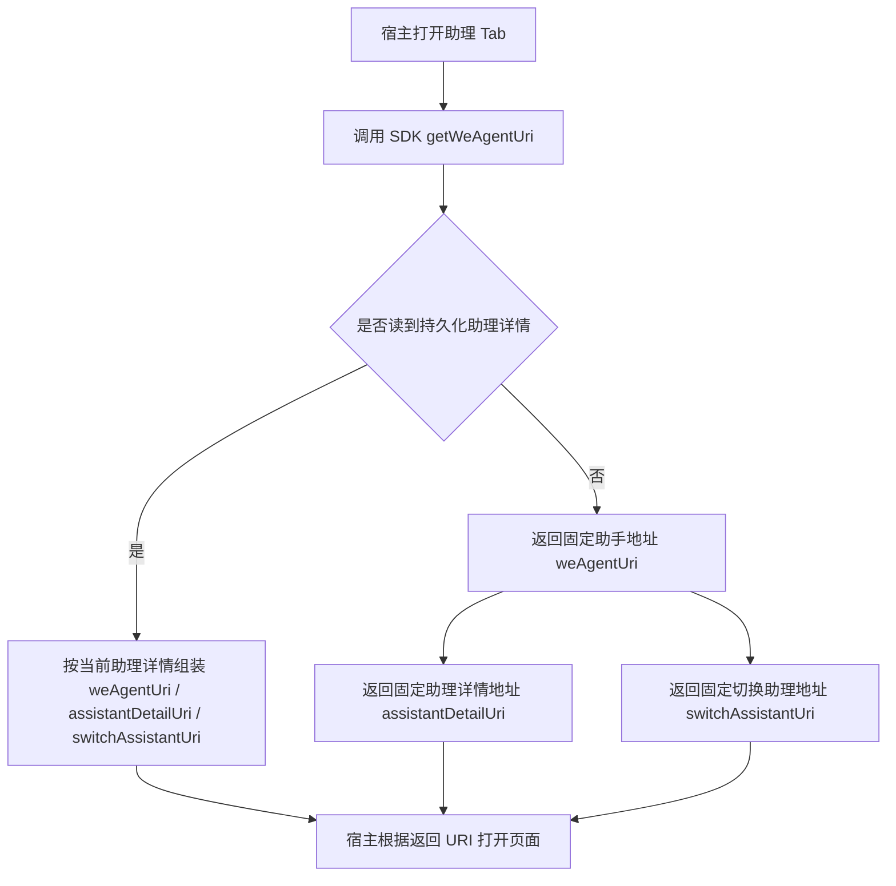
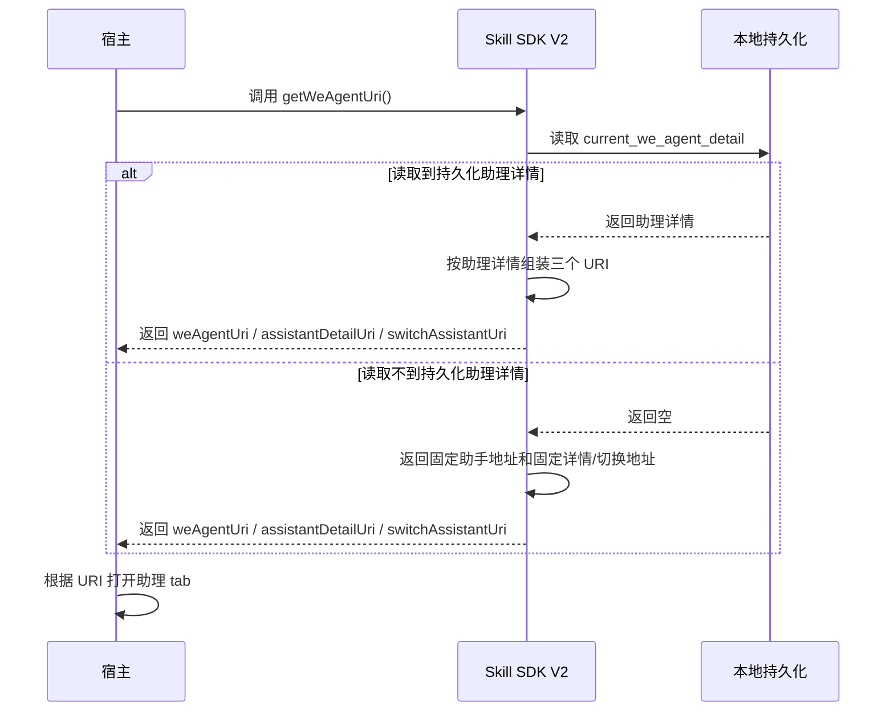
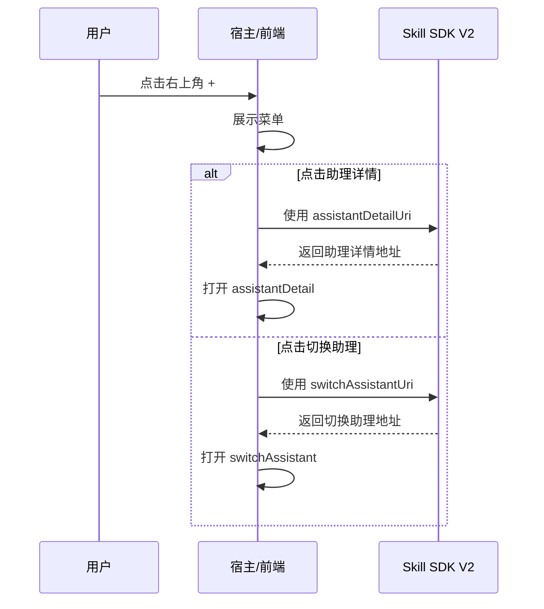

# 助理 Tab 默认展示助手 We 码方案

- 方案日期：2026-05-20
- 目标工程：`ai-chat-viewer`
- 参考文档：`SkillClientSdkInterfaceV2.md`
- 方案类型：SDK V2 URI 返回策略调整方案

## 1. 背景

### 1.1 场景说明

当前助理 tab 的页面打开入口依赖 SDK V2 的 `getWeAgentUri` 返回值。

现状下：

1. 当 SDK 能读取到持久化的当前助理详情时，会基于助理详情组装 `weAgentUri`、`assistantDetailUri`、`switchAssistantUri`。
2. 当 SDK 读取不到持久化助理详情时，`weAgentUri` 的 fallback 会返回：
   - `h5://S008623/index.html?wecodePlace=weAgent#activateAssistant`
3. 同时 `assistantDetailUri`、`switchAssistantUri` 在该场景下返回空字符串。

这会导致助理 tab 首次打开时，默认进入激活页，而不是直接进入固定的助手地址；同时右上角 `+` 菜单依赖的“助理详情”“切换助理”地址也无法返回。

### 1.2 需求目标

本次方案目标调整为：

1. 调整 `SkillClientSdkInterfaceV2.md` 中 `getWeAgentUri` 的实现规则。
2. 若 SDK 读取不到持久化助理详情：
   - `weAgentUri` 返回固定的助手地址
   - `assistantDetailUri` 返回对应助理详情地址
   - `switchAssistantUri` 返回对应切换助理地址
3. 通过 SDK 返回值策略调整，实现助理 tab 默认不再进入激活页。

### 1.3 非目标

本次方案不包含以下内容：

1. 不调整 `SkillClientSdkInterfaceV1.md`。
2. 不新增前端独立首页页面。
3. 不修改 `weAgentCUI` 消息渲染逻辑。
4. 不修改助理详情页和切换助理页自身的页面结构。

## 2. 方案图

### 2.1 整体方案图

### 2.2 方案核心

本次不通过前端新增页面改变默认入口，而是通过 `getWeAgentUri` 的 fallback 返回值来控制助理 tab 的默认落点。

调整后：

1. SDK 有持久化助理详情时，行为保持不变。
2. SDK 无持久化助理详情时，不再返回 `activateAssistant` 地址。
3. SDK 无持久化助理详情时，仍然必须返回完整可用的：
   - `weAgentUri`
   - `assistantDetailUri`
   - `switchAssistantUri`

## 3. 时序图

### 3.1 打开助理 tab

### 3.2 点击右上角 `+`

## 4. 技术细节

### 4.1 调整点

本次仅调整 `SkillClientSdkInterfaceV2.md` 中 `getWeAgentUri` 的 fallback 规则。

重点修改如下：

1. 若读取不到持久化助理详情：
   - `weAgentUri` 不再返回 `#activateAssistant`
   - `assistantDetailUri` 不再返回空字符串
   - `switchAssistantUri` 不再返回空字符串

### 4.2 读取到持久化助理详情时

该场景保持现有规则不变：

1. 读取 `weCodeUrl`、`partnerAccount`、`id`
2. 按 `weCodeUrl.host` 是否等于 `WE_AGENT_CUI_APPID: S008623` 组装 `weAgentUri`
3. `assistantDetailUri` 组装为：
   - `h5://S008623/index.html?partnerAccount={partnerAccount}#assistantDetail`
4. `switchAssistantUri` 组装为：
   - `h5://S008623/index.html?partnerAccount={partnerAccount}#switchAssistant`

### 4.3 读取不到持久化助理详情时

该场景调整为固定返回对应地址。

建议规则如下：

1. `weAgentUri`
   - 返回固定的助手地址
   - 不再使用 `h5://S008623/index.html?wecodePlace=weAgent#activateAssistant`
2. `assistantDetailUri`
   - 返回固定的助理详情地址
3. `switchAssistantUri`
   - 返回固定的切换助理地址

### 4.4 固定地址返回规则

由于本次需求明确是“若读取不到持久化助理详情，则返回固定的助手地址、助理详情地址、切换助理地址”，因此文档中建议将 fallback 规则统一定义为固定页面地址。

推荐写法：

1. `weAgentUri`
   - 固定返回：`h5://S008623/index.html?wecodePlace=weAgent#weAgentCUI`
2. `assistantDetailUri`
   - 固定返回：`h5://S008623/index.html#assistantDetail`
3. `switchAssistantUri`
   - 固定返回：`h5://S008623/index.html#switchAssistant`

说明：

1. 这里不再依赖持久化助理详情中的 `partnerAccount`。
2. 这里的“固定地址”含义是：即使没有当前助理缓存，也返回一个稳定可打开的页面地址。
3. 若后续宿主要求这些固定地址必须带默认 query，再由 SDK 文档补充固定 query 规则。

### 4.5 文档层需要同步调整的内容

`SkillClientSdkInterfaceV2.md` 中至少需要同步修改以下部分：

1. `getWeAgentUri` 的出参说明表
2. `getWeAgentUri` 的出参示例
3. `getWeAgentUri` 的实现方法
4. 与 `openWeAgent`、`deleteWeAgent` 中复用 `getWeAgentUri` 规则的描述

### 4.6 相关接口联动

由于文档中已有以下接口或场景复用 URI 组装规则，因此需要同步检查：

1. `openWeAgent`
2. `deleteWeAgent`
3. 宿主使用 `weAgentUri`、`assistantDetailUri`、`switchAssistantUri` 打开页面的逻辑说明

同步原则：

1. 所有 fallback 规则口径必须一致
2. 不允许一个地方写返回空字符串，另一个地方写固定地址

## 5. 性能

本次仅为 URI fallback 规则调整，对性能基本无新增负担。

需要注意：

1. 不新增接口请求
2. 不新增额外缓存读取次数
3. 仍维持一次本地持久化读取即可完成 URI 组装

## 6. 功耗

本次修改不涉及轮询、长连接、后台任务或额外网络请求，功耗影响可忽略。

## 7. 埋码

本次为 SDK URI 返回策略调整，不强制新增 SDK 埋码。

若前端或宿主需要验证 fallback 生效情况，可选增加以下埋码：

1. `get_weagent_uri_fallback_hit`
   - 说明：命中“无持久化助理详情”的 fallback 分支
2. `open_weagent_from_fallback_uri`
   - 说明：宿主使用 fallback 返回的 `weAgentUri` 成功打开助理页面

当前文档阶段可先不强制要求埋码实现。

## 8. 影响范围

### 8.1 直接影响

1. `SkillClientSdkInterfaceV2.md` 中 `getWeAgentUri` 的 fallback 规则
2. 助理 tab 无持久化详情时的默认打开页面
3. 助理 tab 右上角 `+` 菜单可用性

### 8.2 间接影响

1. 宿主依赖 `assistantDetailUri`、`switchAssistantUri` 为空来做禁用态的逻辑，需要同步调整
2. `openWeAgent`、`deleteWeAgent` 若文档中写明复用同一套 URI 规则，也需同步改口径

### 8.3 不影响

1. `SkillClientSdkInterfaceV1.md`
2. `weAgentCUI` 聊天逻辑
3. 助理详情页内部展示逻辑
4. 切换助理页内部展示逻辑

## 9. 测试范围

### 9.1 功能测试

1. 本地存在 `current_we_agent_detail` 时，`getWeAgentUri` 返回规则保持不变。
2. 本地不存在 `current_we_agent_detail` 时，`weAgentUri` 不再返回 `#activateAssistant`。
3. 本地不存在 `current_we_agent_detail` 时，`assistantDetailUri` 返回固定地址，不再为空字符串。
4. 本地不存在 `current_we_agent_detail` 时，`switchAssistantUri` 返回固定地址，不再为空字符串。

### 9.2 兼容测试

1. 宿主使用 fallback 的 `weAgentUri` 能正常打开页面。
2. 宿主点击右上角 `+` 后，使用 fallback 的 `assistantDetailUri`、`switchAssistantUri` 能正常打开对应页面。
3. 读取到持久化助理详情的正常路径不回退。

### 9.3 文档一致性检查

1. `getWeAgentUri` 出参表、示例、实现方法三处描述一致。
2. `openWeAgent`、`deleteWeAgent` 中引用的 URI fallback 规则与 `getWeAgentUri` 保持一致。
3. 不再出现“读取不到持久化助理详情时，详情地址和切换地址返回空字符串”的旧描述。

## 10. 最终建议

本次最佳方案不是新增前端页面来兜默认入口，而是直接调整 `SkillClientSdkInterfaceV2.md` 的 `getWeAgentUri` fallback 规则：

1. 读取到持久化助理详情时，保持原有 URI 组装逻辑不变。
2. 读取不到持久化助理详情时：
   - `weAgentUri` 返回固定助手地址
   - `assistantDetailUri` 返回固定助理详情地址
   - `switchAssistantUri` 返回固定切换助理地址
3. 同步修改文档中的出参说明、示例和实现方法。
4. 同步检查 `openWeAgent`、`deleteWeAgent` 等复用 URI 规则的描述，保持文档口径一致。

这样改动边界最小，也最符合“通过 SDK 返回地址策略控制助理 tab 默认入口”的目标。
