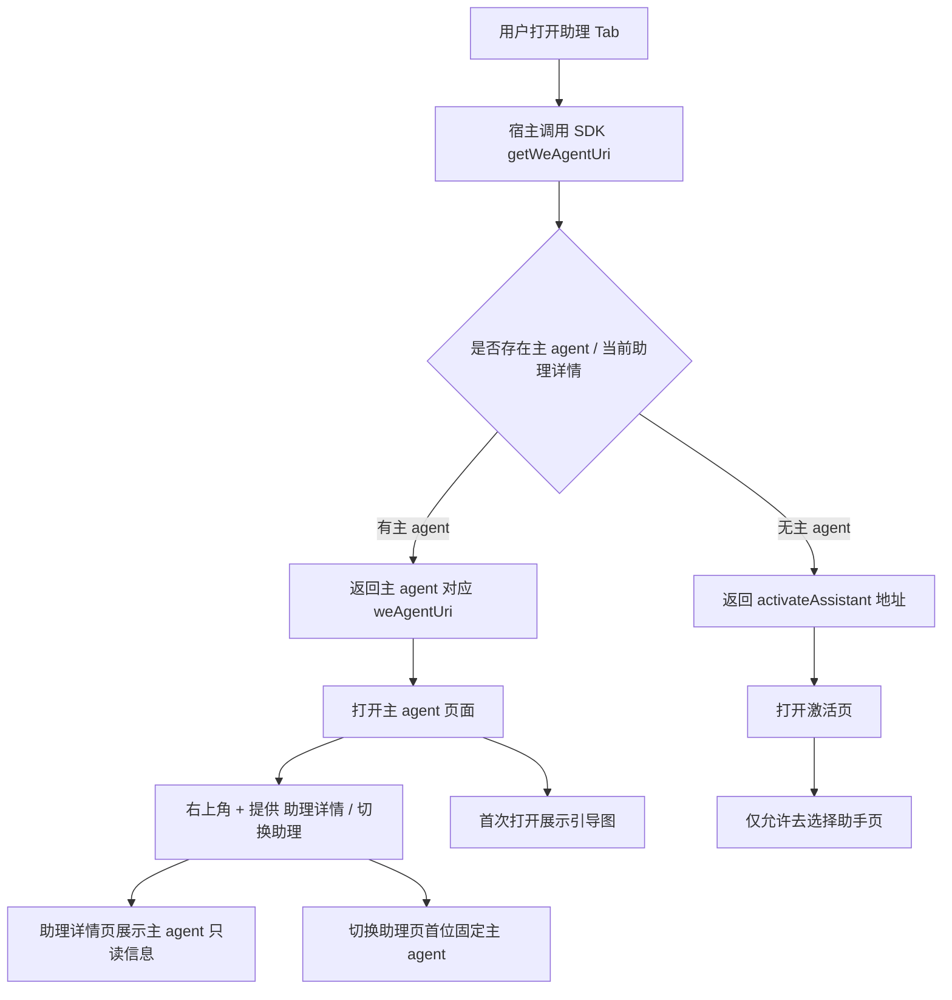
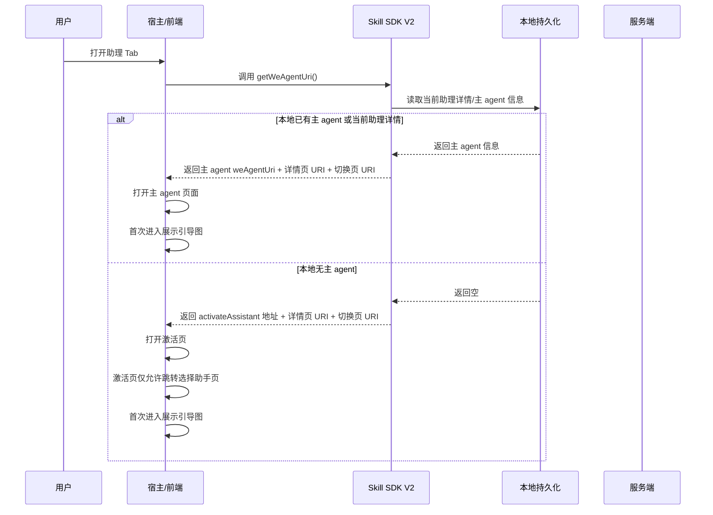
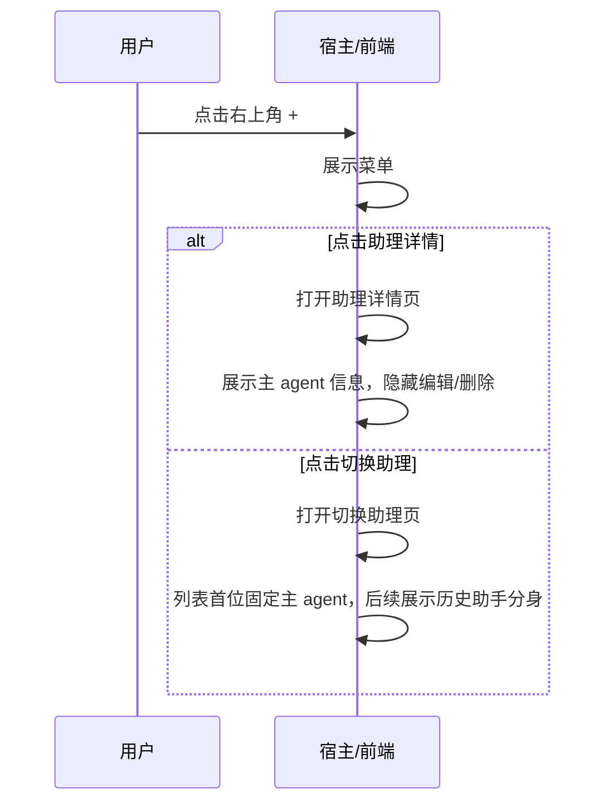
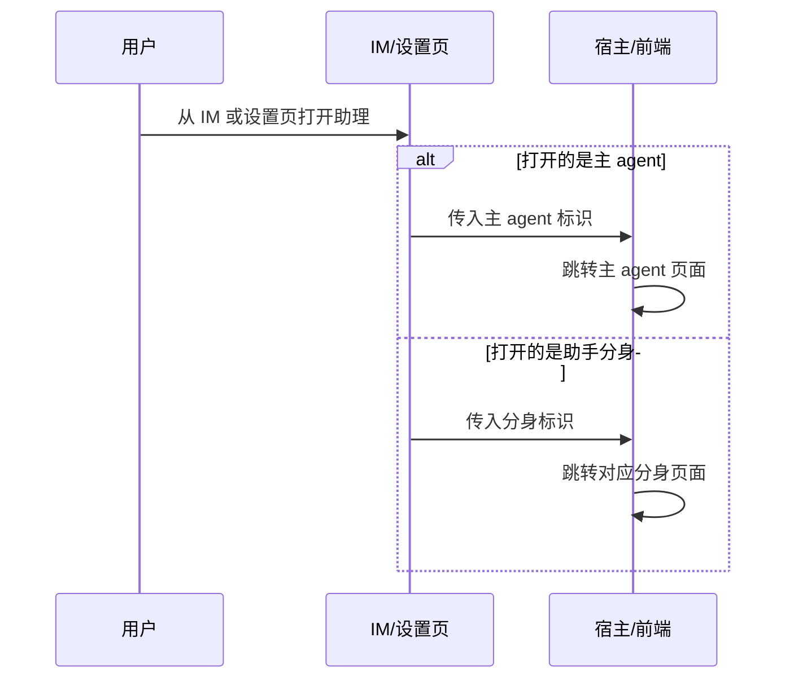

# 助理 Tab 默认展示主 Agent 方案

- 方案日期：2026-05-20
- 目标工程：`ai-chat-viewer`
- 相关文档：`SkillClientSdkInterfaceV2.md`
- 方案类型：助理 Tab 默认入口与主 Agent 展示策略调整方案

## 1. 背景

### 1.1 场景说明

当前助理 Tab 的打开入口依赖 SDK V2 `getWeAgentUri` 返回的 URI，前端再根据 URI 打开对应页面。

现状存在以下问题：

1. 首次打开助理 Tab 时，默认入口与“主 agent”概念未完全对齐。
2. 当本地没有当前助理缓存时，容易进入激活页，无法直接围绕“主 agent”提供统一体验。
3. 助理详情页、切换助理页、激活页、IM + 号入口之间，对“主 agent”“历史助手分身”“创建入口”的规则不一致。
4. 新版场景要求弱化“创建助理”入口，但当前多处页面和宿主行为仍可能暴露该入口。

### 1.2 需求目标

本次方案目标如下：

1. 首次打开助理 Tab 时，默认展示助手主 agent。
2. 若用户没有主 agent，则展示激活页面，但激活页只允许跳转“选择助手”页面，不再跳转“创建助手”页面。
3. 助理 Tab 右上角显示 `+` 菜单，菜单项为“助理详情”“切换助理”。
4. 首次打开助理 Tab 时显示引导图。
5. 助理详情页返回并展示主 agent 信息，且主 agent 不显示创建人等信息，不允许编辑和删除。
6. 切换助理页固定将主 agent 展示在第一位，同时保留历史助手分身切换能力，并调整主 agent 的 tag 文案。
7. 新版 IM `+` 号场景和激活页不再暴露“创建助理”入口；历史版本仍可能存在入口，但由服务端控制失败返回。
8. 扫码注册入口保持不变。
9. 设置页开关和 IM 激活 Tab 行为保持支持：打开主 agent 时跳主 agent，打开助手分身时跳对应分身。

### 1.3 非目标

本次方案不包含以下内容：

1. 不调整 `weAgentCUI` 内部消息渲染逻辑。
2. 不调整扫码注册的业务链路和页面结构。
3. 不新增“重新创建主 agent”的新业务流程。
4. 不改动历史助手分身的会话消息协议。

## 2. 方案图

### 2.1 整体方案图

### 2.2 方案核心

本次方案核心不是单纯修改一个 fallback URI，而是统一“主 agent”在助理体系中的默认入口与页面规则。

统一原则如下：

1. 助理 Tab 默认围绕主 agent 打开。
2. 没有主 agent 时才进入激活页。
3. 激活页不再承载创建助理入口，只保留选择助手能力。
4. 主 agent 在详情页和切换页均视为特殊只读对象。
5. 历史助手分身仍保留切换与打开能力。

## 3. 时序图

### 3.1 首次打开助理 Tab

### 3.2 点击右上角 `+`

### 3.3 IM 或设置页打开助理

## 4. 技术细节

### 4.1 助理 Tab 默认入口策略

`SkillClientSdkInterfaceV2.md` 中 `getWeAgentUri` 的实现口径需要调整为：

1. 若能识别到主 agent 或当前助理详情，默认返回主 agent 对应的 `weAgentUri`。
2. 若无法识别到主 agent，返回激活页地址。
3. 不再采用“无缓存即默认固定主 agent 页面”的旧目标。
4. `assistantDetailUri` 和 `switchAssistantUri` 仍需可返回可打开的页面地址，供右上角 `+` 菜单使用。

### 4.2 首次打开助理 Tab

首次打开场景按以下规则处理：

1. 默认显示主 agent。
2. 若用户没有主 agent，显示激活页。
3. 激活页不允许跳转“创建助手”，只允许跳转“选择助手”。
4. 首次进入助理 Tab 即展示引导图。

说明：

1. “首次打开”以宿主或前端定义的首次进入态为准。
2. 引导图显示逻辑与是否有主 agent 解耦，两种场景都显示。

### 4.3 右上角 `+` 菜单

右上角 `+` 菜单统一保留两个入口：

1. 助理详情
2. 切换助理

不包含以下入口：

1. 创建助理
2. 其他新增快捷入口

### 4.4 助理详情页

助理详情页需要满足以下规则：

1. 助理详情接口返回主 agent 相关信息。
2. 主 agent 卡片或详情区域不显示创建人等信息。
3. 主 agent 不允许编辑。
4. 主 agent 不允许删除。

实现口径建议：

1. 由接口返回或前端识别当前对象是否为主 agent。
2. 一旦识别为主 agent，前端直接隐藏编辑、删除、创建人展示区。
3. 若详情页同时兼容历史助手分身，则分身仍沿用原有展示逻辑。

### 4.5 切换助理页

切换助理页规则如下：

1. 助理列表固定第一个为主 agent。
2. 保留历史助手分身列表和切换能力。
3. 主 agent 的 tag 标签文案按新需求修改。

实现建议：

1. 若服务端直接返回主 agent，前端按字段排序置顶。
2. 若服务端未保证顺序，前端本地重排，确保主 agent 首位固定。
3. 历史分身不因为主 agent 置顶而丢失。

### 4.6 创建助理入口收敛

本次需要统一收敛创建助理入口：

1. 新版 IM `+` 号入口屏蔽创建助理。
2. 激活页不再跳转创建助理。
3. 历史版本若仍存在创建入口，不强制前端删除，但由服务端控制创建失败。

这里的策略分两层：

1. 新版前端与宿主不再展示创建入口。
2. 旧版客户端即使进入创建流程，服务端也通过接口报错控制创建失败。

### 4.7 扫码注册入口

扫码注册入口保持现状不变：

1. 页面入口不变。
2. 跳转链路不变。
3. 服务端协议不变。

### 4.8 设置页开关与 IM 激活 Tab

设置页与 IM 侧打开助理时需要统一行为：

1. 打开主 agent 时，跳转主 agent 页面。
2. 打开助手分身时，跳转对应分身页面。

这意味着 SDK 或宿主在路由组装时，需要能够区分：

1. 主 agent 标识
2. 分身标识

### 4.9 文档需要同步修改的内容

本次文档层建议同步调整：

1. `SkillClientSdkInterfaceV2.md` 中 `getWeAgentUri` 的目标说明。
2. `getWeAgentUri` 的 URI 返回规则示例。
3. 助理详情页与切换助理页相关 URI 的说明。
4. 激活页跳转限制说明。
5. 与主 agent / 助手分身识别相关的字段说明。

## 5. 性能

本次主要是页面入口与展示规则调整，对性能影响较小。

需要注意：

1. 不新增长链路接口。
2. 切换助理页若需要前端重排主 agent，只涉及本地列表排序，开销可忽略。
3. 首次打开引导图应复用现有资源，避免重复下载。

## 6. 功耗

本次修改不涉及轮询、后台任务或新增长连接，功耗影响可忽略。

需要注意：

1. 引导图展示不要引入额外高频动画或重复预加载。
2. 不因主 agent 判断增加额外重试请求。

## 7. 埋码

建议补充以下埋码，便于验证新规则落地情况：

1. `assistant_tab_open_main_agent`
   - 说明：助理 Tab 默认打开主 agent
2. `assistant_tab_open_activate_page`
   - 说明：因无主 agent 进入激活页
3. `assistant_tab_plus_click_detail`
   - 说明：点击右上角 `+` 后进入助理详情页
4. `assistant_tab_plus_click_switch`
   - 说明：点击右上角 `+` 后进入切换助理页
5. `assistant_activate_block_create_entry`
   - 说明：激活页已屏蔽创建入口
6. `assistant_switch_list_main_agent_top`
   - 说明：切换助理页主 agent 成功置顶展示

## 8. 影响范围

### 8.1 直接影响

1. 助理 Tab 默认打开页逻辑。
2. `getWeAgentUri` 的返回策略说明。
3. 助理详情页的展示与操作权限。
4. 切换助理页的列表顺序和 tag 文案。
5. 激活页与新版 IM `+` 号的创建入口收敛。

### 8.2 间接影响

1. 宿主使用 `assistantDetailUri`、`switchAssistantUri` 的菜单逻辑。
2. 服务端创建助理失败返回在旧版本客户端中的表现。
3. IM 和设置页打开主 agent / 分身的路由判断。

### 8.3 不影响

1. 扫码注册入口链路。
2. `weAgentCUI` 聊天消息渲染。
3. 历史助手分身的消息协议。

## 9. 测试范围

### 9.1 首次打开助理 Tab

1. 用户存在主 agent 时，首次打开默认进入主 agent 页面。
2. 用户不存在主 agent 时，首次打开进入激活页。
3. 两种场景下首次进入都展示引导图。

### 9.2 助理详情页

1. 助理详情接口返回主 agent 信息正确。
2. 主 agent 不显示创建人等信息。
3. 主 agent 不展示编辑、删除入口。
4. 历史助手分身若进入详情页，仍保留既有逻辑。

### 9.3 切换助理页

1. 列表第一项固定为主 agent。
2. 历史助手分身仍可展示和切换。
3. 主 agent tag 文案符合新要求。

### 9.4 创建助理入口

1. 新版 IM `+` 号不显示创建助理入口。
2. 激活页不跳转创建助理。
3. 历史版本仍存在入口时，服务端返回创建失败，客户端表现符合预期。

### 9.5 扫码注册与设置页

1. 扫码注册入口行为保持不变。
2. 设置页打开主 agent 时跳主 agent。
3. 设置页打开助手分身时跳对应分身。
4. IM 激活 Tab 打开主 agent / 分身行为正确。

### 9.6 文档一致性检查

1. `SkillClientSdkInterfaceV2.md` 与本方案中“默认入口”规则一致。
2. 主 agent、助手分身、激活页的口径一致。
3. 不再出现“激活页可跳创建助理”的旧描述。

## 10. 最终建议

本次建议将助理体系的默认入口统一收敛到“主 agent 优先”模型：

1. 首次打开助理 Tab，默认展示主 agent；无主 agent 时再显示激活页。
2. 激活页不再承担创建助理入口，只保留选择助手能力。
3. 右上角 `+` 固定为“助理详情”“切换助理”两个入口。
4. 助理详情页将主 agent 视为只读对象，不显示创建人，不允许编辑删除。
5. 切换助理页固定主 agent 置顶，同时保留历史助手分身切换。
6. 新版入口收敛创建助理，历史版本由服务端兜底失败。
7. 扫码注册入口保持不变，设置页和 IM 打开行为继续支持主 agent / 分身分流。

这样可以在不改动聊天核心链路的前提下，统一助理 Tab、详情页、切换页、激活页和 IM 入口的产品口径。
