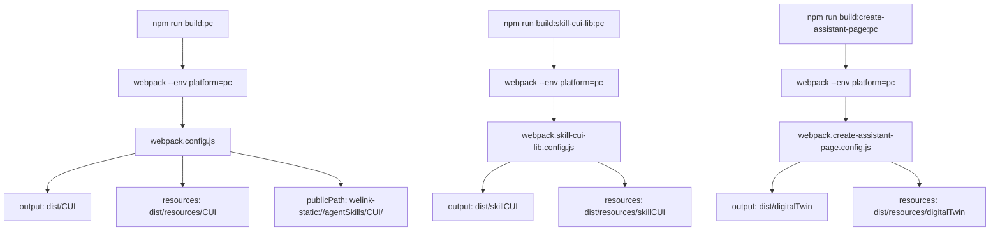

# PC 资源拆分方案

- 方案日期：2026-05-22
- 目标工程：ai-chat-viewer
- 参考文档：无
- 方案类型：构建配置优化

## 1. 背景

### 1.1 场景说明

需要为 `npm run build` 增加 PC 平台打包支持，使得静态资源（图片、字体）可以打包到独立目录，并使用自定义协议路径引用。

### 1.2 需求目标

1. 新增 `build:pc` 命令，产物目录为 `dist/CUI`，资源目录为 `dist/resources/CUI`
2. 新增 `build:skill-cui-lib:pc` 命令，产物目录为 `dist/skillCUI`，资源目录为 `dist/resources/skillCUI`
3. 新增 `build:create-assistant-page:pc` 命令，产物目录为 `dist/digitalTwin`，资源目录为 `dist/resources/digitalTwin`
4. PC 模式下，资源 publicPath 使用 `welink-static://agentSkills/{platform}/` 格式
5. 非 PC 模式下，保持原有行为不变

### 1.3 非目标

1. 不在代码中注入 `__PLATFORM__` 变量
2. 不修改非 PC 模式的构建逻辑

## 2. 方案图

### 2.1 整体方案图



### 2.2 方案核心

通过 webpack 配置的 `env.platform` 参数区分 PC/非 PC 模式，PC 模式下使用 `generator` 配置覆盖默认的 `assetModuleFilename`，实现资源路径和输出目录的定制。

## 3. 技术细节

### 3.1 调整点

1. **package.json**：新增3个命令
2. **webpack.config.js**：
   - 改为函数导出 `(env = {}, argv = {}) => {...}`
   - output.path 根据 `env.platform === 'pc'` 动态设置
   - output.assetModuleFilename 在 PC 模式下设为 undefined
   - module.rules 添加 conditional asset rule
3. **webpack.skill-cui-lib.config.js**：
   - 改为函数导出 `(env = {}) => {...}`
   - 传递 env 参数给 createSharedLibWebpackConfig
4. **webpack.shared.lib.js**：
   - createSharedLibWebpackConfig 增加 env 参数
   - output.path 根据 env 动态设置
   - module.rules 添加 conditional asset rule
5. **webpack.create-assistant-page.config.js**：
   - 改为函数导出 `(env = {}, argv = {}) => {...}`
   - output.path 根据 `env.platform === 'pc'` 动态设置
   - output.assetModuleFilename 在 PC 模式下设为 undefined
   - module.rules 添加 conditional asset rule

### 3.2 核心实现方式

**Conditional Asset Rule**（PC 模式下生效）：
```js
...(env.platform === 'pc' ? [{
  test: /\.(png|jpe?g|gif|svg|ico|woff|woff2|ttf|eot)$/i,
  type: 'asset',
  generator: {
    filename: '[name].[contenthash][ext]',
    outputPath: 'resources/{platform}',
    publicPath: 'welink-static://agentSkills/{platform}/',
  },
}] : []),
```

### 3.3 兼容与边界

1. 非 PC 模式（build, build:lib, build:skill-cui-lib, build:create-assistant-page）保持原有行为
2. PC 模式下，资源文件名包含 contenthash，便于缓存
3. 各配置文件独立判断，互不影响

### 3.4 命令与输出映射

| 命令 | 配置文件 | 产物目录 | 资源目录 | publicPath |
|------|----------|----------|----------|------------|
| `build` | webpack.config.js | `dist/` | `dist/asset/` | 默认 |
| `build:pc` | webpack.config.js | `dist/CUI/` | `dist/resources/CUI/` | `welink-static://agentSkills/CUI/` |
| `build:skill-cui-lib` | webpack.skill-cui-lib.config.js | `dist/lib/` | 无 | 默认 |
| `build:skill-cui-lib:pc` | webpack.skill-cui-lib.config.js | `dist/skillCUI/` | `dist/resources/skillCUI/` | `welink-static://agentSkills/skillCUI/` |
| `build:create-assistant-page` | webpack.create-assistant-page.config.js | `dist/create-assistant-page/` | `dist/create-assistant-page/asset/` | 默认 |
| `build:create-assistant-page:pc` | webpack.create-assistant-page.config.js | `dist/digitalTwin/` | `dist/resources/digitalTwin/` | `welink-static://agentSkills/digitalTwin/` |

## 4. 测试范围

### 4.1 功能测试

1. `npm run build` 产物在 `dist/`，资源在 `dist/asset/`
2. `npm run build:pc` 产物在 `dist/CUI/`，资源在 `dist/resources/CUI/`，引用路径为 `welink-static://agentSkills/CUI/xxx.png`
3. `npm run build:skill-cui-lib:pc` 产物在 `dist/skillCUI/`，资源在 `dist/resources/skillCUI/`
4. `npm run build:create-assistant-page:pc` 产物在 `dist/digitalTwin/`，资源在 `dist/resources/digitalTwin/`

### 4.2 兼容测试

1. 非 PC 命令不受影响
2. 图片、字体资源正确打包到对应目录
3. 引用路径正确替换

## 5. 最终建议

推荐方案：按上述调整点修改4个配置文件，新增3条 npm 命令。方案简单清晰，不影响现有构建流程。