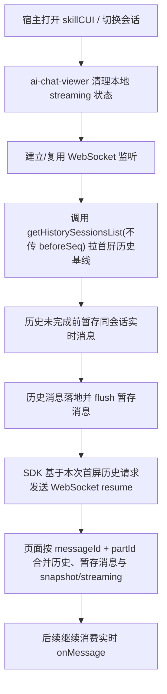
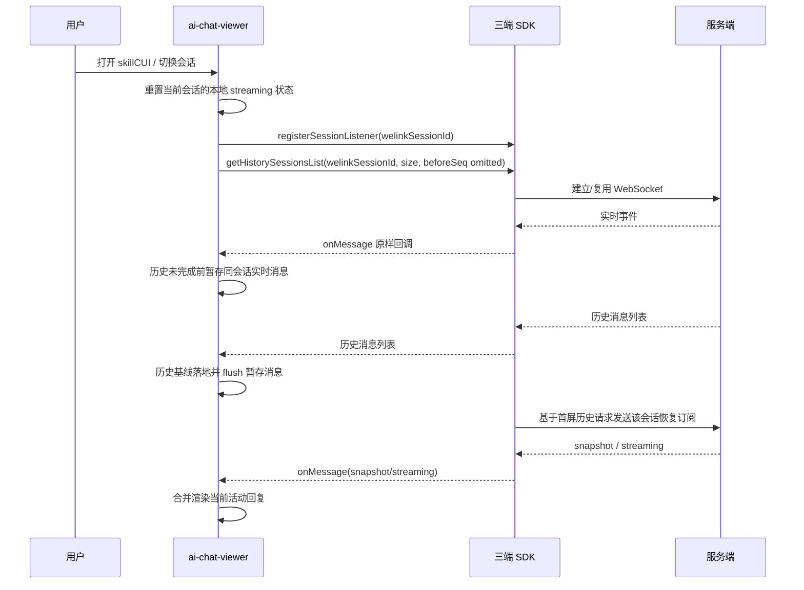
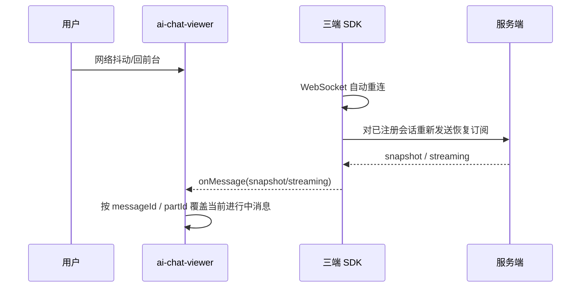

# `MiniApp Skill Snapshot Restore 三端 SDK 与 ai-chat-viewer 实现方案`

- 方案日期：`2026-05-28`
- 目标工程：`android / ios / harmony / ai-chat-viewer`
- 参考文档：`F:\AIProject\opencode-CUI\docs\miniapp-skill-snapshot-restore-design.md`、`F:\AIProject\skillSDK\SkillClientSdkInterfaceV2.md`、`F:\AIProject\skillSDK\小程序JSAPI接口文档.md`
- 方案类型：`功能设计 / 实现方案`

> 说明：
> 1. 本方案聚焦客户端三端 SDK 与 `ai-chat-viewer` 如何消费服务端 `snapshot` / `streaming` 恢复能力。
> 2. 本方案不新增公开 JSAPI 名称，继续以服务端快照恢复为主。
> 3. `SkillClientSdkInterfaceV2.md` 本次主要作为宿主打开 CUI、页面承载链路的约束参考；会话实时消息能力仍沿用 JSAPI 文档中的 V1 会话接口定义。

## 1. 背景

### 1.1 场景说明

当前小程序/SkillCUI 存在两个核心恢复场景：

1. 用户打开 `skillCUI` 页面时，该会话可能已经有历史消息，甚至服务端已经在持续返回 AI 流式回复。
2. 页面刷新、切会话、WebSocket 断线重连后，需要恢复“历史消息 + 当前未完成的流式回复”。

结合现有文档约束：

- `getHistorySessionsList` 返回服务端历史消息，作为历史基线；首屏请求不传 `beforeSeq`。
- `registerSessionListener` 用于接收实时事件。
- 服务端会通过 `snapshot` / `streaming` 表达恢复态。
- 当前恢复能力依赖“服务端快照 + 前端合并”。

### 1.2 需求目标

1. 三端 SDK 在不新增公开接口的前提下，统一支持会话级 `snapshot` / `streaming` 恢复消息透传。
2. `ai-chat-viewer` 在首次打开、切会话、断线重连时，稳定渲染“历史消息 + 当前进行中回复”。
3. 保证 `question`、`permission`、`tool`、`file`、`subagent` 等复杂 part 在恢复态下不丢失、不重复、不拆错消息块。

### 1.3 非目标

1. 不在 SDK 侧新增本地聚合缓存与补发队列。
2. 不改动服务端消息结构，不新增新的公开 JSAPI 方法名。

## 2. 方案图

### 2.1 整体方案图



### 2.2 方案核心

核心方案是：`ai-chat-viewer 建立监听后先拉首屏历史基线，历史未就绪前暂存同会话实时消息；首屏调用 getHistorySessionsList 且不传 beforeSeq 时，由 SDK 自动发送 resume；页面将历史、排队消息与 snapshot/streaming 按 messageId + partId 合并渲染。`

## 3. 时序图

### 3.1 首次打开 / 切换会话



### 3.2 断线重连恢复



## 4. 技术细节

### 4.1 调整点

1. 三端 SDK 的 `registerSessionListener` 保持“注册监听器”职责，用于尽早接收实时消息，但首次注册后不立即发送 resume。
2. 三端 SDK 在首屏调用 `getHistorySessionsList` 且不传 `beforeSeq` 时，自动为该会话发送一次 resume；分页加载历史（传 `beforeSeq`）不触发。
3. 三端 SDK 的 WebSocket 重连成功后，若当前会话已完成首屏恢复，则需要对当前会话重新发送恢复订阅。
4. `ai-chat-viewer` 调整为“先建立监听并排队，再拉首屏历史，历史落地后 flush，由 SDK 自动发送 resume，最后统一合并消息”。

### 4.2 核心实现方式

#### 4.2.1 三端 SDK 通用实现

统一原则：

1. `registerSessionListener` 继续保持同一 `welinkSessionId` 重复注册时覆盖旧监听器。
2. SDK 不做本地消息聚合，不新增 `deliveryMode`、`replayDone` 之类扩展字段。
3. 服务端返回的 `snapshot`、`streaming`、`text.delta`、`question`、`permission.reply` 等 `StreamMessage` 事件原样透传给业务层。
4. SDK 内部维护“当前活跃会话监听集合”和“已完成首屏恢复的会话集合”，用于：
   - `registerSessionListener` 后尽早接收该会话实时事件；
   - 首屏调用 `getHistorySessionsList` 且不传 `beforeSeq` 后，为该会话自动发送 resume；
   - WebSocket 重连成功后，对当前已完成首屏恢复且仍注册中的会话再次发送恢复订阅；
   - `unregisterSessionListener` 后从集合中移除，后续不再恢复该会话。

恢复订阅建议：

1. 不新增对外 JSAPI 名称，由三端 SDK 在首屏调用 `getHistorySessionsList` 且不传 `beforeSeq` 时内部自动发送 resume。
2. 在 SDK WebSocket 管理器内部增加私有方法，例如：
   - Android：`requestSessionSnapshot(String welinkSessionId)`
   - iOS：`sendResumeMessageForSessionId:(NSString *)welinkSessionId`
   - Harmony：`sendResumeForSession(sessionId: string)`
3. 私有恢复请求报文与服务端文档保持一致，建议统一为：

```json
{
  "action": "resume",
  "sessionId": "welinkSessionId"
}
```

#### 4.2.2 Android 实现方案

建议修改点：

1. 在 [android/skill-sdk/src/main/java/com/opencode/skill/SkillSDK.java](/F:/AIProject/skillSDK/android/skill-sdk/src/main/java/com/opencode/skill/SkillSDK.java) 中保持现有 `registerSessionListener` 覆盖逻辑不变。
2. 在 Android `WebSocketManager` 中新增：
   - 已注册会话 ID 集合；
   - 已完成首屏恢复会话 ID 集合或等价状态标记；
   - 连接成功回调中的已完成首屏恢复会话批量 resume；
   - 按会话 ID 发送 resume 的私有方法。
3. `getHistorySessionsList` 在 `beforeSeq` 缺失时，完成本次首屏历史返回后自动触发一次该会话 resume；传 `beforeSeq` 时仅分页拉历史，不触发 resume。
4. `onMessage` 收到 `snapshot` / `streaming` 时，继续通过 `StreamMessage` model 直接分发给监听器。

#### 4.2.3 iOS 实现方案

建议修改点：

1. 在 [ios/WLAgentSkillsSDK/Classes/Managers/WLAgentSkillsSDK.m](/F:/AIProject/skillSDK/ios/WLAgentSkillsSDK/Classes/Managers/WLAgentSkillsSDK.m) 中保持 `registerSessionListener` / `unregisterSessionListener` 公开签名不变。
2. 在 `WLAgentSkillsWebSocketManager` 中补充：
   - `activeSessionIds`；
   - `restoredSessionIds` 或等价状态标记；
   - socket open 后对已完成首屏恢复会话批量 `resume`；
   - 按会话 ID 发送 `resume` 的私有方法。
3. `getHistorySessionsList` 在 `beforeSeq` 缺失时，完成本次首屏历史返回后自动触发一次该会话 `resume`；传 `beforeSeq` 时仅分页拉历史，不触发 `resume`。
4. `snapshot` / `streaming` 保持原始字段透传，不在 ObjC 层额外改写消息内容。

#### 4.2.4 Harmony 实现方案

建议修改点：

1. 在 [harmony/src/main/ets/sdk/SkillSDK.ets](/F:/AIProject/skillSDK/harmony/src/main/ets/sdk/SkillSDK.ets) 中保持 `registerSessionListener` / `unregisterSessionListener` 入参与出参不变。
2. 在 [harmony/src/main/ets/sdk/core/WebSocketManager.ets](/F:/AIProject/skillSDK/harmony/src/main/ets/sdk/core/WebSocketManager.ets) 中增加：
   - 已注册 `sessionId` 集合；
   - 已完成首屏恢复 `sessionId` 集合或等价状态标记；
   - connect 成功后对已完成首屏恢复会话发送 resume；
   - 按会话 ID 发送 resume 的私有方法。
3. `getHistorySessionsList` 仍然只负责：
   - 参数校验；
   - `ensureWebSocketConnected()`；
   - 调服务端历史接口并返回；当 `beforeSeq` 缺失时，在首屏历史返回后自动触发一次 resume。
4. `StreamMessage` 类型继续直接承载 `snapshot` / `streaming`，不新增本地扩展字段。

#### 4.2.5 ai-chat-viewer 实现方案

建议以 [ai-chat-viewer/src/hooks/useChatSession.ts](/F:/AIProject/skillSDK/ai-chat-viewer/src/hooks/useChatSession.ts) 为核心调整：

1. 新增“历史是否已就绪”标记，例如 `historyReadyRef`。
2. 新增“历史加载前待处理事件队列”，仅缓存当前 `welinkSessionId` 的原始 `StreamMessage`。
3. 页面进入某会话时，执行顺序改为：
   - 重置本地 streaming 状态；
   - 立即 `registerSessionListener`；
   - 调用 `getHistorySessionsList` 首屏历史接口，且不传 `beforeSeq`；
   - 在历史未就绪前，将收到的同会话实时事件放入待处理队列；
   - 历史消息落地后渲染历史基线；
   - 标记 `historyReady=true`；
   - 依次 flush 待处理队列；
   - SDK 基于本次首屏历史请求自动触发当前会话 `resume`；
   - 消费 resume 返回的 `snapshot` / `streaming` 以及后续实时消息。
4. 页面上拉加载更早历史时，调用 `getHistorySessionsList` 并传入 `beforeSeq`；该场景只补历史，不触发 resume。
5. `snapshot` 处理规则：
   - 仅兼容 merge 当前会话内存消息基线；
   - 保留 `messageId`、`parts`、`subagentSessionId` 等结构；
   - 覆盖后继续允许后续 `streaming` / `text.delta` 在同一 `messageId` 上增量更新。
6. `streaming` 处理规则：
   - 若 `messageId + parts` 存在，则按当前 `StreamAssembler` 逻辑恢复进行中的 assistant 消息；
   - 若 `sessionStatus=idle` 且 `parts` 为空，则清理当前 streaming 状态并关闭“输出中/停止生成”。
7. `question` / `permission` / `tool` / `file` / `subagent` 继续复用现有 `mapRawParts`、`snapshotMessageToMessage`、`StreamAssembler`、`SubtaskBlock` 渲染链路。
8. `agent.online/offline` 不进入历史等待队列，可直接处理；其他同会话实时消息在历史完成前先排队。
9. `resume` 仅在首屏调用 `getHistorySessionsList` 且不传 `beforeSeq` 的场景下，由 SDK 在历史完成或历史失败结束后自动发送，避免服务端恢复态消息先于历史基线落地。

### 4.3 兼容与边界

1. 兼容点：不新增对外公开 SDK / JSAPI 方法，业务调用方式仍是 `getHistorySessionsList + registerSessionListener`。
2. 边界条件：若服务端没有返回 `snapshot`，页面仍以历史接口结果为准，后续继续消费实时流式事件。
3. 降级策略：若恢复订阅发送失败，不阻断历史加载；页面至少能展示 `getHistorySessionsList` 返回的历史内容。

### 4.4 相关接口联动

1. `getHistorySessionsList`
2. `registerSessionListener`
3. `unregisterSessionListener`

### 4.5 文档需要同步修改的内容

1. `SkillClientSdkInterfaceV1.md` 或后续会话接口文档中补充“首屏调用 getHistorySessionsList 且不传 beforeSeq 时，SDK 自动发送 resume”的实现说明。
2. [小程序JSAPI接口文档.md](/F:/AIProject/skillSDK/小程序JSAPI接口文档.md) 中补充 `snapshot` / `streaming` 的页面使用建议，强调前端需要做历史基线与恢复态合并。
3. `ai-chat-viewer` 侧联调文档 / mock 调试文档需补充“先历史、后监听、再由 SDK resume 的恢复顺序”说明。

## 5. 性能

本方案不新增公开接口，只会在首屏调用 `getHistorySessionsList` 且不传 `beforeSeq` 的场景下新增一条轻量级 WebSocket `resume` 指令；不会增加历史接口次数。  
`ai-chat-viewer` 侧新增的是短生命周期内存队列与历史/恢复消息合并逻辑，对首屏性能影响可控。

## 6. 功耗

本方案不增加轮询，不新增后台任务，不新增额外长连接；继续复用原有 WebSocket。  
新增的恢复订阅仅发生在首屏历史加载完成后和重连成功时，功耗影响很小。

## 7. 埋码

1. `skill_snapshot_resume_send`
   - 说明：SDK 成功发送单次会话恢复订阅时上报，字段建议包含 `platform`、`welinkSessionId`、`triggerType(first_page_history/reconnect)`。
2. `skill_snapshot_resume_receive`
   - 说明：`ai-chat-viewer` 收到 `snapshot` / `streaming` 首包时上报，字段建议包含 `mode`、`messageType`、`welinkSessionId`。
3. `skill_snapshot_restore_render_done`
   - 说明：历史基线 + 恢复消息合并处理完成后上报，可用于统计恢复耗时与成功率。

## 8. 影响范围

### 8.1 直接影响

1. Android / iOS / Harmony WebSocket 管理器与 `registerSessionListener` 内部行为。
2. `ai-chat-viewer` 的 `useChatSession` 会话初始化、切会话、恢复态渲染逻辑。

### 8.2 间接影响

1. `skillCUI` / `weAgentCUI` 页面在打开已有进行中会话时的首屏展示顺序。
2. mock 调试、联调 case、快照恢复相关测试用例。

### 8.3 不影响

1. `sendMessage`、`replyPermission`、`createNewSession` 等公开接口的入参与出参。
2. V2 助理入口类接口，如 `getWeAgentUri`、`openWeAgent`、`getMyAgentDetail` 的协议定义。

## 9. 测试范围

### 9.1 功能测试

1. 页面打开前服务端已在流式返回，打开 `skillCUI` 后能先看到历史，再恢复当前未完成回复。
2. 切换会话时，旧会话监听被移除，新会话只展示自己的历史与恢复态，不串会话。
3. `snapshot`、`streaming`、`question`、`permission`、`tool`、`file`、`subagent` 混合场景下消息块不重复、不丢失。

### 9.2 兼容测试

1. Android / iOS / Harmony 三端在弱网断线重连后，均会对当前监听中的会话重新发送恢复订阅。
2. `ai-chat-viewer` 在 `skillCUI` 与 `weAgentCUI` 两种 mode 下都能正确消费 `snapshot` / `streaming`。

### 9.3 文档一致性检查

1. `SkillClientSdkInterfaceV2.md`、`小程序JSAPI接口文档.md` 与实际实现中，对 `snapshot` / `streaming` 的含义保持一致。
2. `ai-chat-viewer` 调试文档、mock 文档与最终实现顺序保持一致。

## 10. 最终建议

推荐采用“`SDK 负责原始消息透传，并在首屏调用 getHistorySessionsList 且不传 beforeSeq 时发送 resume；ai-chat-viewer 负责历史基线、待处理事件队列与恢复态合并`”的方案。  
这样触发时机更清晰：首屏恢复和历史分页加载被明确区分，三端 SDK 行为也更容易统一；`ai-chat-viewer` 则继续复用现有 `StreamAssembler`、`snapshot`、`streaming`、`subagent` 渲染链路，整体风险较低，后续联调与测试也更容易收敛。
