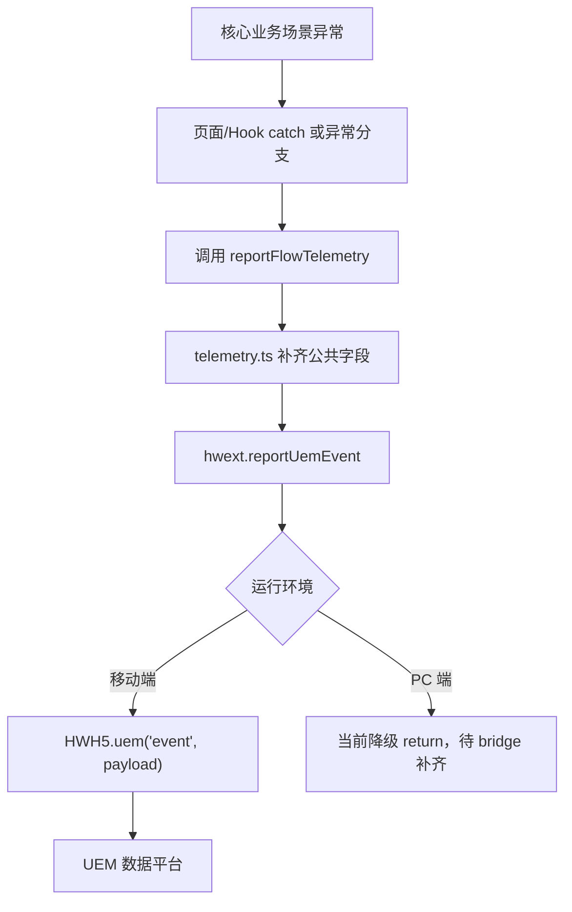
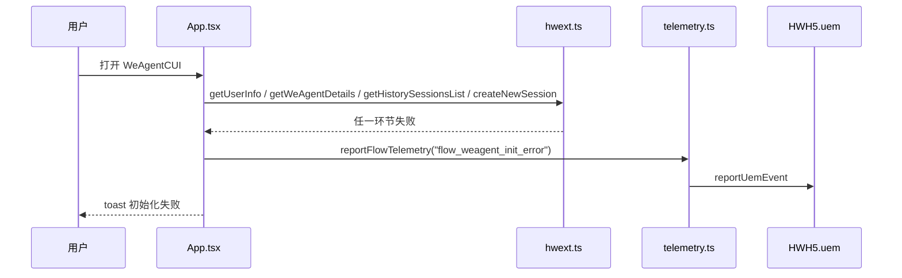
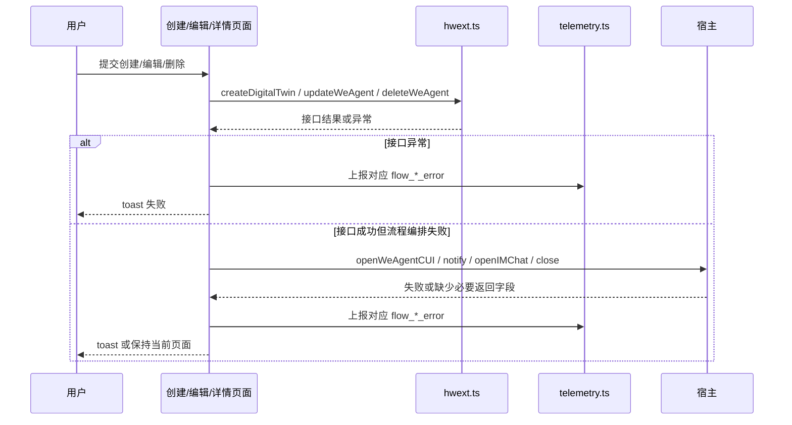

# `ai-chat-viewer 核心场景异常埋码数据上报方案`

- 方案日期：`2026-06-04`
- 目标工程：`ai-chat-viewer`
- 参考文档：`docs/plans/技术方案模板.md`、`docs/plans/2026-05-20-ai-chat-viewer-telemetry-plan.md`、`docs/requirements.md`
- 方案类型：`埋码增强 / 异常监控补齐`

## 1. 背景

### 1.1 场景说明

当前工程已经实现埋码上报能力，不需要从零建设：

1. `src/utils/hwext.ts` 已提供 `reportUemEvent(eventId, eventTitle, data)`，移动端通过 `window.HWH5.uem('event', payload)` 上报，PC 端当前直接 return，待 PC bridge ready 后补齐。
2. `src/utils/uemUtil.ts` 已集中封装点击埋码和接口成功 / 失败埋码，接口类埋码通过 `hwext.ts` 的 SDK API wrapper 统一接入。
3. `src/utils/telemetry.ts` 已封装 `reportApiSuccess`、`reportApiError`、`reportFlowTelemetry`、`installBrowserJsErrorTelemetry`，并已接入 `browser_js_error` 与 `flow_onmessage_error`。
4. `docs/plans/2026-05-20-ai-chat-viewer-telemetry-plan.md` 已沉淀当前已实现埋码总表。

现有能力已经覆盖接口异常和部分运行时异常，但核心业务流程中仍存在仅 `WeLog` + toast、未形成可聚合异常埋码的场景，例如会话初始化失败、打开助手失败、创建 / 编辑 / 删除助手流程失败、二维码创建流程的编排异常、宿主通知失败、缺少关键入参等。

### 1.2 需求目标

1. 复用现有 `reportFlowTelemetry` / `reportUemEvent` 埋码链路，补齐核心场景异常数据上报。
2. 将异常埋码聚焦在“流程级失败”，避免与已有 `api_*` 接口失败埋码重复。
3. 新增埋码字段可用于定位页面、流程阶段、会话、助理账号、错误码、错误信息和关键业务参数。
4. 保持 fire-and-forget 上报，不阻断页面跳转、toast、接口调用和宿主通信。

### 1.3 非目标

1. 不重构现有 `HWH5.uem` payload 结构。
2. 不变更现有点击埋码和 `api_*` 接口埋码事件名。
3. 不上报用户输入原文、消息正文、头像文件内容等敏感数据，仅上报长度、状态、标识类字段。
4. 不在本方案内实现 PC 端 UEM bridge，PC 端仍沿用当前 `reportUemEvent` 降级策略。

## 2. 方案图

### 2.1 整体方案图



### 2.2 方案核心

基于现有埋码链路新增流程异常事件，页面和 Hook 只在关键失败分支调用 `reportFlowTelemetry`，接口成功 / 失败继续由 `uemUtil.ts` 和 `hwext.ts` 的 API wrapper 负责。

## 3. 时序图

### 3.1 `WeAgentCUI 初始化异常`



### 3.2 `创建/编辑/删除助手流程异常`



## 4. 技术细节

### 4.1 调整点

1. 在 `src/utils/telemetry.ts` 继续使用 `reportFlowTelemetry` 作为流程异常统一出口，必要时新增轻量 helper：`reportCoreFlowError(eventId, eventTitle, payload, error)`，复用现有 `errorCode` / `errorMessage` 解析逻辑。
2. 在 `src/App.tsx` 的 `initializeWeAgentSession` catch 分支新增 `flow_weagent_init_error`；在缺少 `assistantAccount` 分支新增可选 `flow_weagent_missing_param_error`。
3. 在 `src/pages/selectAssistant.tsx`、`src/pages/switchAssistant.tsx` 的 `openAssistantByPartnerAccount` 失败或返回 `opened=false` 分支补充 `flow_open_weagent_error`。
4. 在 `src/pages/createAssistantBasic.tsx`、`src/pages/selectBrainAssistant.tsx` 的创建助手流程中补充 `flow_create_assistant_error`，覆盖创建接口异常、创建结果缺少 `partnerAccount`、创建后打开 IM / WeAgentCUI 失败。
5. 在 `src/components/assistant/EditAssistantContent.tsx` 补充 `flow_edit_assistant_error`，覆盖详情加载失败、更新失败、`notifyAssistantDetailUpdated` 失败和缺少目标标识。
6. 在 `src/pages/assistantDetail.tsx` 补充 `flow_delete_assistant_error`，覆盖删除失败和缺少 `partnerAccount` / `robotId`。
7. 在 `src/pages/skillCUI.tsx` 缺少 `welinkSessionId` 分支补充 `flow_skillcui_missing_param_error`，用于识别入口参数异常。
8. 保留现有 `flow_onmessage_error`、`browser_js_error`，并在总表文档同步新增事件。

### 4.2 核心实现方式

推荐新增一个流程异常上报薄封装，减少页面重复拼装错误字段：

```typescript
export function reportCoreFlowError(
  eventId: string,
  eventTitle: string,
  error: unknown,
  payload: Record<string, unknown> = {},
): void {
  void reportFlowTelemetry(eventId, eventTitle, {
    type: 'error',
    ...payload,
    errorCode: resolveErrorCode(error),
    errorMessage: resolveErrorMessage(error),
  });
}
```

若不调整 `telemetry.ts` 内部函数可见性，也可以直接在各 catch 中调用现有 `reportFlowTelemetry`，使用页面已知字段补充 `errorMessage: String(...)`。推荐 helper 方案的原因是统一错误截断、错误码解析和日志降级策略。

流程事件字段统一建议：

1. `page`：页面标识，如 `weAgentCUI`、`skillCUI`、`createAssistant`、`selectBrainAssistant`、`selectAssistant`、`switchAssistant`、`assistantDetail`、`editAssistant`。
2. `stage`：失败阶段，如 `init`、`loadList`、`openWeAgentCUI`、`createDigitalTwin`、`missingPartnerAccount`、`notifyHost`。
3. `assistantAccount` / `partnerAccount`：助理账号，字段名优先沿用当前页面已有语义。
4. `welinkSessionId`：会话页或会话相关场景传入。
5. `from` / `source`：入口来源，如 `qrcode`、`weAgent`、`assistantDetail`、`external`。
6. `isPc`：是否 PC 小程序环境。
7. `errorCode` / `errorMessage`：错误码和截断后的错误信息。

### 4.3 兼容与边界

1. 移动端继续通过 `HWH5.uem` 上报；`HWH5.uem` 不存在时由 `telemetry.ts` 捕获并写入 `WeLog`，不影响业务。
2. PC 端 `reportUemEvent` 当前直接 return，本次新增事件不会改变 PC 现有行为；待 PC bridge 支持后同一批事件可自动生效。
3. 异常埋码不 await，不阻塞用户操作、页面关闭和路由跳转。
4. 不上报消息正文、用户输入原文、头像文件路径原文；消息相关字段继续使用 `contentLength`。
5. 对“接口失败”场景，保留已有 `api_*` 事件；新增 `flow_*` 只记录流程阶段失败，允许同一次失败同时存在接口级和流程级数据，用于分别分析接口稳定性与用户流程损失。

### 4.4 相关接口联动

1. `reportUemEvent(eventId, eventTitle, data)`：最终 UEM 上报入口。
2. `reportFlowTelemetry(eventId, eventTitle, payload)`：流程类埋码统一入口。
3. `createNewSession`、`getHistorySessionsList`、`getSessionMessageHistory`、`sendMessage`、`replyPermission`、`stopSkill`、`sendMessageToIM`、`createDigitalTwin`、`queryQrcodeInfo`、`updateQrcodeInfo`、`getWeAgentDetails`、`getWeAgentList`、`updateWeAgent`、`deleteWeAgent`：已有 `api_*` 成功 / 失败埋码继续保留。
4. `openWeAgentCUI`、`notifyAssistantDetailUpdated`、`openH5Webview`、`openIMChat`、`close`：当前未统一包装接口埋码，建议在页面流程失败分支补 `flow_*`。

### 4.5 文档需要同步修改的内容

1. 更新 `docs/plans/2026-05-20-ai-chat-viewer-telemetry-plan.md`，新增流程异常埋码总表。
2. 如 `docs/requirements.md` 继续维护埋码要求，需追加核心场景异常埋码字段定义。
3. 若后续 PC bridge 支持 UEM，需要补充 PC 端上报行为说明。

## 5. 性能

新增异常埋码为异常路径 fire-and-forget 上报，不增加正常路径的同步等待。`telemetry.ts` 已缓存 `getTelemetryBase()`，公共字段不会在每次上报都重复请求设备和应用信息。异常高频场景主要是 JS 运行时错误，现有 `installBrowserJsErrorTelemetry` 已做 3 秒同指纹节流；新增流程异常一般由用户动作或页面初始化触发，频率可控。

## 6. 功耗

不新增轮询、长连接、后台任务、动画或频繁刷新。仅在异常发生时触发一次 UEM 上报，对功耗影响可忽略。

## 7. 埋码

### 7.1 已实现埋码现状

| 分类 | 事件 | 当前接入模块 | 覆盖场景 | 备注 |
|---|---|---|---|---|
| 点击 | `activate_select_assistant_click` | `activateAssistant.tsx`、`uemUtil.ts` | 激活页点击“选择助理” | 已实现 |
| 点击 | `select_assistant_create_click` | `selectAssistant.tsx`、`uemUtil.ts` | 选择助理页点击“创建助理” | 已实现 |
| 点击 | `select_assistant_start_click` | `selectAssistant.tsx`、`uemUtil.ts` | 选择助理页点击“开始使用” | 已实现 |
| 点击 | `switch_assistant_confirm_click` | `switchAssistant.tsx`、`uemUtil.ts` | 切换助理页点击“确认切换” | 已实现 |
| 点击 | `weagent_history_click` | `WeAgentHistorySidebar.tsx`、`uemUtil.ts` | WeAgentCUI 点击历史会话 | 已实现 |
| 点击 | `weagent_create_session_click` | `App.tsx`、`uemUtil.ts` | WeAgentCUI 点击创建会话 | 已实现 |
| 点击 | `weagent_send_message_click` | `useChatSession.ts`、`uemUtil.ts` | WeAgentCUI / skillCUI 点击发送消息 | 已实现，只记录点击与内容长度，不记录流式耗时 |
| 接口 | `api_create_new_session` | `hwext.ts`、`uemUtil.ts` | 创建会话成功 / 失败 | 已实现 |
| 接口 | `api_get_history_sessions` | `hwext.ts`、`uemUtil.ts` | 获取历史会话成功 / 失败 | 已实现 |
| 接口 | `api_get_session_message_history` | `hwext.ts`、`uemUtil.ts` | 获取历史消息成功 / 失败 | 已实现 |
| 接口 | `api_send_message` | `hwext.ts`、`uemUtil.ts` | 发送消息接口成功 / 失败 | 已实现 |
| 接口 | `api_reply_permission` | `hwext.ts`、`uemUtil.ts` | 权限回复成功 / 失败 | 已实现 |
| 接口 | `api_create_digital_twin` | `hwext.ts`、`uemUtil.ts` | 创建助理成功 / 失败 | 已实现 |
| 接口 | `api_query_qrcode_info` | `hwext.ts`、`uemUtil.ts` | 查询二维码信息成功 / 失败 | 已实现 |
| 接口 | `api_update_qrcode_info` | `hwext.ts`、`uemUtil.ts` | 更新二维码状态成功 / 失败 | 已实现 |
| 接口 | `api_get_weagent_details` | `hwext.ts`、`uemUtil.ts` | 获取助理详情成功 / 失败 | 已实现 |
| 接口 | `api_get_weagent_list` | `hwext.ts`、`uemUtil.ts` | 获取助理列表成功 / 失败 | 已实现 |
| 接口 | `api_stop_skill` | `hwext.ts`、`uemUtil.ts` | 停止生成成功 / 失败 | 已实现 |
| 接口 | `api_send_message_to_im` | `hwext.ts`、`uemUtil.ts` | 发送到 IM 成功 / 失败 | 已实现 |
| 接口 | `api_update_weagent` | `hwext.ts`、`uemUtil.ts` | 更新助理成功 / 失败 | 已实现 |
| 接口 | `api_delete_weagent` | `hwext.ts`、`uemUtil.ts` | 删除助理成功 / 失败 | 已实现 |
| 流程异常 | `flow_onmessage_error` | `useChatSession.ts`、`telemetry.ts` | `onMessage` 收到错误消息或 listener error | 已实现 |
| 浏览器异常 | `browser_js_error` | `App.tsx`、`skillCUI.tsx`、`telemetry.ts` | 浏览器运行时脚本异常 | 已实现，3 秒同指纹节流 |

### 7.2 拟新增异常埋码

| 分类 | 事件 | 接入模块 | 触发时机 | 建议字段 |
|---|---|---|---|---|
| 流程异常 | `flow_weagent_init_error` | `App.tsx` | 初始化 WeAgentCUI 失败，覆盖用户信息、助手详情、历史会话、兜底创建会话等任一阶段失败 | `page`、`stage`、`assistantAccount`、`isPc`、`errorCode`、`errorMessage` |
| 流程异常 | `flow_weagent_missing_param_error` | `App.tsx` | 进入 WeAgentCUI 但缺少 `assistantAccount` | `page`、`stage: 'missingAssistantAccount'`、`isPc` |
| 流程异常 | `flow_open_weagent_error` | `selectAssistant.tsx`、`switchAssistant.tsx` | 选择助理 / 切换助理后打开 WeAgentCUI 失败或 `openAssistantByPartnerAccount` 未成功打开 | `page`、`stage`、`selectedAssistantId` / `selectedPartnerAccount`、`isPc`、`errorCode`、`errorMessage` |
| 流程异常 | `flow_create_assistant_error` | `createAssistantBasic.tsx`、`selectBrainAssistant.tsx` | 创建助理流程失败，包括二维码校验、创建结果缺少 `partnerAccount`、创建后打开 IM / WeAgentCUI 失败 | `page`、`stage`、`from`、`qrcode`、`weCrewType`、`bizRobotId`、`isPc`、`errorCode`、`errorMessage` |
| 流程异常 | `flow_edit_assistant_error` | `EditAssistantContent.tsx` | 编辑助理流程失败，包括详情加载、目标标识缺失、更新接口失败、通知宿主失败 | `page`、`stage`、`source`、`partnerAccount`、`robotId`、`isPc`、`errorCode`、`errorMessage` |
| 流程异常 | `flow_delete_assistant_error` | `assistantDetail.tsx` | 删除助理流程失败，包括目标标识缺失、删除接口异常 | `page`、`stage`、`partnerAccount`、`robotId`、`isPc`、`errorCode`、`errorMessage` |
| 流程异常 | `flow_skillcui_missing_param_error` | `skillCUI.tsx` | `skillCUI` 页面缺少 `welinkSessionId` | `page`、`stage: 'missingWelinkSessionId'`、`isPc` |
| 流程异常 | `flow_host_bridge_error` | `createAssistantFlow.ts` 或具体页面 | 宿主桥接能力调用失败，如 `notifyAssistantDetailUpdated`、`openIMChat`、`close`、`navigateBack` 等非接口 wrapper 能力 | `page`、`stage`、`bridgeMethod`、`isPc`、`errorCode`、`errorMessage` |

### 7.3 埋码安全与字段约束

| 约束项 | 规则 |
|---|---|
| 用户输入 | 不上报用户输入原文、问题答案原文、消息正文、AI 回复正文 |
| 标识字段 | `assistantAccount`、`welinkSessionId`、`messageId` 沿用当前工程既有口径；如数据安全要求升级，应支持改为哈希或只上报是否存在 |
| 错误信息 | `errorMessage` 沿用 `telemetry.ts` 截断策略，且不得拼接输入原文 |
| 字段构造 | 使用白名单字段构造 payload，不直接透传完整事件对象、消息对象或命令对象 |

## 8. 影响范围

### 8.1 直接影响

1. `src/utils/telemetry.ts`：新增或复用流程异常上报 helper。
2. `src/App.tsx`：WeAgentCUI 初始化和创建新会话流程异常。
3. `src/pages/skillCUI.tsx`：缺少 `welinkSessionId` 的入口异常。
4. `src/pages/selectAssistant.tsx`、`src/pages/switchAssistant.tsx`：打开 / 切换助手异常。
5. `src/pages/createAssistantBasic.tsx`、`src/pages/selectBrainAssistant.tsx`：创建助手异常。
6. `src/components/assistant/EditAssistantContent.tsx`：编辑助手异常。
7. `src/pages/assistantDetail.tsx`：删除助手异常。

### 8.2 间接影响

1. UEM 数据平台会新增 `flow_*` 事件，需要数据侧同步事件白名单、看板或告警规则。
2. 测试用例需要 mock `reportFlowTelemetry` 或 `reportUemEvent`，避免异步上报影响断言。
3. 文档总表需同步，避免后续维护者误删或重复新增事件。

### 8.3 不影响

1. 不影响现有页面 UI 和交互文案。
2. 不影响现有 `api_*` 埋码事件名、字段和调用时机。
3. 不影响消息渲染、流式协议解析、历史会话分页逻辑。
4. 不影响构建产物入口和外部 SDK API 签名。

## 9. 测试范围

### 9.1 功能测试

1. Mock `getWeAgentDetails` / `getHistorySessionsList` / `createNewSession` 失败，验证 `flow_weagent_init_error` 被触发且页面仍 toast 初始化失败。
2. Mock `openAssistantByPartnerAccount` throw 或返回 false，验证 `flow_open_weagent_error` 被触发。
3. Mock `createDigitalTwin` 成功但缺少 `partnerAccount`，验证 `flow_create_assistant_error` 的 `stage` 为 `missingPartnerAccount`。
4. Mock `notifyAssistantDetailUpdated` 失败，验证 `flow_edit_assistant_error` 被触发且不关闭页面。
5. Mock `deleteWeAgent` 失败或目标标识缺失，验证 `flow_delete_assistant_error` 被触发。
6. `skillCUI` 不传 `welinkSessionId`，验证 `flow_skillcui_missing_param_error` 触发一次，不随渲染重复上报。
### 9.2 兼容测试

1. 移动端 `window.HWH5.uem` 可用时，验证 payload 结构仍为 `{ type, code, name, result, msg, duration, data }`。
2. 移动端 `window.HWH5.uem` 不可用时，验证业务不崩溃，`telemetry.ts` 捕获异常并写 `WeLog`。
3. PC 小程序环境下，验证新增埋码调用不影响既有流程，`reportUemEvent` 仍按当前逻辑 return。
4. 中英文环境下，验证埋码不依赖页面文案，事件名和字段稳定。
### 9.3 文档一致性检查

1. 新增事件需同步到 `docs/plans/2026-05-20-ai-chat-viewer-telemetry-plan.md`。
2. `docs/requirements.md` 中埋码章节需与代码事件名、字段保持一致。
3. 若新增 helper，需在代码注释或文档中说明流程埋码、接口埋码的边界，避免重复维护。

## 10. 最终建议

最终结论：推荐复用现有 `telemetry.ts` + `hwext.reportUemEvent` 链路，补齐 `flow_weagent_init_error`、`flow_open_weagent_error`、`flow_create_assistant_error`、`flow_edit_assistant_error`、`flow_delete_assistant_error`、`flow_skillcui_missing_param_error` 等核心流程异常埋码。该方案改动小、与当前埋码架构一致、不会阻塞业务流程；代价是同一次失败可能同时出现接口级 `api_*` 和流程级 `flow_*` 数据，需要数据分析侧按事件维度区分“接口稳定性”和“用户流程损失”。后续动作建议先实现 `reportCoreFlowError`，再按页面和 Hook 逐个补点，并同步更新埋码总表、数据看板口径与单元测试。
