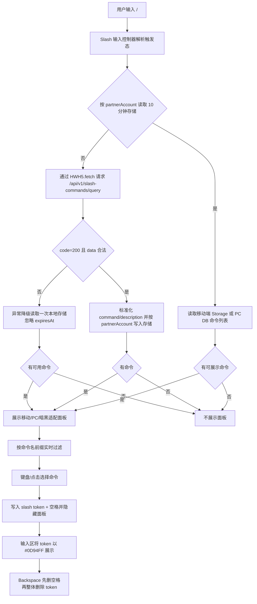
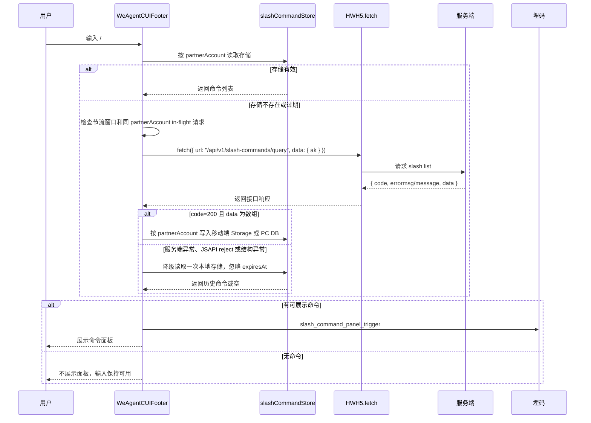
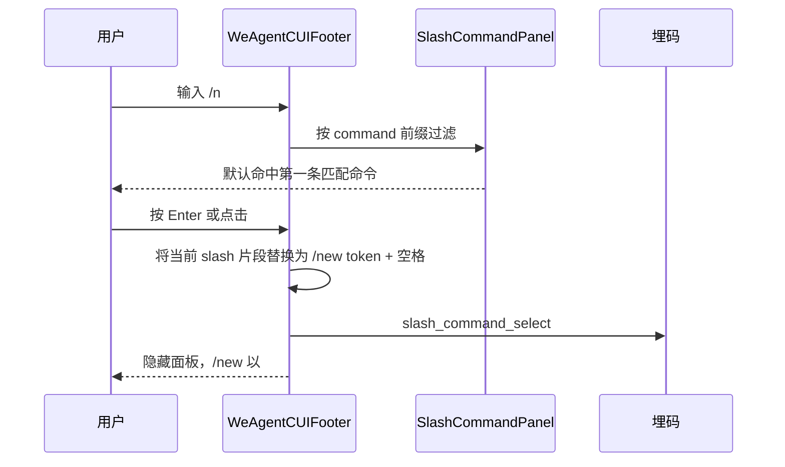

# `ai-chat-viewer Slash 命令联想方案`

- 方案日期：`2026-06-04`
- 目标工程：`ai-chat-viewer`
- 参考文档：`docs/plans/技术方案模板.md`、`docs/plans/2026-05-20-ai-chat-viewer-telemetry-plan.md`、`docs/requirements.md`
- 方案类型：`前端交互增强 / HWH5.fetch 接口接入 / 埋码补充`

## 1. 背景

### 1.1 场景说明

当前 `ai-chat-viewer` 的助手对话输入框尚未实现 slash 命令联想。用户在 `WeAgentCUI` 与 agent 对话时，如果需要使用 `/new`、`/help` 这类命令，必须手动输入完整命令；当助手支持的命令较多时，用户难以记忆命令名称，导致命令能力发现成本高、输入效率低。

本次 slash 命令列表获取方式与以往 SDK bridge 能力不同：不通过 `src/utils/hwext.ts` 内的 `getJsApiOrThrow()`、`window.HWH5EXT` 扩展方法或 PC `Pedestal.callMethod` 包装新增 bridge 方法，而是由纯前端直接调用 `HWH5.fetch` JSAPI 请求接口 `/api/v1/slash-commands/query` 获取命令列表。

从现有代码看：

1. `src/components/assistant/WeAgentCUIFooter.tsx` 是 `WeAgentCUI` 输入区，移动端使用 `input`，PC 端使用 `textarea`，内部维护本地 `value` 并通过 `onSend(trimmedValue)` 发送。
2. `src/components/skillCUI/SkillCUIFooter.tsx` 是 `skillCUI` 输入区，当前也使用 `input`。
3. `src/hooks/useChatSession.ts` 统一处理发送、停止生成、历史消息加载等会话逻辑，发送内容最终进入 `hwext.sendMessage`。
4. `src/utils/hwext.ts` 仍负责既有 SDK bridge 能力适配；本次 slash list 接口不在该文件新增 `getSlashCommands` wrapper。
5. `src/utils/uemUtil.ts` 是现有埋码封装入口，slash 触发、选择和接口结果可继续在该层补充统一上报方法。

### 1.2 需求目标

1. 用户在助手对话输入框输入 `/` 时，若当前应用存在可用命令，则展示 slash 命令联想面板；接口耗时与超时策略由服务端控制，前端不再做固定时长展示窗口判断。
2. 通过 `HWH5.fetch` 请求 `/api/v1/slash-commands/query` 获取命令列表，请求参数为 `{ "ak": "appkey" }`。
3. 支持按命令名从前到后精确前缀匹配过滤，例如 `/n` 只匹配命令名以 `/n` 或 `n` 开头的命令，不匹配描述。
4. 面板展示 `command` 和 `description`，描述超长单行省略，不换行；面板最多展示 10 行，超出后滚动查看更多。
5. 输入 `/` 后默认不命中；输入后若存在匹配命令，则默认命中第一条，支持回车选中，选中后填充命令并自动追加空格。
6. 当前没有命令时不展示面板；从服务端获取异常或响应结构异常时，前端只降级读取一次本地存储数据，本次读取忽略 10 分钟过期标识，仍无可用命令则不展示面板，不阻断输入与发送。
7. slash 命令列表本地存储 10 分钟，移动端使用 `HWH5.getStorage` / `HWH5.setStorage`，PC 端写入 DB；存储 key 使用 `partnerAccount`，不使用 `ak`。
8. slash 命令作为整体 token 删除，提升命令编辑体验。
9. 选中的 slash 命令需要在输入区中呈现为独立 token，命令文本颜色为 `#0D94FF`；选中后自动追加一个空格，删除时先删除空格，再将 slash 命令整体删除。
10. UI 适配移动端与 PC 端显示，并支持浅色与暗黑模式。
11. 频繁输入 `/` 或反复进入 slash 触发态时，需要对 slash list 请求做节流、in-flight 复用和存储命中保护，避免短时间重复请求。
12. slash list 面板支持 Enter 选择、ArrowUp / ArrowDown 上下移动高亮、Escape 关闭弹窗。
13. 补充 slash 面板触发数、slash 命令选择次数、slash list 接口成功/失败埋码。

### 1.3 非目标

1. 不在本期实现多命令组合、嵌套参数提示、命令参数 schema 表单化。
2. 不改变 `sendMessage` 的既有发送协议，选中命令后仍以文本内容的一部分发送。
3. 不在输入过程中实时请求服务端过滤，过滤在本地命令列表上完成。
4. 不将描述文本作为过滤条件。
5. 不新增 `HWH5EXT.getSlashCommands`、`hwext.getSlashCommands` 或 `Pedestal.callMethod` bridge wrapper。
6. 不要求本期改造消息渲染协议或服务端流式返回协议。

## 2. 方案图

### 2.1 整体方案图



### 2.2 方案核心

在 `WeAgentCUIFooter` 中引入 slash 命令输入控制器、`HWH5.fetch` 命令列表请求、跨端持久化存储、联想面板和可渲染 token 的输入区；请求接口仍使用 `ak`，命令列表存储按 `partnerAccount` 维度隔离 10 分钟，接口耗时控制交给服务端。服务端获取异常时，前端只做一次忽略过期标识的本地存储降级读取，避免在服务端和存储之间循环拉取。选中命令后将 `/command` 作为独立 token 展示，颜色固定为 `#0D94FF`，发送时仍转换为普通文本。

## 3. 时序图

### 3.1 `输入 / 触发命令面板`



### 3.2 `过滤并选择命令`



## 4. 技术细节

### 4.1 调整点

1. 新增 `src/types/slashCommand.ts` 或在相关 hook 内定义前端类型：
   - `SlashCommandItem { command: string; description: string }`
   - `SlashCommandQueryParams { ak: string }`
   - `SlashCommandStorageContext { partnerAccount: string; isPcMiniApp: boolean }`
   - `SlashCommandQuerySuccess { code: 200; errormsg: string; data: SlashCommandItem[] }`
   - `SlashCommandQueryError { code: number; message: string }`
2. 新增 `src/utils/slashCommandApi.ts`，封装纯前端 `HWH5.fetch` 调用，不依赖 `src/utils/hwext.ts`：
   - URL：`/api/v1/slash-commands/query`
   - 请求参数：`{ "ak": "appkey" }`
   - 成功判断：`response.code === 200 && Array.isArray(response.data)`
   - 失败判断：`code !== 200`、`message` 非空、JSAPI reject、超时、结构不合法。
3. `src/utils/uemUtil.ts` 新增 `trackApiSlashCommandQuery`，复用现有 `api_*` 成功/失败埋码模式；同时新增交互埋码 `reportSlashCommandPanelTrigger`、`reportSlashCommandSelect`。
4. 新增 `src/utils/slashCommandStore.ts`，按 `partnerAccount` 做 10 分钟跨端持久化存储：
   - 移动端：使用 `HWH5.getStorage` / `HWH5.setStorage`。
   - PC 端：写入 PC DB，具体 DB JSAPI 或封装方法待确认。
   - 存储值包含 `expiresAt`、`partnerAccount` 与标准化后的命令列表。
5. 新增 `src/hooks/useSlashCommandSuggest.ts`，封装触发检测、存储读取、请求节流、in-flight 复用、服务端异常后一次性本地存储降级读取、本地过滤、键盘高亮和选择回填。
6. 新增 `src/components/assistant/SlashCommandPanel.tsx`，负责展示最多 10 行的命令联想面板、滚动、hover、click、aria 状态、浅色/暗黑样式 class。
7. 新增或改造 `src/components/assistant/SlashCommandComposer.tsx`，负责可渲染 token 的输入区、selection 管理、placeholder、纯文本序列化、IME 组合输入、Backspace / Delete 删除规则和移动/PC 两套尺寸表现。
8. 改造 `src/components/assistant/WeAgentCUIFooter.tsx`：
   - 接收或读取 `ak`，作为 slash list 查询入参。
   - 接收或读取 `partnerAccount`，作为 slash list 存储 key 和隔离维度。
   - 将移动端 `input` 和 PC 端 `textarea` 升级为可渲染 slash token 的 composer 输入区，或抽取新的 `SlashCommandComposer` 组件承载文本节点、slash token、光标和键盘行为。
   - 在 `onKeyDown` 中优先处理 slash 面板的 Enter / ArrowUp / ArrowDown / Escape，再处理发送快捷键。
   - 在 Backspace / Delete 中处理空格与已选 slash token 的分段删除：先删除 token 后方空格，再整体删除 token。
9. `src/App.tsx` 或页面入口补充 `ak`、`partnerAccount` 获取与透传路径，若当前工程已有 appkey 和助理账号来源，应复用既有来源。
10. `src/styles/WeAgentCUIFooter.less` 或组件样式文件新增移动端、PC 端、暗黑模式下的面板样式，以及 slash token 的 `#0D94FF` 文本样式。
11. `src/mocks/installJsApiMock.ts` 可补充 `HWH5.fetch` mock 或在 slash API 封装层提供可替换 fetcher，保障本地调试。

### 4.2 核心实现方式

#### 4.2.1 接口协议

请求接口：

```text
/api/v1/slash-commands/query
```

请求方式：通过 `HWH5.fetch` JSAPI 发起，具体 method 待接口文档确认；若无特殊要求，推荐使用 `POST` 并将请求参数放入 body。

请求参数：

```json
{
  "ak": "appkey"
}
```

正常响应：

```json
{
  "code": 200,
  "errormsg": "",
  "data": [
    {
      "command": "/new",
      "description": "新建会话"
    },
    {
      "command": "/new",
      "description": "新建会话"
    }
  ]
}
```

错误响应：

```json
{
  "code": 500,
  "message": "查询失败：错误详情"
}
```

前端解析规则：

1. 仅当 `code === 200` 且 `data` 为数组时视为成功。
2. `errormsg` 只在成功结构中兼容读取；失败结构以 `message` 作为错误说明。
3. `command` 必须为非空字符串；无效项过滤掉，不让单条脏数据影响整个面板。
4. `description` 非字符串时按空字符串处理。
5. 服务端可能返回重复命令时，前端不按 `command` 去重；fetch 到多少条有效数据就缓存多少条、展示多少条，保持与服务端配置一致。渲染列表时使用 `command + index` 或服务端唯一 id 作为 key，避免重复 command 造成 React key 冲突。
6. `command` 推荐保留服务端返回的 `/` 前缀；若服务端未来返回无 `/` 前缀，前端展示和回填时补齐 `/`。

#### 4.2.2 HWH5.fetch 封装

推荐封装为 `querySlashCommands({ ak, partnerAccount })`：

1. 函数内部检查 `window.HWH5?.fetch` 是否可用；不可用时 reject 并上报接口失败。
2. 前端不设置固定时长展示窗口，不按本地计时器主动取消或压制面板展示；接口耗时、超时和数据可用性由服务端控制，前端只处理最终成功、失败或 JSAPI reject。
3. 网络请求成功后按 `partnerAccount` 写入移动端 Storage 或 PC DB，供下一次 slash 触发直接命中。
4. 接口错误、JSAPI reject、解析异常统一转换为前端错误对象，交给 hook 触发一次性本地存储降级读取。
5. 不在 `src/utils/hwext.ts` 新增 wrapper，避免把普通 HTTP 接口误归类为 SDK bridge 能力。

#### 4.2.3 Slash list 存储策略

存储 key 必须使用 `partnerAccount`，不使用 `ak`。推荐 key 格式为 `slash_commands:${partnerAccount}`，value 结构为：

```json
{
  "partnerAccount": "assistant_partner_account",
  "expiresAt": 1781179200000,
  "commands": [
    {
      "command": "/new",
      "description": "新建会话"
    }
  ]
}
```

跨端存储方式：

1. 移动端：读取时调用 `HWH5.getStorage({ key })`，写入时调用 `HWH5.setStorage({ key, data })`；若宿主 Storage 能力不可用，则退化为当前页面生命周期内的内存缓存。
2. PC 端：通过 PC DB 读写同一 key；具体 DB API、表名、序列化格式和清理策略待确认。若 DB 能力不可用，则退化为当前页面生命周期内的内存缓存。
3. 内存层仍保留同 `partnerAccount` 的 in-flight promise，避免一次存储 miss 后并发发出多次相同请求。
4. `ak` 只作为 `/api/v1/slash-commands/query` 的请求参数，不参与存储 key，避免 appkey 变化导致同一助手命令列表重复存储。
5. `partnerAccount` 缺失时不读写持久化存储；若 `ak` 存在，可按本次触发临时请求并只写内存缓存，或者直接不请求，最终策略待产品与宿主上下文确认。
6. 常规读取需要校验 `expiresAt`，超过 10 分钟视为存储失效并请求服务端。
7. 服务端获取异常后的降级读取只允许执行一次，且本次读取忽略 `expiresAt`；降级读取得到数据后只用于本次展示，不再次触发服务端请求，也不因为过期标识继续回到“请求服务端”分支。
8. 建议在 hook 内维护 `fallbackReadTried` 或等价状态，确保一次 slash 触发链路中最多执行一次“服务端异常后读本地旧数据”的降级动作，避免 Storage / DB 与服务端循环读取 slash list。

#### 4.2.4 触发、节流与过滤规则

输入控制器维护当前输入值、光标位置和 slash 片段：

1. 仅当光标前存在一个有效 slash 片段时进入联想态。
2. 有效 slash 片段建议规则：`/` 位于输入开头，或前一个字符为空白；`/` 后到光标之间不包含空白。
3. 同一 `partnerAccount` 在存储 miss 后如果已有 in-flight 请求，后续触发复用同一个 promise，不再发起新请求。
4. 对频繁输入 `/`、删除后再次输入 `/`、焦点来回切换等场景增加节流窗口，建议同一 `partnerAccount` 1 秒内最多触发一次网络请求。
5. 对失败结果增加短失败冷却，建议 3 秒内不重复请求同一 `partnerAccount`，避免接口异常时连续打点和连续请求。
6. 用户只输入 `/` 时，展示全量命令列表，但不默认高亮任何命令。
7. 用户输入 `/n` 时，取查询串 `n`，用标准化命令名做前缀匹配；`/new` 和 `new` 两种返回形态都应匹配。
8. 只匹配 `command`，不匹配 `description`。
9. 若过滤结果为空，则隐藏面板；按需求“没有命令不出现面板”，不推荐展示空态。

#### 4.2.5 面板 UI

面板定位在输入框上方，移动端、PC 端与暗黑模式分别处理：

1. 移动端：面板宽度跟随 footer 内容区，左右保留安全边距；底部避让键盘抬起和安全区，最大高度不超过可视区域的 40%。
2. PC 端：面板宽度建议 320px 至 420px，靠 composer 左侧或光标附近展示，不遮挡发送按钮；composer 多行增长时，面板仍贴近输入区上方。
3. 每行固定高度，建议 36px 至 40px；面板最大高度为 `10 * rowHeight`。
4. `overflow-y: auto` 支持滚动查看更多，滚动条在 PC 可见，移动端沿用系统滚动体验。
5. 命令名展示为 `command`；描述展示为 `description`。
6. 描述容器使用 `white-space: nowrap; overflow: hidden; text-overflow: ellipsis;`，不换行。
7. 暗黑模式下背景、边框、hover、高亮、文字颜色使用现有主题变量；若缺少变量，新增局部 CSS 变量并跟随 `prefers-color-scheme: dark` 或工程既有 dark class。
8. 高亮态需要同时满足鼠标 hover、键盘选中和暗黑可读性，文字对比度不低于常规可读标准。
9. 面板打开时不改变 footer 高度，不顶起消息列表，避免移动端键盘场景产生明显布局跳动。
10. 键盘交互：Enter 选择当前高亮命令；ArrowDown 移动到下一条，最后一条继续按时保持在最后一条或循环到第一条，推荐保持在最后一条以降低误选；ArrowUp 移动到上一条；Escape 关闭弹窗并保留输入内容和焦点。
11. 键盘事件只在面板打开时拦截；面板关闭后恢复输入框原有 Enter 发送和方向键移动光标行为。

#### 4.2.6 Token 输入区、回填与整体删除

当前移动端 `input` 和 PC 端 `textarea` 只能显示纯文本，无法将 `/new` 局部渲染为 `#0D94FF`，也无法在浏览器原生编辑模型中稳定保证“命令作为整体节点删除”。为满足新的 UI 与删除要求，本期推荐将 `WeAgentCUIFooter` 的输入区升级为可渲染 token 的 composer 组件，优先采用 `contenteditable` 容器或等价的自定义输入层。

推荐状态模型：

```ts
type ComposerSegment =
  | { type: 'text'; text: string }
  | { type: 'slashCommand'; command: string; description?: string };
```

核心规则：

1. 选中命令后，将当前 slash 片段替换为一个 `slashCommand` segment，并在其后追加一个普通文本空格。展示层将 token 渲染为不可拆分节点，例如 `<span data-slash-token="/new">/new</span>`，文字颜色为 `#0D94FF`。
2. 输入区内部可以维护 segment 模型，但对外 `value`、`onSend`、埋码和下游 `sendMessage` 仍使用纯文本序列化结果，例如 `/new 帮我创建会话`。
3. Backspace 删除规则：
   - 光标位于 slash token 后方空格之后时，第一次 Backspace 只删除普通空格。
   - 空格被删除后，光标紧贴 slash token 右侧时，再次 Backspace 整体删除该 token。
   - 光标位于 token 前方时按普通文本规则处理，不反向删除 token。
4. Delete 删除规则：
   - 光标位于 token 左侧时，一次 Delete 整体删除 token。
   - 光标位于 token 右侧且后方为空格时，Delete 先删除空格；如果紧贴 token 的删除语义与 Backspace 有冲突，以平台原生直觉和测试结果为准，最终在组件内保持 PC 与移动端一致。
5. 选区删除规则：
   - 选区完整覆盖 slash token 时，删除整个 token。
   - 选区部分覆盖 token 时，按覆盖整个 token 处理，避免留下 `/ne` 这类半截命令。
6. 用户粘贴纯文本时，需要将粘贴内容插入为 text segment；若粘贴内容包含 `/new`，不自动转换为 token，只有通过 slash 面板选择的命令才成为 token。
7. 用户在 token 内部点击或尝试编辑时，不允许将光标落入 token 内部；光标只能停在 token 前后，避免 token 被拆分。
8. 空输入、placeholder、发送按钮禁用状态、Enter 发送快捷键、IME 组合输入需要继续保持现有行为。
9. 如果最低版本或宿主 WebView 对 `contenteditable` selection 支持不足，可降级为纯文本输入框：保留 `/new ` 回填和发送，不展示蓝色 token，不启用整体 token 删除；该降级路径必须通过版本门禁控制。

样式规则：

1. slash token 颜色固定为 `#0D94FF`，不随浅色/暗黑主题变化。
2. token 背景默认透明，避免破坏输入框视觉；如后续产品要求 pill 样式，可在不改变 segment 模型的前提下增加浅蓝背景和圆角。
3. token 与后续文本之间的空格是普通文本，不属于 token 节点，保证删除时可以先删除空格。
4. contenteditable 容器需要模拟原 `input` / `textarea` 的高度、placeholder、focus、disabled、滚动和多行表现，移动端保持单行体验，PC 端保持 textarea 式多行体验。

### 4.3 兼容与边界

1. IME 组合输入期间不处理 slash 快捷键，沿用当前 `event.nativeEvent.isComposing` 判断。
2. 面板打开时 Enter 优先选择命令；没有高亮命令时 Enter 仍按原发送逻辑处理，避免只输入 `/` 时误选。
3. 面板打开时 ArrowUp / ArrowDown 只移动高亮，不移动输入框光标；Escape 关闭面板。
4. 当前没有命令时不展示面板；接口失败、JSAPI reject、返回结构异常时，先降级读取一次本地存储数据，本次忽略 `expiresAt`，仍无可用命令则不展示面板，输入框保持可用。
5. 存储按 `partnerAccount` 维度隔离；切换助手或 `partnerAccount` 变化时读取对应存储，不复用其他助手命令。
6. 如果 `partnerAccount` 缺失，不读写持久化存储，并上报可选失败原因 `missing_partner_account`。
7. 如果 `ak` 缺失，不发起接口请求，不展示面板，并上报可选失败原因 `missing_ak`。
8. 如果 `window.HWH5?.fetch` 不存在，页面不崩溃；本次 slash list 获取失败并静默降级。
9. 最低版本能力需要显式门禁：`HWH5.fetch`、移动端 `HWH5.getStorage` / `HWH5.setStorage`、PC DB 能力分别按端判断；最低支持版本待宿主确认，建议收口到 `src/utils/versionCheck.ts` 的 `canIUse.slashCommandSuggest()` 和 `canIUse.slashCommandStorage()`。
10. 低于最低版本时，slash 联想可整体关闭，或只启用无持久化的内存缓存降级；推荐优先关闭接口请求和弹窗，避免旧客户端 JSAPI 缺失导致异常。
11. 命令名称建议标准化为带 `/` 的形式缓存，避免展示和回填出现 `new` 与 `/new` 混用。
12. 如果命令列表超过 10 条，面板高度固定，只通过滚动查看更多，不把页面 footer 顶高。
13. 如果描述为空，命令行仍展示命令名，描述区域留空或隐藏。
14. `skillCUI` 当前没有明确 `ak`、`partnerAccount` 与 slash 业务语义，是否接入 slash 命令待确认；本方案主路径先覆盖助手对话界面 `WeAgentCUI`。
15. 一次 slash 触发链路中，服务端异常后的本地降级读取最多执行一次；降级读取不再触发服务端请求，避免“服务端失败 -> 读到过期存储 -> 再请求服务端 -> 再失败”的循环。
16. 埋码字段必须通过白名单构造，具体安全与隐私约束收敛到 `## 7. 埋码` 中说明。

### 4.4 相关接口联动

1. Slash list 接口：`/api/v1/slash-commands/query`。
   - 调用方式：`HWH5.fetch` JSAPI。
   - 入参：`{ "ak": "appkey" }`。
   - 成功出参：`{ code: 200, errormsg: "", data: [{ command: "/new", description: "新建会话" }] }`。
   - 错误出参：`{ code: 500, message: "查询失败：错误详情" }`。
2. 移动端存储：`HWH5.getStorage` / `HWH5.setStorage`，key 使用 `slash_commands:${partnerAccount}`。
3. PC 端存储：写入 PC DB，key 同样使用 `slash_commands:${partnerAccount}`；具体 DB API 待确认。
4. 版本门禁：复用 `getAppInfo().versionName` 和 `src/utils/versionCheck.ts` 的能力判断方式，最低版本待确认。
5. `sendMessage(params)`：不新增字段，选中 slash 命令后仍通过 `content` 发送，例如 `/new 帮我创建一个会话`。
6. `reportUemEvent(eventId, eventTitle, data)`：复用现有 UEM 上报入口。
7. `reportApiSuccess` / `reportApiError`：为 `api_slash_commands_query` 记录接口成功/失败。
8. `src/utils/hwext.ts`：不新增本接口 wrapper；仅继续承载既有 SDK bridge 能力。

### 4.5 文档需要同步修改的内容

1. `docs/plans/2026-05-20-ai-chat-viewer-telemetry-plan.md`：新增 slash 命令触发、选择、接口埋码说明。
2. `docs/requirements.md`：补充 slash 命令联想交互、跨端存储、节流、服务端异常降级、整体删除、移动/PC/暗黑适配规则。
3. `docs/weAgentCUI-mock-debug.md`：补充 mock 环境 `HWH5.fetch`、`HWH5.getStorage`、`HWH5.setStorage` 和 PC DB slash list 返回示例与调试方式。
4. 若存在接口文档：同步 `/api/v1/slash-commands/query` 的 method、header、鉴权、服务端耗时控制、错误码说明。
5. 若存在版本矩阵文档：同步 slash 联想、移动端 Storage、PC DB 的最低客户端版本。

## 5. 性能

本方案新增一次 slash 命令列表请求，但通过 10 分钟跨端持久化存储、同 `partnerAccount` in-flight 复用和请求节流控制请求频率。输入过滤只在本地数组上执行，命令数量通常较小，即使数百条也可在单次输入变更内完成；若未来命令量超过 1000 条，可对命令名小写结果做预计算。

前端不再实现固定时长展示窗口，也不通过本地计时器控制 slash list 请求可见性；接口耗时与超时策略由服务端控制。前端只负责存储优先、请求节流、in-flight 复用和异常后的单次本地旧数据降级读取。

UI 方面，面板最多渲染 10 条可见项，滚动区域固定高度，不会引起消息列表大面积重排；移动端键盘抬起时需要避免反复计算窗口尺寸造成抖动。

## 6. 功耗

不新增轮询、长连接或后台任务。只在用户输入有效 slash 片段且 Storage / DB 失效时触发接口请求，并通过节流与 in-flight 复用避免频繁请求。面板滚动、hover、高亮、键盘选择和暗黑样式切换为普通前端交互，对功耗影响可忽略。

## 7. 埋码

1. `slash_command_panel_trigger`
   - 说明：用户输入 `/` 且成功触发命令面板展示时上报。建议字段：`page: 'weAgentCUI'`、`partnerAccountHash` 或既有口径 `partnerAccount`、`commandCount`、`source: 'storage' | 'db' | 'memory' | 'network'`、`theme: 'light' | 'dark'`、`deviceType: 'mobile' | 'pc'`、`operationTime`。不上报输入框内容、查询串、命令描述。
2. `slash_command_select`
   - 说明：用户通过回车或点击选择 slash 命令时上报。建议字段：`page: 'weAgentCUI'`、`partnerAccountHash` 或既有口径 `partnerAccount`、`commandNameHash`、`queryLength`、`selectMethod: 'enter' | 'click'`、`theme: 'light' | 'dark'`、`deviceType: 'mobile' | 'pc'`、`operationTime`。`command` 只有在确认命令名非敏感且允许明文分析时才上报；不上报命令描述和命令参数。
3. `api_slash_commands_query`
   - 说明：获取服务端 slash 命令列表成功/失败。建议字段：`type: 'ok' | 'error'`、`request: { akHash 或既有口径 ak, hasAk, partnerAccountHash 或既有口径 partnerAccount }`、`response: { commandCount }`、`errorCode`、`errorMessage`、`duration`、`throttled: boolean`、`reusedInFlight: boolean`、`fallbackStorageRead: boolean`。不记录命令列表明细、命令描述、完整 `ak`。
4. 埋码安全与隐私约束
   - 说明：slash 命令埋码按最小必要原则设计，不上报用户输入框完整内容，不上报 slash 后的原始查询串，例如 `/n`、`/new xxx` 中的 `n` 或后续参数都不直接上报。
   - 说明：不上报命令描述 `description`。描述可能包含服务端配置的业务说明、内部系统名或敏感操作提示，只用于本地展示。
   - 说明：`command` 仅在命令名已由服务端配置并确认可观测时上报；如果命令名可能包含租户自定义敏感词，默认只上报 `commandNameHash`。
   - 说明：`partnerAccount` 用于存储 key 和助手维度分析，`ak` 只用于接口请求分析；若数据安全要求升级，建议改为哈希值或只上报是否存在、命令数量、选择方式等聚合字段。
   - 说明：`queryLength` 只上报数字长度，不上报查询文本；错误埋码中的 `errorMessage` 沿用 `telemetry.ts` 截断策略，并避免拼接用户输入内容。
   - 说明：调试日志 `WeLog` 同样不能打印输入框内容、命令描述、完整命令参数；实现时不允许直接透传命令对象或输入框状态对象。

## 8. 影响范围

### 8.1 直接影响

1. `src/components/assistant/WeAgentCUIFooter.tsx`：输入控制、键盘事件、命令面板渲染、命令回填、发送入口协调。
2. `src/components/assistant/SlashCommandPanel.tsx`：新增命令面板组件。
3. `src/components/assistant/SlashCommandComposer.tsx`：新增可渲染 token 的输入区，负责 segment 模型、contenteditable 渲染、selection 映射、placeholder、纯文本序列化和删除规则。
4. `src/hooks/useSlashCommandSuggest.ts`：新增 slash 命令联想状态管理。
5. `src/utils/slashCommandApi.ts`：新增 `HWH5.fetch` slash list 接口封装。
6. `src/utils/slashCommandStore.ts`：新增移动端 Storage、PC DB、内存降级和 10 分钟过期管理。
7. `src/utils/uemUtil.ts`、`src/utils/telemetry.ts`：新增 slash 相关埋码封装。
8. `src/App.tsx` 或 `WeAgentCUI` 页面入口：向 footer 传递 `ak`、`partnerAccount` 或提供读取路径。
9. `src/styles/WeAgentCUIFooter.less`：新增移动端、PC 端、暗黑模式下的 slash 面板样式，以及 slash token `#0D94FF` 文本样式。

### 8.2 间接影响

1. `src/components/skillCUI/SkillCUIFooter.tsx` 后续如需支持 slash，可复用同一 hook，但需要补充 `ak` 和业务触发条件。
2. `src/mocks/installJsApiMock.ts` 需要补充 `HWH5.fetch`、`HWH5.getStorage`、`HWH5.setStorage` 和 PC DB mock 或测试注入点，保障本地调试。
3. 单元测试需要 mock `HWH5.fetch`、Storage / DB、`reportUemEvent`、节流时间和输入法组合状态。
4. 数据平台需要新增 slash 命令相关事件口径。
5. 暗黑模式主题变量若不完整，需要补充局部变量或跟随工程主题 class。
6. `src/utils/versionCheck.ts` 需要补充 slash 相关能力门禁，最低版本待确认。

### 8.3 不影响

1. 不影响 `useChatSession` 的发送、停止生成、历史消息加载主流程。
2. 不影响 `sendMessage` 入参结构和后端会话协议。
3. 不影响消息列表渲染、权限卡片、问题卡片、工具调用渲染。
4. 不影响现有点击埋码和接口埋码事件名。
5. 不影响 `src/utils/hwext.ts` 既有 SDK bridge 方法。

## 9. 测试范围

### 9.1 功能测试

1. 空输入框输入 `/`，存储命中或服务端成功返回命令时展示面板，且默认无高亮；前端不校验固定时长展示窗口。
2. 输入 `/n`，只展示 `command` 以 `n` 或 `/n` 开头的命令，不按 `description` 匹配。
3. 输入 `/n` 且存在匹配项时，第一条默认高亮；按 Enter 后填充 `/命令名 ` 并隐藏面板。
4. 点击命令项后填充命令、追加空格、输入框保持焦点。
5. 命令超过 10 条时，面板固定高度，支持上下滚动查看更多。
6. 命令描述超长时，单行省略，不换行、不撑开面板。
7. 当前没有命令时，输入 `/` 不展示面板。
8. `/api/v1/slash-commands/query` 返回 `code: 200` 且 `data` 为数组时，正常解析 `command` 和 `description`。
9. 接口返回 `{ code: 500, message: "查询失败：错误详情" }`、JSAPI reject 或结构异常时，降级读取一次本地存储数据，本次忽略 10 分钟过期标识；如果读到可用命令则展示，否则不展示面板。
10. 服务端返回重复 `command` 时，前端保留所有有效行，面板展示数量与缓存数量一致；React key 不因重复 command 冲突。
11. 选中 slash 命令后，输入区展示 `#0D94FF` 的 slash token，并自动追加一个普通空格。
12. 光标在 slash token 后方空格之后按 Backspace 时，第一次删除空格，第二次整体删除 slash token。
13. 光标在 slash token 左侧按 Delete 时，整体删除 slash token；选区部分覆盖 token 时按删除整个 token 处理。
14. token 不能被拆开编辑，点击或移动光标时只能停在 token 前后。
15. 面板打开时 Escape 关闭面板；ArrowUp / ArrowDown 移动高亮。
16. 面板打开时 Enter 选择当前高亮命令；没有高亮时不误选，不破坏原发送逻辑。
17. 频繁输入 `/`、删除后再次输入 `/`、焦点切换后重复触发时，同一 `partnerAccount` 的网络请求被节流或复用 in-flight promise。
18. 移动端存储命中时从 `HWH5.getStorage` 读取并展示；请求成功后通过 `HWH5.setStorage` 写入。
19. PC 端存储命中时从 DB 读取并展示；请求成功后写入 DB。
20. 存储 key 使用 `partnerAccount`，不使用 `ak`；切换 `partnerAccount` 后不会复用上一助手命令。
21. 服务端异常后的本地降级读取只执行一次，不因读到过期数据或空数据再次请求服务端，不形成服务端与存储之间的循环读取。
22. 触发、选择和接口埋码只包含白名单字段，不包含输入框内容、查询串、命令描述、命令参数。

### 9.2 兼容测试

1. 移动端 composer 场景：输入、过滤、token 回填、空格优先删除、token 整体删除、发送按钮状态正常，面板避让键盘和安全区。
2. PC 端 composer 场景：多行输入、Enter 选择命令与 Enter 发送快捷键不冲突；Ctrl/Cmd+Enter 发送逻辑保持。
3. 浅色模式：面板背景、边框、hover、高亮、滚动条、命令名和描述文本可读。
4. 暗黑模式：面板背景、边框、hover、高亮、滚动条、命令名和描述文本可读，不出现浅色硬编码残留。
5. 中文 IME 组合输入期间不误触发选择或发送。
6. `partnerAccount` 变化后存储隔离，旧助手命令不串到新助手。
7. `ak` 变化但 `partnerAccount` 不变时，不产生新的存储 key；是否重新拉取由过期时间和服务端策略决定。
8. `window.HWH5?.fetch` 不存在或返回异常时，页面不崩溃。
9. 移动端 `HWH5.getStorage` / `HWH5.setStorage` 不存在时，退化为内存缓存或关闭 slash 联想，具体按最低版本门禁策略执行。
10. PC DB 不可用或读写失败时，退化为内存缓存或关闭 slash 联想，具体按最低版本门禁策略执行。
11. contenteditable selection 在最低支持 WebView 上可用；低于最低版本时按版本门禁降级为纯文本或关闭 slash token 展示，不出现 JS 错误。
12. 低于 slash 联想最低版本、低于移动端 Storage 最低版本、低于 PC DB 最低版本时，按版本门禁降级，不出现 JS 错误。
13. 数据安全开关或数据平台要求哈希标识时，`partnerAccount`、`ak`、`command` 可切换为哈希或聚合字段，不影响前端交互。

### 9.3 文档一致性检查

1. 技术方案、需求文档、埋码总表中的事件名保持一致。
2. `SlashCommandQueryParams`、`SlashCommandItem`、`SlashCommandStorageContext` 类型与服务端接口文档、宿主存储能力文档保持一致。
3. mock 文档中的 `HWH5.fetch`、`HWH5.getStorage`、`HWH5.setStorage` 和 PC DB 返回示例与真实解析逻辑保持一致。
4. 方案中不得再描述为新增 `HWH5EXT.getSlashCommands` 或 `hwext.ts` bridge wrapper。
5. 版本矩阵中 slash 联想、移动端 Storage、PC DB 最低版本与 `versionCheck.ts` 常量保持一致。

## 10. 最终建议

最终结论：推荐先在 `WeAgentCUIFooter` 落地 slash 命令联想，并将当前 `input` / `textarea` 升级为可渲染 token 的 `SlashCommandComposer`。`useSlashCommandSuggest` 继续管理命令查询、跨端存储、节流、过滤、高亮和选择回填；composer 负责 segment 模型、`contenteditable` 渲染、`#0D94FF` slash token、纯文本序列化、空格优先删除和 token 整体删除。命令列表通过纯前端 `HWH5.fetch` 请求 `/api/v1/slash-commands/query`，入参固定为 `{ "ak": "appkey" }`，成功解析 `data[].command` 与 `data[].description`；服务端返回多少条有效命令，前端就缓存和展示多少条，不按 `command` 去重。前端不再做固定时长展示窗口，接口耗时控制由服务端负责；服务端获取异常时只降级读取一次本地存储数据，并忽略本次读取的 10 分钟过期标识，仍无可用命令则静默降级不展示。命令列表存储 key 使用 `partnerAccount`，移动端读写 `HWH5.getStorage` / `HWH5.setStorage`，PC 端写 DB，并通过最低版本门禁保证旧客户端降级安全。该方案能满足 10 分钟存储、频繁触发节流、异常后单次本地旧数据降级、最多 10 行滚动、Enter/上下箭头/Escape 键盘操作、描述省略、移动/PC/暗黑适配、命令蓝色 token 展示和分段删除等核心要求；主要取舍是 composer 改造比继续使用原生输入框风险更高，需要重点测试 selection、IME、移动端键盘和旧 WebView 兼容。
