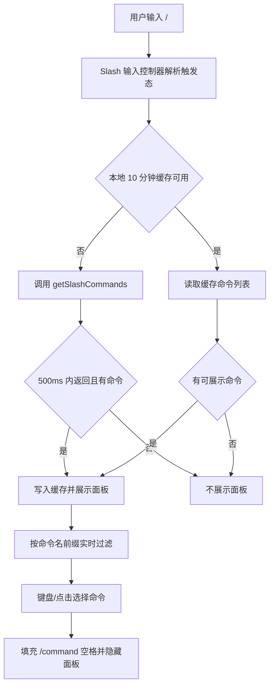
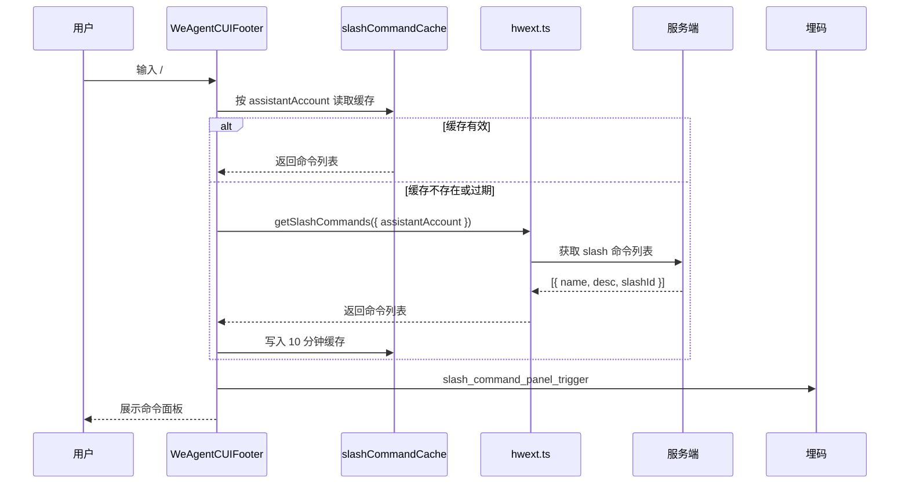
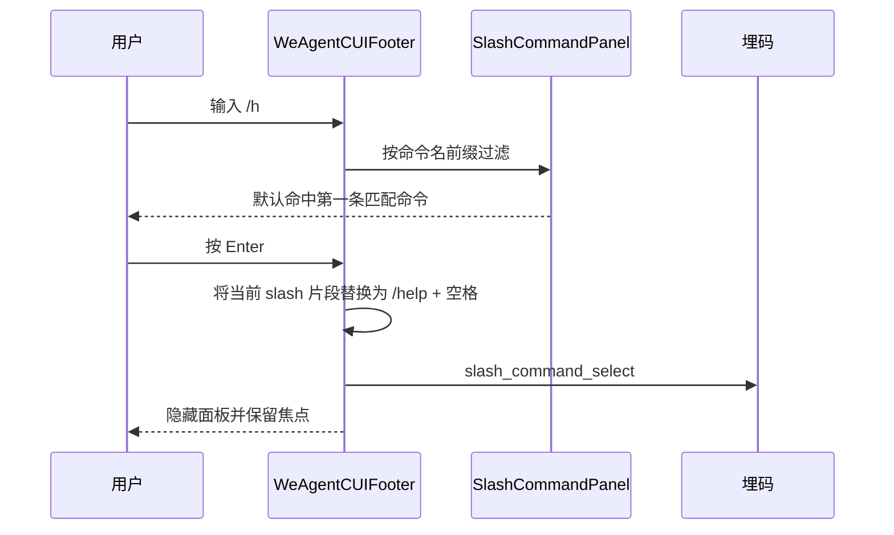

# `ai-chat-viewer Slash 命令联想方案`

- 方案日期：`2026-06-04`
- 目标工程：`ai-chat-viewer`
- 参考文档：`docs/plans/技术方案模板.md`、`docs/plans/2026-05-20-ai-chat-viewer-telemetry-plan.md`、`docs/requirements.md`
- 方案类型：`前端交互增强 / SDK 接口扩展 / 埋码补充`

## 1. 背景

### 1.1 场景说明

当前 `ai-chat-viewer` 的助手对话输入框尚未实现 slash 命令联想。用户在 `WeAgentCUI` 与 agent 对话时，如果需要使用 `/preview`、`/help` 这类命令，必须手动输入完整命令；当助手支持的命令较多时，用户难以记忆命令名称，导致命令能力发现成本高、输入效率低。

从现有代码看：

1. `src/components/assistant/WeAgentCUIFooter.tsx` 是 `WeAgentCUI` 输入区，移动端使用 `input`，PC 端使用 `textarea`，内部维护本地 `value` 并通过 `onSend(trimmedValue)` 发送。
2. `src/components/skillCUI/SkillCUIFooter.tsx` 是 `skillCUI` 输入区，当前也使用 `input`。
3. `src/hooks/useChatSession.ts` 统一处理发送、停止生成、历史消息加载等会话逻辑，发送内容最终进入 `hwext.sendMessage`。
4. `src/utils/hwext.ts` 通过 `getJsApiOrThrow()` 适配移动端 `window.HWH5EXT` 与 PC 端 `Pedestal.callMethod`，接口埋码通过 `src/utils/uemUtil.ts` 收口。
5. 目前 `src/types/bridge/hwext.ts` 的 `HWH5EXT` 类型中没有 slash 命令列表接口，需要新增类型与 wrapper。

### 1.2 需求目标

1. 用户在助手对话输入框输入 `/` 时，若当前助手存在可用命令，则 500 毫秒内展示 slash 命令联想面板。
2. 支持按命令名从前到后精确前缀匹配过滤，例如 `/h` 只匹配命令名以 `h` 开头的命令，不匹配描述。
3. 面板展示命令名和描述，描述超长单行省略，不换行；面板最多展示 10 行，超出后滚动查看更多。
4. 输入 `/` 后默认不命中；输入后若存在匹配命令，则默认命中第一条，支持回车选中，选中后填充命令并自动追加空格。
5. 当前助手没有命令、获取命令超时或获取失败时，不展示面板，不阻断输入与发送。
6. slash 命令列表本地缓存 10 分钟，缓存失效后再请求服务端。
7. slash 命令作为整体 token 删除，提升命令编辑体验。
8. 补充 slash 面板触发数与 slash 命令选择次数埋码。

### 1.3 非目标

1. 不在本期实现多命令组合、嵌套参数提示、命令参数 schema 表单化。
2. 不改变 `sendMessage` 的既有发送协议，选中命令后仍以文本内容的一部分发送。
3. 不在输入过程中实时请求服务端过滤，过滤在本地命令列表上完成。
4. 不将描述文本作为过滤条件。
5. 不要求本期改造消息渲染协议或服务端流式返回协议。

## 2. 方案图

### 2.1 整体方案图

### 2.2 方案核心

在 `WeAgentCUIFooter` 中引入 slash 命令输入控制器、命令列表缓存和联想面板，服务端命令只按助手维度 10 分钟缓存，输入过滤全部在本地完成，选中命令后以整体 token 写回输入框。

## 3. 时序图

### 3.1 `输入 / 触发命令面板`

### 3.2 `过滤并选择命令`

## 4. 技术细节

### 4.1 调整点

1. `src/types/bridge/hwext.ts` 新增 slash 命令类型：
   - `SlashCommandItem { name: string; desc: string; slashId: number | string }`
   - `GetSlashCommandsParams { assistantAccount?: string; ak?: string }`
   - `GetSlashCommandsResult { content: SlashCommandItem[] }` 或直接返回 `SlashCommandItem[]`，最终形态待服务端确认。
2. `HWH5EXT` 新增 `getSlashCommands(params)`，`src/utils/hwext.ts` 在移动端透传 `HWH5EXT.getSlashCommands`，PC 端通过 `Pedestal.callMethod(PEDESTAL_METHOD, { funName: 'getSlashCommands', params })`。
3. `src/utils/uemUtil.ts` 新增 `trackApiGetSlashCommands`，复用现有 `api_*` 成功 / 失败埋码模式；同时新增点击/交互埋码 `reportSlashCommandPanelTrigger`、`reportSlashCommandSelect`。
4. 新增 `src/utils/slashCommandCache.ts`，按 `assistantAccount` 或 `ak` 做 10 分钟内存缓存；缓存值包含 `expiresAt` 与命令列表。
5. 新增 `src/hooks/useSlashCommandSuggest.ts`，封装触发检测、缓存读取、500ms 超时控制、本地过滤、键盘高亮、选择回填。
6. 新增 `src/components/assistant/SlashCommandPanel.tsx`，负责展示最多 10 行的命令联想面板、滚动、hover、click、aria 状态。
7. 改造 `src/components/assistant/WeAgentCUIFooter.tsx`：
   - 接收 `assistantAccount` 或 `assistantDetail` 参数，用于拉取当前助手命令。
   - 将移动端 `input` 和 PC 端 `textarea` 的输入变更接入 slash hook。
   - 在 `onKeyDown` 中优先处理 slash 面板的 Enter / ArrowUp / ArrowDown / Escape，再处理发送快捷键。
8. `src/App.tsx` 调用 `WeAgentCUIFooter` 时传入 `assistantAccount` 和必要的助手上下文。
9. 可选：`src/components/skillCUI/SkillCUIFooter.tsx` 若 `skillCUI` 也需要 slash 命令，复用同一 hook；若服务端命令只绑定助手账号，本期先只覆盖 `WeAgentCUI`。

### 4.2 核心实现方式

#### 4.2.1 触发与过滤规则

输入控制器维护当前输入值、光标位置和 slash 片段：

1. 仅当光标前存在一个有效 slash 片段时进入联想态。
2. 有效 slash 片段建议规则：`/` 位于输入开头，或前一个字符为空白；`/` 后到光标之间不包含空白。
3. 用户只输入 `/` 时，展示全量命令列表，但不默认高亮任何命令。
4. 用户输入 `/h` 时，取查询串 `h`，用 `command.name.toLowerCase().startsWith(query.toLowerCase())` 过滤。
5. 只匹配命令名，不匹配描述。
6. 若过滤结果为空，则隐藏面板或展示空态二选一；根据需求“没有命令不出现面板”，推荐隐藏面板。

#### 4.2.2 500ms 展示与超时降级

为了满足“输入 `/` 后 500 毫秒内必须出现命令面板”：

1. 缓存命中时同步或微任务内展示，通常远低于 500ms。
2. 缓存未命中时发起 `getSlashCommands`，同时设置 500ms 超时。
3. 如果 500ms 内返回且命令非空，则展示面板。
4. 如果超过 500ms 未返回，则本次不展示面板；请求返回后只更新缓存，不再补弹面板，避免用户输入节奏被打断。
5. 用户继续编辑形成新的 slash 触发态时，可重新读取刚写入的缓存并展示。

#### 4.2.3 面板 UI

面板定位在输入框上方，样式与现有 PC 快捷键弹层保持一致：

1. 每行固定高度，建议 36px 至 40px；面板最大高度为 `10 * rowHeight`。
2. `overflow-y: auto` 支持滚动查看更多。
3. 命令名展示为 `/name`；描述展示为 `desc`。
4. 描述容器使用 `white-space: nowrap; overflow: hidden; text-overflow: ellipsis;`，不换行。
5. 移动端面板宽度跟随 footer 宽度；PC 端宽度建议 320px 至 420px，避免遮挡发送按钮。

#### 4.2.4 回填与整体删除

当前移动端 `input` 和 PC 端 `textarea` 只能显示纯文本，不能天然把 `/preview` 渲染为一个富媒体 token。若要满足“slash 命令整体删除”，推荐采用两阶段方案：

1. 一期保留 `input` / `textarea`，在状态中维护 `selectedSlashToken` 元数据：`{ slashId, name, start, end }`。选中命令后把文本替换为 `/name `，并记录 token 边界。
2. 在 `onKeyDown` 捕获 Backspace / Delete：当光标贴近 token 边界或选区覆盖 token 时，一次性删除整个 `/name ` 或 `/name`，再清空 token 元数据。
3. 用户在 token 内部编辑、粘贴或移动光标修改命令文本时，判定 token 失效，退化为普通文本。
4. 若后续需要像 Codex / opencode 那样将 slash 命令显示为独立 pill、支持多 token、参数 slot、富文本样式，则应升级为 `contenteditable` 或专用 composer 组件；普通 `input` 无法直接承载真正富媒体节点。

本期推荐采用“一期保留原输入框 + token 元数据整体删除”的方案，改动小、风险可控，能满足整体删除语义；视觉上仍是纯文本 `/preview `，不是富媒体 pill。

### 4.3 兼容与边界

1. IME 组合输入期间不处理 slash 快捷键，沿用当前 `event.nativeEvent.isComposing` 判断。
2. 面板打开时 Enter 优先选择命令；没有高亮命令时 Enter 仍按原发送逻辑处理，避免只输入 `/` 时误选。
3. 面板打开时 ArrowUp / ArrowDown 只移动高亮，不移动输入框光标；Escape 关闭面板。
4. 当前助手没有命令、接口失败、接口超时、返回结构异常时，不展示面板，输入框保持可用。
5. 缓存按助手维度隔离；切换助手或 `assistantAccount` 变化时读取对应缓存，不复用其他助手命令。
6. 命令名称建议统一去除前导 `/` 后缓存，展示和回填时再补 `/`，避免服务端返回 `preview` 与 `/preview` 混用。
7. 如果命令列表超过 10 条，面板高度固定，只通过滚动查看更多，不把页面 footer 顶高。
8. 如果描述为空，命令行仍展示命令名，描述区域留空或隐藏。
9. `skillCUI` 当前没有 `assistantAccount` 上下文，是否接入 slash 命令待确认；本方案主路径先覆盖助手对话界面 `WeAgentCUI`。
10. 埋码字段必须通过白名单构造，具体安全与隐私约束收敛到 `## 7. 埋码` 中说明。

### 4.4 相关接口联动

1. 新增获取 slash 命令列表接口：`getSlashCommands(params)`。
   - 入参建议：`{ assistantAccount?: string; ak?: string }`。
   - 出参列表项：`{ name: "preview", desc: "review", slashId: 214234 }`。
   - 返回容器待确认：服务端是直接返回数组，还是 `{ content: SlashCommandItem[] }`。
2. `sendMessage(params)`：不新增字段，选中 slash 命令后仍通过 `content` 发送，例如 `/preview 当前文件`。
3. `reportUemEvent(eventId, eventTitle, data)`：复用现有 UEM 上报入口。
4. `reportApiSuccess` / `reportApiError`：为 `api_get_slash_commands` 记录接口成功 / 失败。

### 4.5 文档需要同步修改的内容

1. `docs/plans/2026-05-20-ai-chat-viewer-telemetry-plan.md`：新增 slash 命令触发、选择、接口埋码说明。
2. `docs/requirements.md`：补充 slash 命令联想交互、缓存、超时、整体删除规则。
3. `docs/weAgentCUI-mock-debug.md`：补充 mock 环境 slash 命令返回示例和调试方式。

## 5. 性能

本方案新增一次 slash 命令列表请求，但通过 10 分钟本地缓存控制请求频率。输入过滤只在本地数组上执行，命令数量通常较小，即使数百条也可在单次输入变更内完成；若未来命令量超过 1000 条，可对命令名小写结果做预计算。

500ms 要求通过“缓存优先 + 请求超时降级”保证：缓存命中立即展示；缓存未命中时只有 500ms 内返回才展示，超时则静默失败并写缓存。该策略牺牲首次慢网络下的即时展示，换取输入体验稳定性。

## 6. 功耗

不新增轮询、长连接或后台任务。只在用户输入有效 slash 片段时触发一次接口请求，且缓存 10 分钟。面板滚动和键盘高亮为普通前端交互，对功耗影响可忽略。

## 7. 埋码

1. `slash_command_panel_trigger`
   - 说明：用户输入 `/` 且成功触发命令面板展示时上报。建议字段：`page: 'weAgentCUI'`、`assistantAccountHash` 或既有口径 `assistantAccount`、`welinkSessionIdHash` 或既有口径 `welinkSessionId`、`commandCount`、`source: 'cache' | 'network'`、`operationTime`。不上报输入框内容、查询串、命令描述。
2. `slash_command_select`
   - 说明：用户通过回车或点击选择 slash 命令时上报。建议字段：`page: 'weAgentCUI'`、`assistantAccountHash` 或既有口径 `assistantAccount`、`welinkSessionIdHash` 或既有口径 `welinkSessionId`、`slashId`、`commandNameHash`、`queryLength`、`selectMethod: 'enter' | 'click'`、`operationTime`。`commandName` 只有在确认命令名非敏感且允许明文分析时才上报；不上报命令描述和命令参数。
3. `api_get_slash_commands`
   - 说明：获取服务端 slash 命令列表成功 / 失败。建议字段：`type: 'ok' | 'error'`、`request: { assistantAccountHash 或既有口径 assistantAccount, hasAk }`、`response: { commandCount }`、`errorCode`、`errorMessage`。不记录命令列表明细、命令描述、完整 `ak`。
4. 埋码安全与隐私约束
   - 说明：slash 命令埋码按最小必要原则设计，不上报用户输入框完整内容，不上报 slash 后的原始查询串，例如 `/h`、`/preview xxx` 中的 `h` 或后续参数都不直接上报。
   - 说明：不上报命令描述 `desc`。描述可能包含服务端配置的业务说明、内部系统名或敏感操作提示，只用于本地展示。
   - 说明：`commandName` 仅在命令名已由服务端配置并确认可观测时上报；如果命令名可能包含租户自定义敏感词，默认只上报 `slashId` 和 `commandNameHash`。
   - 说明：`assistantAccount`、`welinkSessionId` 沿用当前工程既有埋码口径；若数据安全要求升级，建议改为哈希值或只上报是否存在、命令数量、选择方式等聚合字段。
   - 说明：`queryLength` 只上报数字长度，不上报查询文本；错误埋码中的 `errorMessage` 沿用 `telemetry.ts` 截断策略，并避免拼接用户输入内容。
   - 说明：调试日志 `WeLog` 同样不能打印输入框内容、命令描述、完整命令参数；实现时不允许直接透传命令对象或输入框状态对象。

## 8. 影响范围

### 8.1 直接影响

1. `src/components/assistant/WeAgentCUIFooter.tsx`：输入控制、键盘事件、命令面板渲染、命令回填、整体删除。
2. `src/components/assistant/SlashCommandPanel.tsx`：新增命令面板组件。
3. `src/hooks/useSlashCommandSuggest.ts`：新增 slash 命令联想状态管理。
4. `src/utils/slashCommandCache.ts`：新增 10 分钟缓存。
5. `src/types/bridge/hwext.ts`、`src/utils/hwext.ts`：新增 `getSlashCommands` 类型和 bridge wrapper。
6. `src/utils/uemUtil.ts`、`src/utils/telemetry.ts`：新增 slash 相关埋码封装。
7. `src/App.tsx`：向 footer 传递 `assistantAccount`、`welinkSessionId` 或助手上下文。
8. `src/styles/WeAgentCUIFooter.less`：新增 slash 面板样式。

### 8.2 间接影响

1. `src/components/skillCUI/SkillCUIFooter.tsx` 后续如需支持 slash，可复用同一 hook，但需要补充命令查询上下文。
2. `src/mocks/installJsApiMock.ts` 和 `src/opencode/createOpencodeHwh5ext.ts` 需要补充 `getSlashCommands` mock，保障本地调试与 opencode adapter 调试。
3. 单元测试需要 mock `getSlashCommands`、`reportUemEvent` 和输入法组合状态。
4. 数据平台需要新增 slash 命令相关事件口径。

### 8.3 不影响

1. 不影响 `useChatSession` 的发送、停止生成、历史消息加载主流程。
2. 不影响 `sendMessage` 入参结构和后端会话协议。
3. 不影响消息列表渲染、权限卡片、问题卡片、工具调用渲染。
4. 不影响现有点击埋码和接口埋码事件名。

## 9. 测试范围

### 9.1 功能测试

1. 空输入框输入 `/`，有命令且 500ms 内返回时展示面板，且默认无高亮。
2. 输入 `/h`，只展示命令名以 `h` 开头的命令，不按描述匹配。
3. 输入 `/h` 且存在匹配项时，第一条默认高亮；按 Enter 后填充 `/命令名 ` 并隐藏面板。
4. 点击命令项后填充命令、追加空格、输入框保持焦点。
5. 命令超过 10 条时，面板固定高度，支持上下滚动查看更多。
6. 命令描述超长时，单行省略，不换行、不撑开面板。
7. 当前助手没有命令时，输入 `/` 不展示面板。
8. 获取命令超过 500ms 或失败时，不展示面板；请求后续返回只更新缓存，不补弹。
9. 选中 slash 命令后按 Backspace / Delete，命令作为整体删除；用户编辑命令内部字符后，token 失效并按普通文本删除。
10. 面板打开时 Escape 关闭面板；ArrowUp / ArrowDown 移动高亮。
11. 触发和选择埋码只包含白名单字段，不包含输入框内容、查询串、命令描述、命令参数。

### 9.2 兼容测试

1. 移动端 `input` 场景：输入、过滤、回填、整体删除、发送按钮状态正常。
2. PC 端 `textarea` 场景：Enter 选择命令与 Enter 发送快捷键不冲突；Ctrl/Cmd+Enter 发送逻辑保持。
3. 中文 IME 组合输入期间不误触发选择或发送。
4. `assistantAccount` 切换后缓存隔离，旧助手命令不串到新助手。
5. `HWH5EXT.getSlashCommands` 不存在或 PC `Pedestal` 返回异常时，页面不崩溃。
6. 数据安全开关或数据平台要求哈希标识时，`assistantAccount`、`welinkSessionId`、`commandName` 可切换为哈希或聚合字段，不影响前端交互。

### 9.3 文档一致性检查

1. 技术方案、需求文档、埋码总表中的事件名保持一致。
2. `GetSlashCommandsParams`、`SlashCommandItem` 类型与服务端接口文档保持一致。
3. mock 文档中的返回示例与真实 wrapper 解析逻辑保持一致。

## 10. 最终建议

最终结论：推荐先在 `WeAgentCUIFooter` 落地 slash 命令联想，保留当前 `input` / `textarea` 作为输入载体，通过 `useSlashCommandSuggest` 管理命令查询、缓存、过滤、高亮、回填和 token 整体删除；同时新增 `getSlashCommands` bridge wrapper 和 slash 埋码。该方案能以较小改动满足 500ms 展示、10 分钟缓存、最多 10 行滚动、描述省略和整体删除等核心要求。需要取舍的是，本期 slash 命令视觉仍是纯文本，不做富媒体 pill；如果后续要支持真正富媒体输入和复杂命令参数，应再升级为 `contenteditable` 或独立 composer 组件。
