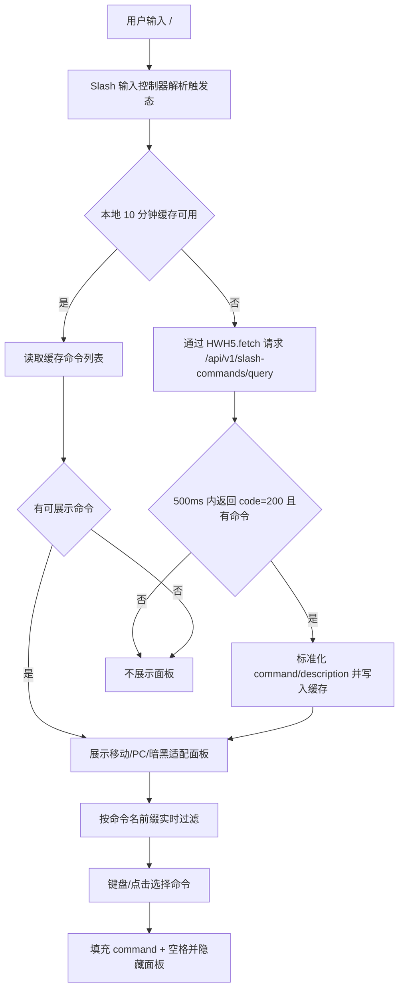
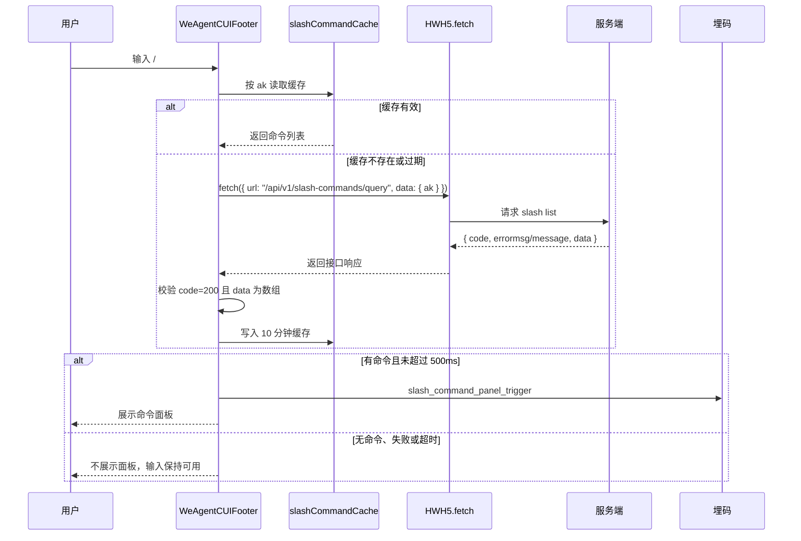
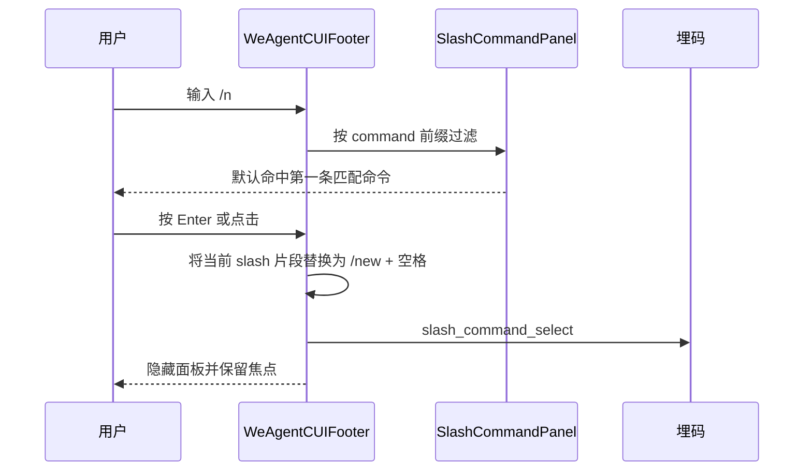

# `ai-chat-viewer Slash 命令联想方案`

- 方案日期：`2026-06-04`
- 目标工程：`ai-chat-viewer`
- 参考文档：`docs/plans/技术方案模板.md`、`docs/plans/2026-05-20-ai-chat-viewer-telemetry-plan.md`、`docs/requirements.md`
- 方案类型：`前端交互增强 / HWH5.fetch 接口接入 / 埋码补充`

## 1. 背景

### 1.1 场景说明

当前 `ai-chat-viewer` 的助手对话输入框尚未实现 slash 命令联想。用户在 `WeAgentCUI` 与 agent 对话时，如果需要使用 `/new`、`/help` 这类命令，必须手动输入完整命令；当助手支持的命令较多时，用户难以记忆命令名称，导致命令能力发现成本高、输入效率低。

本次 slash 命令列表获取方式与以往 SDK bridge 能力不同：不通过 `src/utils/hwext.ts` 内的 `getJsApiOrThrow()`、`window.HWH5EXT` 扩展方法或 PC `Pedestal.callMethod` 包装新增 bridge 方法，而是由纯前端直接调用 `HWH5.fetch` JSAPI 请求接口 `/api/v1/slash-commands/query` 获取命令列表。

从现有代码看：

1. `src/components/assistant/WeAgentCUIFooter.tsx` 是 `WeAgentCUI` 输入区，移动端使用 `input`，PC 端使用 `textarea`，内部维护本地 `value` 并通过 `onSend(trimmedValue)` 发送。
2. `src/components/skillCUI/SkillCUIFooter.tsx` 是 `skillCUI` 输入区，当前也使用 `input`。
3. `src/hooks/useChatSession.ts` 统一处理发送、停止生成、历史消息加载等会话逻辑，发送内容最终进入 `hwext.sendMessage`。
4. `src/utils/hwext.ts` 仍负责既有 SDK bridge 能力适配；本次 slash list 接口不在该文件新增 `getSlashCommands` wrapper。
5. `src/utils/uemUtil.ts` 是现有埋码封装入口，slash 触发、选择和接口结果可继续在该层补充统一上报方法。

### 1.2 需求目标

1. 用户在助手对话输入框输入 `/` 时，若当前应用存在可用命令，则 500 毫秒内展示 slash 命令联想面板。
2. 通过 `HWH5.fetch` 请求 `/api/v1/slash-commands/query` 获取命令列表，请求参数为 `{ "ak": "appkey" }`。
3. 支持按命令名从前到后精确前缀匹配过滤，例如 `/n` 只匹配命令名以 `/n` 或 `n` 开头的命令，不匹配描述。
4. 面板展示 `command` 和 `description`，描述超长单行省略，不换行；面板最多展示 10 行，超出后滚动查看更多。
5. 输入 `/` 后默认不命中；输入后若存在匹配命令，则默认命中第一条，支持回车选中，选中后填充命令并自动追加空格。
6. 当前没有命令、获取命令超时、获取失败或响应结构异常时，不展示面板，不阻断输入与发送。
7. slash 命令列表本地缓存 10 分钟，缓存失效后再请求服务端。
8. slash 命令作为整体 token 删除，提升命令编辑体验。
9. UI 适配移动端与 PC 端显示，并支持浅色与暗黑模式。
10. 补充 slash 面板触发数、slash 命令选择次数、slash list 接口成功/失败埋码。

### 1.3 非目标

1. 不在本期实现多命令组合、嵌套参数提示、命令参数 schema 表单化。
2. 不改变 `sendMessage` 的既有发送协议，选中命令后仍以文本内容的一部分发送。
3. 不在输入过程中实时请求服务端过滤，过滤在本地命令列表上完成。
4. 不将描述文本作为过滤条件。
5. 不新增 `HWH5EXT.getSlashCommands`、`hwext.getSlashCommands` 或 `Pedestal.callMethod` bridge wrapper。
6. 不要求本期改造消息渲染协议或服务端流式返回协议。

## 2. 方案图

### 2.1 整体方案图



### 2.2 方案核心

在 `WeAgentCUIFooter` 中引入 slash 命令输入控制器、`HWH5.fetch` 命令列表请求、本地缓存和联想面板；服务端命令按 `ak` 维度缓存 10 分钟，输入过滤全部在本地完成，选中命令后以整体 token 写回输入框。

## 3. 时序图

### 3.1 `输入 / 触发命令面板`



### 3.2 `过滤并选择命令`



## 4. 技术细节

### 4.1 调整点

1. 新增 `src/types/slashCommand.ts` 或在相关 hook 内定义前端类型：
   - `SlashCommandItem { command: string; description: string }`
   - `SlashCommandQueryParams { ak: string }`
   - `SlashCommandQuerySuccess { code: 200; errormsg: string; data: SlashCommandItem[] }`
   - `SlashCommandQueryError { code: number; message: string }`
2. 新增 `src/utils/slashCommandApi.ts`，封装纯前端 `HWH5.fetch` 调用，不依赖 `src/utils/hwext.ts`：
   - URL：`/api/v1/slash-commands/query`
   - 请求参数：`{ "ak": "appkey" }`
   - 成功判断：`response.code === 200 && Array.isArray(response.data)`
   - 失败判断：`code !== 200`、`message` 非空、JSAPI reject、超时、结构不合法。
3. `src/utils/uemUtil.ts` 新增 `trackApiSlashCommandQuery`，复用现有 `api_*` 成功/失败埋码模式；同时新增交互埋码 `reportSlashCommandPanelTrigger`、`reportSlashCommandSelect`。
4. 新增 `src/utils/slashCommandCache.ts`，按 `ak` 做 10 分钟内存缓存；缓存值包含 `expiresAt` 与标准化后的命令列表。
5. 新增 `src/hooks/useSlashCommandSuggest.ts`，封装触发检测、缓存读取、500ms 超时控制、本地过滤、键盘高亮、选择回填、整体删除 token 元数据。
6. 新增 `src/components/assistant/SlashCommandPanel.tsx`，负责展示最多 10 行的命令联想面板、滚动、hover、click、aria 状态、浅色/暗黑样式 class。
7. 改造 `src/components/assistant/WeAgentCUIFooter.tsx`：
   - 接收或读取 `ak`，作为 slash list 查询入参。
   - 将移动端 `input` 和 PC 端 `textarea` 的输入变更接入 slash hook。
   - 在 `onKeyDown` 中优先处理 slash 面板的 Enter / ArrowUp / ArrowDown / Escape，再处理发送快捷键。
   - 在 Backspace / Delete 中处理已选 slash token 的整体删除。
8. `src/App.tsx` 或页面入口补充 `ak` 获取与透传路径，若当前工程已有 appkey 配置来源，应复用既有来源。
9. `src/styles/WeAgentCUIFooter.less` 或组件样式文件新增移动端、PC 端、暗黑模式下的面板样式。
10. `src/mocks/installJsApiMock.ts` 可补充 `HWH5.fetch` mock 或在 slash API 封装层提供可替换 fetcher，保障本地调试。

### 4.2 核心实现方式

#### 4.2.1 接口协议

请求接口：

```text
/api/v1/slash-commands/query
```

请求方式：通过 `HWH5.fetch` JSAPI 发起，具体 method 待接口文档确认；若无特殊要求，推荐使用 `POST` 并将请求参数放入 body。

请求参数：

```json
{
  "ak": "appkey"
}
```

正常响应：

```json
{
  "code": 200,
  "errormsg": "",
  "data": [
    {
      "command": "/new",
      "description": "新建会话"
    },
    {
      "command": "/new",
      "description": "新建会话"
    }
  ]
}
```

错误响应：

```json
{
  "code": 500,
  "message": "查询失败：错误详情"
}
```

前端解析规则：

1. 仅当 `code === 200` 且 `data` 为数组时视为成功。
2. `errormsg` 只在成功结构中兼容读取；失败结构以 `message` 作为错误说明。
3. `command` 必须为非空字符串；无效项过滤掉，不让单条脏数据影响整个面板。
4. `description` 非字符串时按空字符串处理。
5. 服务端可能返回重复命令时，前端按 `command` 去重，保留第一条，避免面板重复展示。
6. `command` 推荐保留服务端返回的 `/` 前缀；若服务端未来返回无 `/` 前缀，前端展示和回填时补齐 `/`。

#### 4.2.2 HWH5.fetch 封装

推荐封装为 `querySlashCommands({ ak })`：

1. 函数内部检查 `window.HWH5?.fetch` 是否可用；不可用时 reject 并上报接口失败。
2. 设置 500ms 交互等待窗口；若请求超过 500ms，本次触发不再弹出面板。
3. 网络请求本身可继续完成，成功后写入缓存，供下一次 slash 触发直接命中。
4. 接口错误、JSAPI reject、解析异常统一转换为前端错误对象，避免组件层直接处理多种异常结构。
5. 不在 `src/utils/hwext.ts` 新增 wrapper，避免把普通 HTTP 接口误归类为 SDK bridge 能力。

#### 4.2.3 触发与过滤规则

输入控制器维护当前输入值、光标位置和 slash 片段：

1. 仅当光标前存在一个有效 slash 片段时进入联想态。
2. 有效 slash 片段建议规则：`/` 位于输入开头，或前一个字符为空白；`/` 后到光标之间不包含空白。
3. 用户只输入 `/` 时，展示全量命令列表，但不默认高亮任何命令。
4. 用户输入 `/n` 时，取查询串 `n`，用标准化命令名做前缀匹配；`/new` 和 `new` 两种返回形态都应匹配。
5. 只匹配 `command`，不匹配 `description`。
6. 若过滤结果为空，则隐藏面板；按需求“没有命令不出现面板”，不推荐展示空态。

#### 4.2.4 面板 UI

面板定位在输入框上方，移动端、PC 端与暗黑模式分别处理：

1. 移动端：面板宽度跟随 footer 内容区，左右保留安全边距；底部避让键盘抬起和安全区，最大高度不超过可视区域的 40%。
2. PC 端：面板宽度建议 320px 至 420px，靠输入框左侧或光标附近展示，不遮挡发送按钮；textarea 多行增长时，面板仍贴近输入区上方。
3. 每行固定高度，建议 36px 至 40px；面板最大高度为 `10 * rowHeight`。
4. `overflow-y: auto` 支持滚动查看更多，滚动条在 PC 可见，移动端沿用系统滚动体验。
5. 命令名展示为 `command`；描述展示为 `description`。
6. 描述容器使用 `white-space: nowrap; overflow: hidden; text-overflow: ellipsis;`，不换行。
7. 暗黑模式下背景、边框、hover、高亮、文字颜色使用现有主题变量；若缺少变量，新增局部 CSS 变量并跟随 `prefers-color-scheme: dark` 或工程既有 dark class。
8. 高亮态需要同时满足鼠标 hover、键盘选中和暗黑可读性，文字对比度不低于常规可读标准。
9. 面板打开时不改变 footer 高度，不顶起消息列表，避免移动端键盘场景产生明显布局跳动。

#### 4.2.5 回填与整体删除

当前移动端 `input` 和 PC 端 `textarea` 只能显示纯文本，不能天然把 `/new` 渲染为一个富媒体 token。若要满足“slash 命令整体删除”，推荐采用两阶段方案：

1. 一期保留 `input` / `textarea`，在状态中维护 `selectedSlashToken` 元数据：`{ command, start, end }`。选中命令后把文本替换为 `/new `，并记录 token 边界。
2. 在 `onKeyDown` 捕获 Backspace / Delete：当光标贴近 token 边界或选区覆盖 token 时，一次性删除整个 `/new ` 或 `/new`，再清空 token 元数据。
3. 用户在 token 内部编辑、粘贴或移动光标修改命令文本时，判定 token 失效，退化为普通文本。
4. 若后续需要像 Codex / opencode 那样将 slash 命令显示为独立 pill、支持多 token、参数 slot、富文本样式，则应升级为 `contenteditable` 或专用 composer 组件；普通 `input` 无法直接承载真正富媒体节点。

本期推荐采用“一期保留原输入框 + token 元数据整体删除”的方案，改动小、风险可控，能满足整体删除语义；视觉上仍是纯文本 `/new `，不是富媒体 pill。

### 4.3 兼容与边界

1. IME 组合输入期间不处理 slash 快捷键，沿用当前 `event.nativeEvent.isComposing` 判断。
2. 面板打开时 Enter 优先选择命令；没有高亮命令时 Enter 仍按原发送逻辑处理，避免只输入 `/` 时误选。
3. 面板打开时 ArrowUp / ArrowDown 只移动高亮，不移动输入框光标；Escape 关闭面板。
4. 当前没有命令、接口失败、接口超时、返回结构异常时，不展示面板，输入框保持可用。
5. 缓存按 `ak` 维度隔离；切换 appkey 或环境变化时读取对应缓存，不复用其他 appkey 命令。
6. 如果 `ak` 缺失，不发起接口请求，不展示面板，并上报可选失败原因 `missing_ak`。
7. 如果 `window.HWH5?.fetch` 不存在，页面不崩溃；本次 slash list 获取失败并静默降级。
8. 命令名称建议标准化为带 `/` 的形式缓存，避免展示和回填出现 `new` 与 `/new` 混用。
9. 如果命令列表超过 10 条，面板高度固定，只通过滚动查看更多，不把页面 footer 顶高。
10. 如果描述为空，命令行仍展示命令名，描述区域留空或隐藏。
11. `skillCUI` 当前没有明确 `ak` 与 slash 业务语义，是否接入 slash 命令待确认；本方案主路径先覆盖助手对话界面 `WeAgentCUI`。
12. 埋码字段必须通过白名单构造，具体安全与隐私约束收敛到 `## 7. 埋码` 中说明。

### 4.4 相关接口联动

1. Slash list 接口：`/api/v1/slash-commands/query`。
   - 调用方式：`HWH5.fetch` JSAPI。
   - 入参：`{ "ak": "appkey" }`。
   - 成功出参：`{ code: 200, errormsg: "", data: [{ command: "/new", description: "新建会话" }] }`。
   - 错误出参：`{ code: 500, message: "查询失败：错误详情" }`。
2. `sendMessage(params)`：不新增字段，选中 slash 命令后仍通过 `content` 发送，例如 `/new 帮我创建一个会话`。
3. `reportUemEvent(eventId, eventTitle, data)`：复用现有 UEM 上报入口。
4. `reportApiSuccess` / `reportApiError`：为 `api_slash_commands_query` 记录接口成功/失败。
5. `src/utils/hwext.ts`：不新增本接口 wrapper；仅继续承载既有 SDK bridge 能力。

### 4.5 文档需要同步修改的内容

1. `docs/plans/2026-05-20-ai-chat-viewer-telemetry-plan.md`：新增 slash 命令触发、选择、接口埋码说明。
2. `docs/requirements.md`：补充 slash 命令联想交互、缓存、超时、整体删除、移动/PC/暗黑适配规则。
3. `docs/weAgentCUI-mock-debug.md`：补充 mock 环境 `HWH5.fetch` slash list 返回示例和调试方式。
4. 若存在接口文档：同步 `/api/v1/slash-commands/query` 的 method、header、鉴权、超时、错误码说明。

## 5. 性能

本方案新增一次 slash 命令列表请求，但通过 10 分钟本地缓存控制请求频率。输入过滤只在本地数组上执行，命令数量通常较小，即使数百条也可在单次输入变更内完成；若未来命令量超过 1000 条，可对命令名小写结果做预计算。

500ms 要求通过“缓存优先 + 请求超时降级”保证：缓存命中立即展示；缓存未命中时只有 500ms 内返回且成功解析才展示，超时则静默失败并写缓存。该策略牺牲首次慢网络下的即时展示，换取输入体验稳定性。

UI 方面，面板最多渲染 10 条可见项，滚动区域固定高度，不会引起消息列表大面积重排；移动端键盘抬起时需要避免反复计算窗口尺寸造成抖动。

## 6. 功耗

不新增轮询、长连接或后台任务。只在用户输入有效 slash 片段且缓存失效时触发一次接口请求，且缓存 10 分钟。面板滚动、hover、高亮和暗黑样式切换为普通前端交互，对功耗影响可忽略。

## 7. 埋码

1. `slash_command_panel_trigger`
   - 说明：用户输入 `/` 且成功触发命令面板展示时上报。建议字段：`page: 'weAgentCUI'`、`akHash` 或既有口径 `ak`、`commandCount`、`source: 'cache' | 'network'`、`theme: 'light' | 'dark'`、`deviceType: 'mobile' | 'pc'`、`operationTime`。不上报输入框内容、查询串、命令描述。
2. `slash_command_select`
   - 说明：用户通过回车或点击选择 slash 命令时上报。建议字段：`page: 'weAgentCUI'`、`akHash` 或既有口径 `ak`、`commandNameHash`、`queryLength`、`selectMethod: 'enter' | 'click'`、`theme: 'light' | 'dark'`、`deviceType: 'mobile' | 'pc'`、`operationTime`。`command` 只有在确认命令名非敏感且允许明文分析时才上报；不上报命令描述和命令参数。
3. `api_slash_commands_query`
   - 说明：获取服务端 slash 命令列表成功/失败。建议字段：`type: 'ok' | 'error'`、`request: { akHash 或既有口径 ak, hasAk }`、`response: { commandCount }`、`errorCode`、`errorMessage`、`duration`、`timeout: boolean`。不记录命令列表明细、命令描述、完整 `ak`。
4. 埋码安全与隐私约束
   - 说明：slash 命令埋码按最小必要原则设计，不上报用户输入框完整内容，不上报 slash 后的原始查询串，例如 `/n`、`/new xxx` 中的 `n` 或后续参数都不直接上报。
   - 说明：不上报命令描述 `description`。描述可能包含服务端配置的业务说明、内部系统名或敏感操作提示，只用于本地展示。
   - 说明：`command` 仅在命令名已由服务端配置并确认可观测时上报；如果命令名可能包含租户自定义敏感词，默认只上报 `commandNameHash`。
   - 说明：`ak` 沿用当前工程既有埋码口径；若数据安全要求升级，建议改为哈希值或只上报是否存在、命令数量、选择方式等聚合字段。
   - 说明：`queryLength` 只上报数字长度，不上报查询文本；错误埋码中的 `errorMessage` 沿用 `telemetry.ts` 截断策略，并避免拼接用户输入内容。
   - 说明：调试日志 `WeLog` 同样不能打印输入框内容、命令描述、完整命令参数；实现时不允许直接透传命令对象或输入框状态对象。

## 8. 影响范围

### 8.1 直接影响

1. `src/components/assistant/WeAgentCUIFooter.tsx`：输入控制、键盘事件、命令面板渲染、命令回填、整体删除。
2. `src/components/assistant/SlashCommandPanel.tsx`：新增命令面板组件。
3. `src/hooks/useSlashCommandSuggest.ts`：新增 slash 命令联想状态管理。
4. `src/utils/slashCommandApi.ts`：新增 `HWH5.fetch` slash list 接口封装。
5. `src/utils/slashCommandCache.ts`：新增 10 分钟缓存。
6. `src/utils/uemUtil.ts`、`src/utils/telemetry.ts`：新增 slash 相关埋码封装。
7. `src/App.tsx` 或 `WeAgentCUI` 页面入口：向 footer 传递 `ak` 或提供读取路径。
8. `src/styles/WeAgentCUIFooter.less`：新增移动端、PC 端、暗黑模式下的 slash 面板样式。

### 8.2 间接影响

1. `src/components/skillCUI/SkillCUIFooter.tsx` 后续如需支持 slash，可复用同一 hook，但需要补充 `ak` 和业务触发条件。
2. `src/mocks/installJsApiMock.ts` 需要补充 `HWH5.fetch` mock 或测试注入点，保障本地调试。
3. 单元测试需要 mock `HWH5.fetch`、`reportUemEvent` 和输入法组合状态。
4. 数据平台需要新增 slash 命令相关事件口径。
5. 暗黑模式主题变量若不完整，需要补充局部变量或跟随工程主题 class。

### 8.3 不影响

1. 不影响 `useChatSession` 的发送、停止生成、历史消息加载主流程。
2. 不影响 `sendMessage` 入参结构和后端会话协议。
3. 不影响消息列表渲染、权限卡片、问题卡片、工具调用渲染。
4. 不影响现有点击埋码和接口埋码事件名。
5. 不影响 `src/utils/hwext.ts` 既有 SDK bridge 方法。

## 9. 测试范围

### 9.1 功能测试

1. 空输入框输入 `/`，有命令且 500ms 内返回时展示面板，且默认无高亮。
2. 输入 `/n`，只展示 `command` 以 `n` 或 `/n` 开头的命令，不按 `description` 匹配。
3. 输入 `/n` 且存在匹配项时，第一条默认高亮；按 Enter 后填充 `/命令名 ` 并隐藏面板。
4. 点击命令项后填充命令、追加空格、输入框保持焦点。
5. 命令超过 10 条时，面板固定高度，支持上下滚动查看更多。
6. 命令描述超长时，单行省略，不换行、不撑开面板。
7. 当前没有命令时，输入 `/` 不展示面板。
8. `/api/v1/slash-commands/query` 返回 `code: 200` 且 `data` 为数组时，正常解析 `command` 和 `description`。
9. 接口返回 `{ code: 500, message: "查询失败：错误详情" }`、JSAPI reject、超时或结构异常时，不展示面板；请求后续返回只更新缓存，不补弹。
10. 服务端返回重复 `command` 时，面板去重展示。
11. 选中 slash 命令后按 Backspace / Delete，命令作为整体删除；用户编辑命令内部字符后，token 失效并按普通文本删除。
12. 面板打开时 Escape 关闭面板；ArrowUp / ArrowDown 移动高亮。
13. 触发、选择和接口埋码只包含白名单字段，不包含输入框内容、查询串、命令描述、命令参数。

### 9.2 兼容测试

1. 移动端 `input` 场景：输入、过滤、回填、整体删除、发送按钮状态正常，面板避让键盘和安全区。
2. PC 端 `textarea` 场景：Enter 选择命令与 Enter 发送快捷键不冲突；Ctrl/Cmd+Enter 发送逻辑保持。
3. 浅色模式：面板背景、边框、hover、高亮、滚动条、命令名和描述文本可读。
4. 暗黑模式：面板背景、边框、hover、高亮、滚动条、命令名和描述文本可读，不出现浅色硬编码残留。
5. 中文 IME 组合输入期间不误触发选择或发送。
6. `ak` 变化后缓存隔离，旧 appkey 命令不串到新 appkey。
7. `window.HWH5?.fetch` 不存在或返回异常时，页面不崩溃。
8. 数据安全开关或数据平台要求哈希标识时，`ak`、`command` 可切换为哈希或聚合字段，不影响前端交互。

### 9.3 文档一致性检查

1. 技术方案、需求文档、埋码总表中的事件名保持一致。
2. `SlashCommandQueryParams`、`SlashCommandItem` 类型与服务端接口文档保持一致。
3. mock 文档中的 `HWH5.fetch` 返回示例与真实解析逻辑保持一致。
4. 方案中不得再描述为新增 `HWH5EXT.getSlashCommands` 或 `hwext.ts` bridge wrapper。

## 10. 最终建议

最终结论：推荐先在 `WeAgentCUIFooter` 落地 slash 命令联想，保留当前 `input` / `textarea` 作为输入载体，通过 `useSlashCommandSuggest` 管理命令查询、缓存、过滤、高亮、回填和 token 整体删除；命令列表通过纯前端 `HWH5.fetch` 请求 `/api/v1/slash-commands/query`，入参固定为 `{ "ak": "appkey" }`，成功解析 `data[].command` 与 `data[].description`，失败时按 `message` 记录错误并静默降级。该方案能以较小改动满足 500ms 展示、10 分钟缓存、最多 10 行滚动、描述省略、移动/PC/暗黑适配和整体删除等核心要求。需要取舍的是，本期 slash 命令视觉仍是纯文本，不做富媒体 pill；如果后续要支持真正富媒体输入和复杂命令参数，应再升级为 `contenteditable` 或独立 composer 组件。
