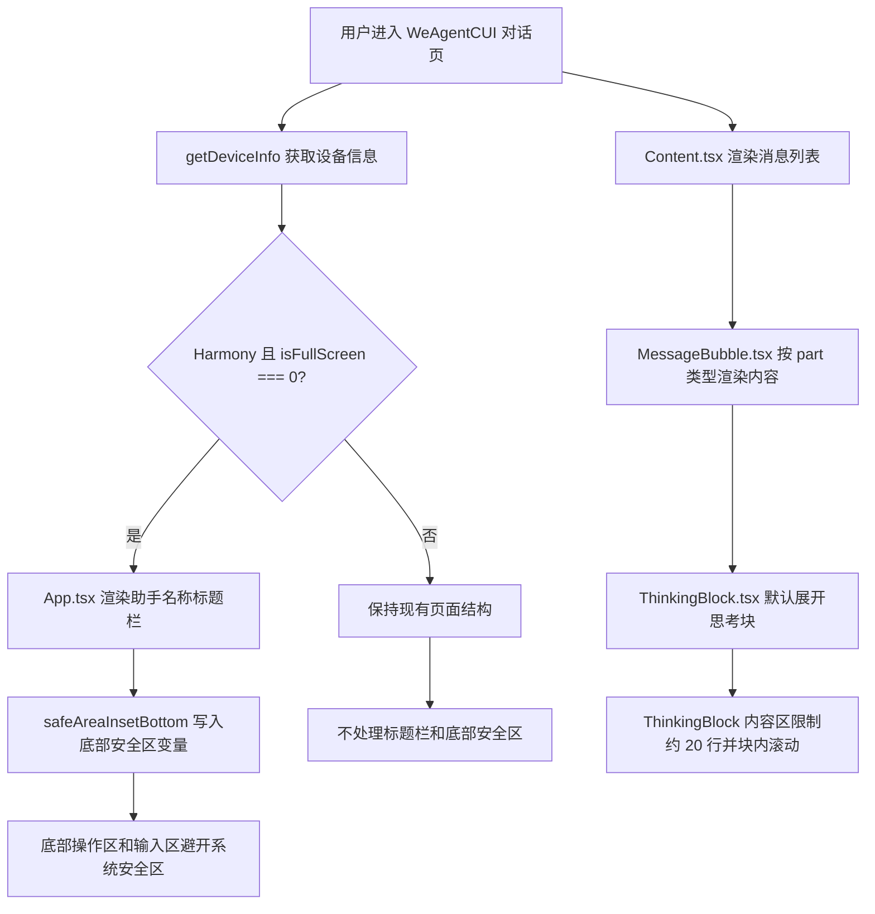
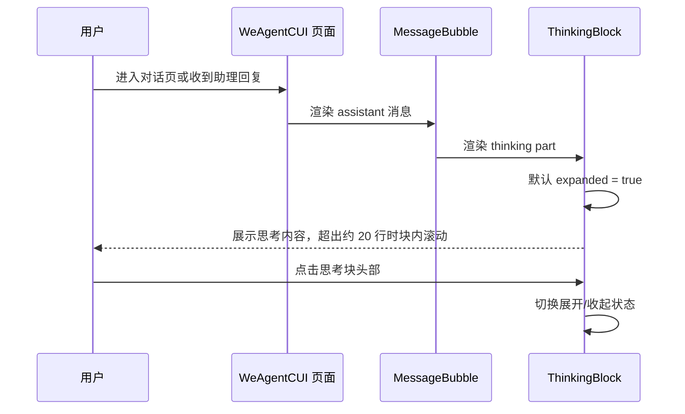
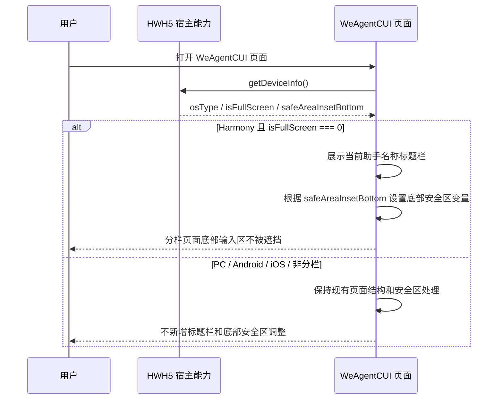

# `WeAgentCUI UI 交互优化方案`

- 方案日期：`2026-06-10`
- 目标工程：`ai-chat-viewer`
- 参考文档：`docs/requirements.md`、`docs/design-decisions.md`、`docs/weAgentCUI-ai-reply-rendering.md`
- 方案类型：`前端 UI/交互优化方案`

## 1. 背景

### 1.1 场景说明

当前 `weAgentCUI` 对话页已支持 AI 回复的结构化渲染，`thinking` 类型内容由 `src/components/ThinkingBlock.tsx` 渲染，消息列表由 `src/components/Content.tsx` 承载，页面主体由 `src/App.tsx` 与 `src/styles/WeAgentCUI.less` 组织。

现有体验存在三个问题，其中第 2、3 点只针对鸿蒙移动端分栏场景：

1. 助理输出的思考内容如果是长文本，展开后没有最大高度限制，会挤压正文和输入区，影响阅读与继续对话。
2. 鸿蒙移动端分栏下，`weAgentCUI` 对话页缺少标题栏，不利于用户在分栏窗口内识别当前助手。
3. 鸿蒙移动端分栏下，`weAgentCUI` 底部输入区可能被系统底部安全区遮挡；顶部安全区当前已有处理，本次不调整顶部安全区。

### 1.2 需求目标

1. 思考内容块默认展开，单个思考正文区域最大高度约 20 行，超出后在块内滚动。
2. 仅当 `deviceInfo.osType === 'Harmony'` 且 `deviceInfo.isFullScreen === 0` 时，`weAgentCUI` 页面新增标题栏，标题读取当前助手名称并居中显示。
3. 仅当 `deviceInfo.osType === 'Harmony'` 且 `deviceInfo.isFullScreen === 0` 时，`weAgentCUI` 页面处理 `deviceInfo.safeAreaInsetBottom`，保证底部输入区和操作区不被底部安全区遮挡。

### 1.3 非目标

1. 不调整 AI 回复协议、`thinking.delta` / `thinking.done` 事件结构和 `StreamAssembler` 组装逻辑。
2. 不调整历史会话侧边栏的数据加载、会话切换、新建会话等业务流程。
3. 不新增跨平台 SDK API，不涉及 Android、iOS、HarmonyOS 原生 SDK 接口变更。
4. 不处理 PC、Android、iOS 的标题栏和底部安全区样式变化。
5. 不调整其它页面，仅处理 `weAgentCUI` 页面。
6. 不重做整体视觉风格，仅在现有 WeAgentCUI 页面结构内做局部交互与布局优化。

## 2. 方案图

### 2.1 整体方案图



### 2.2 方案核心

在不改变消息协议和会话逻辑的前提下，通过组件默认状态、局部滚动容器、`getDeviceInfo` 场景识别和 `safeAreaInsetBottom` 布局变量完成交互优化；标题栏和底部安全区只在鸿蒙移动端分栏的 `weAgentCUI` 页面生效。

## 3. 时序图

### 3.1 `思考内容渲染`



### 3.2 `鸿蒙分栏页面布局`



## 4. 技术细节

### 4.1 调整点

1. `src/components/ThinkingBlock.tsx`
   - 将 `expanded` 初始值从 `false` 调整为 `true`，满足单个思考文本块默认展开。
   - 保留流式中自动展开逻辑，避免历史或非流式思考块被强制收起。
2. `src/styles/WeAgentCUI.less`
   - 为 `.thinking-block__content` 增加 `max-height`、`overflow-y: auto`、`-webkit-overflow-scrolling: touch`。
   - 推荐按现有正文 `line-height: 22px` 计算约 20 行，即 `max-height: 440px`；如果后续主题行高变化，可抽为 CSS 变量。
   - 新增仅鸿蒙分栏启用的页面标题栏样式，例如 `.we-agent-cui-title`。
   - 仅鸿蒙分栏容器增加底部安全区 padding，PC、Android、iOS 和鸿蒙非分栏保持现有布局。
3. `src/App.tsx`
   - 初始化阶段调用或复用 `getDeviceInfo()`，识别 `deviceInfo.osType === 'Harmony' && deviceInfo.isFullScreen === 0`。
   - 在 `.we-agent-cui-chat-panel` 内、`.content-wrapper` 前按条件新增标题栏节点。
   - 标题文案读取当前助手名称，即现有 `weAgentAssistantName`；为空时标题栏可不展示或使用兜底空态，避免显示固定文案。
   - 将 `safeAreaInsetBottom` 转为 CSS 变量或 inline style，例如 `--harmony-split-safe-area-bottom: ${safeAreaInsetBottom}px`。
4. `src/utils/hwext.ts`
   - `getDeviceInfo()` 当前已返回 `safeAreaInsetBottom`，建议补充对 `safeAreaInsetBottom` 的正数归一化，和 `statusBarHeight` 保持一致。
   - 保持 PC 分支返回安全默认值，不让 PC 误入鸿蒙分栏逻辑。
5. `src/types/bridge/hwext.ts`
   - 在 `HWH5DeviceInfo` 中显式补充 `osType?: string`、`isFullScreen?: number`，避免实现时通过索引字段读取。

### 4.2 核心实现方式

思考块采用“外层仍参与消息流布局，内层正文独立滚动”的方式。`ThinkingBlock` 默认展开后，长文本只会让 `.thinking-block__content` 达到最大高度，随后通过块内滚动查看完整内容，不再继续撑高整条消息和页面。

标题栏采用页面主体内固定布局，不覆盖消息区；仅在鸿蒙分栏场景渲染。推荐结构如下：

```tsx
<div className="we-agent-cui-chat-panel">
  {isHarmonySplitScreen && weAgentAssistantName ? (
    <div className="we-agent-cui-title" role="heading" aria-level={1}>
      {weAgentAssistantName}
    </div>
  ) : null}
  <div className="content-wrapper">...</div>
  <div className="we-agent-cui-bottom">...</div>
</div>
```

鸿蒙分栏识别与底部安全区采用 `getDeviceInfo()` 返回值：

1. 新增状态 `isHarmonySplitScreen`，条件为 `deviceInfo.osType === 'Harmony' && deviceInfo.isFullScreen === 0`。
2. 新增状态 `harmonySplitSafeAreaBottom`，取 `deviceInfo.safeAreaInsetBottom`，并做正数兜底。
3. `.app-container--we-agent-cui` 仅在 `isHarmonySplitScreen` 为 `true` 时增加 class，例如 `is-harmony-split-screen`。
4. `.app-container--we-agent-cui.is-harmony-split-screen` 通过 CSS 变量增加底部 padding，例如 `padding-bottom: calc(12px + var(--harmony-split-safe-area-bottom, 0px))`。
5. `.we-agent-cui-main` / `.we-agent-cui-chat-panel` / `.content-wrapper` 继续保持 `min-height: 0`，让消息列表成为唯一主滚动区。

### 4.3 兼容与边界

1. 鸿蒙移动端分栏
   - 仅当 `deviceInfo.osType === 'Harmony' && deviceInfo.isFullScreen === 0` 时，启用助手名称标题栏和 `safeAreaInsetBottom` 底部避让。
   - `safeAreaInsetBottom` 为 `0`、缺失或非数字时按 `0` 处理，不额外增加底部高度。
   - 标题读取 `weAgentAssistantName`，助手详情尚未返回前不展示标题栏或展示空占位需二选一，推荐不展示以避免错误文案闪烁。
2. 鸿蒙移动端非分栏
   - `deviceInfo.osType === 'Harmony'` 但 `deviceInfo.isFullScreen !== 0` 时不做第 2、3 点处理。
3. Android、iOS
   - 不做第 2、3 点处理。
   - iOS 键盘逻辑继续由 `useIosKeyboardLift` 处理，不复用本次鸿蒙分栏底部安全区逻辑。
4. PC 小程序模式
   - `.app-container--we-agent-cui.pc-mode` 保持现有 `height: 100vh`、PC 背景和侧边栏布局，不展示新增标题栏，不处理 `safeAreaInsetBottom`。
5. 其它页面
   - 创建助理、选择助理、切换助理、助手详情、`skillCUI` 等页面不处理本次标题栏与底部安全区逻辑。
6. 思考块内容边界
   - 空内容或仅流式占位时仍展示头部与“思考中...”状态。
   - Markdown、代码、列表、公式等内容仍交由 `ReactMarkdown` 和现有 `markdownComponents` 渲染。
   - 嵌套在 `SubtaskBlock` 内的 thinking part 复用同一限制，避免子任务长思考撑高父块。

### 4.4 相关接口联动

1. `StreamAssembler`
   - 不涉及接口变更；继续输出 `MessagePart.type = 'thinking'`。
2. `useChatSession`
   - 不涉及接口变更；继续维护消息列表、流式状态、停止生成等逻辑。
3. `HWH5.onKeyboardHeightChange`
   - 不新增调用；继续由 `useIosKeyboardLift` 处理软键盘避让。
4. `HWH5.getDeviceInfo`
   - 复用现有 `getDeviceInfo()`，读取 `osType`、`isFullScreen`、`safeAreaInsetBottom` 作为鸿蒙分栏判断和底部安全区高度来源。
5. 国际化资源
   - 标题读取当前助手名称，不新增固定标题文案和 i18n key。

### 4.5 文档需要同步修改的内容

1. `docs/requirements.md`
   - 补充 WeAgentCUI 思考块默认展开及最大高度、鸿蒙分栏标题栏、鸿蒙分栏底部安全区要求。
2. `docs/design-decisions.md`
   - 记录思考块默认展开、约 20 行滚动上限、`getDeviceInfo` 鸿蒙分栏识别、`safeAreaInsetBottom` 底部避让策略。
3. `docs/weAgentCUI-ai-reply-rendering.md`
   - 在 `thinking` 渲染说明中补充默认展开和最大高度策略。

## 5. 性能

不新增网络请求，不改变消息流处理复杂度。鸿蒙分栏判断复用宿主 `getDeviceInfo()`，该能力当前已有调用场景；如在 `App.tsx` 初始化中新增一次调用，成本较低。新增标题节点和少量 CSS 对首屏影响可忽略。思考块长文本从整页撑高改为局部滚动，通常会降低消息列表整体重排和滚动距离，对长回复阅读体验更稳定。

## 6. 功耗

不新增轮询、长连接、后台任务、动画或频繁刷新。保留现有折叠箭头过渡动画，不增加额外功耗风险。

## 7. 埋码

1. 不涉及
   - 说明：本次优化属于纯 UI 展示与布局调整，不改变发送、停止、新建会话、历史会话等核心行为。
2. 可选埋码
   - 说明：如后续需要评估思考块使用情况，可新增 `thinking_block_toggle`，记录展开/收起动作、是否流式中、内容长度区间，不上报思考正文。
3. 可选埋码
   - 说明：如需验证安全区问题修复效果，可在前端错误或体验反馈中增加设备信息维度，但不建议为本次方案新增常驻上报。

## 8. 影响范围

### 8.1 直接影响

1. `src/components/ThinkingBlock.tsx`：调整默认展开状态。
2. `src/styles/WeAgentCUI.less`：新增思考块内容最大高度、鸿蒙分栏标题栏样式、鸿蒙分栏底部安全区样式。
3. `src/App.tsx`：新增 `getDeviceInfo()` 场景识别、鸿蒙分栏 class / style、当前助手名称标题栏条件渲染。
4. `src/utils/hwext.ts`：建议补齐 `safeAreaInsetBottom` 正数归一化。
5. `src/types/bridge/hwext.ts`：建议显式补充 `osType?: string`、`isFullScreen?: number`。

### 8.2 间接影响

1. `src/components/MessageBubble.tsx`：不直接修改逻辑，但所有 `thinking` part 的展示效果会变化。
2. `src/components/SubtaskBlock.tsx`：子任务内部复用 `ThinkingBlock`，长思考内容同样会被限制高度。
3. `src/components/Content.tsx`：鸿蒙分栏下消息列表可滚动区域高度会因新增标题略微减少，需要验证欢迎态和历史加载场景。
4. 鸿蒙分栏暗黑模式：新增标题栏和底部安全区背景需要确认与 `prefers-color-scheme: dark` 样式一致。

### 8.3 不影响

1. 不影响消息协议、历史消息结构和后端接口。
2. 不影响 `sendMessage`、`stopSkill`、`closeSkill` 等 SDK 行为。
3. 不影响 PC 历史侧边栏加载与展开收起逻辑。
4. 不影响代码块、工具块、问题卡片、权限卡片的业务逻辑。
5. 不影响 PC、Android、iOS 的标题栏和底部安全区布局。
6. 不影响 WeAgentCUI 以外的其它页面。

## 9. 测试范围

### 9.1 功能测试

1. 触发 `mock-thinking` 或包含长思考内容的回复，确认思考块默认展开。
2. 构造超过 20 行的思考内容，确认单个思考内容区出现块内滚动，页面主体不被异常撑高。
3. 点击思考块头部，确认展开/收起状态和箭头方向正常。
4. Mock `getDeviceInfo()` 返回 `{ osType: 'Harmony', isFullScreen: 0, safeAreaInsetBottom: 具体值 }`，确认 `weAgentCUI` 顶部展示当前助手名称标题栏。
5. Mock 鸿蒙分栏且 `safeAreaInsetBottom > 0`，确认底部操作区和输入区避开底部安全区。
6. Mock 助手详情未返回或 `weAgentAssistantName` 为空，确认标题栏不展示或按实现约定展示空占位，不出现固定 `CodeAgent` 文案。
7. 进入已有历史会话，确认标题、消息列表、底部操作区和输入区布局正常。

### 9.2 兼容测试

1. 鸿蒙移动端分栏：确认 `deviceInfo.osType === 'Harmony' && deviceInfo.isFullScreen === 0` 时标题栏和底部安全区处理生效。
2. 鸿蒙移动端非分栏：确认 `deviceInfo.osType === 'Harmony' && deviceInfo.isFullScreen !== 0` 时不展示新增标题栏，不额外处理底部安全区。
3. Android：确认不展示新增标题栏，不额外处理 `safeAreaInsetBottom`。
4. iOS：确认不展示新增标题栏，原有顶部安全区和键盘逻辑不受影响。
5. PC：确认不展示新增标题栏，历史侧边栏、底部输入区和 PC 背景布局不受影响。
6. 鸿蒙分栏暗黑模式：确认标题文字、思考块滚动区域和底部安全区背景颜色符合现有暗黑主题。

### 9.3 文档一致性检查

1. `docs/requirements.md` 与实际交互保持一致：思考块默认展开、约 20 行上限、鸿蒙分栏助手名称标题栏、鸿蒙分栏底部安全区。
2. `docs/design-decisions.md` 与样式实现保持一致：`getDeviceInfo` 判断条件、`safeAreaInsetBottom` 变量、滚动容器边界。
3. `docs/weAgentCUI-ai-reply-rendering.md` 与 `ThinkingBlock` 行为保持一致。

## 10. 最终建议

最终结论：推荐采用“思考块默认展开 + 内容区局部滚动 + `getDeviceInfo` 识别鸿蒙分栏 + 鸿蒙分栏助手名称标题栏 + `safeAreaInsetBottom` 底部避让”的轻量方案。该方案改动集中在展示层，不改变消息协议和会话业务逻辑，且第 2、3 点只作用于 `deviceInfo.osType === 'Harmony' && deviceInfo.isFullScreen === 0` 的 `weAgentCUI` 页面，能避免影响 PC、Android、iOS 和其它页面。代价是鸿蒙分栏下消息区可用高度会因标题栏和底部安全区 padding 略有减少，但换来更清晰的分栏页面识别和更可靠的底部输入区可用性。

后续动作建议先完成代码改动，再用本地 mock 场景验证 `mock-thinking`、长思考文本、鸿蒙分栏标题栏、`safeAreaInsetBottom` 底部避让、鸿蒙非分栏、Android、iOS 和 PC 回归，最后同步更新 `requirements`、`design-decisions` 与 AI 回复渲染文档。
