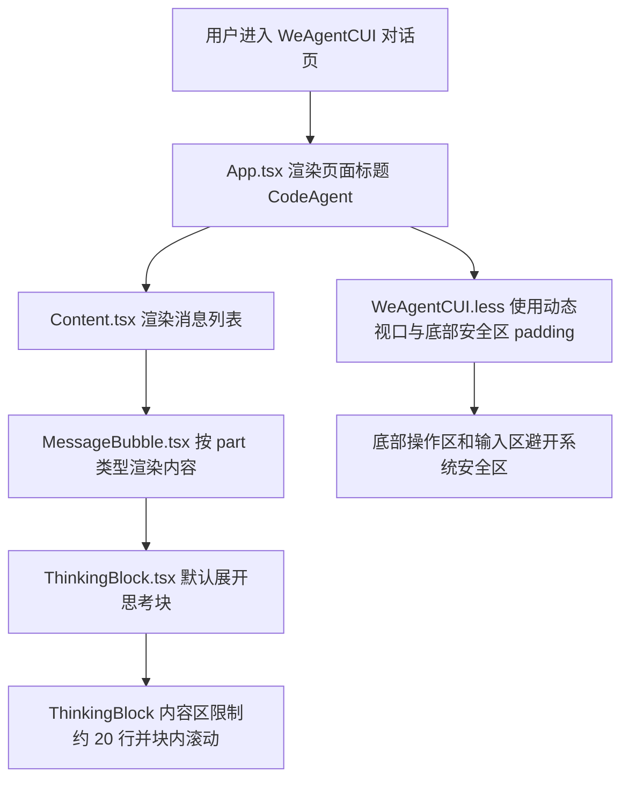
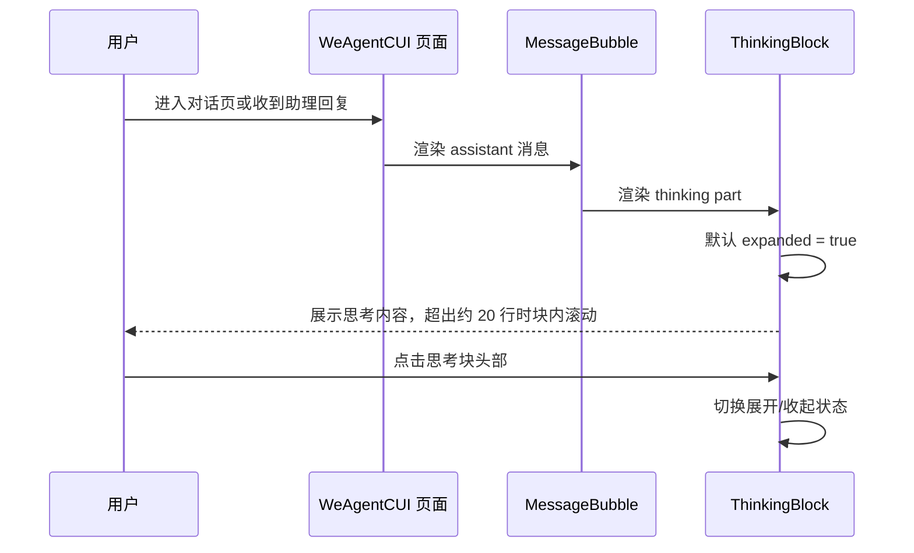
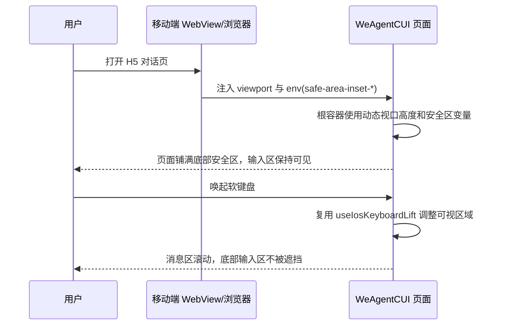

# `WeAgentCUI UI 交互优化方案`

- 方案日期：`2026-06-08`
- 目标工程：`ai-chat-viewer`
- 参考文档：`docs/requirements.md`、`docs/design-decisions.md`、`docs/weAgentCUI-ai-reply-rendering.md`
- 方案类型：`前端 UI/交互优化方案`

## 1. 背景

### 1.1 场景说明

当前 `weAgentCUI` 对话页已支持 AI 回复的结构化渲染，`thinking` 类型内容由 `src/components/ThinkingBlock.tsx` 渲染，消息列表由 `src/components/Content.tsx` 承载，页面主体由 `src/App.tsx` 与 `src/styles/WeAgentCUI.less` 组织。

现有体验存在三个问题：

1. 助理输出的思考内容如果是长文本，展开后没有最大高度限制，会挤压正文和输入区，影响阅读与继续对话。
2. 对话页缺少固定标题，不利于用户识别当前页面与品牌名称。
3. 移动端 H5 页面主要使用 `100vh` 和固定底部间距，未显式处理 iPhone 底部 Home Indicator、安卓底部导航栏等底部安全区，存在底部输入区贴边或被系统区域遮挡的风险。

### 1.2 需求目标

1. 思考内容块默认展开，单个思考正文区域最大高度约 20 行，超出后在块内滚动。
2. 对话页面新增居中标题，标题文案固定为 `CodeAgent`。
3. 移动端 H5 页面铺满可视区域底部安全区，同时保证底部输入区和操作区不被系统底部区域遮挡。

### 1.3 非目标

1. 不调整 AI 回复协议、`thinking.delta` / `thinking.done` 事件结构和 `StreamAssembler` 组装逻辑。
2. 不调整历史会话侧边栏的数据加载、会话切换、新建会话等业务流程。
3. 不新增跨平台 SDK API，不涉及 Android、iOS、HarmonyOS 原生 SDK 接口变更。
4. 不重做整体视觉风格，仅在现有 WeAgentCUI 页面结构内做局部交互与布局优化。

## 2. 方案图

### 2.1 整体方案图



### 2.2 方案核心

在不改变消息协议和会话逻辑的前提下，通过组件默认状态、局部滚动容器和安全区 CSS 变量完成交互优化。

## 3. 时序图

### 3.1 `思考内容渲染`



### 3.2 `移动端页面布局`



## 4. 技术细节

### 4.1 调整点

1. `src/components/ThinkingBlock.tsx`
   - 将 `expanded` 初始值从 `false` 调整为 `true`，满足单个思考文本块默认展开。
   - 保留流式中自动展开逻辑，避免历史或非流式思考块被强制收起。
2. `src/styles/WeAgentCUI.less`
   - 为 `.thinking-block__content` 增加 `max-height`、`overflow-y: auto`、`-webkit-overflow-scrolling: touch`。
   - 推荐按现有正文 `line-height: 22px` 计算约 20 行，即 `max-height: 440px`；如果后续主题行高变化，可抽为 CSS 变量。
   - 新增页面标题样式，例如 `.we-agent-cui-title`。
   - 移动端容器增加底部安全区 padding，PC 模式保持现有布局。
3. `src/App.tsx`
   - 在 `.we-agent-cui-chat-panel` 内、`.content-wrapper` 前新增标题节点。
   - 标题文案固定为 `CodeAgent`，使用 `h1` 或语义化 `div role="heading" aria-level={1}`，居中显示。
4. `src/styles/theme.less`
   - 新增 `--mobile-safe-bottom: env(safe-area-inset-bottom, 0px);`。
   - 保留现有 `--mobile-safe-top`。
5. `public/index.html`
   - 将 viewport 调整为支持安全区延展：`viewport-fit=cover`。
   - 保持 `html/body/#root` 的 `height: 100%` 与 `overflow: hidden`。

### 4.2 核心实现方式

思考块采用“外层仍参与消息流布局，内层正文独立滚动”的方式。`ThinkingBlock` 默认展开后，长文本只会让 `.thinking-block__content` 达到最大高度，随后通过块内滚动查看完整内容，不再继续撑高整条消息和页面。

标题采用页面主体内固定布局，不覆盖消息区。推荐结构如下：

```tsx
<div className="we-agent-cui-chat-panel">
  <div className="we-agent-cui-title" role="heading" aria-level={1}>
    CodeAgent
  </div>
  <div className="content-wrapper">...</div>
  <div className="we-agent-cui-bottom">...</div>
</div>
```

移动端安全区采用 CSS 变量和动态视口组合：

1. `:root` 定义 `--mobile-safe-bottom: env(safe-area-inset-bottom, 0px)`。
2. `.app-container--we-agent-cui:not(.pc-mode)` 使用 `height: 100dvh`，并以 `min-height: 100vh` 兼容不支持动态视口的 WebView。
3. 底部区域使用 `padding-bottom: max(12px, var(--mobile-safe-bottom))` 或 `padding-bottom: calc(12px + var(--mobile-safe-bottom))`，确保视觉间距和系统安全区同时存在。
4. `.we-agent-cui-main` / `.we-agent-cui-chat-panel` / `.content-wrapper` 继续保持 `min-height: 0`，让消息列表成为唯一主滚动区。

### 4.3 兼容与边界

1. iOS Safari、iOS WebView
   - 通过 `viewport-fit=cover` 启用 `safe-area-inset-bottom`。
   - 使用 `100dvh` 适配地址栏、工具栏变化；不支持时回退到 `100vh`。
   - 继续复用 `useIosKeyboardLift({ viewportOffset: 49 })` 处理键盘唤起后的可视区域。
2. Android 浏览器、Android WebView
   - `env(safe-area-inset-bottom)` 在多数普通机型为 `0px`，不会额外影响布局。
   - 对有底部导航栏或沉浸式区域的场景，底部 padding 能提供避让空间。
3. PC 小程序模式
   - `.app-container--we-agent-cui.pc-mode` 保持现有 `height: 100vh`、PC 背景和侧边栏布局。
   - 标题是否展示在 PC 端建议与移动端一致，保持页面品牌一致；如产品要求 PC 隐藏，可通过 `.pc-mode .we-agent-cui-title { display: none; }` 单独控制。
4. 思考块内容边界
   - 空内容或仅流式占位时仍展示头部与“思考中...”状态。
   - Markdown、代码、列表、公式等内容仍交由 `ReactMarkdown` 和现有 `markdownComponents` 渲染。
   - 嵌套在 `SubtaskBlock` 内的 thinking part 复用同一限制，避免子任务长思考撑高父块。

### 4.4 相关接口联动

1. `StreamAssembler`
   - 不涉及接口变更；继续输出 `MessagePart.type = 'thinking'`。
2. `useChatSession`
   - 不涉及接口变更；继续维护消息列表、流式状态、停止生成等逻辑。
3. `HWH5.onKeyboardHeightChange`
   - 不新增调用；继续由 `useIosKeyboardLift` 处理软键盘避让。
4. 国际化资源
   - 标题文案需求指定为 `CodeAgent`，无需新增 i18n key；若后续需要多语言标题，再补充到 `src/i18n/resources`。

### 4.5 文档需要同步修改的内容

1. `docs/requirements.md`
   - 补充 WeAgentCUI 对话页标题、思考块默认展开及最大高度、移动端底部安全区要求。
2. `docs/design-decisions.md`
   - 记录思考块默认展开、约 20 行滚动上限、底部安全区变量与动态视口策略。
3. `docs/weAgentCUI-ai-reply-rendering.md`
   - 在 `thinking` 渲染说明中补充默认展开和最大高度策略。

## 5. 性能

不新增网络请求，不改变消息流处理复杂度。新增标题节点和少量 CSS 对首屏影响可忽略。思考块长文本从整页撑高改为局部滚动，通常会降低消息列表整体重排和滚动距离，对长回复阅读体验更稳定。

## 6. 功耗

不新增轮询、长连接、后台任务、动画或频繁刷新。保留现有折叠箭头过渡动画，不增加额外功耗风险。

## 7. 埋码

1. 不涉及
   - 说明：本次优化属于纯 UI 展示与布局调整，不改变发送、停止、新建会话、历史会话等核心行为。
2. 可选埋码
   - 说明：如后续需要评估思考块使用情况，可新增 `thinking_block_toggle`，记录展开/收起动作、是否流式中、内容长度区间，不上报思考正文。
3. 可选埋码
   - 说明：如需验证安全区问题修复效果，可在前端错误或体验反馈中增加设备信息维度，但不建议为本次方案新增常驻上报。

## 8. 影响范围

### 8.1 直接影响

1. `src/components/ThinkingBlock.tsx`：调整默认展开状态。
2. `src/styles/WeAgentCUI.less`：新增思考块内容最大高度、标题样式、移动端底部安全区样式。
3. `src/App.tsx`：新增 `CodeAgent` 标题节点。
4. `src/styles/theme.less`：新增底部安全区 CSS 变量。
5. `public/index.html`：viewport 增加 `viewport-fit=cover`。

### 8.2 间接影响

1. `src/components/MessageBubble.tsx`：不直接修改逻辑，但所有 `thinking` part 的展示效果会变化。
2. `src/components/SubtaskBlock.tsx`：子任务内部复用 `ThinkingBlock`，长思考内容同样会被限制高度。
3. `src/components/Content.tsx`：消息列表可滚动区域高度会因新增标题略微减少，需要验证欢迎态和历史加载场景。
4. 移动端暗黑模式：新增标题和安全区背景需要确认与 `prefers-color-scheme: dark` 样式一致。

### 8.3 不影响

1. 不影响消息协议、历史消息结构和后端接口。
2. 不影响 `sendMessage`、`stopSkill`、`closeSkill` 等 SDK 行为。
3. 不影响 PC 历史侧边栏加载与展开收起逻辑。
4. 不影响代码块、工具块、问题卡片、权限卡片的业务逻辑。

## 9. 测试范围

### 9.1 功能测试

1. 触发 `mock-thinking` 或包含长思考内容的回复，确认思考块默认展开。
2. 构造超过 20 行的思考内容，确认单个思考内容区出现块内滚动，页面主体不被异常撑高。
3. 点击思考块头部，确认展开/收起状态和箭头方向正常。
4. 打开空会话欢迎态，确认页面顶部居中展示 `CodeAgent`。
5. 进入已有历史会话，确认标题、消息列表、底部操作区和输入区布局正常。
6. PC 模式下确认标题与历史侧边栏、底部输入区不重叠。

### 9.2 兼容测试

1. iPhone Safari 或 iOS WebView：确认页面底部铺满安全区，输入区不被 Home Indicator 遮挡。
2. iPhone 键盘唤起：确认键盘打开期间消息区可滚动，输入区可见。
3. Android Chrome 或 Android WebView：确认底部导航栏场景下输入区不贴边、不被遮挡。
4. 小屏设备：确认标题、消息区、底部操作区不会互相挤压或溢出。
5. 暗黑模式：确认标题文字、思考块滚动区域和底部安全区背景颜色符合现有暗黑主题。

### 9.3 文档一致性检查

1. `docs/requirements.md` 与实际交互保持一致：思考块默认展开、约 20 行上限、标题名称、底部安全区。
2. `docs/design-decisions.md` 与样式实现保持一致：动态视口、安全区变量、滚动容器边界。
3. `docs/weAgentCUI-ai-reply-rendering.md` 与 `ThinkingBlock` 行为保持一致。

## 10. 最终建议

最终结论：推荐采用“组件默认展开 + 内容区局部滚动 + 页面标题 + 移动端安全区 CSS 适配”的轻量方案。该方案改动集中在展示层，不改变消息协议和会话业务逻辑，风险较低；代价是移动端消息区可用高度会因新增标题和底部安全区 padding 略有减少，但换来更稳定的页面识别、长思考阅读体验和系统安全区兼容性。

后续动作建议先完成代码改动，再用本地 mock 场景验证 `mock-thinking`、长思考文本、iOS/Android 安全区、键盘唤起和 PC 侧边栏布局，最后同步更新 `requirements`、`design-decisions` 与 AI 回复渲染文档。
