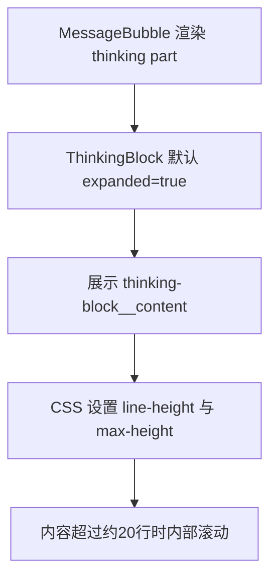
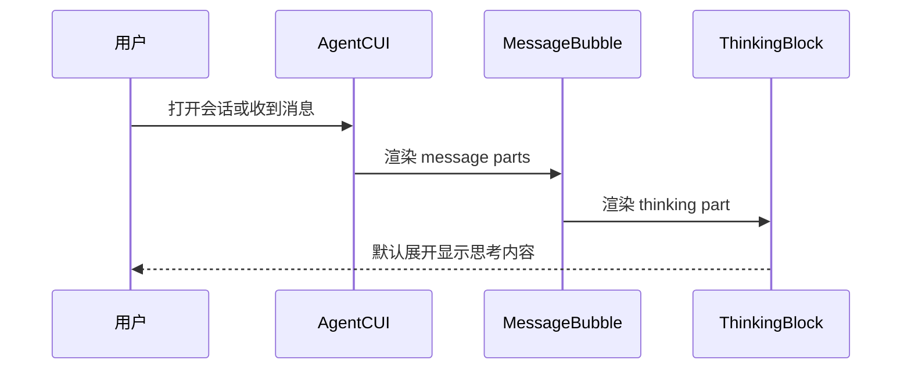
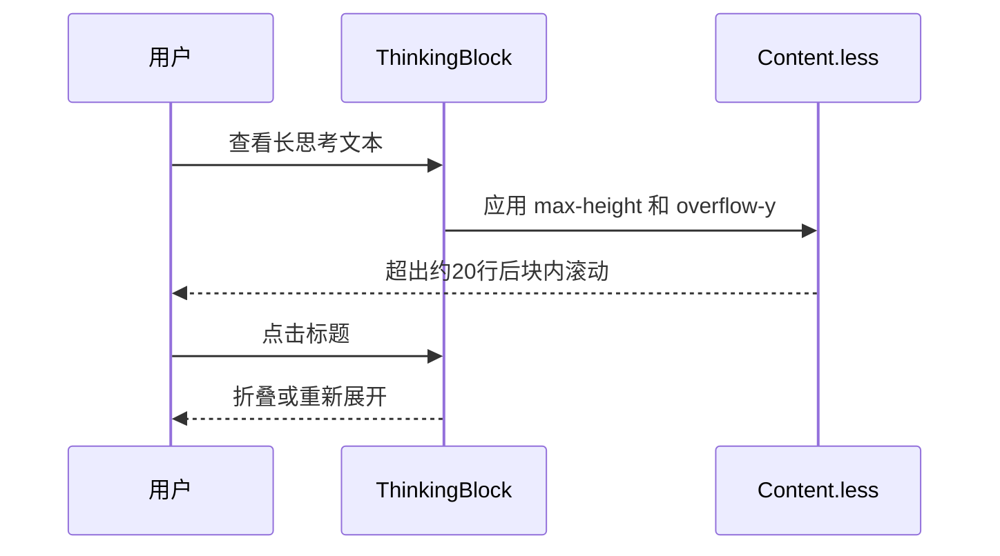

# `AgentCUI思考内容默认展开与20行限高方案`

- 方案日期：`2026-06-11`
- 目标工程：`ai-chat-viewer`
- 参考文档：`src/components/ThinkingBlock.tsx`、`src/styles/Content.less`、`src/components/MessageBubble.tsx`
- 方案类型：`前端交互与样式调整`

## 1. 背景

### 1.1 场景说明

当前 AgentCUI 中 `thinking` 类型消息由 `MessageBubble` 渲染到 `ThinkingBlock`。代码现状如下：

1. `ThinkingBlock` 使用 `const [expanded, setExpanded] = useState(false);`，因此思考块默认折叠。
2. `ThinkingBlock` 仅在 `part.isStreaming` 从非流式变为流式时执行 `setExpanded(true)`。
3. `.thinking-block__content` 当前只配置了 `padding`、`border-top`、`background-color`、`font-size`、`color`，没有 `max-height` 或 `overflow-y`。
4. 因此长思考内容在展开后会完整撑高消息区域；历史消息默认不会展开。

### 1.2 需求目标

1. 单个思考文本块默认展开。
2. 单个思考文本块最大高度约 20 行。
3. 超出 20 行后在思考文本块内部使用滚动条。
4. 保留用户点击标题折叠和再次展开的能力。

### 1.3 非目标

1. 不调整 `tool`、`question`、`permission` 等其他消息块。
2. 不改动流式协议、消息组装逻辑或埋点逻辑。
3. 不改变 markdown 渲染插件与内容解析规则。

## 2. 方案图

### 2.1 整体方案图



### 2.2 方案核心

将 `ThinkingBlock` 初始展开态从 `false` 调整为 `true`，并在 `.thinking-block__content` 上增加约 20 行高度上限和纵向滚动。

## 3. 时序图

### 3.1 `展示思考内容`



### 3.2 `长文本滚动`



## 4. 技术细节

### 4.1 调整点

1. `src/components/ThinkingBlock.tsx`
   - 将 `const [expanded, setExpanded] = useState(false);` 调整为 `useState(true);`。
2. `src/components/ThinkingBlock.tsx`
   - 现有流式自动展开逻辑可以保留，默认展开后作为兼容兜底。
   - 若希望进一步简化组件，可后续移除 `useEffect` 与 `prevStreamingRef`，但本次建议保持小改动。
3. `src/styles/Content.less`
   - 为 `.thinking-block__content` 增加：

```less
line-height: 20px;
max-height: 400px;
overflow-y: auto;
overflow-x: hidden;
box-sizing: border-box;
-webkit-overflow-scrolling: touch;
```

### 4.2 核心实现方式

推荐用固定行高计算 20 行高度：`line-height: 20px`，`max-height: 400px`。这样“约 20 行”的展示效果更可预期，避免浏览器默认 `line-height: normal` 带来的差异。

### 4.3 兼容与边界

1. 历史消息、非流式消息、流式消息都会默认展开。
2. 长 markdown、列表、代码片段、表格等内容会在思考块内部滚动。
3. 外层 `.thinking-block` 当前 `overflow: hidden` 可保留，内部滚动由 `.thinking-block__content` 承接。
4. 深色模式已有 `.thinking-block__content` 颜色和背景覆盖，不需要额外改动。

### 4.4 相关接口联动

1. `MessageBubble.renderPart`
   - 继续按 `part.type === 'thinking'` 渲染 `ThinkingBlock`，不需要改接口。
2. `StreamAssembler`
   - 不涉及。
3. `useChatSession`
   - 不涉及。

### 4.5 文档需要同步修改的内容

1. 本方案文档记录“思考过程默认展开，超过约 20 行内部滚动”。
2. 如项目存在产品交互说明或验收用例，需同步该默认展示规则。
3. 其他文档不涉及。

## 5. 性能

不新增请求，不改变数据结构。默认展开会让历史长思考内容立即参与 markdown 渲染和布局；若首屏存在大量长思考块，会比默认折叠产生更多初始渲染成本。通过 20 行限高可以控制单个思考块对页面高度的影响。

## 6. 功耗

不新增轮询、长连接、后台任务、动画或频繁刷新。滚动条仅在用户查看长内容时产生常规 UI 开销。

## 7. 埋码

1. 不涉及
   - 说明：本次只调整展示默认态和 CSS 限高，不新增用户行为事件。
2. 可选埋码
   - 说明：如后续需要分析用户是否查看思考内容，可新增展开/折叠点击埋点，本次不建议纳入。

## 8. 影响范围

### 8.1 直接影响

1. AgentCUI 中所有 `thinking` 消息块默认展开。
2. 单个思考块长文本不再无限撑高页面，而是在块内滚动。

### 8.2 间接影响

1. 历史会话进入后可直接看到思考过程，信息密度增加。
2. 移动端长思考内容区域会出现内部滚动，需要重点验证触摸滚动体验。

### 8.3 不影响

1. 普通 assistant 文本消息不影响。
2. 工具调用卡片不影响。
3. 权限卡片、问题卡片、代码块折叠逻辑不影响。

## 9. 测试范围

### 9.1 功能测试

1. 普通 `thinking` 消息进入页面后默认展开。
2. 流式 `thinking` 消息展示时默认展开，并持续追加内容。
3. 点击思考块标题后可折叠，再次点击可展开。
4. 超过 20 行的思考内容出现内部滚动条。

### 9.2 兼容测试

1. PC 模式和移动端模式。
2. 浅色模式和深色模式。
3. markdown 内容包含段落、列表、代码、表格时的滚动表现。

### 9.3 文档一致性检查

1. 交互描述与实际默认展开行为一致。
2. “约 20 行”与 CSS `line-height: 20px; max-height: 400px;` 一致。

## 10. 最终建议

最终结论：推荐采用 `ThinkingBlock` 默认 `expanded=true` 加 `.thinking-block__content` 设置 `line-height: 20px; max-height: 400px; overflow-y: auto;` 的轻量方案。该方案改动范围小、风险低，能同时满足默认展开和长文本不撑满页面的诉求；后续动作是补一组长思考内容 mock 或手工场景，完成 PC/移动端、浅色/深色模式视觉验收。
