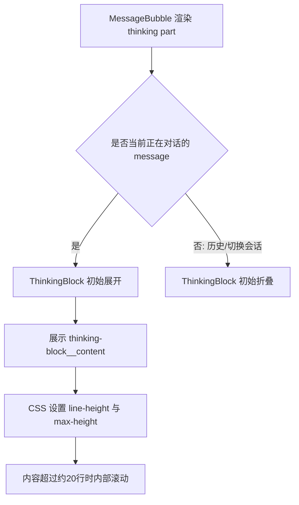
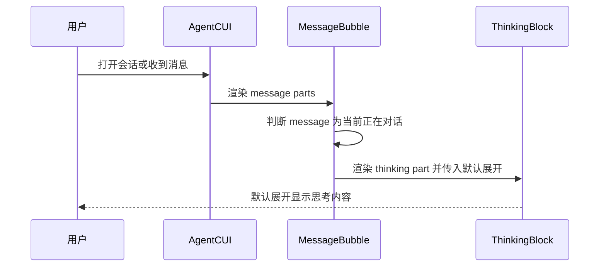
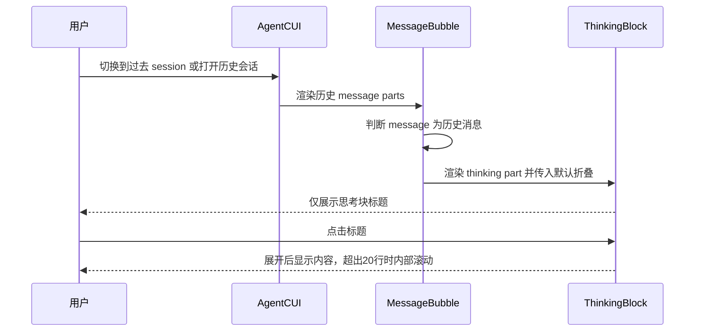

# `AgentCUI活跃思考内容默认展开与20行限高方案`

- 方案日期：`2026-06-12`
- 目标工程：`ai-chat-viewer`
- 参考文档：`src/components/ThinkingBlock.tsx`、`src/styles/Content.less`、`src/components/MessageBubble.tsx`
- 方案类型：`前端交互与样式调整`

## 1. 背景

### 1.1 场景说明

当前 AgentCUI 中 `thinking` 类型消息由 `MessageBubble` 渲染到 `ThinkingBlock`。代码现状如下：

1. `ThinkingBlock` 使用 `const [expanded, setExpanded] = useState(false);`，因此思考块默认折叠。
2. `ThinkingBlock` 仅在 `part.isStreaming` 从非流式变为流式时执行 `setExpanded(true)`。
3. `.thinking-block__content` 当前只配置了 `padding`、`border-top`、`background-color`、`font-size`、`color`，没有 `max-height` 或 `overflow-y`。
4. 因此长思考内容在展开后会完整撑高消息区域；历史消息默认不会展开。
5. 需要特别区分“正在对话的当前 message”和“过去 session 会话中的历史 message”：前者需要默认展开思考过程，后者仍应默认折叠。

### 1.2 需求目标

1. 正在对话的当前 message 中，单个思考文本块默认展开。
2. 过去 session 会话中的 `thinking` 默认不展开，包括从其他会话切换过来、打开历史会话、恢复历史消息等场景。
3. 单个思考文本块最大高度约 20 行。
4. 超出 20 行后在思考文本块内部使用滚动条。
5. 保留用户点击标题折叠和再次展开的能力。

### 1.3 非目标

1. 不调整 `tool`、`question`、`permission` 等其他消息块。
2. 不改动流式协议、消息组装逻辑或埋点逻辑。
3. 不改变 markdown 渲染插件与内容解析规则。

## 2. 方案图

### 2.1 整体方案图



### 2.2 方案核心

由 `MessageBubble` 根据消息上下文判断 `thinking` 是否应默认展开：当前正在对话的 message 默认展开，历史 session message 默认折叠；同时在 `.thinking-block__content` 上增加约 20 行高度上限和纵向滚动。

## 3. 时序图

### 3.1 `当前对话展示思考内容`



### 3.2 `历史会话展示思考内容`



## 4. 技术细节

### 4.1 调整点

1. `src/components/ThinkingBlock.tsx`
   - 新增显式入参，例如 `defaultExpanded?: boolean`。
   - 初始状态使用 `useState(defaultExpanded)`，而不是在组件内部无条件 `useState(true)`。
2. `src/components/ThinkingBlock.tsx`
   - 现有流式自动展开逻辑可以保留，用于保障当前 streaming thinking 在生成过程中可见。
   - 若历史消息误带 `isStreaming=true`，需要优先以 message 历史上下文为准，避免历史 session 被自动展开。
3. `src/components/MessageBubble.tsx`
   - 渲染 `part.type === 'thinking'` 时，按消息上下文传入 `defaultExpanded`。
   - 推荐判断：`defaultExpanded = !message.isHistory && message.isStreaming` 或基于当前会话中“正在生成的 assistant message”状态判断。
   - 对从其他会话切换过来、历史回放、`getSessionMessageHistory` 返回的消息，应保持 `defaultExpanded=false`。
4. `src/styles/Content.less`
   - 为 `.thinking-block__content` 增加：

```less
line-height: 20px;
max-height: 400px;
overflow-y: auto;
overflow-x: hidden;
box-sizing: border-box;
-webkit-overflow-scrolling: touch;
```

### 4.2 核心实现方式

推荐将默认展开逻辑上移到 `MessageBubble`，因为它能同时拿到 `message.isHistory`、`message.isStreaming` 与 `part` 信息；`ThinkingBlock` 只负责根据 `defaultExpanded` 初始化折叠态并处理用户点击。高度控制继续用固定行高计算 20 行高度：`line-height: 20px`，`max-height: 400px`。这样“约 20 行”的展示效果更可预期，避免浏览器默认 `line-height: normal` 带来的差异。

### 4.3 兼容与边界

1. 当前正在对话的 message thinking 默认展开。
2. 过去 session 会话 thinking 默认折叠，包括切换会话、打开历史会话、历史消息恢复等场景。
3. 长 markdown、列表、代码片段、表格等内容在展开后会在思考块内部滚动。
4. 外层 `.thinking-block` 当前 `overflow: hidden` 可保留，内部滚动由 `.thinking-block__content` 承接。
5. 深色模式已有 `.thinking-block__content` 颜色和背景覆盖，不需要额外改动。
6. 如果用户手动折叠当前正在生成的 thinking，后续 streaming delta 是否再次强制展开待确认；推荐尊重用户手动折叠，不再反复自动展开。

### 4.4 相关接口联动

1. `MessageBubble.renderPart`
   - 继续按 `part.type === 'thinking'` 渲染 `ThinkingBlock`，但需要传入默认展开布尔值。
2. `StreamAssembler`
   - 不涉及。
3. `useChatSession`
   - 需要确认 `message.isHistory`、`message.isStreaming` 在当前会话与历史会话中的赋值是否稳定；如不稳定，需要补充上下文标记。

### 4.5 文档需要同步修改的内容

1. 本方案文档记录“当前对话 thinking 默认展开，历史 session thinking 默认折叠，展开后超过约 20 行内部滚动”。
2. 如项目存在产品交互说明或验收用例，需同步当前/历史会话的差异化默认展示规则。
3. 其他文档不涉及。

## 5. 性能

不新增请求，不改变数据结构。历史 session thinking 保持默认折叠，可避免历史长思考内容在切换会话或打开历史会话时立即参与大面积布局。当前正在对话的 thinking 默认展开，影响范围集中在当前生成消息；通过 20 行限高可以控制单个思考块对页面高度的影响。

## 6. 功耗

不新增轮询、长连接、后台任务、动画或频繁刷新。滚动条仅在用户查看长内容时产生常规 UI 开销。

## 7. 埋码

1. 不涉及
   - 说明：本次只调整展示默认态和 CSS 限高，不新增用户行为事件。
2. 可选埋码
   - 说明：如后续需要分析用户是否查看思考内容，可新增展开/折叠点击埋点，本次不建议纳入。

## 8. 影响范围

### 8.1 直接影响

1. AgentCUI 当前正在对话的 `thinking` 消息块默认展开。
2. 过去 session 会话中的 `thinking` 消息块默认折叠。
3. 单个思考块长文本展开后不再无限撑高页面，而是在块内滚动。

### 8.2 间接影响

1. 当前对话的思考过程更容易被用户及时看到。
2. 历史会话仍保持较低信息密度，避免打开过去 session 时被长 thinking 干扰。
3. 移动端长思考内容区域会出现内部滚动，需要重点验证触摸滚动体验。

### 8.3 不影响

1. 普通 assistant 文本消息不影响。
2. 工具调用卡片不影响。
3. 权限卡片、问题卡片、代码块折叠逻辑不影响。

## 9. 测试范围

### 9.1 功能测试

1. 当前正在对话的流式 `thinking` 消息展示时默认展开，并持续追加内容。
2. 从其他会话切换到过去 session 后，历史 `thinking` 默认折叠。
3. 直接打开过去对话或历史回放时，历史 `thinking` 默认折叠。
4. 点击思考块标题后可折叠，再次点击可展开。
5. 超过 20 行的思考内容在展开后出现内部滚动条。

### 9.2 兼容测试

1. PC 模式和移动端模式。
2. 浅色模式和深色模式。
3. markdown 内容包含段落、列表、代码、表格时的滚动表现。

### 9.3 文档一致性检查

1. 交互描述与当前/历史会话差异化默认展开行为一致。
2. “约 20 行”与 CSS `line-height: 20px; max-height: 400px;` 一致。

## 10. 最终建议

最终结论：推荐采用“`MessageBubble` 判断消息上下文 + `ThinkingBlock` 接收 `defaultExpanded` + `.thinking-block__content` 设置 `line-height: 20px; max-height: 400px; overflow-y: auto;`”的方案。该方案能准确满足当前对话默认展开、历史 session 默认折叠、长文本不撑满页面三个目标；后续动作是更新实现中无条件默认展开的逻辑，并补充当前会话展开、历史会话折叠、长文本滚动三类测试。
