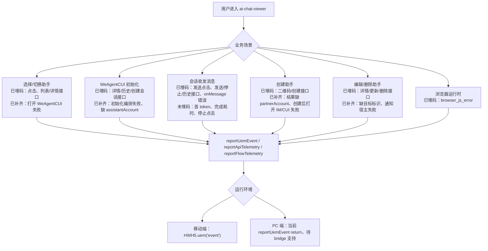
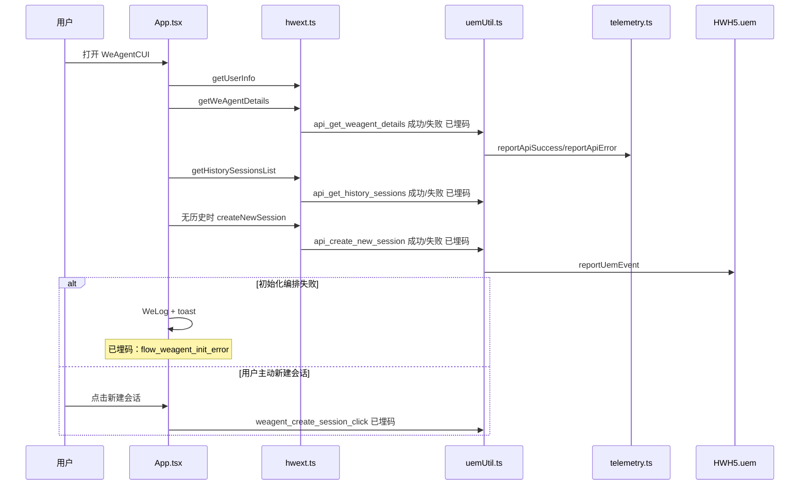
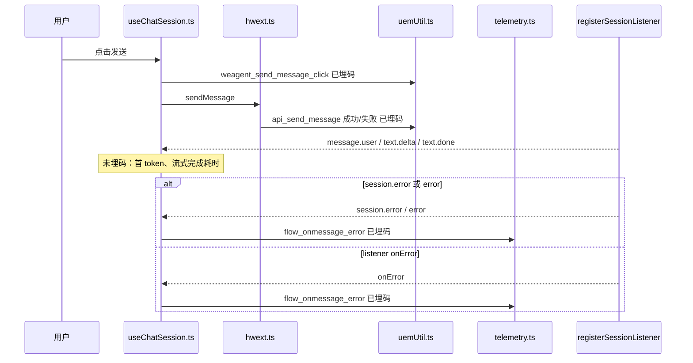
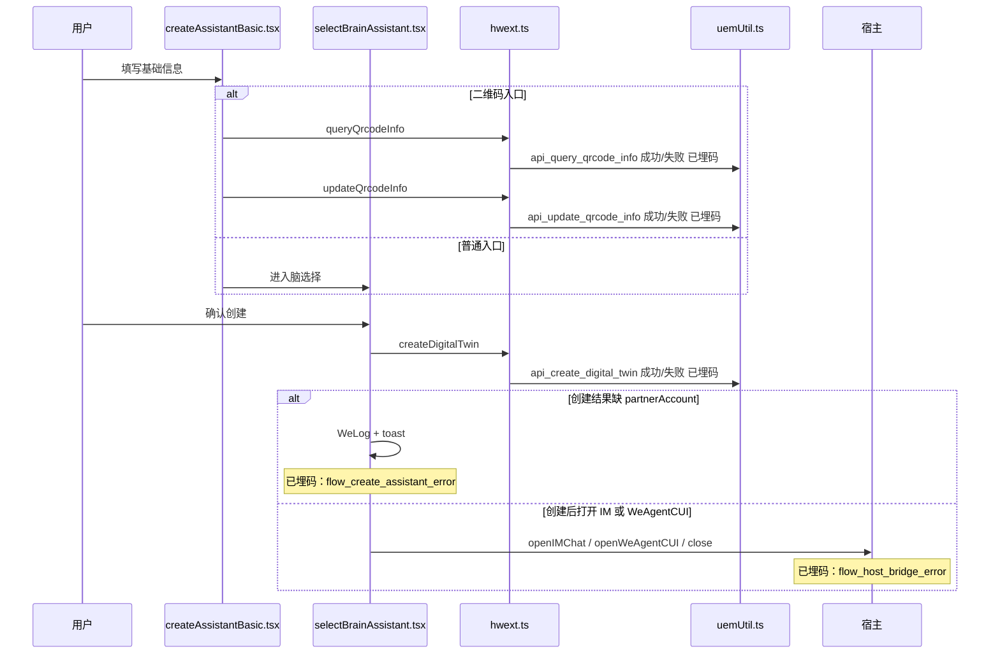
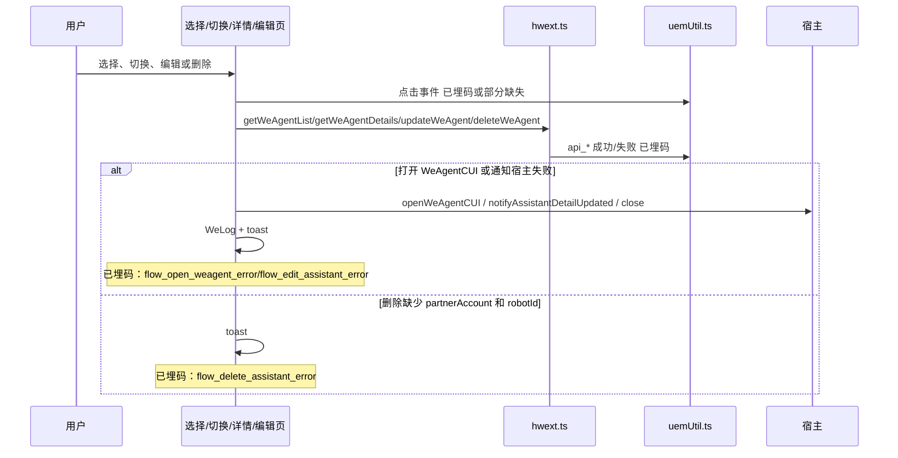

# `ai-chat-viewer 埋码功能现状整理与异常监控补齐方案`

- 方案日期：`2026-06-11`
- 目标工程：`ai-chat-viewer`
- 参考文档：`docs/plans/2026-05-20-ai-chat-viewer-telemetry-plan.md`、`docs/plans/2026-06-04-core-exception-telemetry-plan.md`、`docs/requirements.md`
- 方案类型：`埋码现状盘点 / 异常监控补齐 / 技术实现整理`

## 1. 背景

### 1.1 场景说明

当前工程已经形成三类埋码能力：

1. 点击类埋码：由 `src/utils/uemUtil.ts` 的 `reportClickEvent` 收口，最终调用 `src/utils/hwext.ts` 的 `reportUemEvent`。
2. 接口类埋码：由 `src/utils/uemUtil.ts` 的 `trackApi*` wrapper 收口，覆盖接口成功和失败，最终通过 `src/utils/telemetry.ts` 的 `reportApiSuccess` / `reportApiError` 上报。
3. 流程异常类埋码：由 `src/utils/telemetry.ts` 的 `reportFlowTelemetry` 上报，目前已覆盖流式 `onMessage` 错误和浏览器 JS 运行时错误。

现状主要缺口是：核心业务流程中的编排失败、缺参、宿主桥接失败、创建/编辑/删除助手后续动作失败，多数仅 `WeLog` 或 toast，未形成可聚合分析的流程异常埋码。

### 1.2 需求目标

1. 梳理现有埋码类型、事件、业务模块、实现状态和描述。
2. 对核心业务场景用流程图和时序图呈现关键路径，并标识关键节点是否已埋码。
3. 特别区分异常和错误埋码，明确已覆盖的错误路径和未覆盖的流程异常缺口。
4. 重新审视已实现和未实现埋码的告警必要性，区分实时告警、阈值告警、看板观察和不告警。
5. 整理当前代码层面的埋码实现方式，给出后续补齐建议。

### 1.3 非目标

1. 本文不直接新增代码实现。
2. 不调整现有 `HWH5.uem` payload 协议。
3. 不变更已实现事件名。
4. 不上报用户输入原文、AI 回复正文、头像文件内容等敏感数据。

## 2. 方案图

### 2.1 整体方案图

### 2.2 方案核心

以现有 `uemUtil.ts`、`telemetry.ts`、`hwext.ts` 为埋码统一入口，保留已实现点击和接口埋码，补齐核心流程异常埋码，使“接口失败”和“业务流程失败”可以分层分析。

## 3. 时序图

### 3.1 `WeAgentCUI 初始化与新建会话`

### 3.2 `发送消息与流式错误`

### 3.3 `创建助手流程`

### 3.4 `选择/切换/编辑/删除助手`

## 4. 技术细节

### 4.1 调整点

1. 现状盘点：保持 `reportClickEvent`、`trackApi*`、`reportFlowTelemetry` 三类入口不变。
2. 异常补齐：建议新增流程异常 helper，例如 `reportCoreFlowError(eventId, eventTitle, error, payload)`，复用错误码和错误信息截断逻辑。
3. 核心流程补点：在 `App.tsx`、`useChatSession.ts`、`selectAssistant.tsx`、`switchAssistant.tsx`、`createAssistantBasic.tsx`、`selectBrainAssistant.tsx`、`EditAssistantContent.tsx`、`assistantDetail.tsx` 的失败分支补 `flow_*_error`。
4. 告警策略：只对影响核心链路可用性、且可通过错误率或突增判断的埋码接入告警；点击行为、预期业务校验失败和低频非主链路失败进入看板观察。
5. 文档同步：以本文总表作为当前实现状态基线，后续代码补点后同步更新“是否实现”和“告警建议”。

### 4.2 核心实现方式

当前代码层面分为四层：

1. 上报底座：`src/utils/hwext.ts` 的 `reportUemEvent(eventId, eventTitle, data)`。
   - 移动端调用 `window.HWH5.uem('event', { type, code, name, result, msg, duration, data })`。
   - PC 端当前直接 return，注释为待 PC bridge ready 后补齐。
2. 公共封装：`src/utils/telemetry.ts`。
   - `getTelemetryBase()` 缓存 `clientType`、`versionName`、`environment`。
   - `emitTelemetry()` 统一补 `entry: 'WeAgent'` 和 `operationTime`。
   - `reportApiSuccess()` / `reportApiError()` 处理接口成功与失败。
   - `reportFlowTelemetry()` 处理流程类和异常类事件。
   - `installBrowserJsErrorTelemetry()` 监听 `window.error` 并做 3 秒同指纹节流。
3. 业务事件封装：`src/utils/uemUtil.ts`。
   - `reportSelectAssistantClick()` 等点击事件。
   - `trackApiCreateNewSession()` 等接口 wrapper，在 try/catch 中上报 `type: 'ok' | 'error'`。
4. SDK API 接入：`src/utils/hwext.ts`。
   - `sendMessage()`、`createNewSession()`、`getWeAgentList()` 等方法统一包上对应 `trackApi*`。
   - 页面和 Hook 调 SDK 方法时自动获得接口成功/失败埋码。

### 4.3 兼容与边界

1. 上报失败被 `telemetry.ts` 或 `uemUtil.ts` 捕获并写 `WeLog`，不影响业务主流程。
2. 接口类失败埋码和流程类失败埋码允许同时存在：前者定位接口稳定性，后者定位用户流程损失。
3. 消息相关字段当前只上报 `contentLength`，不上传用户输入原文。
4. `browser_js_error` 只监听 `window.error`，暂未覆盖 `unhandledrejection`。
5. `getTelemetryBase()` 首次调用异步获取设备和应用信息，后续复用 promise，避免重复请求。

### 4.4 相关接口联动

1. 会话接口：`createNewSession`、`getHistorySessionsList`、`getSessionMessageHistory`、`sendMessage`、`stopSkill`、`sendMessageToIM`、`replyPermission`。
2. 助手接口：`getWeAgentList`、`getWeAgentDetails`、`createDigitalTwin`、`updateWeAgent`、`deleteWeAgent`。
3. 二维码接口：`queryQrcodeInfo`、`updateQrcodeInfo`。
4. 宿主桥接：`openWeAgentCUI`、`notifyAssistantDetailUpdated`、`openH5Webview`、`openIMChat`、`close`、`navigateBack`，当前未统一接入接口埋码。
5. 流式监听：`registerSessionListener` 的 `onMessage`、`onError`、`onClose`。

### 4.5 文档需要同步修改的内容

1. 后续补齐代码后，同步更新 `docs/plans/2026-05-20-ai-chat-viewer-telemetry-plan.md` 的已实现总表。
2. 若确认新增流程异常事件，需要在需求或埋码字典中补充字段定义。
3. PC 端 UEM bridge 支持后，需要补充 PC 上报策略和验收方式。

## 5. 性能

现有点击和异常埋码均为 fire-and-forget，不阻塞页面流程。接口类埋码在 wrapper 的 try/catch 中触发，上报 promise 不 await，因此不会延长接口返回链路。`getTelemetryBase()` 做 promise 级缓存，避免每次埋码重复调用 `getDeviceInfo` 和 `getAppInfo`。

后续若新增流式性能埋码，应只在首 token、完成、错误等关键节点上报，不应在每个 `text.delta` 分片上报。

## 6. 功耗

不涉及新增轮询、长连接、后台任务或动画。现有 `browser_js_error` 为事件监听，且对同指纹错误做 3 秒节流。后续新增流程异常埋码仅在异常分支触发，对功耗影响可忽略。

## 7. 埋码

### 7.1 埋码类型

| 类型 | 说明 | 当前入口 | 错误/异常覆盖 |
|---|---|---|---|
| 点击埋码 | 用户主动点击行为，如选择助手、发送消息、新建会话 | `uemUtil.ts` -> `reportUemEvent` | 仅部分事件带 `type: ok/error`，主要不是异常监控 |
| 接口埋码 | SDK API 成功/失败结果 | `hwext.ts` -> `trackApi*` -> `reportApiSuccess/reportApiError` | 已覆盖接口异常，带 `errorCode`、`errorMessage` |
| 流程异常埋码 | 非单一接口失败的业务流程错误 | `reportFlowTelemetry` | 已覆盖 `flow_onmessage_error`，核心流程仍缺口较多 |
| 浏览器异常埋码 | 前端运行时 JS 错误 | `installBrowserJsErrorTelemetry` | 已覆盖 `window.error`，未覆盖 promise rejection |
| 性能埋码 | 流式首 token、完成、初始化耗时等 | 待接入 | 未实现 |
| 本地日志 | 仅用于端侧日志排查 | `WeLog` -> `HWH5.log` | 不进入 UEM 聚合分析 |

### 7.2 已实现与未实现埋码总表

| 类型 | 事件 | 业务模块 | 是否实现 | 描述 |
|---|---|---|---|---|
| 点击 | `activate_select_assistant_click` | 激活助手页 `activateAssistant.tsx` | 已实现 | 点击“选择助理”。 |
| 点击 | `select_assistant_create_click` | 选择助手页 `selectAssistant.tsx` | 已实现 | 点击“创建助理”。 |
| 点击 | `select_assistant_start_click` | 选择助手页 `selectAssistant.tsx` | 已实现 | 点击“开始使用”。 |
| 点击 | `switch_assistant_confirm_click` | 切换助手页 `switchAssistant.tsx` | 已实现 | 点击“确认切换”。 |
| 点击 | `weagent_history_click` | 历史会话侧边栏 `WeAgentHistorySidebar.tsx` | 已实现 | 点击历史会话入口，带 `page`、`assistantAccount`。 |
| 点击 | `weagent_create_session_click` | WeAgentCUI `App.tsx` | 已实现 | 用户主动新建会话，带 `type: ok/error`。 |
| 点击 | `weagent_send_message_click` | 会话 Hook `useChatSession.ts` | 已实现 | 点击发送消息，带 `page`、`welinkSessionId`、`contentLength`、机器人标识。 |
| 点击 | `weagent_stop_generate_click` | 会话 Hook `useChatSession.ts` | 未实现 | 停止生成点击当前只有 `api_stop_skill`，无点击行为埋码。 |
| 点击 | `weagent_send_to_im_click` | 会话 Hook `useChatSession.ts` | 未实现 | 发送到 IM 当前只有 `api_send_message_to_im`，无点击行为埋码。 |
| 点击 | `weagent_permission_allow_click` | 权限卡片流程 | 未实现 | 权限选择当前只有 `api_reply_permission`，无点击行为埋码。 |
| 点击 | `weagent_question_answer_click` | 问题卡片流程 | 未实现 | 问题回答复用 `sendMessage`，无独立点击埋码。 |
| 接口 | `api_create_new_session` | 会话创建 | 已实现 | 创建会话成功/失败，失败带错误码和错误信息。 |
| 接口 | `api_get_history_sessions` | 历史会话列表 | 已实现 | 获取历史会话列表成功/失败。 |
| 接口 | `api_get_session_message_history` | 历史消息 | 已实现 | 获取会话历史消息成功/失败。 |
| 接口 | `api_send_message` | 发送消息 | 已实现 | 发送消息接口成功/失败，只记录内容长度。 |
| 接口 | `api_reply_permission` | 权限回复 | 已实现 | 权限卡片回复成功/失败。 |
| 接口 | `api_stop_skill` | 停止生成 | 已实现 | 停止生成接口成功/失败。 |
| 接口 | `api_send_message_to_im` | 发送到 IM | 已实现 | 发送到 IM 接口成功/失败。 |
| 接口 | `api_create_digital_twin` | 创建助手 | 已实现 | 创建助手接口成功/失败。 |
| 接口 | `api_query_qrcode_info` | 二维码创建助手 | 已实现 | 查询二维码状态成功/失败。 |
| 接口 | `api_update_qrcode_info` | 二维码创建助手 | 已实现 | 更新二维码状态成功/失败。 |
| 接口 | `api_get_weagent_details` | 助手详情 | 已实现 | 获取助手详情成功/失败，支持单个和批量账号。 |
| 接口 | `api_get_weagent_list` | 助手列表 | 已实现 | 获取助手列表成功/失败，记录列表数量和是否有专属助手。 |
| 接口 | `api_update_weagent` | 编辑助手 | 已实现 | 更新助手成功/失败。 |
| 接口 | `api_delete_weagent` | 删除助手 | 已实现 | 删除助手成功/失败。 |
| 流程异常 | `flow_onmessage_error` | 流式会话 `useChatSession.ts` | 已实现 | 收到 `session.error`、`error` 或 listener `onError` 时上报。 |
| 浏览器异常 | `browser_js_error` | `App.tsx`、`skillCUI.tsx` | 已实现 | 浏览器 JS 运行时错误，带页面、会话、文件、行列、堆栈。 |
| 流程异常 | `flow_weagent_init_error` | WeAgentCUI 初始化 `App.tsx` | 已实现 | 初始化编排失败，上报 `page`、`stage`、`assistantAccount`、`isPc` 和错误信息。 |
| 流程异常 | `flow_weagent_missing_param_error` | WeAgentCUI 入口 `App.tsx` | 已实现 | 缺少 `assistantAccount`，上报入口缺参异常。 |
| 流程异常 | `flow_open_weagent_error` | 选择/切换助手 | 已实现 | `openAssistantByPartnerAccount` 失败或未打开，上报选择/切换入口断链。 |
| 流程异常 | `flow_create_assistant_error` | 创建助手 | 已实现 | 创建结果异常、二维码校验失败、创建后打开 IM/CUI 失败等流程级失败。 |
| 流程异常 | `flow_edit_assistant_error` | 编辑助手 | 已实现 | 缺目标、加载失败、更新失败、通知宿主失败等流程级失败。 |
| 流程异常 | `flow_delete_assistant_error` | 删除助手 | 已实现 | 缺目标或删除流程失败。接口失败仍由 `api_delete_weagent` 覆盖。 |
| 流程异常 | `flow_skillcui_missing_param_error` | SkillCUI 入口 | 已实现 | 缺少 `welinkSessionId` 的入口异常。 |
| 流程异常 | `flow_host_bridge_error` | 宿主桥接 | 已实现 | 当前覆盖创建助手后 `openIMChat` / PC 创建后宿主处理失败，后续可扩展到更多桥接方法。 |
| 性能 | `perf_stream_first_token` | 流式会话 | 未实现 | 用户发送后首次可展示内容耗时。 |
| 性能 | `perf_stream_complete` | 流式会话 | 未实现 | 首 token 后生成耗时和端到端完成耗时。 |
| 性能 | `perf_stream_error` | 流式会话 | 未实现 | 流式错误前耗时，补充 `flow_onmessage_error` 的性能维度。 |
| 性能 | `perf_history_load` | 历史会话/历史消息 | 未实现 | 历史列表或历史消息加载耗时。 |
| 性能 | `perf_weagent_init` | WeAgentCUI 初始化 | 未实现 | 初始化成功耗时。 |

### 7.3 异常和错误埋码重点说明

1. 已实现接口错误：所有通过 `hwext.ts` 包装的 `api_*` 方法，失败时都会调用 `reportApiError`，字段包含 `type: 'error'`、`request`、`errorCode`、`errorMessage`。
2. 已实现流式错误：`useChatSession.ts` 在 `session.error`、`error` 和 listener `onError` 中上报 `flow_onmessage_error`。
3. 已实现运行时错误：`App.tsx` 和 `skillCUI.tsx` 安装 `installBrowserJsErrorTelemetry`，上报 `browser_js_error`。
4. 未实现流程错误：初始化失败、缺参、打开 CUI 失败、创建后桥接失败、编辑通知失败、删除缺目标等，目前主要依赖 `WeLog` 和 toast，无法在 UEM 中按业务流程聚合。

### 7.4 告警建议总表

告警不建议按单条事件直接触发，推荐按时间窗口内错误率、错误量、版本维度突增进行聚合。下表中的“实时告警”也应配置最小样本量，避免单个用户或单台设备造成误报。

| 类型 | 事件 | 实现状态 | 告警建议 | 建议级别 | 判断理由 |
|---|---|---|---|---|---|
| 点击 | `activate_select_assistant_click` | 已实现 | 不告警 | P3 | 用户点击行为只用于漏斗分析，不代表异常。 |
| 点击 | `select_assistant_create_click` | 已实现 | 不告警 | P3 | 创建入口点击用于转化分析，不作为稳定性告警。 |
| 点击 | `select_assistant_start_click` | 已实现 | 不告警 | P3 | 开始使用点击本身不是失败信号。 |
| 点击 | `switch_assistant_confirm_click` | 已实现 | 不告警 | P3 | 切换确认点击不是失败信号，失败应由打开 CUI 或接口错误承接。 |
| 点击 | `weagent_history_click` | 已实现 | 不告警 | P3 | 历史入口点击只用于行为分析。 |
| 点击 | `weagent_create_session_click` | 已实现 | 看板观察 | P2 | 当前带 `type: ok/error`，但错误原因由 `api_create_new_session` 或初始化流程更准确承接。 |
| 点击 | `weagent_send_message_click` | 已实现 | 不告警 | P3 | 发送点击不代表发送失败，失败应看 `api_send_message` 和 `flow_onmessage_error`。 |
| 点击 | `weagent_stop_generate_click` | 未实现 | 不告警 | P3 | 即使补点也主要用于行为分析，停止失败看 `api_stop_skill`。 |
| 点击 | `weagent_send_to_im_click` | 未实现 | 不告警 | P3 | 即使补点也主要用于行为分析，发送失败看 `api_send_message_to_im`。 |
| 点击 | `weagent_permission_allow_click` | 未实现 | 不告警 | P3 | 权限选择点击用于行为分析，失败看 `api_reply_permission`。 |
| 点击 | `weagent_question_answer_click` | 未实现 | 不告警 | P3 | 问题回答点击用于行为分析，失败看 `api_send_message`。 |
| 接口 | `api_create_new_session` | 已实现 | 阈值告警 | P1 | 创建会话失败会导致无法进入或继续新会话，是 WeAgentCUI 主链路。 |
| 接口 | `api_get_history_sessions` | 已实现 | 阈值告警 | P2 | 历史会话加载失败影响体验和默认会话选择，但通常可通过兜底新建会话恢复。 |
| 接口 | `api_get_session_message_history` | 已实现 | 阈值告警 | P2 | 历史消息加载失败影响会话上下文展示，非发送主链路。 |
| 接口 | `api_send_message` | 已实现 | 阈值告警 | P1 | 发送消息失败直接影响核心对话能力。 |
| 接口 | `api_reply_permission` | 已实现 | 阈值告警 | P2 | 权限回复失败会卡住工具授权流程，但不是所有会话都会触发。 |
| 接口 | `api_stop_skill` | 已实现 | 看板观察 | P2 | 停止失败影响用户控制感，但通常不阻断后续会话，先观察错误率。 |
| 接口 | `api_send_message_to_im` | 已实现 | 看板观察 | P2 | 发送到 IM 失败影响扩展功能，不是 AI 对话主链路。 |
| 接口 | `api_create_digital_twin` | 已实现 | 阈值告警 | P1 | 创建助手失败影响关键转化链路。 |
| 接口 | `api_query_qrcode_info` | 已实现 | 看板观察 | P2 | 二维码查询失败影响二维码入口，需排除二维码过期等预期业务状态。 |
| 接口 | `api_update_qrcode_info` | 已实现 | 看板观察 | P3 | 更新二维码状态失败更多影响状态同步，单独告警价值较低。 |
| 接口 | `api_get_weagent_details` | 已实现 | 阈值告警 | P1 | 助手详情是初始化、打开 CUI、编辑详情等多个主流程依赖。 |
| 接口 | `api_get_weagent_list` | 已实现 | 阈值告警 | P2 | 助手列表失败影响选择/切换入口，重要但不等同会话不可用。 |
| 接口 | `api_update_weagent` | 已实现 | 看板观察 | P2 | 编辑失败影响管理流程，接口错误已有数据，通常不需要实时告警。 |
| 接口 | `api_delete_weagent` | 已实现 | 看板观察 | P2 | 删除失败影响管理流程，频率较低，建议看板观察。 |
| 流程异常 | `flow_onmessage_error` | 已实现 | 阈值告警 | P1 | 流式错误直接影响 AI 回复生成，是当前最关键的已实现流程异常告警。 |
| 浏览器异常 | `browser_js_error` | 已实现 | 阈值告警 | P1/P2 | 若同版本、同页面 JS 错误突增可能导致页面不可用；需按 `filename`、`message`、`versionName` 聚合并去重。 |
| 流程异常 | `flow_weagent_init_error` | 已实现 | 阈值告警 | P1 | 初始化失败会导致用户无法进入会话，建议纳入核心告警。 |
| 流程异常 | `flow_weagent_missing_param_error` | 已实现 | 突增告警 | P2 | 缺 `assistantAccount` 多为入口拼参或宿主集成问题，按版本/入口突增告警。 |
| 流程异常 | `flow_open_weagent_error` | 已实现 | 阈值告警 | P1 | 选择/切换助手后打不开 CUI，属于入口断链。 |
| 流程异常 | `flow_create_assistant_error` | 已实现 | 阈值告警 | P1 | 覆盖接口成功但后续打开 IM/CUI 失败等转化断点，建议告警。 |
| 流程异常 | `flow_edit_assistant_error` | 已实现 | 看板观察 | P2 | 编辑流程重要但不是主会话链路，先用于排查和趋势观察。 |
| 流程异常 | `flow_delete_assistant_error` | 已实现 | 看板观察 | P2 | 删除流程低频，建议只在错误突增时临时关注。 |
| 流程异常 | `flow_skillcui_missing_param_error` | 已实现 | 突增告警 | P2 | SkillCUI 缺 `welinkSessionId` 会导致页面不可用，但通常是入口集成问题，适合按版本突增告警。 |
| 流程异常 | `flow_host_bridge_error` | 已实现 | 阈值告警 | P1/P2 | 宿主桥接失败可能导致打开 CUI、打开 IM、通知更新失败；需按 `bridgeMethod` 区分告警级别。 |
| 性能 | `perf_stream_first_token` | 未实现 | 性能阈值告警 | P2 | 首 token P95/P99 超阈值会显著影响体验，但不属于错误告警。 |
| 性能 | `perf_stream_complete` | 未实现 | 性能阈值告警 | P2 | 端到端生成耗时可用于体验 SLA，建议按页面、版本、模型/场景聚合。 |
| 性能 | `perf_stream_error` | 未实现 | 合并告警 | P1/P2 | 不单独告警，建议与 `flow_onmessage_error` 合并，用于判断错误发生前等待时长。 |
| 性能 | `perf_history_load` | 未实现 | 性能阈值告警 | P3 | 历史加载慢影响体验但通常不阻塞发送，低优先级。 |
| 性能 | `perf_weagent_init` | 未实现 | 性能阈值告警 | P2 | 初始化慢会影响进入体验，建议与 `flow_weagent_init_error` 一起观察。 |

### 7.5 告警触发规则建议

1. P1 稳定性告警：5 分钟窗口内错误率 > 5%，且样本数 > 50；或 10 分钟内同一 `eventId + errorCode + versionName + clientType` 错误数 > 20。
2. P2 体验/转化告警：15 分钟窗口内错误率 > 8%，且样本数 > 80；或新版本错误率超过全量基线 2 倍。
3. 突增告警：同一入口、同一版本、同一错误指纹较过去 1 小时基线突增 3 倍以上时触发。
4. 性能告警：使用 P95/P99，而不是平均值；首 token 和初始化耗时需要按页面、客户端类型、版本分组。
5. 去噪规则：二维码过期、用户主动取消、参数为空导致按钮禁用、单用户重复触发、`browser_js_error` 同指纹 3 秒内重复事件，不应直接触发告警。
6. 告警路由：P1 进入实时值班；P2 进入工作时间告警或群通知；P3 只进看板和周报。

## 8. 影响范围

### 8.1 直接影响

1. 埋码文档基线：后续埋码评审可直接基于本文判断实现状态。
2. 异常监控口径：将接口失败、流程失败、运行时异常分层。
3. 业务模块：WeAgentCUI、SkillCUI、选择助手、切换助手、创建助手、编辑助手、删除助手、历史会话。

### 8.2 间接影响

1. 数据分析侧需要按 `type`、`eventId`、`page`、`stage` 区分接口错误和流程错误。
2. PC 端当前不上报 UEM，补齐 PC bridge 后同一套事件会扩大数据量。
3. 若新增性能埋码，需要明确采样或关键节点触发策略，避免流式高频事件。

### 8.3 不影响

1. 不影响 SDK API 方法签名。
2. 不影响页面跳转、toast 和宿主桥接行为。
3. 不影响消息渲染、历史加载和流式组装逻辑。

## 9. 测试范围

### 9.1 功能测试

1. 移动端触发选择助手、切换助手、发送消息、新建会话，确认点击埋码仍正常。
2. Mock SDK API 成功/失败，确认 `api_*` 成功和失败事件字段完整。
3. Mock `session.error`、`error`、listener `onError`，确认 `flow_onmessage_error` 上报。
4. 人为触发页面 JS 错误，确认 `browser_js_error` 上报且同指纹 3 秒内节流。
5. 在埋码平台或测试桩中校验 P1/P2 告警所需字段完整，包括 `eventId`、`type`、`page`、`stage`、`errorCode`、`errorMessage`、`clientType`、`versionName`。

### 9.2 兼容测试

1. `window.HWH5.uem` 不存在时，业务不阻塞且写入 `WeLog`。
2. PC 小程序环境下 `reportUemEvent` return，不影响页面流程。
3. i18n 初始化、页面卸载、会话切换过程中，埋码异步上报不造成状态更新异常。

### 9.3 文档一致性检查

1. 对照 `src/utils/uemUtil.ts` 的导出函数，确认总表事件无遗漏。
2. 对照 `src/utils/hwext.ts` 的 SDK API wrapper，确认接口事件和接入方法一致。
3. 对照 `src/hooks/useChatSession.ts`、`src/App.tsx`、创建/编辑/选择页面 catch 分支，确认“未实现”流程异常标注准确。
4. 对照第 7.4 节，确认已实现事件和拟新增事件均有明确告警建议，且 P1/P2/P3 分级和第 7.5 节规则一致。

## 10. 最终建议

最终结论：推荐保留现有三层收口方式，即点击类继续走 `uemUtil.ts`，接口类继续走 `hwext.ts` + `trackApi*`，流程异常和浏览器异常继续走 `telemetry.ts`。当前已补齐 `flow_weagent_init_error`、`flow_open_weagent_error`、`flow_create_assistant_error`、`flow_host_bridge_error`、`flow_skillcui_missing_param_error` 等核心流程异常；中期继续补充 `unhandledrejection` 和流式性能埋码；PC 端待 bridge 支持后再统一开启 UEM 上报。

取舍原因：接口错误已覆盖较完整，不需要重复建设；当前最大观测盲区在“接口成功但业务流程失败”和“非接口桥接失败”，这些问题最容易造成用户不可用但数据侧不可见。告警层面不建议所有异常事件直接告警，推荐只对 `api_create_new_session`、`api_send_message`、`api_create_digital_twin`、`api_get_weagent_details`、`flow_onmessage_error`、`browser_js_error` 以及补齐后的核心 `flow_*_error` 配置阈值告警；点击类、低频管理类、预期业务校验失败进入看板观察。后续动作建议先实现统一 `reportCoreFlowError` helper，再按核心页面失败分支逐步接入，并在埋码平台验证字段完整性和告警阈值后更新已实现总表。
