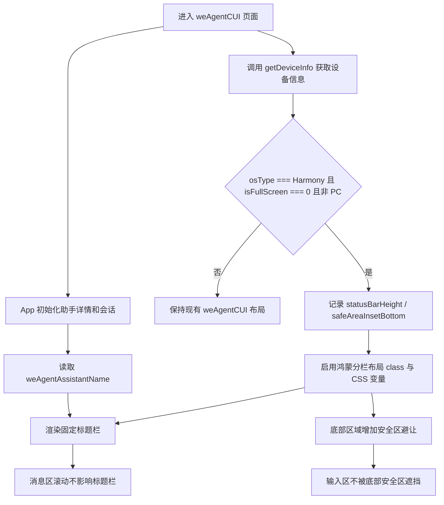
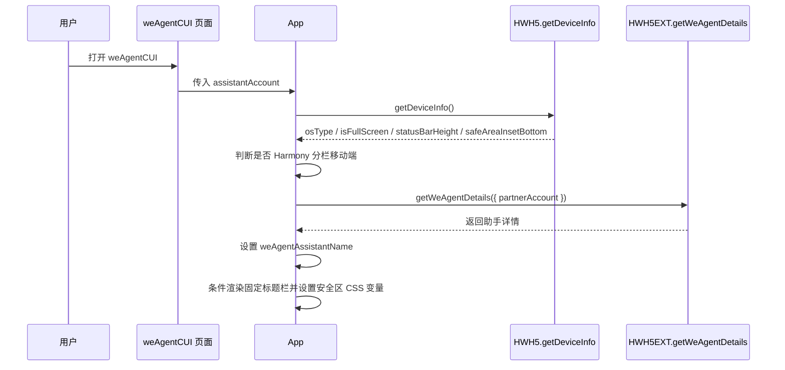
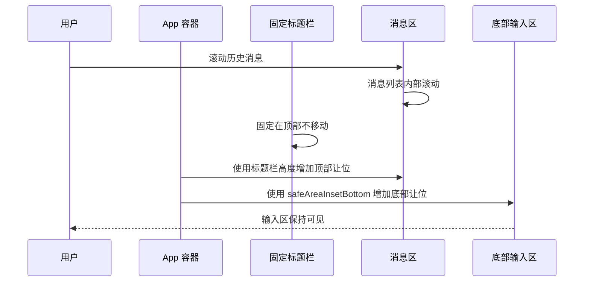

# 鸿蒙移动端分栏 weAgentCUI 安全区与标题栏适配方案

- 方案日期：`2026-06-18`
- 目标工程：`ai-chat-viewer`
- 参考文档：`src/pages/weAgentCUI.tsx`、`src/App.tsx`、`src/utils/hwext.ts`、`src/types/bridge/hwext.ts`、`src/styles/WeAgentCUI.less`、`src/styles/WeAgentCUIFooter.less`
- 方案类型：`鸿蒙移动端分栏 UI 交互优化方案`

## 1. 背景

### 1.1 场景说明

当前 `weAgentCUI` 页面在移动端小程序内运行，页面入口 `src/pages/weAgentCUI.tsx` 读取 `assistantAccount` 后渲染 `App`。`App` 内部通过 `getWeAgentDetails({ partnerAccount })` 获取当前助手详情，并将 `detail.name` 写入 `weAgentAssistantName`，随后传递给消息渲染层。

现状中 `weAgentCUI` 移动端整体背景和底部输入区已由 `src/styles/WeAgentCUI.less`、`src/styles/WeAgentCUIFooter.less` 控制，但在鸿蒙移动端分栏场景存在以下问题：

1. 小程序已隐藏移动端 statusbar，页面内容可能顶到系统状态栏区域，标题栏若直接贴顶会被状态栏图标覆盖。
2. `weAgentCUI` 当前没有独立固定标题栏，分栏场景下用户无法稳定看到当前助手名称。
3. 底部输入区可能被鸿蒙分栏或底部安全区遮挡，需要使用 `deviceInfo.safeAreaInsetBottom` 做避让。
4. 暗黑模式下标题栏、页面背景、底部安全区填充色需要与现有 `weAgentCUI` 暗黑背景保持一致。

本次优化只在鸿蒙移动端分栏场景生效。判断条件使用 `src/utils/hwext.ts` 的 `getDeviceInfo()` 返回值：

1. `deviceInfo.osType === 'Harmony'` 表示鸿蒙端。
2. `deviceInfo.isFullScreen === 0` 表示分栏。
3. `deviceInfo.statusBarHeight` 表示顶部状态栏高度。
4. `deviceInfo.safeAreaInsetBottom` 表示底部安全区高度。

### 1.2 需求目标

1. 仅在 `weAgentCUI` 页面、鸿蒙移动端、分栏状态下展示固定标题栏。
2. 标题栏标题读取当前助手名称，即 `App` 中已获取到的 `weAgentAssistantName`，居中显示。
3. 标题栏顶部避让 `deviceInfo.statusBarHeight`，避免被系统状态栏图标覆盖。
4. 标题栏固定在页面顶部，消息区滚动时标题栏不随消息滚走。
5. 底部输入区避让 `deviceInfo.safeAreaInsetBottom`，避免被底部安全区遮挡。
6. 标题栏内容高度为 `44px`，总占位高度为 `44px + deviceInfo.statusBarHeight`；标题文字样式为 `font-size: 16px`、`font-weight: 500`、亮色模式 `color: #333`。
7. 标题栏和安全区背景色与 `weAgentCUI` 页面背景保持一致，并覆盖亮色与暗黑模式。
8. PC、Android、iOS、非分栏鸿蒙、非 `weAgentCUI` 页面均不改变现有表现。

### 1.3 非目标

1. 不调整 PC 端 `.pc-mode` 布局、历史侧边栏和工具提示。
2. 不调整 Android、iOS 的标题栏、安全区和键盘适配策略。
3. 不调整 `skillCUI`、助手详情页、切换助手页、创建助手页等其它页面。
4. 不新增接口请求，不改变 `getWeAgentDetails`、`createNewSession`、`getHistorySessionsList` 等业务链路。
5. 不改变消息渲染、流式消息、历史会话加载和发送停止逻辑。

## 2. 方案图

### 2.1 整体方案图



### 2.2 方案核心

在 `App` 内新增 `weAgentCUI` 专用的鸿蒙分栏布局状态：通过 `getDeviceInfo()` 判断 `Harmony + isFullScreen === 0` 后，用 class 和 CSS 变量驱动固定标题栏、顶部内容让位和底部安全区避让，业务接口与其它端保持不变。

## 3. 时序图

### 3.1 `weAgentCUI 初始化鸿蒙分栏布局`



### 3.2 `消息滚动与底部输入避让`



## 4. 技术细节

### 4.1 调整点

1. 在 `src/types/bridge/hwext.ts` 中补充 `HWH5DeviceInfo` 可读字段约束：
   - `osType?: string`
   - `isFullScreen?: number`
   - `statusBarHeight: number`
   - `safeAreaInsetBottom: number`
2. 在 `src/utils/hwext.ts` 的 `getDeviceInfo()` 中对 `safeAreaInsetBottom` 也做 `toPositiveNumber` 归一化，避免宿主未返回或返回非法值时影响样式计算。
3. 在 `src/App.tsx` 中新增移动端鸿蒙分栏布局状态，例如 `harmonySplitLayout`：
   - `enabled: boolean`
   - `statusBarHeight: number`
   - `safeAreaInsetBottom: number`
4. 在 `App` 初始化阶段调用 `getDeviceInfo()`，仅当 `!isPc && deviceInfo.osType === 'Harmony' && deviceInfo.isFullScreen === 0` 时启用布局优化。
5. 在 `App` 根节点追加条件 class，例如 `is-harmony-split`，并通过 inline CSS variables 注入：
   - `--we-agent-cui-status-bar-height`
   - `--we-agent-cui-safe-area-bottom`
   - `--we-agent-cui-title-bar-height`
6. 在 `we-agent-cui-chat-panel` 内、`content-wrapper` 之前条件渲染标题栏：
   - class 建议为 `we-agent-cui-titlebar`
   - 文案使用 `weAgentAssistantName || ''`
   - 使用 `aria-label` 或 `role` 保持可访问性
7. 在 `src/styles/WeAgentCUI.less` 中新增 `.app-container--we-agent-cui.is-harmony-split:not(.pc-mode)` 样式，控制固定标题栏、消息区顶部让位、底部安全区避让和暗黑模式颜色。

### 4.2 核心实现方式

推荐在 `App` 中集中完成判断和样式变量注入，避免将鸿蒙分栏逻辑扩散到 `weAgentCUI.tsx`、`Content`、`WeAgentCUIFooter` 等子组件。

建议状态结构如下：

```typescript
interface HarmonySplitLayoutState {
  enabled: boolean;
  statusBarHeight: number;
  safeAreaInsetBottom: number;
}
```

判断逻辑：

```typescript
const isHarmonySplit =
  !isPc
  && deviceInfo.osType === 'Harmony'
  && deviceInfo.isFullScreen === 0;
```

样式变量建议：

```typescript
const layoutStyle = harmonySplitLayout.enabled
  ? {
      '--we-agent-cui-status-bar-height': `${harmonySplitLayout.statusBarHeight}px`,
      '--we-agent-cui-safe-area-bottom': `${harmonySplitLayout.safeAreaInsetBottom}px`,
      '--we-agent-cui-title-bar-height': '44px',
    } as React.CSSProperties
  : {};
```

需要与现有 `keyboardContainerStyle` 合并，避免覆盖 iOS 键盘适配 hook 已有 style：

```typescript
style={{
  ...keyboardContainerStyle,
  ...layoutStyle,
}}
```

标题栏样式推荐：

1. 使用 `position: fixed` 固定在视口顶部。
2. `top: 0`，内部使用 `padding-top: var(--we-agent-cui-status-bar-height)` 避让状态栏。
3. 标题栏内容高度固定为 `44px`，总高度使用 `calc(var(--we-agent-cui-status-bar-height) + 44px)`，或通过 `--we-agent-cui-title-bar-height: 44px` 变量表达。
4. `z-index` 高于消息区和底部区域，但低于移动端历史侧边栏遮罩或弹层。
5. 标题文字单行省略，居中显示；亮色模式样式为 `font-size: 16px`、`font-weight: 500`、`color: #333`。
6. 背景色亮色下与 `weAgentCUI` 背景协调；暗黑下使用 `var(--ai-dark-page-bg)`。

消息区和底部避让推荐：

1. `.content-wrapper` 在鸿蒙分栏下增加 `padding-top: calc(var(--we-agent-cui-status-bar-height) + var(--we-agent-cui-title-bar-height))`，避免首条消息被固定标题栏覆盖。
2. `.we-agent-cui-bottom` 在鸿蒙分栏下增加 `padding-bottom: var(--we-agent-cui-safe-area-bottom)`，或将该值叠加到现有底部 padding。
3. 固定标题栏不放入可滚动消息容器，确保消息滚动时标题栏不被顶走。

### 4.3 兼容与边界

1. PC 边界：`isPcMiniApp()` 为 true 时不调用分栏布局生效逻辑；根节点已有 `.pc-mode`，样式必须使用 `:not(.pc-mode)` 限定。
2. Android / iOS 边界：即使宿主返回 `statusBarHeight` 或 `safeAreaInsetBottom`，只要 `osType !== 'Harmony'` 就不启用本方案。
3. 鸿蒙全屏边界：`deviceInfo.isFullScreen !== 0` 时不启用本方案，保持现有全屏布局。
4. 宿主字段缺失边界：`osType` 缺失、`isFullScreen` 缺失、`statusBarHeight` 非数字、`safeAreaInsetBottom` 非数字时均降级为不启用或高度为 0。
5. 助手名称为空边界：标题栏仍可渲染固定区域，但标题文案为空；也可按评审结论降级展示 `t('weAgent.title')`，当前推荐不新增文案以避免与“读取当前助手名称”需求冲突。
6. 历史侧边栏边界：移动端历史侧边栏打开时，其遮罩和面板应覆盖标题栏；如现有层级不足，需调整 sidebar z-index 高于标题栏。
7. 暗黑模式边界：现有 `@media (prefers-color-scheme: dark)` 中 `.app-container--we-agent-cui:not(.pc-mode)` 已切换为 `var(--ai-dark-page-bg)`，新增标题栏和底部安全区必须同源使用该变量；标题文字颜色需覆盖为 `var(--ai-dark-text-primary)` 或等价暗黑主文本色，避免沿用亮色 `#333`。
8. iOS 键盘适配边界：`useIosKeyboardLift` 仅用于 iOS，鸿蒙分栏样式变量与其 style 合并，不改变原有 hook 行为。

### 4.4 相关接口联动

1. `getDeviceInfo()`：
   - 来源：`src/utils/hwext.ts`
   - 用途：读取 `osType`、`isFullScreen`、`statusBarHeight`、`safeAreaInsetBottom`
   - 变更：补充 `safeAreaInsetBottom` 数字归一化，类型增加可选字段说明
2. `getWeAgentDetails({ partnerAccount })`：
   - 来源：`src/utils/hwext.ts`
   - 用途：当前已用于获取助手详情
   - 变更：不新增调用，仅复用 `App` 中的 `weAgentAssistantName`
3. `isPcMiniApp()`：
   - 来源：`src/constants.tsx`
   - 用途：隔离 PC 场景
   - 变更：不改动实现
4. `useIosKeyboardLift()`：
   - 来源：`src/hooks/useIosKeyboardLift.ts`
   - 用途：现有 iOS 键盘顶起适配
   - 变更：不改动 hook，只在 `App` 根节点 style 合并时避免覆盖

### 4.5 文档需要同步修改的内容

1. 新增本文档：`docs/plans/2026-06-18-we-agent-cui-harmony-split-layout-plan.md`
2. 如项目维护页面交互说明，建议同步补充 `weAgentCUI` 鸿蒙分栏标题栏和安全区规则。
3. 如后续实现涉及测试说明，建议在相关 PR 描述中注明 PC、Android、iOS 不变更的验证结果。

## 5. 性能

本方案不新增业务请求，不改变消息列表渲染和历史会话加载策略。新增成本仅为进入 `App` 后一次 `getDeviceInfo()` 调用，以及一次轻量级 React 状态更新和 CSS 变量计算，对首屏和列表滚动性能影响可忽略。

需要注意：`getDeviceInfo()` 应避免在每次渲染或消息更新时重复调用，推荐在 `useEffect` 中随 `isPc` 初始化一次即可。

## 6. 功耗

不涉及轮询、长连接、后台任务、动画或频繁刷新。固定标题栏和安全区避让均由 CSS 完成，不增加额外功耗。

## 7. 埋码

1. 不涉及新增埋码
   - 说明：本次为特定端布局适配，不改变用户行为路径，也不新增可点击入口。
2. 可选调试日志
   - 说明：如联调阶段需要排查宿主返回值，可使用现有 `WeLog` 记录一次 `osType`、`isFullScreen` 和高度归一化结果；正式提交前建议避免记录过多设备细节。
3. 可选埋码或不涉及

## 8. 影响范围

### 8.1 直接影响

1. `src/App.tsx`：新增鸿蒙分栏布局状态、条件标题栏渲染、根节点 class 和 CSS 变量。
2. `src/utils/hwext.ts`：补充 `safeAreaInsetBottom` 归一化，确保底部安全区值可靠。
3. `src/types/bridge/hwext.ts`：补充设备信息字段类型，提升后续维护可读性。
4. `src/styles/WeAgentCUI.less`：新增鸿蒙分栏标题栏、顶部让位、底部安全区和暗黑模式样式。

### 8.2 间接影响

1. `Content` 消息区可用高度会在鸿蒙分栏场景减少一个标题栏高度，需要验证历史消息加载和自动滚动仍正常。
2. `WeAgentCUIFooter` 底部视觉位置会在鸿蒙分栏场景上移，需要验证输入、发送、停止生成按钮不被遮挡。
3. 移动端历史侧边栏打开时，需要确认遮罩层级覆盖新增标题栏。

### 8.3 不影响

1. PC 端 `weAgentCUI` 布局、历史侧边栏、快捷发送设置和 tooltip。
2. Android、iOS、鸿蒙全屏模式。
3. `skillCUI` 页面及其头尾组件。
4. 助手详情、切换助手、创建助手、激活助手等页面。
5. 会话创建、历史会话、消息发送、停止生成、权限卡片、问题卡片、代码块渲染等业务逻辑。

## 9. 测试范围

### 9.1 功能测试

1. 鸿蒙移动端分栏打开 `weAgentCUI`，确认顶部出现固定标题栏，标题为当前助手名称且居中显示；标题栏内容高度为 `44px`，顶部额外避让 `deviceInfo.statusBarHeight`。
2. 鸿蒙移动端分栏下滚动长消息列表，确认标题栏固定在顶部，不随消息滚动消失。
3. 鸿蒙移动端分栏下首条消息、欢迎区、加载更多区域不被标题栏遮挡。
4. 鸿蒙移动端分栏下底部输入框、发送按钮、停止按钮不被底部安全区遮挡。
5. 鸿蒙移动端分栏下切换历史会话、新建会话、发送消息、停止生成流程正常。
6. 助手名称异步加载前后，标题栏文案能从空态更新为当前助手名称。
7. 亮色模式确认标题文字为 `font-size: 16px`、`font-weight: 500`、`color: #333`。

### 9.2 兼容测试

1. PC 端打开 `weAgentCUI`，确认不展示新增移动端标题栏，`.pc-mode` 布局不变化。
2. Android 移动端打开 `weAgentCUI`，确认不展示新增标题栏，底部布局不变化。
3. iOS 移动端打开 `weAgentCUI`，确认不展示新增标题栏，现有键盘顶起适配不变化。
4. 鸿蒙移动端全屏打开 `weAgentCUI`，确认不展示新增标题栏，底部布局不变化。
5. 鸿蒙移动端分栏暗黑模式，确认标题栏背景、页面背景、底部安全区颜色一致，文字颜色可读。
6. 宿主 `getDeviceInfo()` 返回字段缺失或异常值时，页面降级为现有布局或高度按 0 处理，无白屏和样式错位。

### 9.3 文档一致性检查

1. 方案中提到的文件路径与工程实际路径一致。
2. 方案中使用的设备字段与需求字段一致：`osType`、`isFullScreen`、`statusBarHeight`、`safeAreaInsetBottom`。
3. 方案中明确 PC、Android、iOS、鸿蒙全屏、其它页面不处理，与需求边界一致。

## 10. 最终建议

最终结论：推荐采用 `App` 集中判断 + CSS 变量驱动的轻量方案。该方案复用现有 `getDeviceInfo()` 和 `weAgentAssistantName`，不新增业务接口，不改动三端 SDK 协议和消息链路；通过 `Harmony + isFullScreen === 0 + !pc-mode` 三重条件控制影响范围，可以精确满足鸿蒙移动端分栏适配，同时把 PC、Android、iOS 和其它页面的回归风险降到最低。

后续动作建议：

1. 先补齐 `HWH5DeviceInfo` 类型与 `getDeviceInfo()` 安全区归一化。
2. 再在 `App` 中新增鸿蒙分栏状态、标题栏渲染和 CSS 变量注入。
3. 最后补充 `WeAgentCUI.less` 样式，并按第 9 节完成鸿蒙分栏、暗黑模式和非目标端回归验证。
