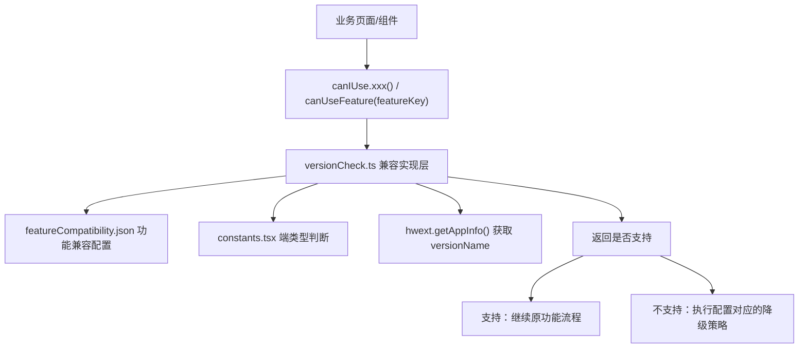
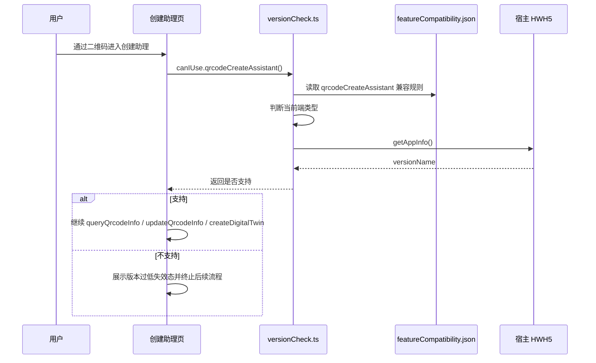
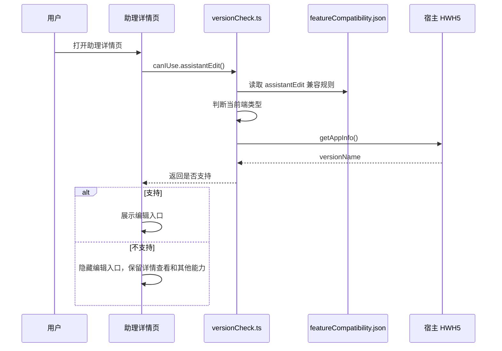
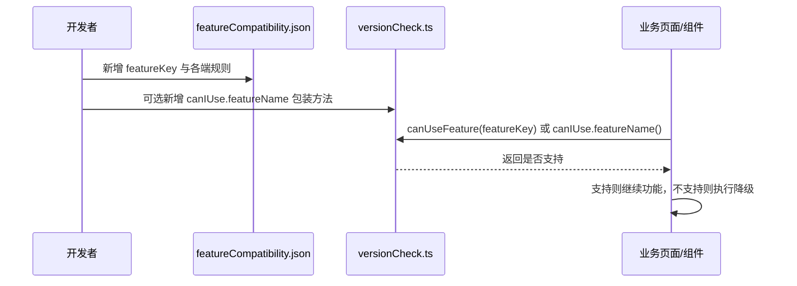

# `ai-chat-viewer 低版本功能兼容配置化方案`

- 方案日期：`2026-07-09`
- 目标工程：`ai-chat-viewer`
- 参考文档：`ai-chat-viewer/docs/plans/技术方案模板.md`、`ai-chat-viewer/src/utils/versionCheck.ts`
- 方案类型：`前端兼容方案`

## 1. 背景

### 1.1 场景说明

`ai-chat-viewer` 已有 `versionCheck.ts` 用于处理低版本客户端兼容，例如二维码创建助理和助理详情编辑入口。但当前最低版本门槛直接写在实现文件中，后续新增功能时需要继续修改判断逻辑，容易导致业务页面散落版本号、降级策略不清晰、兼容测试无法直接对齐功能配置。

本方案在已有 `versionCheck.ts` 基础上优化为“功能兼容配置 JSON + 统一版本判断实现层 + 业务调用导出方法”的结构。

### 1.2 需求目标

1. 通过 JSON 配置文件集中描述各功能在 Android、iOS、Harmony、PC 和未知端上的兼容规则。
2. `versionCheck.ts` 只负责读取配置、识别端类型、获取客户端版本、执行通用比较和导出判断方法。
3. 业务页面在具体需要兼容的地方调用导出方法，不直接读取最低版本号，也不自行实现版本比较。

### 1.3 非目标

1. 不调整现有宿主 `HWH5.getAppInfo()` 的返回结构和缓存策略。
2. 不改变已有二维码创建助理、助理详情编辑入口的业务降级表现。
3. 不引入远程配置或服务端动态下发，当前兼容规则随前端版本发版。

## 2. 方案图

### 2.1 整体方案图



### 2.2 方案核心

将功能兼容能力从“硬编码版本常量”调整为“配置驱动的能力判断”，新增功能只需要在 JSON 中声明各端最低版本和降级说明，再通过统一导出方法在业务入口判断。

## 3. 时序图

### 3.1 二维码创建助理版本判断



### 3.2 助理详情编辑入口版本判断



### 3.3 新增功能兼容判断



## 4. 技术细节

### 4.1 调整点

1. 新增 `src/utils/featureCompatibility.json`，集中配置功能兼容规则。
2. 改造 `src/utils/versionCheck.ts`，移除硬编码最低版本常量，统一从 JSON 读取规则。
3. 保留 `canIUse.assistantEdit()` 和 `canIUse.qrcodeCreateAssistant()`，避免现有调用点迁移成本。
4. 新增通用方法 `canUseFeature(featureKey)`，用于后续功能直接按配置 key 判断。
5. 导出 `getCurrentPlatform()` 和 `getFeatureCompatibilityRule()`，方便单元测试和排查配置命中情况。

### 4.2 核心实现方式

`featureCompatibility.json` 以功能 key 为第一层，每个功能声明各端规则：

```json
{
  "assistantEdit": {
    "description": "助理详情页移动端编辑入口版本判断",
    "fallback": "隐藏编辑入口，不阻断助理详情查看、客服入口、复制和删除能力",
    "pc": {
      "supported": true
    },
    "android": {
      "minVersion": "5.85.0"
    },
    "ios": {
      "minVersion": "5.85.0"
    },
    "harmony": {
      "minVersion": "1.31.0"
    },
    "unknown": {
      "supported": true
    }
  }
}
```

实现层处理规则：

1. `supported=false`：当前端明确不支持，直接返回 `false`。
2. `supported=true` 且没有 `minVersion`：当前端无版本门槛，直接返回 `true`。
3. 存在 `minVersion`：调用 `getAppInfo()` 获取 `versionName`，通过 `compareVersion(currentVersion, minVersion)` 判断。
4. 未配置当前端规则：默认返回 `true`，避免未知配置误伤存量功能。
5. 获取不到 `versionName`：默认返回 `true`，保持现有宽松兼容策略。

### 4.3 兼容与边界

1. PC 端当前能力默认通过 `supported=true` 配置，不走移动端版本门槛。
2. 未知端默认支持，避免 UA 或端类型识别异常导致功能被误隐藏。
3. 对低版本不支持的功能，业务页面必须使用明确降级策略：隐藏入口、展示版本过低态、跳过新增接口调用或保留旧逻辑。
4. 业务页面不允许直接比较 `versionName`，也不允许在页面中硬编码最低版本号。
5. JSON 配置中的 `description` 和 `fallback` 只用于说明和评审，不参与运行时 UI 展示。
6. 新增功能若需要默认不支持未知端，应显式配置 `unknown.supported=false`。

### 4.4 相关接口联动

1. `getAppInfo()`：继续复用 `hwext.ts` 中的模块级 Promise 缓存，避免重复调用宿主接口。
2. `isPcMiniApp()`、`isHarmonyMobileDevice()`、`isIosMobileDevice()`、`isAndroidMobileDevice()`：继续复用 `constants.tsx` 中的端类型判断。
3. `compareVersion()`：保留现有版本比较实现，作为所有功能的统一版本比较方法。

### 4.5 文档需要同步修改的内容

1. `docs/design-decisions.md`：补充能力版本判断改为配置驱动。
2. `docs/requirements.md`：新增能力时同步说明 feature key、各端最低版本和降级策略。
3. 新增或调整功能方案文档时，需要引用 `featureCompatibility.json` 中的配置 key。

## 5. 性能

不新增网络请求。版本判断继续复用 `getAppInfo()` 的页面运行期内存缓存；JSON 配置随前端包加载，体积很小，对首屏影响可忽略。

## 6. 功耗

不新增轮询、长连接、后台任务、动画或频繁刷新。能力判断只在业务入口或页面初始化时触发。

## 7. 埋码

1. `feature_compatibility_blocked`
   - 说明：后续如需统计低版本拦截量，可在 `canUseFeature` 调用方按功能 key 上报。
2. `feature_compatibility_check_failed`
   - 说明：当 `getAppInfo()` 或业务包装判断异常时，页面可记录本地日志，排查宿主版本获取问题。
3. 当前版本先不新增强制埋码，保持和现有逻辑一致。

## 8. 影响范围

### 8.1 直接影响

1. `src/utils/versionCheck.ts`：由常量驱动调整为 JSON 配置驱动。
2. `src/utils/featureCompatibility.json`：新增能力兼容配置。
3. 现有二维码创建助理和助理详情编辑入口判断链路。

### 8.2 间接影响

1. 后续新增低版本兼容功能时，优先改配置和调用统一判断方法。
2. 单元测试可以直接覆盖配置命中、版本比较和降级结果。

### 8.3 不影响

1. 不影响普通聊天消息渲染、历史会话、流式回复等能力。
2. 不影响 PC 端助理详情编辑入口现有展示规则。
3. 不影响 `getAppInfo()` 的语言初始化复用逻辑。

## 9. 测试范围

### 9.1 功能测试

1. Android `5.83.0`、iOS `5.83.0`、Harmony `1.29.0` 及以上，二维码创建助理流程继续执行。
2. Android 低于 `5.83.0`、iOS 低于 `5.83.0`、Harmony 低于 `1.29.0`，二维码场景展示版本过低失效态，不调用后续二维码接口。
3. Android `5.85.0`、iOS `5.85.0`、Harmony `1.31.0` 及以上，助理详情页展示移动端编辑入口。
4. Android 低于 `5.85.0`、iOS 低于 `5.85.0`、Harmony 低于 `1.31.0`，助理详情页隐藏编辑入口，详情查看、客服、复制、删除不受影响。
5. PC 端 `assistantEdit` 和 `qrcodeCreateAssistant` 均按配置直接支持。

### 9.2 兼容测试

1. `versionName` 为空或宿主未返回时，保持现有策略默认支持，不误伤存量功能。
2. 未知端命中 `unknown.supported=true`，默认支持已有功能。
3. 新增功能配置 `supported=false` 时，校验对应端直接返回不支持。
4. 业务调用 `canIUse.assistantEdit()` 和 `canIUse.qrcodeCreateAssistant()` 的返回行为与改造前一致。
5. 业务调用 `canUseFeature(featureKey)` 与 `canIUse.xxx()` 包装方法结果一致。

### 9.3 文档一致性检查

1. `featureCompatibility.json` 中每个功能 key 都需要有 `description` 和 `fallback` 说明。
2. 新增低版本兼容功能时，需求文档、方案文档和 JSON 配置中的最低版本需要一致。

## 10. 最终建议

推荐采用配置驱动方案：短期内保持 `canIUse` 旧调用方式兼容，降低迁移风险；中长期新增低版本能力统一落到 `featureCompatibility.json`，再通过 `canUseFeature(featureKey)` 或 `canIUse.xxx()` 包装方法调用，避免版本号散落在业务页面中。
