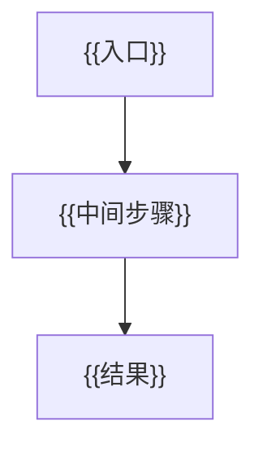
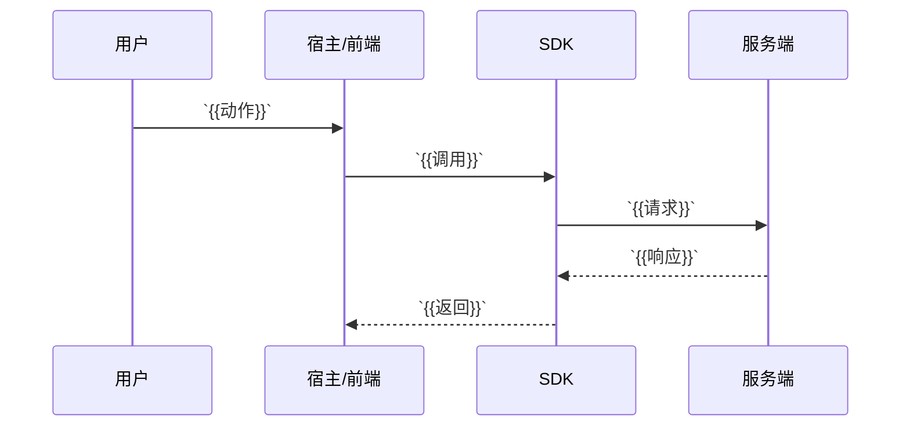
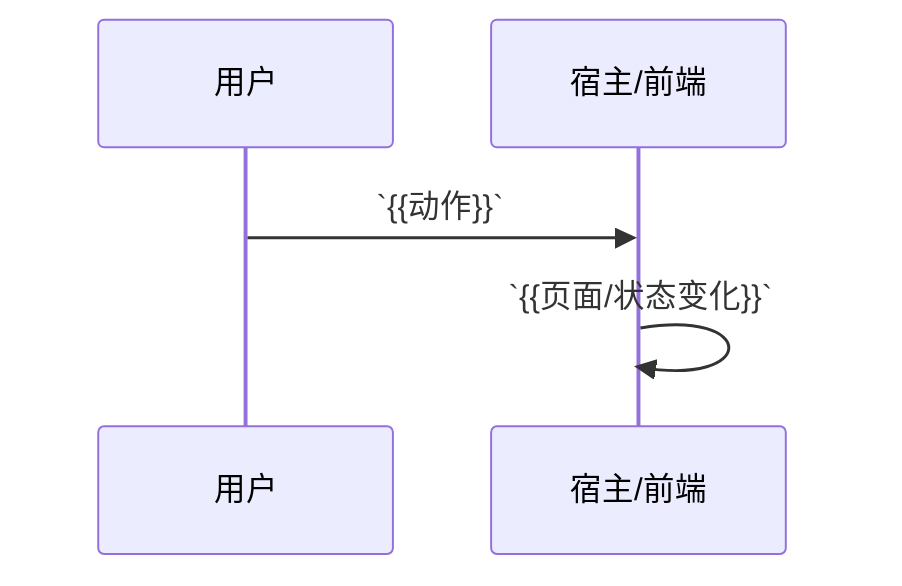

# `{{方案名称}}`

- 方案日期：`{{YYYY-MM-DD}}`
- 目标工程：`{{工程名}}`
- 参考文档：`{{参考文档列表}}`
- 方案类型：`{{方案类型}}`

> 使用说明：
> 1. 将 `{{...}}` 占位符替换为实际内容。
> 2. 保持以下章节顺序不变，便于后续评审和对比。
> 3. 如无需某章节，可保留标题并写“无”。

## 1. 背景

### 1.1 场景说明

`{{当前问题/现状/触发场景}}`

### 1.2 需求目标

1. `{{目标1}}`
2. `{{目标2}}`
3. `{{目标3}}`

### 1.3 非目标

1. `{{不做什么1}}`
2. `{{不做什么2}}`

## 2. 方案图

### 2.1 整体方案图

### 2.2 方案核心

`{{一句话概括核心方案}}`

## 3. 时序图

### 3.1 `{{场景1}}`

### 3.2 `{{场景2}}`

## 4. 技术细节

### 4.1 调整点

1. `{{调整点1}}`
2. `{{调整点2}}`
3. `{{调整点3}}`

### 4.2 核心实现方式

`{{核心实现思路}}`

### 4.3 兼容与边界

1. `{{兼容点1}}`
2. `{{边界条件1}}`
3. `{{降级策略}}`

### 4.4 相关接口联动

1. `{{接口A}}`
2. `{{接口B}}`
3. `{{接口C}}`

### 4.5 文档需要同步修改的内容

1. `{{文档A}}`
2. `{{文档B}}`
3. `{{文档C}}`

## 5. 性能

`{{是否新增请求/是否增加计算/是否影响首屏/是否影响列表}}`

## 6. 功耗

`{{是否增加轮询/长连接/后台任务/动画/频繁刷新}}`

## 7. 埋码

1. `{{埋码1}}`
   - 说明：`{{说明}}`
2. `{{埋码2}}`
   - 说明：`{{说明}}`
3. `{{可选埋码}}`

## 8. 影响范围

### 8.1 直接影响

1. `{{直接影响1}}`
2. `{{直接影响2}}`

### 8.2 间接影响

1. `{{间接影响1}}`
2. `{{间接影响2}}`

### 8.3 不影响

1. `{{不影响1}}`
2. `{{不影响2}}`

## 9. 测试范围

### 9.1 功能测试

1. `{{功能场景1}}`
2. `{{功能场景2}}`
3. `{{功能场景3}}`

### 9.2 兼容测试

1. `{{兼容场景1}}`
2. `{{兼容场景2}}`

### 9.3 文档一致性检查

1. `{{文档一致性1}}`
2. `{{文档一致性2}}`

## 10. 最终建议

`{{最终结论：推荐方案 + 取舍原因 + 后续动作}}`

