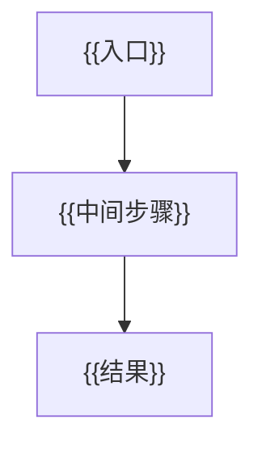
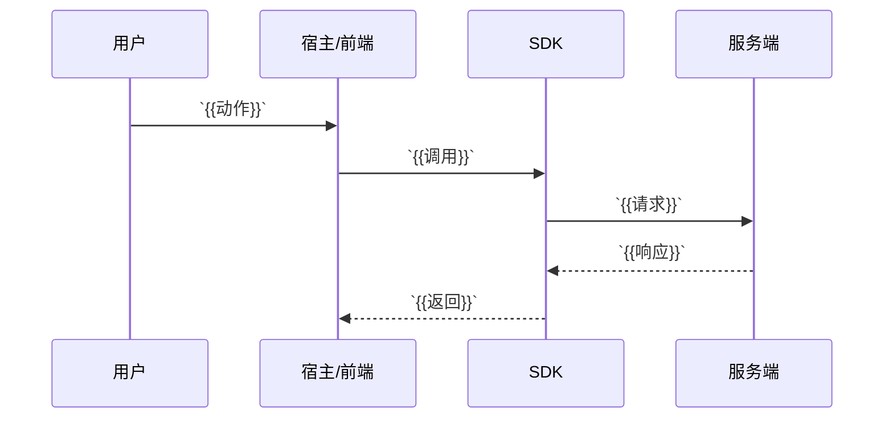
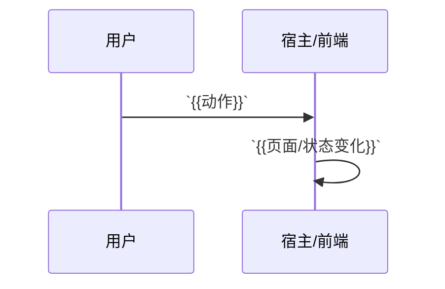

# `{{方案名称}}`

- 方案日期：`{{YYYY-MM-DD}}`
- 目标工程：`{{工程名}}`
- 参考文档：`{{参考文档列表}}`
- 方案类型：`{{方案类型}}`

> 使用说明：
> 1. 将 `{{...}}` 占位符替换为实际内容。
> 2. 保持以下章节顺序不变，便于后续评审和对比。
> 3. 如无需某章节，可保留标题并写“无”。

## 1. 背景

### 1.1 场景说明

`{{当前问题/现状/触发场景}}`

### 1.2 需求目标

1. `{{目标1}}`
2. `{{目标2}}`
3. `{{目标3}}`

### 1.3 非目标

1. `{{不做什么1}}`
2. `{{不做什么2}}`

## 2. 方案图

### 2.1 整体方案图

### 2.2 方案核心

`{{一句话概括核心方案}}`

## 3. 时序图

### 3.1 `{{场景1}}`

### 3.2 `{{场景2}}`

## 4. 技术细节

### 4.1 实现清单

1. `{{模块/文件A：需要新增或修改什么}}`
2. `{{模块/文件B：需要新增或修改什么}}`
3. `{{模块/文件C：需要新增或修改什么}}`

### 4.2 状态设计

1. `{{状态A：含义、归属、清理时机}}`
2. `{{状态B：含义、归属、清理时机}}`
3. `{{状态C：含义、归属、清理时机}}`

### 4.3 数据与缓存处理

1. `{{数据来源/缓存来源}}`
2. `{{成功后的缓存更新规则}}`
3. `{{失败/回滚/校准规则}}`

### 4.4 接口接入

1. `{{新增接口：调用方式、端差异、待确认项}}`
2. `{{复用接口A：使用时机}}`
3. `{{复用接口B：使用时机}}`

### 4.5 边界约束

> 如方案涉及 UI 文案或视觉状态，需在影响范围与测试范围中覆盖暗黑模式和国际化；不在第 4 章展开具体选择器、色值、文案 key 等实现细节。

1. `{{用户交互边界}}`
2. `{{异常/并发边界}}`
3. `{{兼容/降级边界}}`

### 4.6 未确认项

1. `{{UI/交互未确认项}}`
2. `{{接口/数据未确认项}}`
3. `{{文案/配置/运营未确认项}}`

## 5. 性能

`{{是否新增请求/是否增加计算/是否影响首屏/是否影响列表}}`

## 6. 功耗

`{{是否增加轮询/长连接/后台任务/动画/频繁刷新}}`

## 7. 埋码

1. `{{埋码1}}`
   - 说明：`{{说明}}`
2. `{{埋码2}}`
   - 说明：`{{说明}}`
3. `{{可选埋码}}`

## 8. 影响范围

### 8.1 直接影响

1. `{{直接影响1}}`
2. `{{直接影响2}}`

### 8.2 间接影响

1. `{{间接影响1}}`
2. `{{间接影响2}}`

### 8.3 不影响

1. `{{不影响1}}`
2. `{{不影响2}}`

## 9. 测试范围

> 划分规则：
> - 功能测试：验证新能力的核心业务行为、状态流转、成功/失败路径和业务边界。
> - 兼容测试：验证同一能力在不同平台、主题、语言、版本、网络或入口形态下的表现。
> - 文档一致性检查：验证方案、接口文档、需求文档、i18n key 和样式 token 口径一致。
> - 平台特有入口的基本动作属于功能测试；跨平台一致性属于兼容测试。
> - 回归测试按被验证对象归类：验证核心业务链路仍可用放功能测试，验证旧版本/旧入口/旧平台差异放兼容测试。

### 9.1 功能测试

1. `{{核心成功路径：用户动作 -> 结果}}`
2. `{{核心取消/失败路径：异常输入/接口失败 -> 结果}}`
3. `{{核心状态流转：缓存/选中态/禁用态/恢复态}}`
4. `{{业务边界/回归链路：不该触发什么、不该影响什么}}`

### 9.2 兼容测试

1. `{{平台兼容：移动端/PC/iOS/Android/Harmony 等差异}}`
2. `{{主题与语言兼容：亮色/暗黑、中文/英文、长文案}}`
3. `{{版本/网络/入口兼容：旧版本、弱网、刷新、不同入口}}`
4. `{{多端/分页/缓存兼容：多设备、已加载页、缓存校准}}`

### 9.3 文档一致性检查

1. `{{接口名称、URL、HTTP 方法、入参、出参与接口文档一致}}`
2. `{{i18n key 与 zh.ts/en.ts 命名一致}}`
3. `{{暗黑样式与 theme.less token 命名一致}}`
4. `{{需求/设计文档与方案口径一致}}`

## 10. 最终建议

`{{最终结论：推荐方案 + 取舍原因 + 后续动作}}`
