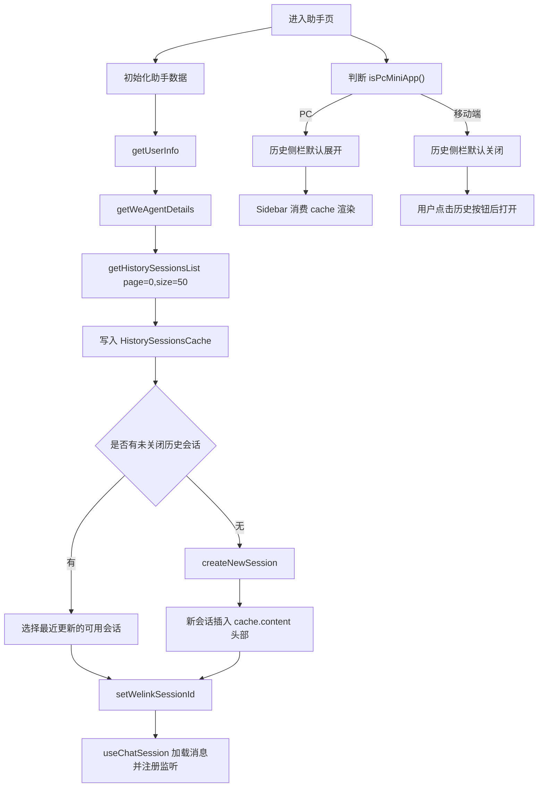
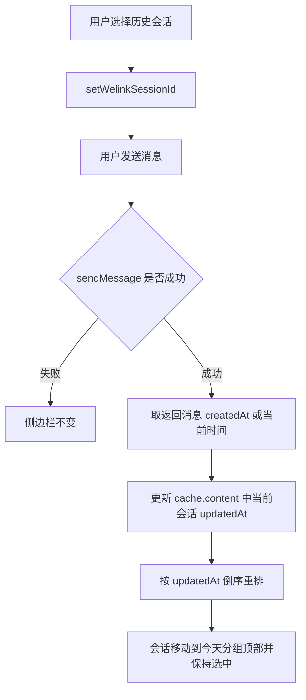
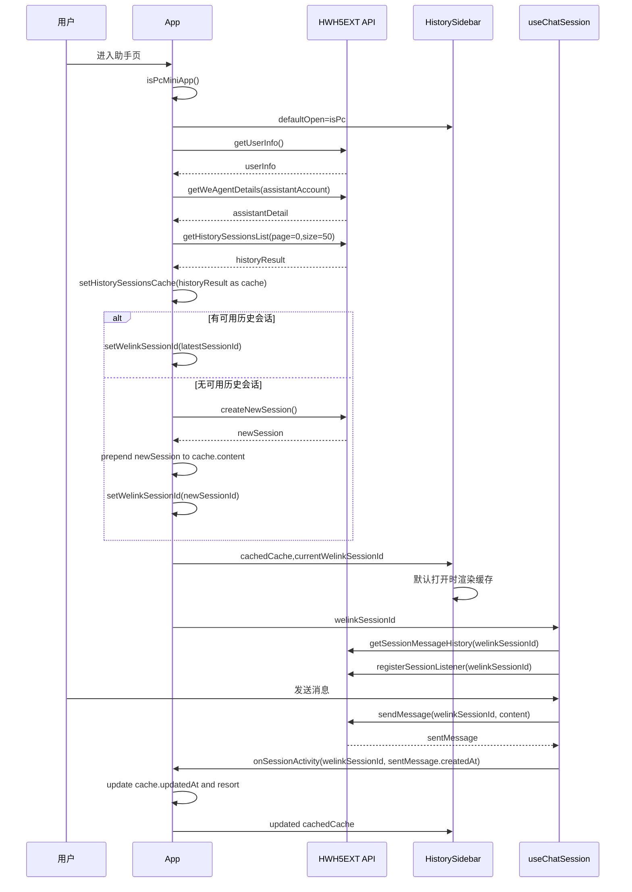

# PC 端默认展示历史对话列表

## Summary

进入助手页时，PC 默认展开历史对话侧边栏，移动端保持点击打开。历史列表初始化、默认选中会话、新建会话、标题更新、发送消息后的排序更新和分页加载统一使用前端缓存类型 `HistorySessionsCache`，字段复用接口结构但语义明确为“前端已合并缓存”。

## Types And State

```ts
export interface HistorySessionsCache {
  content: SkillSession[];
  page: number;
  size: number;
  total: number;
  totalPages: number;
}
```

- `historySessionsLoaded=false`：历史列表尚未初始化完成，PC 侧栏可打开但不展示空态。
- `historySessionsLoaded=true && historySessionsCache?.content.length === 0`：确认无历史，允许展示空态。
- `HistorySessionsListResult.content` 是接口单页结果；`HistorySessionsCache.content` 是前端缓存后的列表，可包含多页合并、新建会话插入、标题更新、活跃会话排序更新。

## Business Logic



## Send Message Sorting

当用户选择昨天或更早的会话并发送消息成功后，侧边栏要即时更新排序，而不是等下一次刷新历史接口。



- `useChatSession` 在 `sendMessage` 成功后触发 `onSessionActivity(sessionId, updatedAt)`。
- `updatedAt` 优先使用发送接口返回消息的 `createdAt`，没有则使用当前时间。
- `App` 找到对应会话后只更新 `updatedAt` 并重排；找不到会话时不创建占位项，等待后续历史刷新补齐。
- 后续 `session.title` 事件只更新标题，不覆盖 `updatedAt` 排序结果。

## Edge Cases

当前助手无历史对话：

- PC 侧边栏默认展开，但初始化完成前不显示空态图。
- 历史接口返回空后，`App` 创建新会话。
- 新会话通过 `ensureSessionTimestamps` 后插入 `historySessionsCache.content` 头部。
- 侧边栏显示该新会话，归入“今天”，并处于选中态。
- 标题为空时继续展示 `weAgent.untitledSession`。
- 用户再次点击新建且当前消息为空时，沿用现有逻辑 toast“当前是最新会话”，侧边栏不变。

当前助手有历史对话，用户主动新建：

- 当前消息为空：不创建新会话，只 toast，侧边栏不变。
- 当前消息非空：创建新会话、清空消息区 transient state、切换 `welinkSessionId`。
- 新会话插入 `historySessionsCache.content` 头部并选中。
- PC 侧边栏保持展开；移动端不自动打开侧边栏。
- 后续收到 `session.title` 事件时，更新缓存中对应会话标题。

## Sequence



## Test Plan

- PC 首屏默认展开侧栏，根容器包含 `has-history-sidebar`。
- PC 默认展开时复用初始化历史结果，不重复请求第一页。
- 初始化无历史时创建新会话，新会话进入侧栏顶部并选中。
- 用户主动新建会话成功后，新会话进入侧栏顶部并选中。
- 当前消息为空时点击新建，只 toast，不改变侧栏列表。
- PC 点击历史项后侧栏保持打开；移动端点击后关闭。
- `session.title` 事件更新侧栏对应会话标题。
- 选择昨天会话发送消息成功后，该会话移动到今天分组顶部并保持选中。
- 发送消息失败时，侧栏排序不变化。
- 多页历史点击“加载更多”后追加数据，并正确更新 `page/totalPages`。
