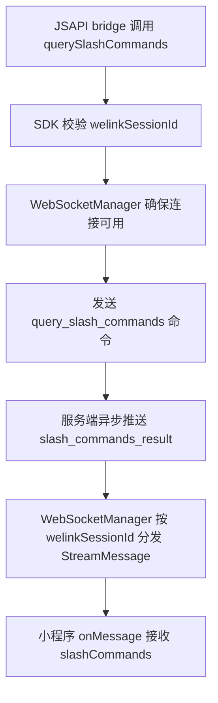
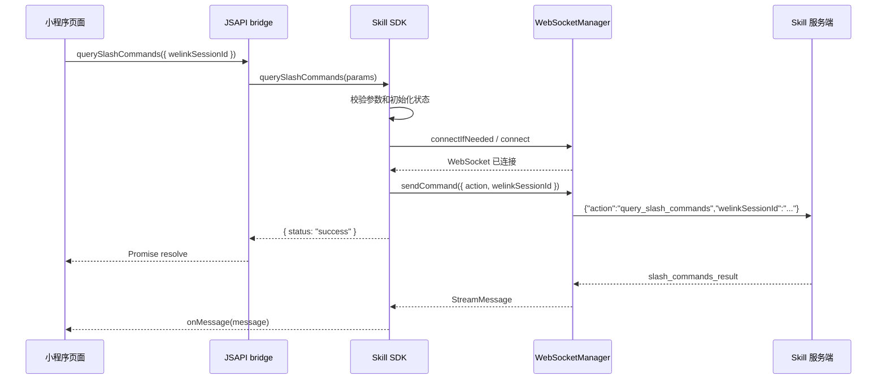
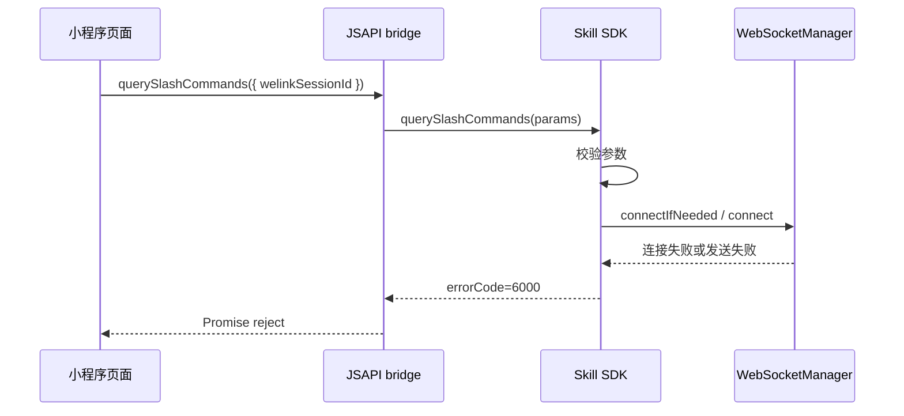

# `querySlashCommands WebSocket 查询 Slash Commands 方案`

- 方案日期：`2026-06-23`
- 目标工程：`Skill SDK`
- 参考文档：`SkillClientSdkInterfaceV1.md`、`小程序JSAPI接口文档.md`、`android/skill-sdk/src/main/java/com/opencode/skill/network/WebSocketManager.java`、`ios/WLAgentSkillsSDK/Classes/WebSocket/WLAgentSkillsWebSocketManager.m`、`harmony/src/main/ets/sdk/core/WebSocketManager.ets`
- 方案类型：`SDK/API 变更方案`

## 1. 背景

### 1.1 场景说明

JSAPI bridge 需要新增一个查询 slash commands 的能力。该能力不是普通 REST 接口，而是通过既有 Skill WebSocket 长连接向服务端发送命令：

```json
{
  "action": "query_slash_commands",
  "welinkSessionId": "{string}"
}
```

服务端不会通过该方法的同步返回值直接返回列表，而是新增 `slash_commands_result` WebSocket 事件，将当前会话可用 slash 命令列表推送给端侧。现有三端 SDK 均已具备 WebSocketManager 和按 `welinkSessionId` 分发 `StreamMessage` 的能力；Android、iOS、HarmonyOS 当前均已有 `resume` 主动 WebSocket 命令，可作为发送命令的实现参考。

### 1.2 需求目标

1. 在 SDK 层定义 `querySlashCommands` 方法，供 JSAPI bridge 调用。
2. 通过 `WebSocketManager` 发送 `query_slash_commands` 命令，不新增 REST 接口。
3. 通过既有 `registerSessionListener` 的 `onMessage` 回调向端侧透出 `slash_commands_result` 事件。
4. 三端保持一致的方法名、入参、返回值、错误语义和事件字段。

### 1.3 非目标

1. 不在本次方案中实现 SDK 源码改动。
2. 不改变现有 `sendMessage`、`getSessionMessage`、`getSessionMessageHistory` 的 REST 行为。
3. 不将 `slash_commands_result` 聚合进 `SessionMessage` 历史消息列表。
4. 不在 SDK 内部缓存 slash commands 列表，缓存策略由调用方或后续需求决定。

## 2. 方案图

### 2.1 整体方案图



### 2.2 方案核心

推荐将 `querySlashCommands` 定义为“发送查询命令”的异步触发接口，方法返回只表示命令发送成功或失败，真实命令列表统一通过 `registerSessionListener` 的 `slash_commands_result` 事件接收。

## 3. 时序图

### 3.1 `正常查询 Slash Commands`



### 3.2 `连接不可用或发送失败`



## 4. 技术细节

### 4.1 调整点

1. SDK 公共接口新增 `querySlashCommands(params)`。
2. 三端 `WebSocketManager` 新增通用发送 JSON 命令能力，或新增专项 `sendQuerySlashCommands(welinkSessionId)` 方法。
3. `StreamMessage` 类型新增 `slashCommands` 字段，元素包含 `command` 和 `description`。
4. 文档新增 `slash_commands_result` 事件类型，并说明该事件不进入消息聚合缓存。
5. JSAPI bridge 暴露同名 `querySlashCommands`，PC 端通过 `handleSdk` 透传。

### 4.2 核心实现方式

推荐三端先抽象一个 WebSocket 命令发送能力：

```typescript
sendCommand(payload: Record<string, unknown>): Promise<void>
```

然后 SDK 的 `querySlashCommands` 只负责参数校验、确保连接、构造 payload 和返回发送状态：

```json
{
  "action": "query_slash_commands",
  "welinkSessionId": "{string}"
}
```

`slash_commands_result` 仍按现有 WebSocket 事件链路解析和分发。由于现有 Android/iOS/HarmonyOS 的 `StreamMessage` 均保留 `raw` 字段，未升级字段模型时端侧也可以临时从 `raw.slashCommands` 读取；但正式方案建议三端模型都显式补充 `slashCommands`，避免 JSAPI 类型缺失。

推荐返回值：

```typescript
interface QuerySlashCommandsResult {
  status: "success";
}
```

推荐事件模型：

```typescript
interface SlashCommand {
  command: string;
  description?: string | null;
}

interface StreamMessage {
  type: "slash_commands_result";
  slashCommands?: SlashCommand[] | null;
  welinkSessionId?: string | null;
}
```

### 4.3 兼容与边界

1. 兼容现有监听模型：调用方仍通过 `registerSessionListener` 接收结果，不新增单独事件监听 API。
2. 若调用方未注册监听器，`querySlashCommands` 仍可能发送成功，但结果事件无法被页面消费；文档需建议先注册监听再调用查询。
3. 若 WebSocket 未连接，SDK 应先建立连接再发送命令；连接失败返回 `6000` 网络错误。
4. 若 `welinkSessionId` 缺失或空字符串，返回 `1000` 无效参数。
5. 若服务端返回空列表，`slashCommands` 使用空数组，端侧按“无可用命令”处理。
6. 若服务端长期未推送 `slash_commands_result`，SDK 不做超时合成事件；调用方可自行设置 UI 超时。
7. `slash_commands_result` 不参与 `getSessionMessage` 本地流式缓存合并，避免污染聊天消息列表。

### 4.4 相关接口联动

1. `registerSessionListener`：必须继续作为 `slash_commands_result` 的接收入口。
2. `unregisterSessionListener`：页面销毁后移除监听，避免结果事件投递到失效页面。
3. `createSession` / `createNewSession`：查询前需已有有效 `welinkSessionId`。
4. `getSessionMessage` / `getSessionMessageHistory`：不返回 slash commands 查询结果。

### 4.5 文档需要同步修改的内容

1. `小程序JSAPI接口文档.md`：新增 `querySlashCommands` 接口、返回值、错误处理、调用示例；补充 `slash_commands_result` 事件和 `slashCommands` 字段。
2. `SkillClientSdkInterfaceV1.md`：新增 SDK 接口定义、WebSocket 命令映射和事件类型说明。
3. `android/README.md`、`ios/README.md`、`harmony/README.md`：新增三端调用示例。
4. 前端类型文档或类型声明：`StreamMessage`、`HWH5EXT` 增补 `querySlashCommands` 和 `slashCommands`。

## 5. 性能

该方案不新增 REST 请求，不增加轮询。每次调用仅通过已有 WebSocket 长连接发送一个小 JSON 命令，服务端返回一个列表事件。对首屏和历史消息列表无直接性能影响。需要避免页面输入框每次聚焦都频繁查询，可由调用方按会话或页面生命周期做简单防抖。

## 6. 功耗

不新增长连接，复用现有 WebSocket。若页面频繁调用会增加少量上行和下行消息，建议调用方只在进入会话、输入 `/` 或需要刷新命令列表时触发。

## 7. 埋码

1. `query_slash_commands_send`
   - 说明：记录查询命令发送结果、耗时、`welinkSessionId` 是否存在，避免记录具体命令内容。
2. `slash_commands_result_receive`
   - 说明：记录是否收到结果、命令数量、事件延迟。
3. 可选埋码：`slash_commands_empty`
   - 说明：记录空列表场景，便于判断服务端配置或权限问题。

## 8. 影响范围

### 8.1 直接影响

1. Android SDK：新增参数/结果模型、SDK 方法、WebSocket 命令发送方法、`StreamMessage.slashCommands` 字段。
2. iOS SDK：新增公开方法、参数/结果模型、WebSocket 发送方法、`WLAgentSkillsStreamMessage.slashCommands` 字段。
3. HarmonyOS SDK：新增类型、SDK 方法、WebSocket 发送方法、`StreamMessage.slashCommands` 字段。
4. JSAPI bridge：新增 `querySlashCommands` 映射。
5. 小程序页面：通过监听 `slash_commands_result` 更新 slash 命令列表。

### 8.2 间接影响

1. 现有 `StreamMessageType` 枚举或联合类型需要新增 `slash_commands_result`，否则 TypeScript 调用方会出现类型不完整。
2. 本地流式缓存逻辑需要显式排除该事件，避免进入聊天消息聚合。
3. WebSocketManager 若抽象通用 `sendCommand`，未来可复用到更多 WS 命令。

### 8.3 不影响

1. 不影响 REST API 客户端和 Retrofit/HTTPClient 路由。
2. 不影响历史消息、发送消息、权限回复、停止生成等现有接口语义。
3. 不影响服务端会话生命周期。

## 9. 测试范围

### 9.1 功能测试

1. 先注册监听，再调用 `querySlashCommands`，确认发送 payload 为 `query_slash_commands` 且带正确 `welinkSessionId`。
2. 收到 `slash_commands_result` 后，确认 `onMessage` 可读取 `slashCommands`。
3. 服务端返回空数组时，确认端侧收到空数组而非错误。
4. 未注册监听时调用，确认方法发送成功但不产生端侧回调。
5. WebSocket 未连接时调用，确认 SDK 会先连接再发送。

### 9.2 兼容测试

1. Android、iOS、HarmonyOS 三端方法名、参数名、错误码、返回值一致。
2. 移动端 `window.HWH5EXT.querySlashCommands(params)` 和 PC 端 `window.Pedestal.callMethod(..., { funName: "querySlashCommands", params })` 行为一致。
3. 老服务端未识别该 action 时，确认 SDK 不崩溃，调用方可通过超时或错误事件降级。
4. `slash_commands_result` 不影响 `getSessionMessage({ isFirst: true })` 的本地流式聚合结果。

### 9.3 文档一致性检查

1. JSAPI 文档、SDK 接口文档、三端 README 的接口名统一为 `querySlashCommands`。
2. WebSocket action 统一为 `query_slash_commands`。
3. WebSocket 事件 type 统一为 `slash_commands_result`。
4. 会话字段统一为 `welinkSessionId`，事件中的兼容字段 `sessionID` 仅作为服务端原始字段说明，不作为 SDK 对外主字段。

## 10. 最终建议

最终结论：推荐采用“`querySlashCommands` 发送 WebSocket 命令 + `registerSessionListener` 接收 `slash_commands_result` 事件”的方案。该方案复用现有长连接和事件分发链路，三端改动小，且符合该需求异步推送结果的本质。实现前建议先与服务端确认两个细节：`slash_commands_result` 是否稳定携带 `welinkSessionId`，以及示例中的 `sessionID` 是否需要 SDK 兼容映射。
